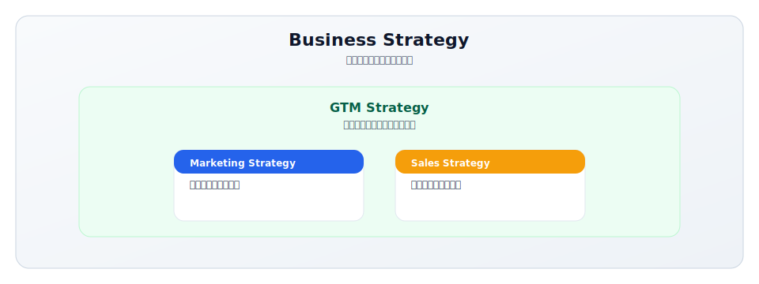
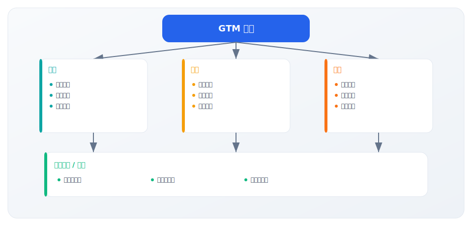

# 1.1 GTM 的本质定义

> **学习目标**：准确理解 GTM 的定义，掌握"市场进入操作系统"的本质，区分 GTM 与其他战略的关系
>
> **预计时长**：30 分钟
>
> **前置知识**：无

---

## 核心内容

本节覆盖以下内容：
- 引言：从一个常见误解说起
- 什么是 GTM？
- GTM 包含什么？
- GTM vs 其他战略：关键区别
- GTM 的核心目标
- GTM 的跨职能本质

## 引言：从一个常见误解说起

"我们需要一个 GTM 计划。"

当你在公司听到这句话时，你脑海中浮现的是什么？

- 一份营销活动排期表？
- 一个产品发布会的策划案？
- 一组销售话术和培训材料？

如果你的答案是以上任何一个，那么你可能正在犯一个常见的错误——**把 GTM 等同于营销计划**。

这个误解的代价是巨大的。根据 Gartner 的研究，许多公司的 GTM 失败并非因为缺少营销活动，而是因为**从一开始就对 GTM 的理解过于狭隘**。

让我们重新定义 GTM。

---

## 什么是 GTM？

### 完整定义

**Go-to-Market（GTM）战略**是一个组织将产品或服务推向市场、触达目标客户并实现商业目标的**完整行动计划**。

这个定义包含几个关键要素：

| 要素 | 含义 |
|------|------|
| **产品或服务** | GTM 的对象可以是新产品、新功能、新市场或新客户群 |
| **推向市场** | 不仅是"发布"，而是让市场真正感知、理解并接受 |
| **触达目标客户** | 不是"所有人"，而是精准定义的理想客户 |
| **实现商业目标** | 最终要转化为收入、增长或其他可衡量的结果 |
| **完整行动计划** | 系统性的策略，而非单点活动 |

### 一个更有力的比喻

如果要用一个比喻来理解 GTM，我建议这样想：

> **GTM 是你的"市场进入操作系统"（Market Entry Operating System）**

就像计算机的操作系统（Windows、macOS、Linux）一样：

- **它是底层架构**：决定了上层所有应用（营销活动、销售流程、客户成功）如何运行
- **它需要各组件协同**：CPU（产品）、内存（资源）、输入输出（渠道）必须配合
- **它可以被优化和迭代**：不是一次性设置，而是持续调整
- **它定义了与外部世界的接口**：决定你如何与市场、客户互动

这个比喻的价值在于：它强调了 GTM 的**系统性**和**可复用性**。

---

## GTM 包含什么？

一个完整的 GTM 战略通常包含以下五大核心组成部分：

### 1. 目标市场（Target Market）
- **你要服务谁？** 不是"所有人"，而是具体的 ICP（理想客户画像）
- 包括市场规模评估（TAM/SAM/SOM）和细分策略

### 2. 价值主张（Value Proposition）
- **你解决什么问题？为什么客户应该选择你？**
- 清晰的差异化定位，而非功能堆砌

### 3. 渠道策略（Channel Strategy）
- **如何触达、转化和交付给客户？**
- 选择合适的 GTM Motion（PLG/SLG/MLG）
- 确定直销、渠道、合作伙伴的组合

### 4. 定价与商业模式（Pricing & Business Model）
- **如何定价？如何收费？**
- 订阅制、一次性、按用量等模式选择
- 产品分层和打包策略

### 5. 执行计划与指标（Execution & Metrics）
- **如何落地执行？如何衡量成功？**
- 资源配置、团队职责、关键里程碑
- 核心 KPI：CAC、LTV、NRR、转化率等

---

## GTM vs 其他战略：关键区别

理解 GTM 的一个重要方式是将它与其他常见战略进行对比。

### 对比一览表

| 维度 | GTM Strategy | Marketing Strategy | Business Strategy |
|------|--------------|-------------------|-------------------|
| **关注范围** | 产品如何进入市场并获客 | 品牌建设与需求生成 | 公司整体方向与资源配置 |
| **时间跨度** | 通常 6-18 个月（一个发布周期） | 1-3 年（品牌建设周期） | 3-5 年（战略规划周期） |
| **核心问题** | 如何让这个产品在这个市场成功？ | 如何建立品牌认知和需求？ | 公司应该做什么业务？ |
| **涉及部门** | 产品、销售、市场、客户成功 | 主要是市场部门 | CEO、战略部门、董事会 |
| **成功指标** | 收入、客户数、市场份额 | 品牌认知度、线索量、互动率 | 营收、利润、市场地位 |
| **调整频率** | 根据市场反馈快速迭代 | 相对稳定，按季度/年度调整 | 较稳定，重大变化时调整 |

### 它们的关系

**关键洞察**：
- **Business Strategy** 决定"做什么"，GTM Strategy 决定"怎么做到"
- **GTM Strategy** 是 Marketing Strategy 和 Sales Strategy 的"母策略"
- 没有 GTM Strategy 的 Marketing 往往是散乱的活动集合
- 没有 GTM Strategy 的 Sales 往往是低效的盲目推销

---

## GTM 的核心目标

一个好的 GTM 战略应该实现两个核心目标：

### 目标一：最小化市场进入风险

市场进入充满不确定性：
- 客户真的需要这个产品吗？
- 定价合理吗？
- 选择的渠道有效吗？
- 时机对吗？

**GTM 战略的价值在于系统性地降低这些风险**。通过前期的 ICP 验证、价值主张测试、渠道实验等，在大规模投入前获得市场反馈。

### 目标二：最大化产品-市场匹配效率

假设你已经有了一个好产品（或正在构建中），GTM 战略的作用是：

- 让**对的客户**知道你的产品存在
- 让他们**理解**你的产品能为他们带来什么价值
- 让他们**愿意**支付费用获取这个价值
- 让这个过程**可持续、可规模化**

这就是 **PMF（Product-Market Fit）效率**——GTM 不创造 PMF，但它决定了你能多快、多高效地验证和放大 PMF。

---

## GTM 的跨职能本质

一个常见的组织问题是：**谁负责 GTM？**

答案是：**没有任何单一部门能独立拥有 GTM**。

### GTM 是一项团队运动

### 各部门的 GTM 职责

| 部门 | GTM 中的核心职责 |
|------|-----------------|
| **产品** | ICP 洞察输入、产品定位参与、定价建议、PLG 体验设计 |
| **市场** | 需求生成、品牌建设、内容策略、MQL 交付 |
| **销售** | 客户转化、ICP 验证反馈、竞争情报、ACV 优化 |
| **客户成功** | 客户留存、扩展收入、成功案例、NPS/NRR |

**关键点**：GTM 成功需要这些部门**围绕统一目标对齐**，而非各自为战。这也是为什么越来越多公司引入 **RevOps（收入运营）**来协调 GTM 执行。

---

## 关键要点

1. **GTM 是"市场进入操作系统"**，不是营销计划或发布活动
2. **GTM 包含五大核心要素**：目标市场、价值主张、渠道策略、定价模式、执行计划
3. **GTM 的核心目标**是最小化市场风险、最大化 PMF 效率
4. **GTM 是跨职能协作**，没有单一部门能独立负责
5. **GTM vs Marketing vs Business Strategy**：三者是层层包含的关系

---

## 实践练习

### 练习 1：GTM 自检

选择你当前工作中的一个产品或服务，回答以下问题：

| 问题 | 你的回答 | 清晰度（1-5） |
|------|----------|--------------|
| 我们的 ICP 是谁？ | | |
| 我们解决什么核心痛点？ | | |
| 我们的差异化是什么？ | | |
| 我们通过什么渠道获客？ | | |
| 我们的定价策略是什么？ | | |

如果任何一项的清晰度低于 3 分，说明你的 GTM 战略可能存在漏洞。

### 练习 2：战略区分

判断以下活动属于哪个层面的战略：

| 活动 | GTM / Marketing / Business |
|------|---------------------------|
| 决定进入 AI 助手市场 | |
| 设计免费试用转付费的流程 | |
| 策划一场行业大会赞助 | |
| 定义目标客户为 50-500 人的 SaaS 公司 | |
| 将产品重新定位为"企业级解决方案" | |

参考答案

1. 决定进入 AI 助手市场 → **Business Strategy**
2. 设计免费试用转付费的流程 → **GTM Strategy**
3. 策划一场行业大会赞助 → **Marketing Strategy**
4. 定义目标客户为 50-500 人的 SaaS 公司 → **GTM Strategy**
5. 将产品重新定位为"企业级解决方案" → **GTM Strategy**

---

## 延伸阅读

- **书籍**：《Obviously Awesome》by April Dunford —— 关于产品定位的经典著作
- **书籍**：《Crossing the Chasm》by Geoffrey Moore —— 理解技术产品的市场采纳
- **文章**：[ProductPlan - Go-to-Market Strategy Glossary](https://www.productplan.com/glossary/go-to-market-strategy/)
- **报告**：[ICONIQ 2025 State of Go-to-Market Report](https://www.iconiqcapital.com/growth/reports/state-of-go-to-market-2025)

---

## 下一步

现在你已经理解了 GTM 的本质定义，下一节我们将探讨：**为什么 GTM 战略如此重要？**

通过真实数据和案例，你将看到 GTM 对产品成败的决定性影响。

→ [1.2 为什么 GTM 战略至关重要](./1.2-gtm-importance.md)

---

**写作状态**：审校完成
**最后更新**：2025-12-23
**版本**：v1.1
