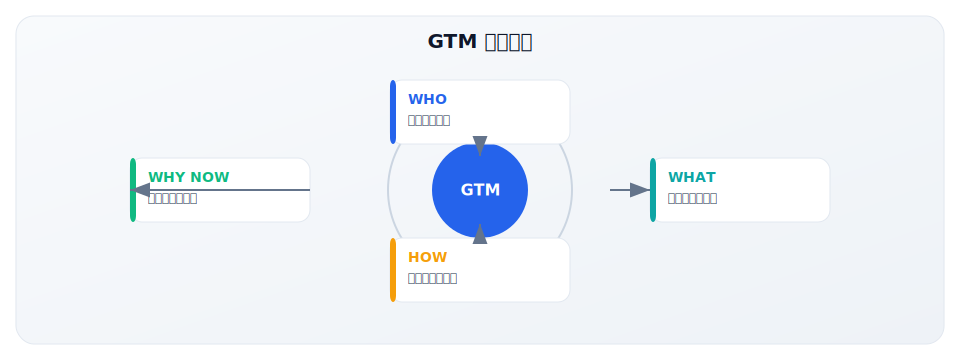
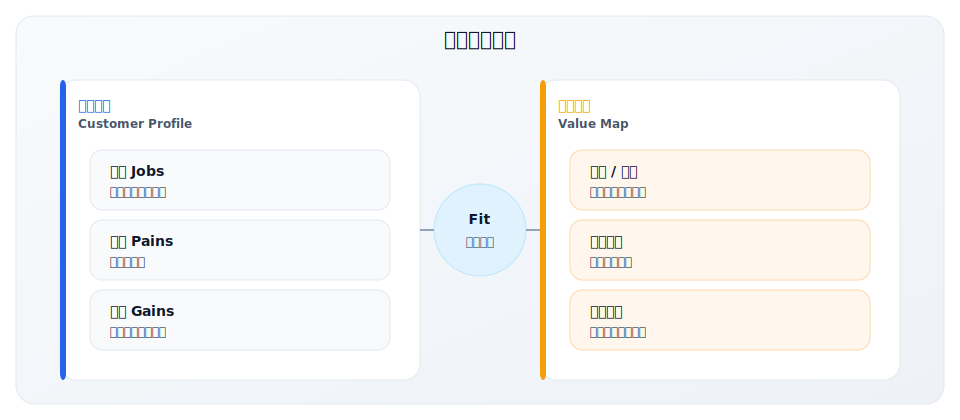
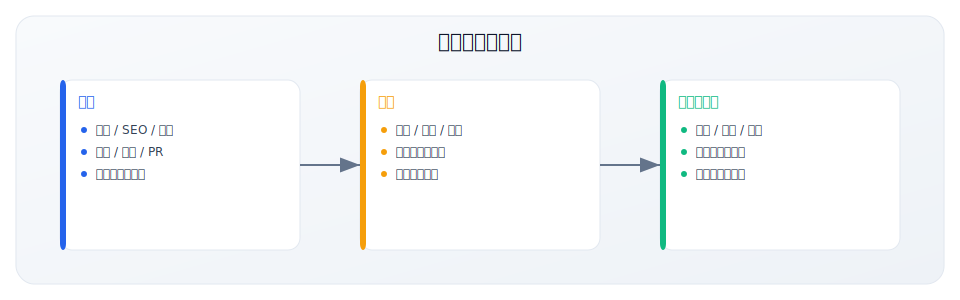
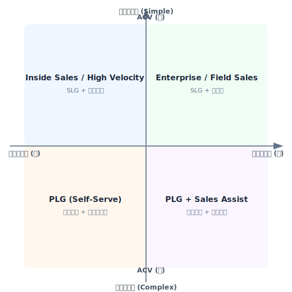
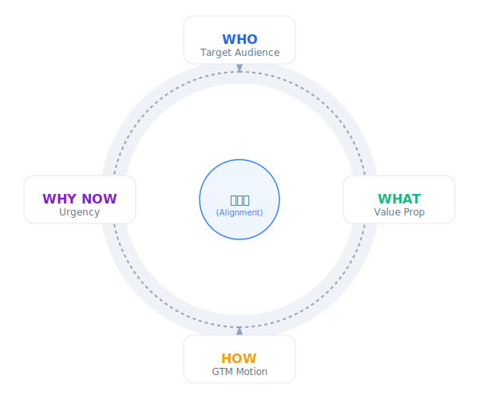

# 1.4 GTM 的核心四问

> **学习目标**：掌握 GTM 战略的核心思考框架，能够使用四问分析任何市场进入问题
>
> **预计时长**：30 分钟
>
> **前置知识**：1.1-1.3 章节

---

## 核心内容

本节覆盖以下内容：
- 引言：一个通用的思考框架
- 第一问：WHO —— 理想客户是谁？
- 第二问：WHAT —— 解决什么痛点？价值主张是什么？
- 第三问：HOW —— 通过什么渠道触达、转化、交付？
- 第四问：WHY NOW —— 为什么客户现在需要你？
- 四问的相互关系

## 引言：一个通用的思考框架

在前面的章节中，我们定义了 GTM、理解了它的重要性、识别了适用场景。

现在，我们需要一个**通用的思考框架**，能够帮助你分析任何 GTM 问题。

这就是 **GTM 核心四问**：

**这四个问题看似简单，但能够清晰回答它们的公司少之又少。**

让我们深入每一个问题。

---

## 第一问：WHO —— 理想客户是谁？

### 为什么 WHO 是第一个问题？

因为**所有其他决策都依赖于对客户的理解**：
- 你的价值主张取决于客户的痛点
- 你的渠道选择取决于客户在哪里
- 你的定价取决于客户愿意支付多少
- 你的时机判断取决于客户的购买周期

**如果 WHO 错了，后面的一切都会错。**

### 核心子问题

| 维度 | 问题 |
|------|------|
| **公司特征** | 目标客户是什么类型的公司？行业、规模、地区？ |
| **角色特征** | 决策者是谁？使用者是谁？影响者是谁？ |
| **痛点特征** | 他们面临什么问题？有多紧迫？ |
| **行为特征** | 他们如何寻找解决方案？购买决策如何做出？ |
| **成功特征** | 什么样的客户最容易成功？最有扩展潜力？ |

### Lincoln Murphy 的 ICP 七标准

客户成功专家 Lincoln Murphy 提出了定义理想客户的七个关键标准：

| 标准 | 含义 | 关键问题 |
|------|------|---------|
| **Ready** | 准备好了 | 他们知道自己有这个问题吗？有紧迫感吗？ |
| **Willing** | 愿意解决 | 有变革的催化剂吗？有内部推动者吗？ |
| **Able** | 有能力 | 有预算吗？有决策权吗？ |
| **Successful** | 能成功 | 用我们的产品能真正解决问题吗？ |
| **Profitable** | 有利可图 | 这个客户能带来健康的单位经济吗？ |
| **Expansion** | 有扩展空间 | 有增购、升级的潜力吗？ |
| **Advocacy** | 会推荐 | 会成为我们的口碑传播者吗？ |

**关键洞察**：一个好的 ICP 不仅仅是"可能买的人"，而是"能成功、能带来价值、能帮你增长"的客户。

### 常见错误

1. **定义太宽泛**："我们的客户是所有需要 XX 的企业"
2. **只看公司特征，忽视个人角色**：B2B 购买是人做决策的
3. **没有区分"能卖"和"应该卖"**：不是所有愿意买的客户都是好客户
4. **一成不变**：ICP 应该随着公司发展而演进

### 方法论指引

→ 详见 [2.3 ICP 构建方法论](../module-02/2.3-icp-methodology)

---

## 第二问：WHAT —— 解决什么痛点？价值主张是什么？

### 价值主张的核心

价值主张回答一个根本问题：

> **为什么客户应该选择你，而不是其他替代方案（包括"什么都不做"）？**

注意这个问题的三个层次：
1. 为什么需要解决这个问题？（vs 不解决）
2. 为什么需要这类解决方案？（vs 其他方式）
3. 为什么选择你？（vs 竞品）

### 核心子问题

| 维度 | 问题 |
|------|------|
| **痛点识别** | 客户面临的核心问题是什么？有多痛？ |
| **紧迫程度** | 这个问题有多紧迫？是"止痛药"还是"维生素"？ |
| **解决方案** | 我们如何解决这个问题？ |
| **差异化** | 与竞品相比，我们有什么独特之处？ |
| **价值量化** | 客户能获得什么具体的收益？能量化吗？ |

### Osterwalder 价值主张画布

Alexander Osterwalder 提出的价值主张画布是一个经典工具：

### April Dunford 的定位框架

定位专家 April Dunford 在《Obviously Awesome》中提出了五个定位要素：

1. **竞争替代品**：如果不用你，客户会用什么？
2. **独特属性**：你有什么他们没有的？
3. **客户价值**：这些属性为客户带来什么价值？
4. **目标客户**：谁最关心这些价值？
5. **市场类别**：你在哪个市场竞争？

**定位声明模板**：

> For [目标客户] who [有这个问题]，
> Our [产品] is a [类别]
> That [提供这个价值]。
> Unlike [竞争对手]，
> We [差异化优势]。

### 常见错误

1. **功能堆砌而非价值表达**："我们有 100+ 功能" vs "我们帮你节省 50% 时间"
2. **对所有人说同样的话**：不同角色关心不同的价值
3. **差异化不真实**：每个竞品都说自己"更快、更好、更便宜"
4. **忽视"不做"这个竞争对手**：在 B2B 中，40% 的交易输给"无决策"

### 方法论指引

→ 详见 [2.4 价值主张设计](../module-02/2.4-value-proposition)
→ 详见 [2.5 市场定位策略](../module-02/2.5-positioning)

---

## 第三问：HOW —— 通过什么渠道触达、转化、交付？

### 渠道策略的三个阶段

HOW 涵盖了客户旅程的三个关键阶段：

### 核心子问题

| 维度 | 问题 |
|------|------|
| **触达渠道** | 客户在哪里？如何让他们知道你？ |
| **GTM Motion** | 使用什么销售模式？PLG/SLG/MLG/混合？ |
| **销售流程** | 从线索到成交的流程是什么？ |
| **合作伙伴** | 是否需要渠道合作伙伴或系统集成商？ |
| **客户成功** | 如何确保客户持续成功和扩展？ |

### GTM Motion 选择框架

选择哪种 GTM Motion 主要取决于两个因素：**产品复杂度**和 **ACV（年合同价值）**。

| 情况 | 推荐 Motion | 典型案例 |
|------|------------|---------|
| 低 ACV + 简单产品 | PLG | Notion、Figma、Canva |
| 低 ACV + 复杂产品 | PLG + 轻销售 | Airtable、Monday |
| 高 ACV + 简单产品 | SLG + 快速成交 | Zoom 企业版 |
| 高 ACV + 复杂产品 | SLG + 长周期 | Salesforce、Workday |
| 跨 ACV 范围 | PLS（混合） | Slack、HubSpot |

### 常见错误

1. **Motion 与产品不匹配**：用 PLG 卖需要大量咨询的产品
2. **渠道选择没有依据**：因为"别人在做"就跟着做
3. **忽视客户成功**：把获客当作终点，而不是起点
4. **合作伙伴战略缺失**：某些市场/客户群必须通过合作伙伴触达

### 方法论指引

→ 详见 [2.2 GTM Motion 类型深度解析](../module-02/2.2-gtm-motions)
→ 详见 [3.1 渠道策略](../module-03/3.1-channel-strategy)

---

## 第四问：WHY NOW —— 为什么客户现在需要你？

### 最容易被忽视，却最关键的问题

很多 GTM 战略在 WHO、WHAT、HOW 上做得不错，但忽略了 WHY NOW。

结果是：客户理解你的价值，但就是不着急买。

**WHY NOW 回答的是：什么驱动客户从"知道"变成"行动"？**

### 核心子问题

| 维度 | 问题 |
|------|------|
| **市场时机** | 市场是否已经准备好接受这类解决方案？ |
| **触发事件** | 什么事件会触发客户的购买决策？ |
| **紧迫性来源** | 客户的紧迫感从何而来？痛点是否足够痛？ |
| **竞争窗口** | 我们有多长的市场窗口期？ |
| **趋势红利** | 是否有宏观趋势可以借势？ |

### 触发事件类型

| 类型 | 例子 | GTM 应用 |
|------|------|---------|
| **业务事件** | 融资、上市、并购、业务扩张 | 追踪目标客户的业务动态 |
| **技术事件** | 系统更换、数字化转型、安全事件 | 针对技术决策周期营销 |
| **人员事件** | 新 CXO 上任、团队扩张 | 关注关键人事变动 |
| **监管事件** | 新法规生效、合规要求 | 时机营销 + 紧迫性信息 |
| **市场事件** | 竞争对手动作、行业整合 | 竞争情报驱动的销售 |

### Geoffrey Moore 的时机洞察

《跨越鸿沟》的作者 Geoffrey Moore 强调：

> 在技术采纳生命周期的不同阶段，客户的购买动机完全不同。

| 阶段 | 客户类型 | 购买动机 | WHY NOW 信息 |
|------|---------|---------|-------------|
| 早期市场 | 创新者、早期采用者 | 竞争优势、先发红利 | "抢先竞争对手" |
| 跨越鸿沟 | 务实的早期主流 | 解决具体问题 | "已验证的解决方案" |
| 主流市场 | 早期/晚期主流 | 行业标准、风险规避 | "同行都在用" |

### 常见错误

1. **假设客户有紧迫感**：你觉得紧急，不代表客户觉得紧急
2. **市场时机误判**：太早进入未成熟市场，或太晚进入饱和市场
3. **没有制造紧迫性**：等客户自己意识到紧迫性
4. **忽视竞争窗口**：窗口期可能比你想象的短

### 制造紧迫性的方法

| 方法 | 例子 | 适用场景 |
|------|------|---------|
| **限时优惠** | 早鸟价、季度折扣 | 销售周期较短的产品 |
| **容量限制** | "本季度只接 5 个新客户" | 高接触服务型产品 |
| **竞争对比** | "你的竞争对手已经在用" | 竞争激烈的行业 |
| **损失厌恶** | "每天损失 XX 成本" | 可量化 ROI 的产品 |
| **趋势借势** | "AI 时代，不转型就落后" | 技术驱动的变革期 |

---

## 四问的相互关系

这四个问题不是独立的，而是相互影响、相互验证的：

### 一致性检验

使用以下问题检验四问的一致性：

| 检验 | 问题 |
|------|------|
| WHO ↔ WHAT | 我们的价值主张是否真正解决了 ICP 的痛点？ |
| WHO ↔ HOW | 我们的渠道是否能有效触达 ICP？ |
| WHO ↔ WHY NOW | ICP 是否处于购买的正确时机？ |
| WHAT ↔ HOW | 我们的销售方式是否能有效传递价值主张？ |
| WHAT ↔ WHY NOW | 我们的价值主张是否利用了当前的市场趋势？ |
| HOW ↔ WHY NOW | 我们的渠道是否能利用当前的市场窗口？ |

---

## 关键要点

1. **四个问题缺一不可**：WHO、WHAT、HOW、WHY NOW 必须都有清晰答案
2. **WHO 是起点**：ICP 定义错误会导致后续所有决策失误
3. **WHAT 是核心**：价值主张要解决真实痛点，且有差异化
4. **HOW 要匹配**：GTM Motion 必须与产品和客户特征匹配
5. **WHY NOW 被低估**：时机判断往往是成败的关键
6. **四问必须一致**：相互验证，形成完整的 GTM 战略

---

## 实践练习

### 练习 1：四问分析

选择一个你熟悉的产品或服务，完成四问分析：

| 问题 | 你的回答 | 清晰度（1-5） |
|------|----------|--------------|
| **WHO**：理想客户是谁？（公司特征 + 角色特征） | | |
| **WHAT**：解决什么痛点？价值主张是什么？ | | |
| **HOW**：通过什么渠道触达、转化、交付？ | | |
| **WHY NOW**：为什么客户现在需要你？ | | |

如果任何一项的清晰度低于 3 分，这可能是你需要重点解决的 GTM 问题。

### 练习 2：一致性检验

检验你在练习 1 中的回答是否一致：

| 检验 | 是否一致 | 问题/改进空间 |
|------|---------|--------------|
| WHO ↔ WHAT | | |
| WHO ↔ HOW | | |
| WHO ↔ WHY NOW | | |
| WHAT ↔ HOW | | |

### 练习 3：案例分析

使用四问框架分析以下公司的 GTM 战略：

**案例 A：Figma（国际案例）**

| 问题 | 你的分析 |
|------|---------|
| WHO | |
| WHAT | |
| HOW | |
| WHY NOW | |

参考答案

**Figma 四问分析**

- **WHO**：需要协作设计的设计团队；产品经理、开发者等非设计角色也需要参与设计评审
- **WHAT**：基于浏览器的协作设计工具，让设计像 Google Docs 一样实时协作；差异化在于无需安装、实时协作、设计系统管理
- **HOW**：PLG 为主——免费个人版 + 团队版付费；产品内置病毒传播（分享链接）；后期加入 SLG 处理大企业客户
- **WHY NOW**：远程工作普及使协作需求激增；Sketch 绑定 Mac 生态的局限性；云端工作方式成为主流

**案例 B：钉钉（中国案例）**

| 问题 | 你的分析 |
|------|---------|
| WHO | |
| WHAT | |
| HOW | |
| WHY NOW | |

参考答案

**钉钉四问分析**

- **WHO**：
  - 早期：中小企业，尤其是需要移动办公和员工管理的传统行业企业
  - 现在：全规模企业，重点深耕政企、教育、医疗、制造等行业
  - 决策者：企业主/CEO（中小企业）、IT/HR 负责人（中大企业）

- **WHAT**：
  - 核心价值：数字化工作平台，帮助企业实现"组织在线、沟通在线、协同在线、业务在线"
  - 差异化：强大的组织管理能力、丰富的第三方应用生态、与阿里云/支付宝的深度集成
  - 解决的痛点：企业数字化转型难、内部沟通效率低、业务流程线下化

- **HOW**：
  - GTM Motion：PLG（免费版吸引用户）+ SLG（大客户直销）+ 渠道（合作伙伴覆盖中小企业）
  - 触达渠道：阿里生态导流、线上广告、线下活动、渠道伙伴
  - 增长飞轮：免费使用 → 组织内传播 → 付费升级 → 生态应用扩展

- **WHY NOW**：
  - 2015 年推出时：移动互联网普及，企业移动办公需求爆发
  - 2020 年：疫情催化远程办公需求井喷
  - 2023 年后：企业数字化转型深化，信创政策推动

**案例 C：有赞（中国案例）**

| 问题 | 你的分析 |
|------|---------|
| WHO | |
| WHAT | |
| HOW | |
| WHY NOW | |

参考答案

**有赞四问分析**

- **WHO**：
  - 核心 ICP：有私域流量运营需求的零售商家，包括电商卖家、线下门店、品牌商
  - 行业聚焦：零售、餐饮、美业、教育等服务行业
  - 规模：从个体商户到连锁品牌

- **WHAT**：
  - 核心价值：帮助商家建立私域流量运营能力，实现"以客户为中心"的新零售
  - 产品矩阵：有赞微商城、有赞零售、有赞美业、有赞教育等
  - 差异化：深度服务特定行业、强大的社交电商能力、完整的 SaaS + 交易佣金模式

- **HOW**：
  - GTM Motion：PLG（免费试用）+ SLG（行业销售团队）+ 生态伙伴
  - 渠道策略：
    - 线上：内容营销、行业社区、微信生态获客
    - 线下：城市服务商、行业合作伙伴
  - 商业模式：SaaS 订阅 + 交易佣金双轮驱动

- **WHY NOW**：
  - 2012 年成立时：微信公众号兴起，社交电商机会显现
  - 2018-2020 年：私域流量概念爆发，品牌商 DTC 需求增长
  - 持续：平台电商流量成本上升，商家寻求私域经营能力

---

## 模块一总结

恭喜你完成了模块一的学习！

回顾一下你学到了什么：

| 章节 | 核心收获 |
|------|---------|
| 1.1 GTM 的本质定义 | GTM 是"市场进入操作系统"，不是营销计划 |
| 1.2 GTM 战略的重要性 | 95% 产品失败与 GTM 相关；对齐的团队增长快 2 倍 |
| 1.3 GTM 战略的适用场景 | 五大场景：新产品、新市场、重定位、商业模式转型、竞争应对 |
| 1.4 GTM 的核心四问 | WHO/WHAT/HOW/WHY NOW 是分析任何 GTM 问题的框架 |

---

## 延伸阅读

- [2.3 ICP 构建方法论](../module-02/2.3-icp-methodology)
- [2.4 价值主张设计](../module-02/2.4-value-proposition)
- [2.2 GTM Motion 类型](../module-02/2.2-gtm-motions)

---

## 下一步

现在你已经建立了 GTM 的基础认知，接下来我们将深入学习**回答四个核心问题的具体方法论**：

- 如何构建 ICP？（回答 WHO）
- 如何设计价值主张和定位？（回答 WHAT）
- 如何选择 GTM Motion？（回答 HOW）
- 如何判断市场时机？（回答 WHY NOW）

→ [进入模块二：GTM 核心方法论与框架](../module-02/)

---

**写作状态**：审校完成
**最后更新**：2025-12-23
**版本**：v1.1
