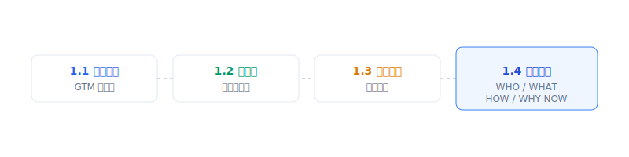

# 模块一：GTM 基础认知与战略意义

> **学习目标**：理解 GTM 的本质，明确其战略价值，掌握 GTM 的核心思考框架
>
> **预计时长**：2 小时
>
> **教学方式**：讲授 + 案例讨论 + 实践练习
>
> **前置知识**：无

---

## 核心内容

本节覆盖以下内容：
- 模块概述
- 章节列表
- 关键概念预览
- 学习路径
- 开始前的思考
- 学习建议

## 模块概述

本模块是整个 GTM 培训的基础，帮助你建立对 GTM 的正确认知。

**一个残酷的现实**：根据多项行业研究，高达 95% 的新产品最终以失败告终。而这些失败中的绝大多数，不是因为产品本身不好，而是因为 **GTM 准备不足**。

这意味着什么？意味着即使你有一个出色的产品，如果没有正确的市场进入策略，它仍然可能默默无闻地消失在市场中。

本模块将帮助你理解：**GTM 不是简单的营销计划，而是一个完整的"市场进入操作系统"**。它涵盖了从识别目标客户、打造价值主张、选择触达渠道到把握市场时机的全部要素。

### 你将学到什么

通过本模块的学习，你将能够：

1. **清晰定义 GTM**：准确理解 GTM 的本质，区分它与 Marketing Strategy、Business Strategy 的关系
2. **理解战略价值**：通过数据和案例理解 GTM 战略为何至关重要
3. **识别适用场景**：判断何时需要制定或调整 GTM 战略
4. **掌握核心框架**：使用"GTM 核心四问"（WHO/WHAT/HOW/WHY NOW）分析任何市场进入问题

---

## 章节列表

| 章节 | 标题 | 核心内容 | 时长 |
|------|------|----------|------|
| 1.1 | [GTM 的本质定义](./1.1-gtm-definition) | GTM 定义、"操作系统"比喻、与其他战略的区别 | 30分钟 |
| 1.2 | [GTM 战略的重要性](./1.2-gtm-importance) | 关键数据洞察、失败原因分析、成功模式 | 30分钟 |
| 1.3 | [GTM 战略的适用场景](./1.3-gtm-scenarios) | 五大典型场景、决策框架 | 30分钟 |
| 1.4 | [GTM 的核心四问](./1.4-gtm-core-questions) | WHO/WHAT/HOW/WHY NOW 完整框架 | 30分钟 |

---

## 关键概念预览

| 概念 | 定义 | 为什么重要 |
|------|------|-----------|
| **GTM（Go-to-Market）** | 将产品或服务推向市场并获取客户的完整战略与执行体系 | 决定产品成败的核心变量 |
| **PMF（Product-Market Fit）** | 产品与市场需求的匹配程度 | GTM 的前提条件 |
| **ICP（Ideal Customer Profile）** | 理想客户画像 | GTM 战略的起点 |
| **GTM Motion** | 增长引擎类型（PLG/SLG/MLG） | 决定如何触达和转化客户 |

> 📖 完整术语解释请参考 [术语表](../appendix/glossary)

---

## 学习路径

---

## 开始前的思考

在正式学习之前，花几分钟思考以下问题。这些问题没有标准答案，但会帮助你更好地理解后续内容：

### 问题 1：GTM 现状审视
你所在的公司/团队是否有明确的 GTM 战略？如果有，它包含哪些要素？如果没有，你认为缺失的原因是什么？

### 问题 2：案例反思
回顾一个你熟悉的产品发布案例（无论成功还是失败）：
- 它的目标客户是谁？
- 价值主张清晰吗？
- 通过什么渠道触达客户？
- 为什么选择那个时机发布？

### 问题 3：认知挑战
**"好产品自然会卖出去"**——这个观点你同意吗？

如果你同意，思考一下：为什么那么多技术优秀的产品最终失败了？

如果你不同意，思考一下：产品质量和 GTM 战略，哪个更重要？

---

## 学习建议

1. **按顺序学习**：四个章节是递进关系，建议按顺序完成
2. **完成练习**：每章末尾的实践练习是巩固知识的关键
3. **联系实际**：尝试将所学应用到你熟悉的产品或公司
4. **记录问题**：遇到不理解的地方，记下来在后续模块寻找答案

---

## 模块与后续内容的关系

| 本模块内容 | 后续深入模块 |
|-----------|-------------|
| 1.1 GTM 定义中的"操作系统"比喻 | → 模块三：GTM 执行体系 |
| 1.4 核心四问之 WHO | → 模块二：2.3 ICP 构建方法论 |
| 1.4 核心四问之 WHAT | → 模块二：2.4 价值主张设计 |
| 1.4 核心四问之 HOW | → 模块二：2.2 GTM Motion 类型 |
| 1.4 核心四问之 WHY NOW | → 模块二：2.1 跨越鸿沟 |

---

## 关键要点

- 明确 GTM 的本质与战略价值，建立正确认知
- 掌握 WHO/WHAT/HOW/WHY NOW 四问框架的核心逻辑
- 理清模块结构与后续方法论模块的衔接关系

## 实践练习

1. 写下你当前产品/业务最突出的 GTM 痛点（不超过 3 条）
2. 选择 1 个章节，写出你最希望得到的 3 个答案
3. 用“四问”框架快速描述你熟悉的一个产品

## 延伸阅读

- [术语表](../appendix/glossary)
- [推荐阅读](../appendix/reading-list)
- [参考资源](../appendix/resources)

---

**写作状态**：审校完成
**最后更新**：2025-12-23
**版本**：v1.1
