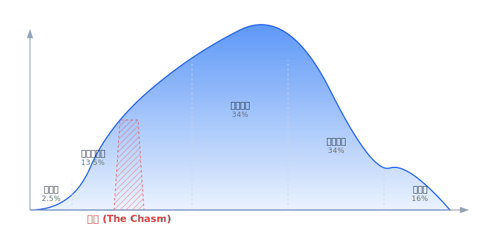
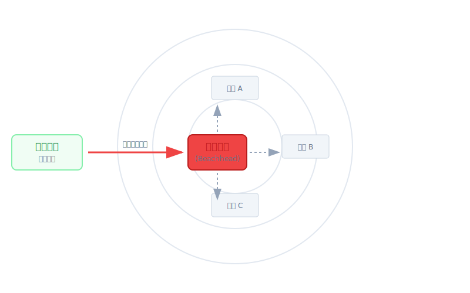
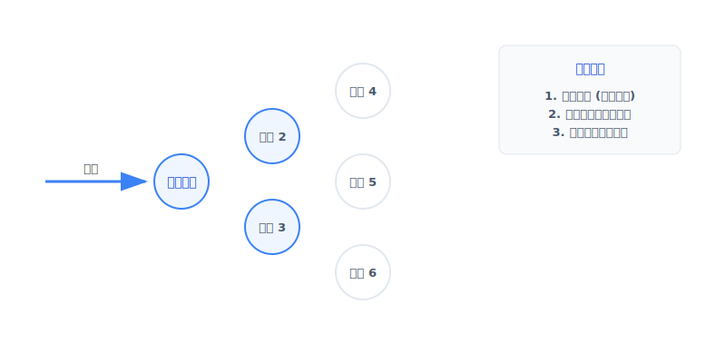
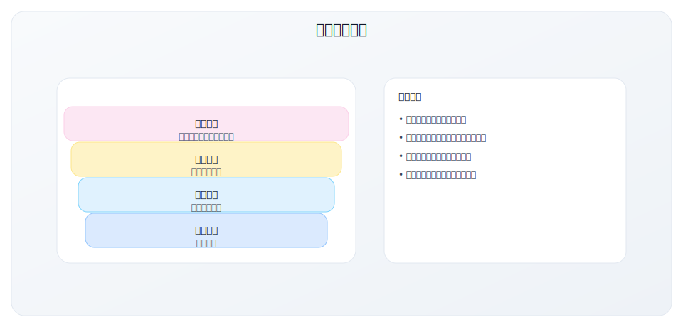

# 2.1 技术采纳生命周期与跨越鸿沟

> **学习目标**：理解技术采纳生命周期的五类用户群体，掌握"鸿沟"的本质，学会制定跨越鸿沟的策略
>
> **预计时长**：60 分钟
>
> **前置知识**：模块一全部内容

---

## 引言：为什么好产品会"卡住"？

你可能听过这样的故事：

> 一款技术领先的产品，在极客圈子里大受欢迎，获得了热烈的用户反馈和媒体报道。创始团队信心满满地开始扩张，准备征服主流市场。然而，增长突然停滞了。原本疯狂增长的用户曲线变平了，甚至开始下降。尽管产品确实很好，尽管早期用户确实很爱，但就是无法突破到更大的市场。

这不是个案。这是一个有规律可循的现象。

**Geoffrey Moore** 在 1991 年的经典著作《跨越鸿沟》（Crossing the Chasm）中揭示了这个规律，并将其命名为——**鸿沟（The Chasm）**。

理解这个规律，是制定正确 GTM 战略的前提。

---

## Geoffrey Moore 与技术采纳生命周期

### 理论背景

Geoffrey Moore 的理论基于 Everett Rogers 在 1962 年提出的 **创新扩散理论**（Diffusion of Innovations）。Rogers 发现，人们对创新的采纳遵循一条钟形曲线，可以分为五类人群。

Moore 的贡献在于：他发现在高科技产品的采纳中，这五类人群之间存在 **断层（Gap）**，而其中一个断层特别致命——那就是 **早期采用者和早期主流之间的鸿沟**。

### 核心洞察

> **技术产品的市场采纳不是连续的、线性的过程，而是存在断裂的、阶段性的过程。**

这意味着：
- 在早期市场成功不能保证在主流市场成功
- 每个阶段需要不同的 GTM 策略
- 跨越阶段需要有意识的战略调整

---

## 技术采纳生命周期：五类用户群体

### 1. 创新者（Innovators）—— 2.5%

**别名**：技术发烧友、Technology Enthusiasts

**核心特征**：
- 对技术本身充满热情，喜欢尝试新事物
- 愿意忍受产品的不完善和 Bug
- 技术能力强，可以自己解决问题
- 乐于提供反馈，参与产品迭代

**购买动机**：
- 技术的新颖性和创新性
- "第一个尝试"的满足感
- 技术学习和探索的乐趣

**对产品的期望**：
- 技术领先、有创新点
- 不介意产品不成熟
- 希望有深度的技术文档

**GTM 策略**：
- 在技术社区发布（Hacker News、Reddit、Product Hunt）
- 强调技术创新和架构优势
- 开放 Beta 测试，邀请参与反馈
- 提供技术白皮书和 API 文档

**风险提示**：
- 创新者的热情不代表主流市场的需求
- 他们的反馈可能过于技术化，偏离商业价值
- 不要把创新者的采纳误解为 PMF 验证

**案例**：
- 区块链早期（2015-2017）的采纳者——极客和密码学爱好者
- ChatGPT 发布第一周的用户——AI 研究者和技术爱好者

---

### 2. 早期采用者（Early Adopters）—— 13.5%

**别名**：愿景者、Visionaries

**核心特征**：
- 有远见，能看到技术的战略价值
- 愿意为获得竞争优势而冒险
- 是组织内的变革推动者
- 有预算和决策权
- 愿意与供应商一起共创解决方案

**购买动机**：
- 获得竞争优势（"比对手早 2 年采用"）
- 实现变革愿景（"用这个技术重塑我们的业务"）
- 成为行业先驱和思想领袖

**对产品的期望**：
- 能解决战略性问题
- 接受产品不完美，但期望快速迭代
- 需要定制和专属支持
- 希望建立长期合作关系

**GTM 策略**：
- **愿景销售**：卖的是未来可能性，而非当前功能
- **高触达销售**：创始人/高管亲自参与
- **POC（概念验证）**：帮助他们验证愿景
- **共创模式**：根据他们的需求定制功能
- **灯塔客户培养**：作为标杆案例

**风险提示**：
- 愿景者的需求可能过于定制化，不适合规模化
- 他们愿意付出的努力和容忍的不便，主流客户不会接受
- 来自愿景者的成功案例，可能无法说服务实者

**案例**：
- 2010-2013 年采纳 Salesforce 的企业——相信云计算是未来
- 2020 年采纳远程办公工具的公司——相信远程工作是趋势

---

### 3. 早期主流（Early Majority）—— 34%

**别名**：务实者、Pragmatists

**核心特征**：
- 务实、谨慎，需要证明才会行动
- 关注实际业务问题的解决
- 需要完整的解决方案，不愿意自己拼凑
- 看重同行的参考和案例
- 厌恶风险，需要安全感

**购买动机**：
- 解决具体的业务问题
- 降低成本或提升效率
- 跟上行业标准（"大家都在用"）

**对产品的期望**：
- **完整产品**：开箱即用，不需要自己组装
- **成熟可靠**：稳定、有保障、有支持
- **行业验证**：有同行业的成功案例
- **标准化**：符合行业规范和集成标准

**GTM 策略**：
- **整体产品**：不只是核心功能，还包括培训、支持、集成
- **同行参考**：提供同行业、同规模的成功案例
- **风险消除**：提供试用、退款保障、SLA
- **垂直聚焦**：先主导一个细分市场，再扩展
- **合作伙伴**：与行业咨询公司、集成商合作

**案例**：
- 2015-2018 年采纳 Slack 的中型公司——看到其他科技公司成功使用后跟进
- 2021-2023 年采纳 AI 工具的企业——在 ChatGPT 证明价值后开始投入

---

### 4. 晚期主流（Late Majority）—— 34%

**别名**：保守者、Conservatives

**核心特征**：
- 对变化持谨慎态度
- 只有在技术成为"标准"后才会采纳
- 价格敏感
- 需要高度成熟、简化的解决方案
- 通常等到"不得不"时才行动

**购买动机**：
- 不落后于竞争对手（"大家都用了"）
- 遵守行业规范或法规要求
- 价格变得可接受

**对产品的期望**：
- 极度成熟和稳定
- 简单易用，无需学习成本
- 价格合理，有预算方案
- 完善的客户支持

**GTM 策略**：
- **标准化产品**：高度成熟、极简配置
- **价格优化**：提供入门级方案
- **渠道销售**：通过代理商、经销商触达
- **捆绑销售**：与其他产品打包
- **被动营销**：让产品"被找到"而非推销

**案例**：
- 2018-2020 年才开始使用云存储的传统企业
- 现在才开始考虑使用 SaaS CRM 的小企业

---

### 5. 落后者（Laggards）—— 16%

**别名**：怀疑论者、Skeptics

**核心特征**：
- 抵触变化和新技术
- 只有在绝对必要时才会采纳
- 通常是被迫采纳（法规、旧系统停止支持）
- 可能永远不会采纳某些技术

**购买动机**：
- 被迫（旧系统不再支持、法规要求）
- 绝对必要（业务无法继续）

**GTM 策略**：
- 通常不值得专门针对这个群体
- 如果必须，提供极简方案和迁移支持
- 强调合规和必要性

**案例**：
- 2020 年疫情期间被迫学会使用视频会议的群体
- 因银行要求必须使用数字支付的传统商户

---

## 鸿沟的本质

### 为什么鸿沟存在？

**鸿沟是早期采用者（愿景者）和早期主流（务实者）之间的断层。**

这个断层的本质是：**两类人群有完全不同的购买心理和决策依据**。

| 维度 | 早期采用者（愿景者） | 早期主流（务实者） |
|------|---------------------|-------------------|
| **购买动机** | 获得竞争优势 | 解决实际问题 |
| **风险态度** | 愿意冒险 | 厌恶风险 |
| **决策依据** | 技术潜力和愿景 | 证明的价值和案例 |
| **对"不完整"的容忍** | 高，愿意自己补全 | 低，需要完整方案 |
| **参考对象** | 技术先驱 | 同行业务实者 |
| **与供应商关系** | 合作伙伴，共创 | 供应商，交付 |
| **成功标准** | 战略价值实现 | ROI 可量化 |

### 鸿沟的危险

**关键洞察**：早期采用者的成功无法说服务实者。

为什么？

1. **参考群体不同**：务实者不参考愿景者，他们参考其他务实者
2. **成功标准不同**：愿景者满意的"战略价值"，务实者不买账
3. **产品期望不同**：愿景者能接受的"80% 产品"，务实者无法接受
4. **购买方式不同**：愿景者是"买愿景"，务实者是"买方案"

### 鸿沟中死亡的案例

**案例：Segway（赛格威）**

- **早期市场成功**：2001 年发布时引发轰动，被预言为"改变世界的发明"
- **愿景者买单**：科技爱好者、有远见的公司（如亚马逊仓库）
- **鸿沟中死亡**：主流消费者没有采纳——太贵、没有明确使用场景、缺乏基础设施
- **教训**：技术创新不等于商业成功，没有解决务实者的真实问题

**案例：Google Glass（第一代）**

- **早期市场成功**：科技极客热捧，引发大量媒体关注
- **愿景者买单**：开发者、科技记者、创新爱好者
- **鸿沟中死亡**：主流消费者拒绝——太贵、外形怪异、隐私争议、没有杀手级应用
- **教训**：早期的热度不等于主流市场接受

### 中国案例：跨越鸿沟的成败

**成功案例：钉钉跨越鸿沟**

钉钉的发展历程是中国企业软件跨越鸿沟的典型案例：

| 阶段 | 时间 | 特征 | GTM 策略 |
|------|------|------|---------|
| **早期市场** | 2015-2016 | 互联网创业公司、阿里生态企业 | 愿景销售，强调"未来的工作方式" |
| **跨越鸿沟** | 2017-2019 | 中小企业、传统行业 | 聚焦"考勤管理"这个刚需场景，降低使用门槛 |
| **龙卷风** | 2020 | 疫情推动全面爆发 | 快速扩容、简化产品、教育支持 |
| **主街** | 2021-至今 | 政企、教育、医疗等行业深耕 | 行业解决方案、生态建设 |

**关键跨越鸿沟动作**：
1. **滩头阵地选择**：先聚焦中小企业的"考勤 + 审批"场景（务实者的刚需）
2. **整体产品**：免费 + 简单 + 移动端优先（降低采纳门槛）
3. **参考客户**：积累大量中小企业成功案例
4. **生态建设**：开放平台，让 ISV 提供行业解决方案

**失败案例：某企业社交产品**

2014-2016 年，国内多家公司尝试做"企业版微信"，大多陷入鸿沟：

| 问题 | 具体表现 |
|------|---------|
| **没有明确的滩头阵地** | 试图同时服务所有企业 |
| **整体产品不足** | 只有沟通功能，缺乏企业管理场景 |
| **早期用户≠主流用户** | 互联网公司愿意尝试，传统企业不买账 |
| **没有务实者的参考** | 缺乏同行业成功案例 |

**教训**：技术好、产品体验好不等于能跨越鸿沟，必须有系统的 GTM 策略。

---

## 跨越鸿沟的策略

### 核心策略一：滩头阵地战略（Beachhead Strategy）

**核心思想**：集中所有资源，攻下一个狭窄的细分市场，成为该市场的无可争议的领导者。

**选择滩头阵地的标准**：

| 标准 | 说明 | 评估问题 |
|------|------|----------|
| **市场规模适中** | 小到你能主导，大到足以支撑业务 | 这个市场有多少潜在客户？ |
| **痛点紧迫** | 客户必须解决的问题，而非"可有可无" | 不解决这个问题会怎样？ |
| **决策链短** | 能快速做出购买决策 | 需要几个人决策？周期多长？ |
| **可交付整体产品** | 你能提供完整解决方案 | 客户需要什么才能成功？你能提供吗？ |
| **可作为跳板** | 能辐射到相邻市场 | 成功后，还能卖给谁？ |

**案例：Salesforce 的滩头阵地**

Salesforce 早期没有试图服务所有企业，而是聚焦于：
- **细分市场**：中型 B2B 科技公司的销售团队
- **痛点**：传统 CRM（Siebel）太贵太复杂
- **价值主张**：云端 CRM，无需部署，按月付费

成为这个细分市场的领导者后，再逐步扩展到其他行业和企业规模。

---

### 核心策略二：保龄球道策略（Bowling Alley）

**核心思想**：用第一个滩头阵地的成功，撞倒相邻的细分市场，像保龄球一样连锁反应。

**识别相邻市场的方法**：

1. **行业相邻**：同行业的其他细分（如：科技公司 → 金融科技）
2. **规模相邻**：同行业的不同规模（如：SMB → Mid-Market）
3. **地理相邻**：同类型的不同区域（如：美国 → 欧洲）
4. **用例相邻**：相关的应用场景（如：销售 CRM → 客服 CRM）

**案例：HubSpot 的保龄球道**

- **第一个球瓶**：营销机构（帮助他们做 Inbound Marketing）
- **第二个球瓶**：营销机构的客户（中小企业）
- **第三个球瓶**：直接面向中小企业销售
- **继续扩展**：从营销扩展到销售（Sales Hub）、客服（Service Hub）

---

### 核心策略三：整体产品概念（Whole Product）

**核心思想**：务实者不买"核心产品"，他们买"能让他们成功的完整解决方案"。

**整体产品清单**：

| 类别 | 组成部分 | 示例 |
|------|----------|------|
| **核心功能** | 产品本身的功能 | 软件功能、API |
| **文档支持** | 使用说明和知识库 | 用户手册、帮助中心、视频教程 |
| **实施服务** | 帮助客户上线 | 数据迁移、配置、集成 |
| **培训赋能** | 让用户会用 | 培训课程、认证、Workshop |
| **技术支持** | 解决问题 | 客服、工单系统、SLA |
| **集成生态** | 与其他系统连接 | API、预置集成、合作伙伴 |
| **咨询服务** | 最佳实践指导 | 实施咨询、行业解决方案 |
| **社区资源** | 用户互助 | 用户论坛、模板库、案例 |

**案例：Salesforce 的整体产品**

Salesforce 成功的一个关键是：它不仅仅是一个 CRM 软件，而是一个完整的生态系统：
- **AppExchange**：3,000+ 第三方应用
- **Trailhead**：免费学习平台，200 万+ 学习者
- **咨询伙伴**：全球咨询公司提供实施服务
- **用户社区**：每年 Dreamforce 大会，15 万+ 参与者
- **认证体系**：Salesforce Admin、Developer 等认证

---

## Geoffrey Moore 四阶段 GTM Playbook

### 阶段概览

| 阶段 | 名称 | 市场特征 | 目标客户 | GTM 重点 | 典型挑战 |
|------|------|----------|----------|----------|----------|
| **1** | Early Market | 技术创新期 | 创新者 + 愿景者 | 愿景销售、POC | 找到愿意冒险的客户 |
| **2** | Bowling Alley | 跨越鸿沟期 | 早期主流（务实者） | 垂直聚焦、整体产品 | 让务实者相信你 |
| **3** | Tornado | 高速增长期 | 主流市场大规模采纳 | 规模扩张、标准化 | 跟上市场需求 |
| **4** | Main Street | 成熟市场期 | 晚期主流 + 落后者 | 效率优化、细分 | 保持增长和利润 |

### 阶段一：Early Market（早期市场）

**目标**：找到愿景者，验证产品愿景，获得首批灯塔客户。

**GTM 策略**：

| 活动 | 说明 |
|------|------|
| **愿景销售** | 创始人亲自销售，卖的是未来愿景而非当前功能 |
| **高触达模式** | 一对一深度沟通，理解客户愿景 |
| **POC 验证** | 帮助客户验证技术可行性 |
| **共创开发** | 根据客户反馈快速迭代产品 |
| **灯塔案例** | 培养 3-5 个标杆客户 |

**成功标准**：
- 获得 3-5 个愿意作为案例的客户
- 验证核心价值主张
- 初步验证付费意愿

**常见错误**：
- 把创新者的热情当作 PMF
- 过度定制，偏离产品核心
- 过早扩张销售团队

### 阶段二：Bowling Alley（保龄球道/跨越鸿沟）

**目标**：跨越鸿沟，在一个细分市场建立领导地位，再扩展到相邻市场。

**GTM 策略**：

| 活动 | 说明 |
|------|------|
| **选择滩头阵地** | 聚焦一个可赢的细分市场 |
| **打造整体产品** | 提供完整解决方案，而非核心功能 |
| **同行参考营销** | 培养同细分市场的案例 |
| **垂直销售** | 组建行业专属销售团队 |
| **合作伙伴** | 与行业咨询公司、集成商合作 |

**成功标准**：
- 在目标细分市场占有率 > 50%
- 有 10+ 个可参考的成功案例
- 建立了可复制的销售流程

**常见错误**：
- 过早追求规模，分散资源
- 忽视整体产品建设
- 用愿景者的案例说服务实者

### 阶段三：Tornado（龙卷风/高速增长）

**目标**：抓住市场爆发机会，快速扩张，建立市场领导地位。

**GTM 策略**：

| 活动 | 说明 |
|------|------|
| **规模化销售** | 快速扩张销售团队 |
| **渠道建设** | 发展代理商、经销商网络 |
| **产品标准化** | 减少定制，提高交付效率 |
| **品牌投资** | 建立品类领导者形象 |
| **战略合作** | 与行业巨头合作（如：AWS、Salesforce） |

**成功标准**：
- 三位数增长率
- 市场份额快速提升
- 建立品类领导者地位

**常见错误**：
- 因追求定制化而错失规模化
- 供应能力跟不上需求
- 忽视客户成功导致高流失

### 阶段四：Main Street（主街/成熟市场）

**目标**：在成熟市场保持增长，提升效率和利润率。

**GTM 策略**：

| 活动 | 说明 |
|------|------|
| **市场细分** | 针对不同细分市场提供差异化方案 |
| **效率优化** | 降低获客成本，提升运营效率 |
| **客户成功** | 聚焦留存和扩展，提升 NRR |
| **产品线扩展** | 开发相邻产品，增加钱包份额 |
| **收割后进者** | 通过价格、渠道触达晚期主流 |

**成功标准**：
- 健康的单位经济（LTV/CAC > 3）
- 稳定的 NRR（> 100%）
- 持续的利润改善

**常见错误**：
- 过度追求新客户，忽视现有客户
- 成本控制过度，影响客户体验
- 错过新一轮技术变革

---

## 如何判断你的产品处于哪个阶段？

### 自我诊断框架

| 指标 | Early Market | Bowling Alley | Tornado | Main Street |
|------|-------------|---------------|---------|-------------|
| **客户类型** | 创新者、愿景者 | 务实者（单一垂直） | 务实者（多垂直） | 保守者 |
| **销售模式** | 创始人销售 | 行业销售团队 | 规模化销售 | 渠道/自助 |
| **客户数量** | < 20 | 20-200 | 200-2000 | 2000+ |
| **增长方式** | 案例驱动 | 垂直扩展 | 横向扩展 | 效率驱动 |
| **竞争格局** | 无明确竞品 | 细分市场竞争 | 品类竞争 | 标准化竞争 |
| **价值主张** | 技术领先 | 行业解决方案 | 品类标准 | 价格/便利 |

### 诊断问题

1. **你的客户是什么类型？**
   - 是技术爱好者和愿景者 → Early Market
   - 是单一行业的务实者 → Bowling Alley
   - 是多行业的主流客户 → Tornado
   - 包含大量保守者 → Main Street

2. **你的增长来自哪里？**
   - 主要靠创始人人脉 → Early Market
   - 主要靠行业口碑 → Bowling Alley
   - 主要靠品牌和规模 → Tornado
   - 主要靠效率和价格 → Main Street

3. **竞争格局如何？**
   - 没有明确竞品 → Early Market
   - 在细分市场竞争 → Bowling Alley
   - 品类内激烈竞争 → Tornado/Main Street

---

## 本节关键要点

1. **技术采纳不是连续的**：存在断层，尤其是早期采用者和早期主流之间的"鸿沟"
2. **鸿沟的本质是心理差异**：愿景者和务实者有完全不同的购买心理
3. **跨越鸿沟需要聚焦**：选择一个滩头阵地，成为该市场的领导者
4. **整体产品是关键**：务实者需要完整解决方案，不只是核心功能
5. **保龄球道扩展**：用第一个成功撞倒相邻市场
6. **不同阶段需要不同策略**：Early Market、Bowling Alley、Tornado、Main Street 各有侧重

---

## 实践练习

### 练习 1：阶段诊断

判断你的产品当前处于哪个阶段，并说明依据：

| 诊断维度 | 你的产品现状 | 阶段判断 |
|----------|-------------|----------|
| 客户类型 | | |
| 客户数量 | | |
| 销售模式 | | |
| 竞争格局 | | |
| **综合判断** | | |

### 练习 2：滩头阵地选择

如果你的产品正在跨越鸿沟，列出 3 个可能的滩头阵地，并评估：

| 细分市场 | 市场规模 | 痛点紧迫度 | 你的竞争力 | 是否适合 |
|----------|----------|-----------|-----------|----------|
| | | | | |
| | | | | |
| | | | | |

### 练习 3：整体产品清单

列出让客户成功所需的"整体产品"组成部分：

| 组成部分 | 当前状态 | 差距 | 优先级 |
|----------|----------|------|--------|
| 核心功能 | | | |
| 文档/培训 | | | |
| 实施支持 | | | |
| 集成能力 | | | |
| 成功案例 | | | |

---

## 延伸阅读

- **书籍**：《跨越鸿沟》（Crossing the Chasm）- Geoffrey Moore
- **书籍**：《龙卷风暴》（Inside the Tornado）- Geoffrey Moore
- **书籍**：《大猩猩游戏》（The Gorilla Game）- Geoffrey Moore
- **文章**：[Technology Adoption Life Cycle Overview](https://www.investopedia.com/terms/t/technology-adoption-life-cycle.asp)
- **案例**：Salesforce 跨越鸿沟的完整历程

---

## 下一步

现在你已经理解了技术采纳生命周期和跨越鸿沟的策略，接下来我们将学习 **2.3 ICP 构建方法论**，帮助你精确定义理想客户画像——这是选择滩头阵地的基础。

→ [2.3 ICP 构建方法论](./2.3-icp-methodology.md)

---

**写作状态**：审校完成
**最后更新**：2024-12-07
**版本**：v1.1
