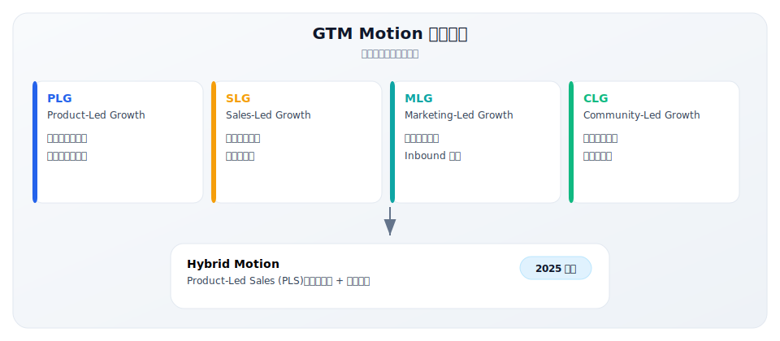
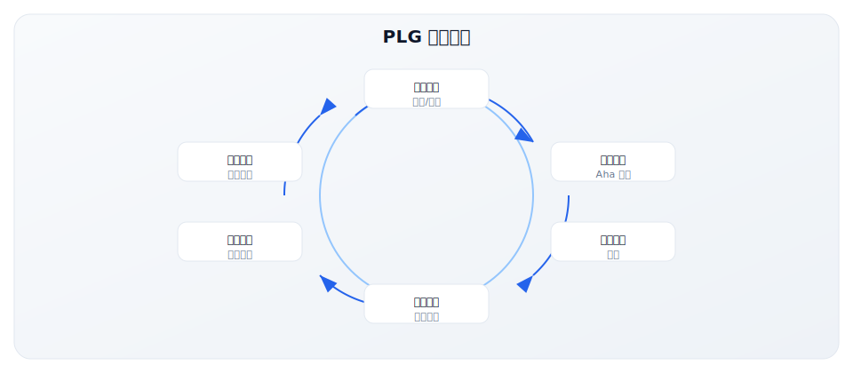
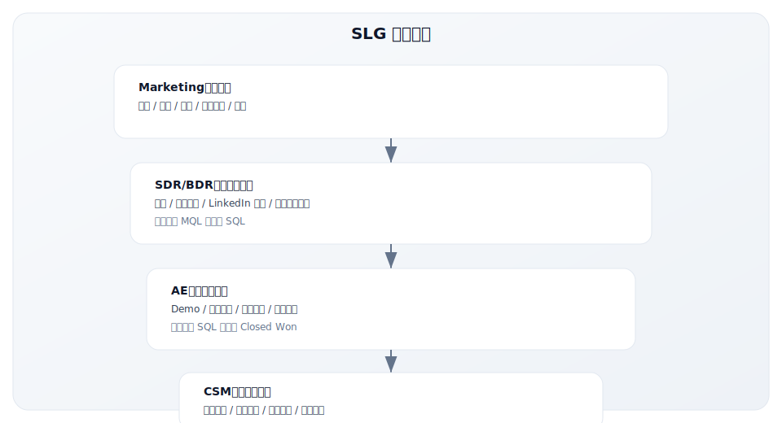
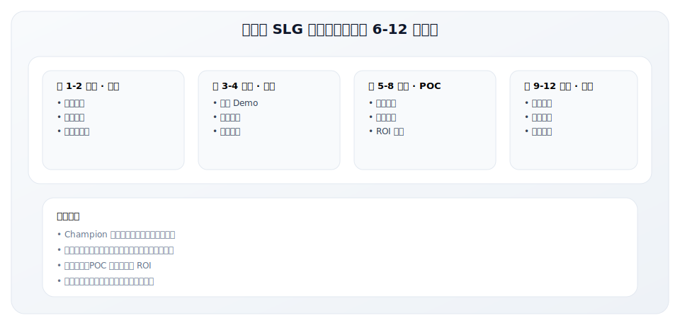
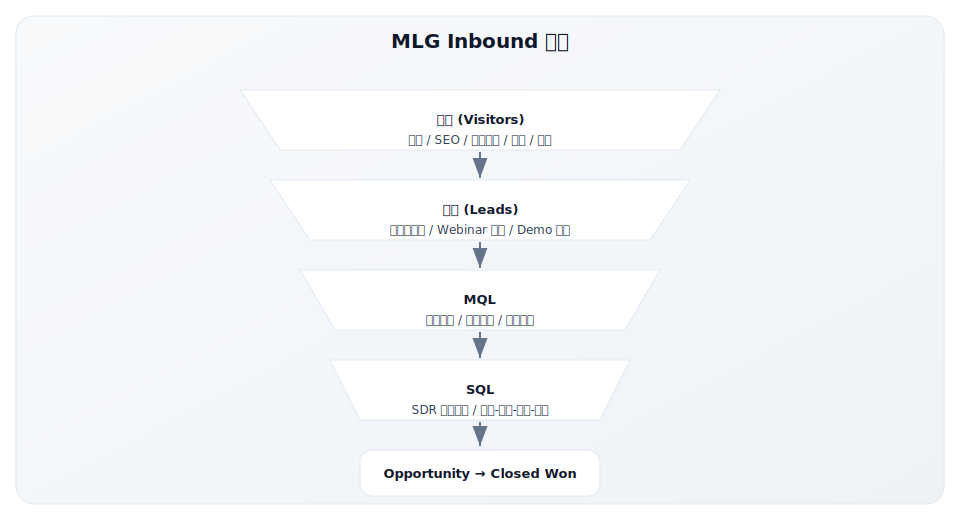
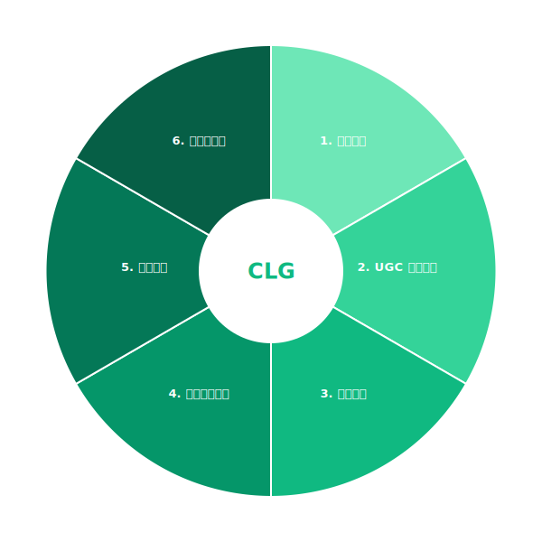
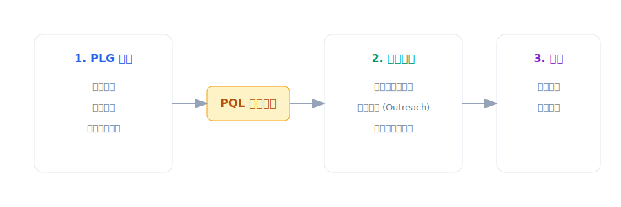
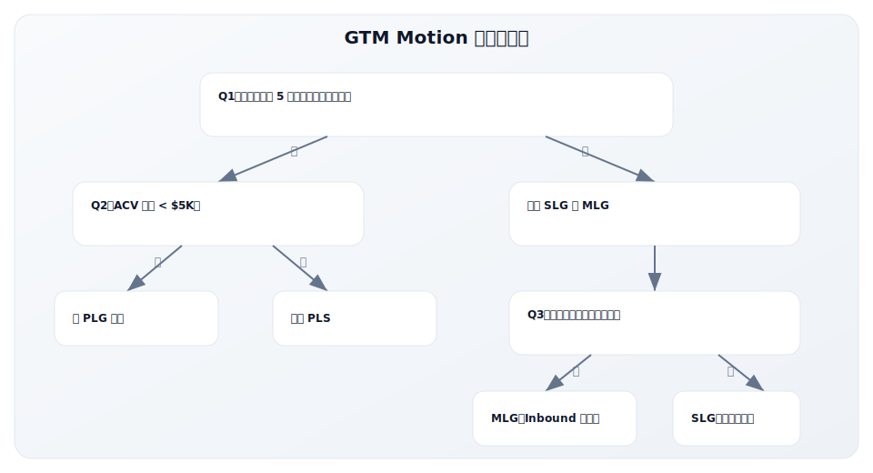
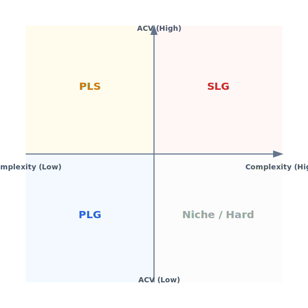

# 2.2 GTM Motion 类型深度解析

> **学习目标**：理解不同 GTM Motion 的特点、适用场景和关键指标，学会选择和设计适合自身的增长模式
>
> **预计时长**：60 分钟
>
> **前置知识**：1.4 GTM 核心四问、2.1 技术采纳生命周期

---

## 引言：增长引擎的选择

在 GTM 战略中，**Motion**（增长模式）是最关键的决策之一。

它决定了：
- 你如何获取客户
- 你需要建设什么样的团队
- 你的成本结构和盈利模式
- 你能达到的增长速度和规模

选错 Motion 的代价极其高昂：

> 一家企业级安全软件公司坚持使用 PLG 模式（免费试用 → 自助购买），但目标客户（大型企业 CISO）根本不会自己注册试用——他们需要销售顾问来讲解合规要求和定制方案。结果：高获客成本，低转化率，两年烧光 5000 万美元。

> 另一家轻量级协作工具配置了昂贵的企业销售团队追逐大客户，忽视了产品天然的病毒传播属性。结果：销售成本居高不下，错失了指数级增长的机会。

本节将帮助你理解各种 GTM Motion 的特点，并提供选择框架。

---

## GTM Motion 概览

GTM Motion 是指公司获取、转化、留存客户的核心运作模式。主要分为四种基本类型和一种混合模式：



### 核心区别一览

| 维度 | PLG | SLG | MLG | CLG |
|------|-----|-----|-----|-----|
| **增长驱动力** | 产品 | 销售团队 | 营销内容 | 用户社区 |
| **获客方式** | 自助注册/Freemium | 销售拓展/SDR | 内容吸引/活动 | 口碑/推荐 |
| **转化方式** | 自助购买/PQL | 顾问式销售 | MQL→SQL | 社区影响 |
| **典型 ACV** | $0-$5K | $50K+ | $5K-$50K | 各类均可 |
| **销售周期** | 即时-数周 | 3-12 个月 | 1-6 个月 | 变化大 |
| **CAC 特点** | 低 | 高 | 中 | 低 |
| **扩展性** | 极高 | 有限 | 中等 | 高 |

---

## PLG（Product-Led Growth）产品驱动增长

### 核心理念

PLG 的核心是：**让产品成为主要的获客、激活、留存引擎**。

用户通过体验产品来发现价值，而非通过销售或营销说服。产品本身承担了传统销售和市场的部分职能。



### PLG 的典型模式

#### 1. Freemium（免费增值）

提供永久免费版本，通过付费版本的高级功能变现。

| 公司 | 免费版 | 付费触发点 |
|------|--------|-----------|
| Slack | 10K 消息历史、10 个集成 | 更多历史、无限集成、合规功能 |
| Notion | 个人版免费 | 团队协作、权限管理、API 访问 |
| Dropbox | 2GB 存储 | 更多存储、团队功能 |

**优势**：降低尝试门槛，快速扩大用户基数
**风险**：免费用户可能永远不转化

#### 2. Free Trial（免费试用）

提供限时的完整产品体验，试用期结束后需付费。

| 公司 | 试用期 | 特点 |
|------|--------|------|
| Zoom | 40 分钟免费会议 | 功能完整，时间限制 |
| Figma | 免费 3 个项目 | 功能完整，数量限制 |
| Canva Pro | 30 天 | 完整功能，时间限制 |

**优势**：用户体验完整价值，转化率更高
**风险**：试用期设计不当可能导致用户流失

#### 3. Open Core（开源核心）

核心产品开源免费，企业版功能付费。

| 公司 | 开源部分 | 付费部分 |
|------|----------|----------|
| GitLab | GitLab CE | Ultimate 版企业功能 |
| Elastic | Elasticsearch | 安全、监控、商业支持 |
| HashiCorp | Terraform OSS | Terraform Cloud/Enterprise |

**优势**：开发者社区驱动，技术认可度高
**风险**：商业化边界难把握，AWS 等巨头可能"分叉"

### PLG 的关键指标

| 指标 | 定义 | 优秀基准 |
|------|------|----------|
| **Time to Value (TTV)** | 用户从注册到感知价值的时间 | < 5 分钟（理想） |
| **Activation Rate** | 完成关键动作的用户比例 | > 40% |
| **Free to Paid Conversion** | 免费用户转付费比例 | 2-5%（Freemium）<br>10-20%（Trial） |
| **Viral Coefficient** | 每个用户带来的新用户数 | > 1 为病毒式增长 |
| **PQL Conversion** | PQL 转化为付费客户的比例 | > 20% |
| **Product Adoption Score** | 产品采纳深度评分 | 因产品而异 |

### PQL（Product Qualified Lead）

PLG 的核心概念是 **PQL**——产品合格线索。与传统的 MQL（基于表单填写、内容下载）不同，PQL 是基于产品内行为识别的高意向用户。

**PQL 信号示例**：

| 信号类型 | 示例 |
|----------|------|
| 使用深度 | 使用了 5 个以上核心功能 |
| 使用频率 | 连续 7 天活跃 |
| 协作行为 | 邀请了 3 个以上团队成员 |
| 付费意向 | 点击了定价页面 |
| 账户特征 | 企业邮箱 + 大公司域名 |

**Slack 的 PQL 定义**（案例）：
- 2000+ 条消息发送
- 团队成员 > 10 人
- 使用工作邮箱
- 连续 2 周活跃

当用户满足这些条件时，销售团队才会主动触达——这大大提高了销售效率。

### 中国 PLG 案例：飞书与钉钉的差异化路径

在中国市场，PLG 的应用有其独特性。让我们对比两个代表性案例：

**飞书：偏 PLG 的协作优先策略**

| 阶段 | 策略 | 关键动作 |
|------|------|----------|
| 2019 启动 | 产品体验优先 | 强调"先进团队，先用飞书"，聚焦互联网/科技公司 |
| 2020 疫情 | 免费版扩张 | 视频会议免费、文档免费，快速获取用户 |
| 2021-2022 | 自下而上渗透 | 个人/小团队免费使用，口碑传播 |
| 2023 至今 | PLG + 企业销售 | 免费用户转企业付费，组建销售团队 |

**飞书的 PLG 设计特点**：
- **产品体验驱动**：界面设计、交互体验对标 Notion、Slack
- **免费版功能丰富**：基础协作功能免费，降低尝试门槛
- **病毒传播机制**：文档分享、会议邀请带来新用户
- **PQL 识别**：根据使用深度识别高价值账户

**钉钉：偏 SLG 的渠道优先策略**

| 阶段 | 策略 | 关键动作 |
|------|------|----------|
| 2015 启动 | 免费 + 地推 | 免费产品 + 大规模地推团队 |
| 2016-2018 | 渠道扩张 | 建立代理商体系，覆盖中小企业 |
| 2020 疫情 | 快速扩张 | 在线教育、政务场景爆发 |
| 2021 至今 | 生态平台化 | 低代码平台、ISV 生态 |

**中国市场 PLG 的特殊挑战**：

| 挑战 | 说明 | 应对策略 |
|------|------|----------|
| 付费意愿低 | 中小企业对 SaaS 付费接受度较低 | 免费 + 增值服务，或 PLG 获客 + 销售转化 |
| 决策链复杂 | 即使小公司也常需老板拍板 | 产品内嵌分享/汇报功能，触达决策者 |
| 本地化需求 | 与钉钉、企业微信等本土工具竞争 | 深度本土化，解决中国企业特有需求 |
| 生态依赖 | 需要与微信、支付宝等生态打通 | 开放 API，建设集成生态 |

### 代表案例深度分析

#### Slack：PLG 的教科书

**增长路径**：
1. **2013**：内测期，在游戏公司 Tiny Speck 内部使用
2. **2014**：公开发布，免费版本吸引小团队
3. **2015**：病毒传播——用户邀请外部协作者
4. **2016**：企业版推出，销售团队跟进大客户
5. **2017**：ARR 突破 1 亿美元，仅用 3 年

**PLG 设计精髓**：
- **零摩擦注册**：邮箱即可开始
- **即时价值**：发送第一条消息就能感受协作体验
- **病毒机制**：邀请外部人协作 → 新用户 → 新团队注册
- **Freemium 钩子**：免费版够用但有限制（消息历史、集成数）
- **数据驱动 PQL**：基于使用行为识别高价值账户

**关键数据**（2019 IPO 时）：
- 日活用户 1000 万+
- 付费客户 88,000+
- $625K+ 年付费客户 575 个
- NRR 143%

#### Figma：协作设计的 PLG 典范

**增长路径**：
1. **2016**：发布首个基于浏览器的协作设计工具
2. **2017-2019**：设计师社区口碑传播
3. **2020**：疫情加速远程协作需求
4. **2021**：ARR 突破 4 亿美元
5. **2022**：Adobe 以 200 亿美元收购（后终止）

**PLG 设计精髓**：
- **浏览器原生**：无需下载安装，链接即可访问
- **实时协作**：多人同时编辑，像 Google Docs 一样
- **免费个人版**：设计师可免费使用核心功能
- **社区生态**：插件市场、设计资源社区（Community）
- **自下而上渗透**：设计师使用 → 团队采纳 → 企业购买

**关键数据**：
- 2024 财年收入 7.49 亿美元，同比增长 48%
- ARR 达到 9.12 亿美元
- 免费用户转企业付费的飞轮持续运转

### PLG 适用条件

PLG 并非适用于所有产品。以下是关键适用条件：

| 条件 | 说明 | 自检问题 |
|------|------|----------|
| **价值可快速体验** | 用户能在几分钟内感受产品价值 | 用户不付费就能体验核心功能吗？ |
| **用户即买家** | 使用者有购买决策权或强影响力 | 谁在使用产品？他们能决定购买吗？ |
| **低接触可成交** | 产品足够简单，不需要销售解释 | 用户能自己理解并完成购买吗？ |
| **网络效应/病毒性** | 用户使用会带来更多用户 | 用户会邀请他人一起使用吗？ |
| **边际成本低** | 新增用户的成本可忽略不计 | 服务 10 万免费用户你能承受吗？ |

**PLG 不适合的场景**：
- 企业级复杂解决方案（需要定制、合规讨论）
- 高 ACV 产品（$50K+，需要销售介入）
- 决策链复杂（采购委员会、多利益相关者）
- 需要培训才能使用的产品

---

## SLG（Sales-Led Growth）销售驱动增长

### 核心理念

SLG 的核心是：**由专业销售团队主导客户的获取、培育和转化**。

适用于高价值、复杂的企业级产品，需要顾问式销售来解释价值、处理异议、推动决策。

### SLG 的运作模式



### SLG 销售团队结构

| 角色 | 职责 | 典型配比 |
|------|------|----------|
| **SDR/BDR** | 线索开发、资质审查、会议预约 | 2-3 SDR : 1 AE |
| **AE** | 商务演示、方案设计、合同谈判 | 按区域/行业划分 |
| **SE** | 技术支持、POC 实施、技术问答 | 1 SE : 2-3 AE |
| **CSM** | 实施交付、采纳推动、续约扩展 | 1 CSM : 20-50 客户 |

### SLG 的典型销售周期



### SLG 的关键指标

| 指标 | 定义 | 优秀基准 |
|------|------|----------|
| **SQL Volume** | 销售合格线索数量 | 足以支撑配额 |
| **Win Rate** | 机会转化为成交的比例 | 20-30% |
| **Sales Cycle** | 从机会创建到成交的时间 | 行业差异大 |
| **ACV** | 平均年合同价值 | $50K+（企业级） |
| **Quota Attainment** | 销售配额完成率 | > 70% |
| **CAC Payback** | 获客成本回收周期 | < 18 个月 |

### 代表案例深度分析

#### Salesforce：SLG 的开创者

**历史地位**：
Salesforce 不仅是 CRM 领域的领导者，更是 SaaS 和 SLG 模式的开创者。Marc Benioff 在 1999 年创立 Salesforce 时，开创了"No Software"（云端订阅）和企业级直销的模式。

**SLG 设计精髓**：

1. **分层销售组织**：
   - SMB 团队：交易周期短，标准化产品
   - 商业团队：中型企业，适度定制
   - 企业团队：大客户，深度定制，多年合同

2. **MEDDIC 销售方法论**：
   - **M**etrics：客户关注什么指标？
   - **E**conomic Buyer：谁是经济决策者？
   - **D**ecision Criteria：评估标准是什么？
   - **D**ecision Process：决策流程是什么？
   - **I**dentify Pain：核心痛点是什么？
   - **C**hampion：谁是内部支持者？

3. **生态系统策略**：
   - AppExchange 应用市场
   - 合作伙伴网络（SI、ISV）
   - Trailhead 培训社区

**关键数据**：
- 2024 财年收入 349 亿美元
- 150,000+ 客户
- 企业级交易平均 > $100K

#### Workday：HR/财务领域的 SLG 典范

**增长路径**：
1. **2005**：两位 PeopleSoft 创始人创建
2. **2007**：首个客户（纯云端 HCM）
3. **2012**：IPO，收入 1.3 亿美元
4. **2024**：收入超过 70 亿美元

**SLG 设计精髓**：
- **极致聚焦**：只服务大型企业（1000+ 员工）
- **高接触销售**：平均销售周期 9-12 个月
- **客户成功先行**：实施成功率高，口碑驱动增长
- **价值量化**：提供详细的 ROI 分析和业务案例

**关键数据**：
- 平均 ACV > $1M
- 客户留存率 > 95%
- NRR 超过 100%

### SLG 适用条件

| 条件 | 说明 | 自检问题 |
|------|------|----------|
| **高 ACV** | 产品单价足以支撑销售成本 | ACV 是否 > $20K？ |
| **复杂决策** | 需要多个利益相关者参与 | 是否有采购委员会？ |
| **定制需求** | 需要解决方案设计或集成 | 客户是否需要定制？ |
| **合规要求** | 涉及安全、隐私、行业合规 | 是否有合规讨论？ |
| **变革管理** | 产品使用需要组织变革 | 是否需要培训变革？ |

**SLG 不适合的场景**：
- 低 ACV 产品（CAC 无法覆盖）
- 用户可自助完成购买
- 市场教育成本高于销售价值
- 需要快速规模化扩张

### 中国 SLG 案例：销售易与北森

**销售易：CRM 领域的 SLG 实践**

销售易是中国本土 CRM 的代表，采用典型的 SLG 模式：

| 维度 | 销售易的执行 |
|------|-------------|
| 目标客户 | 中大型企业（500+ 员工） |
| 销售团队 | 区域销售 + 行业销售 + SDR |
| 销售周期 | 3-6 个月（大客户 6-12 个月） |
| ACV | ¥30 万-300 万+ |
| 差异化 | PaaS 平台化能力、本土化服务 |

**北森：HR SaaS 的 SLG 标杆**

北森是中国 HR SaaS 领域的领导者，2022 年港股上市：

| 阶段 | SLG 策略 |
|------|----------|
| 2002-2010 | 从测评工具起步，建立品牌 |
| 2010-2015 | 转型 SaaS，建立企业销售团队 |
| 2015-2020 | 产品扩展（招聘、绩效、核心人力），深耕大客户 |
| 2020 至今 | 一体化 HR 云平台，NRR 超过 100% |

**北森 SLG 成功要素**：
- **行业深耕**：专注 HR 领域 20+ 年，深度理解 HR 痛点
- **大客户策略**：聚焦 500 强和中大型企业
- **顾问式销售**：销售团队懂 HR 业务，能提供咨询价值
- **客户成功驱动**：强调实施交付和客户成功，NRR 高

**中国 SLG 的特殊考量**：

| 因素 | 中国特点 | 策略调整 |
|------|----------|----------|
| 关系驱动 | 商务关系在决策中权重高 | 长期客户关系维护，高层 Cover |
| 招标流程 | 大客户常走招投标 | 专门的招投标团队和流程 |
| 本地化服务 | 客户期望本地化支持 | 区域化团队部署 |
| 定制需求高 | 中国企业个性化需求多 | PaaS 能力 + 交付团队 |
| 回款周期长 | 账期通常 30-90 天 | 现金流管理，融资支撑 |

---

## MLG（Marketing-Led Growth）营销驱动增长

### 核心理念

MLG 的核心是：**通过内容营销和品牌建设吸引潜在客户，生成销售线索**。

与"硬推"（Outbound）不同，MLG 更多采用"吸引"（Inbound）策略——创造有价值的内容，让客户主动找上门。

### MLG 的运作模式



### MLG 的内容金字塔

| 层级 | 内容类型 | 目的 | 示例 |
|------|----------|------|------|
| **意识层** | 博客、社交、播客 | 吸引流量 | "什么是 GTM 战略？" |
| **兴趣层** | 电子书、白皮书 | 获取线索 | "GTM 战略完全指南" |
| **考虑层** | 案例研究、对比指南 | 建立信任 | "XX 公司如何用我们提升 50% 效率" |
| **决策层** | Demo、免费咨询 | 推动行动 | "预约 30 分钟 Demo" |

### HubSpot：MLG 的定义者

HubSpot 不仅是 MLG 的代表案例，更是 **"Inbound Marketing"** 概念的创造者。

**MLG 设计精髓**：

1. **创造品类**：2006 年创造"Inbound Marketing"概念
2. **内容帝国**：
   - HubSpot Blog：每月数百万访问
   - Academy：免费认证课程
   - Research：行业报告和数据
3. **Freemium + MQL 组合**：
   - 免费 CRM 吸引用户
   - 内容门控获取线索
   - 线索评分筛选 MQL
4. **全漏斗覆盖**：从 Awareness 到 Decision 的完整内容体系

**关键数据**：
- 2024 年 ARR 超过 25 亿美元
- 网站月访问量超过 3000 万
- 100 万+ 社交粉丝

### MLG 的关键指标

| 指标 | 定义 | 优秀基准 |
|------|------|----------|
| **Website Traffic** | 网站月访问量 | 持续增长 |
| **Lead Volume** | 月线索获取量 | 足以支撑 MQL 目标 |
| **MQL Volume** | 月 MQL 数量 | 行业差异大 |
| **MQL to SQL Rate** | MQL 转化为 SQL 的比例 | > 20% |
| **Content Engagement** | 内容互动率 | 取决于内容类型 |
| **Organic Traffic %** | 自然流量占比 | > 50%（理想） |

---

## CLG（Community-Led Growth）社区驱动增长

### 核心理念

CLG 的核心是：**用户社区成为增长的核心引擎**。

用户生成内容、互相帮助、口碑推荐，形成自增长飞轮。

### CLG 的运作模式



### CLG 的典型形式

| 形式 | 说明 | 示例 |
|------|------|------|
| **模板/资源社区** | 用户共享可复用的模板 | Notion 模板库、Figma Community |
| **插件/扩展市场** | 用户开发的扩展功能 | VS Code 插件、Slack App |
| **问答/论坛** | 用户互相解答问题 | Stack Overflow、Discord |
| **Champion 计划** | 培养用户大使 | Salesforce MVP、HubSpot Champions |
| **开源社区** | 开发者贡献代码 | GitHub、GitLab |

### Notion 社区：UGC 驱动增长

**社区策略**：
- **模板画廊**：用户上传分享自己的模板
- **Ambassador 计划**：培养用户大使推广产品
- **社交传播**：Twitter、YouTube 上的 Notion 内容创作者
- **本地社区**：全球各地的 Notion Meetup

**增长效果**：
- 数十万用户创建的模板
- 大量 YouTube 教程由用户自发创作
- Twitter 上 #Notion 话题持续活跃

---

## Hybrid Motion：混合模式与 Product-Led Sales

### 2025 年的主流趋势

根据 ICONIQ 2025 State of Go-to-Market 报告：

> **超过 1/3 的 AI 原生公司采用混合模式**——既有 PLG 的产品引流，又有销售团队收割高价值账户。

纯 PLG 和纯 SLG 都有局限：
- **纯 PLG**：难以触达企业级大客户，Self-serve 天花板明显
- **纯 SLG**：获客成本高，规模扩展慢

**Product-Led Sales（PLS）** 结合了两者优势。

### PLS 的运作模式



### PLS 的关键要素

| 要素 | 说明 |
|------|------|
| **PQL 定义** | 清晰定义什么使用行为触发销售跟进 |
| **账户评分** | 基于公司规模、行业、使用深度评分 |
| **销售触发器** | 自动将高分账户分配给销售 |
| **上下文销售** | 销售基于产品使用数据对话 |
| **时机把握** | 在用户最需要帮助时介入 |

### Dropbox 和 Zoom 的 PLS 进化

#### Dropbox：从 PLG 到 PLS

**早期（2007-2015）**：
- 纯 PLG 模式
- 病毒邀请机制（邀请得空间）
- 个人用户和小团队为主

**转型（2015 至今）**：
- 组建企业销售团队
- 基于产品使用识别企业账户
- Dropbox Business 针对大客户
- 现在超过 50% 收入来自企业

#### Zoom：疫情加速的 PLS 典范

**疫情前**：
- PLG 为主，免费会议吸引用户
- 小企业自助购买 Pro 版本

**疫情期间（2020）**：
- 用户暴增（日活从 1000 万到 3 亿）
- 企业需求激增
- 快速扩充企业销售团队
- 基于使用数据识别大客户

**现在**：
- 成熟的 PLS 模式
- PLG 获客 + 企业销售收割
- ARR 超过 40 亿美元

---

## GTM Motion 选择决策框架

### 核心决策变量

| 变量 | PLG 适合 | SLG 适合 |
|------|----------|----------|
| **产品复杂度** | 低-中，可自助理解 | 高，需要解释和配置 |
| **ACV** | < $5K | > $20K |
| **买家类型** | 终端用户 | 高管/采购 |
| **决策周期** | 即时-几周 | 几个月-一年 |
| **定制需求** | 低，标准化产品 | 高，需要解决方案 |
| **合规要求** | 低 | 高 |
| **价值体验** | 几分钟可感知 | 需要 POC 证明 |

### 选择决策树



### Motion 选择矩阵



---

## 本节关键要点

1. **GTM Motion 是战略选择**：决定了团队结构、成本模型、增长速度
2. **PLG 的本质是让产品成为销售**：适合可快速体验价值、低 ACV、用户即买家的产品
3. **SLG 的本质是专业顾问式销售**：适合高 ACV、复杂决策、需要定制的企业级产品
4. **MLG 的本质是内容吸引客户**：适合需要市场教育、建立思想领导力的场景
5. **CLG 的本质是用户帮用户**：适合有网络效应、用户生成内容价值高的产品
6. **PLS 是 2025 主流趋势**：结合 PLG 引流和 SLG 收割，覆盖全客户谱系
7. **Motion 可以演进**：随着产品成熟和市场扩展，Motion 可以从 PLG 向 PLS 向 SLG 演进

---

## 实践练习

### 练习 1：Motion 诊断

分析你的产品，回答以下问题并判断适合的 Motion：

| 问题 | 你的回答 | Motion 倾向 |
|------|----------|-------------|
| 用户能否在 5 分钟内体验核心价值？ | | 是→PLG |
| ACV 是多少？ | | <$5K→PLG, >$20K→SLG |
| 目标买家是终端用户还是高管/采购？ | | 用户→PLG, 高管→SLG |
| 是否需要销售解释才能理解价值？ | | 否→PLG, 是→SLG |
| 是否有合规/安全/定制需求？ | | 否→PLG, 是→SLG |
| **综合判断** | | |

### 练习 2：PQL 定义

如果你的产品采用 PLG 或 PLS，尝试定义你的 PQL：

| PQL 信号 | 阈值 | 理由 |
|----------|------|------|
| 使用频率 | 例：连续 7 天活跃 | |
| 功能深度 | 例：使用 5+ 核心功能 | |
| 协作行为 | 例：邀请 3+ 成员 | |
| 账户特征 | 例：企业邮箱 | |
| 其他信号 | | |

### 练习 3：Motion 演进规划

如果你的公司当前是某种 Motion，思考未来可能的演进路径：

```
当前 Motion：____________

短期（1 年）：____________

理由：____________

中期（3 年）：____________

理由：____________
```

---

## 延伸阅读

- **书籍**：《Product-Led Growth》by Wes Bush
- **书籍**：《The SaaS Playbook》by Rob Walling
- **报告**：[OpenView 2024 Product Benchmarks](https://openviewpartners.com/product-benchmarks/)
- **报告**：[ICONIQ 2025 State of Go-to-Market](https://www.iconiqcapital.com/)
- **案例**：[How Slack Built a $27B Company with PLG](https://openviewpartners.com/blog/slack-product-led-growth/)
- **案例**：[Figma's Path to $10B](https://www.productled.com/blog/figma-product-led-growth)

---

## 下一步

现在你已经理解了不同 GTM Motion 的特点，接下来我们将学习 **2.1 技术采纳生命周期与跨越鸿沟**，帮助你判断产品所处的市场阶段——这是选择 Motion 的重要前提。

→ [2.1 技术采纳生命周期与跨越鸿沟](./2.1-crossing-the-chasm.md)

---

**写作状态**：审校完成
**最后更新**：2024-12-07
**版本**：v1.1
