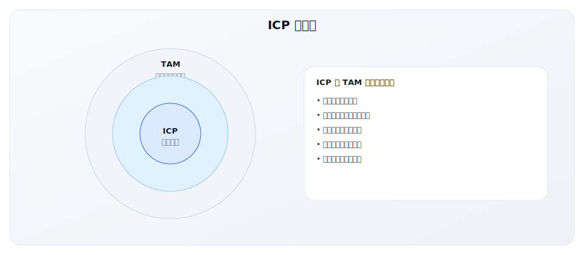
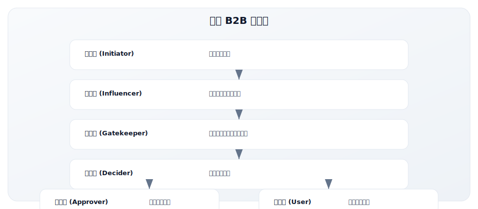
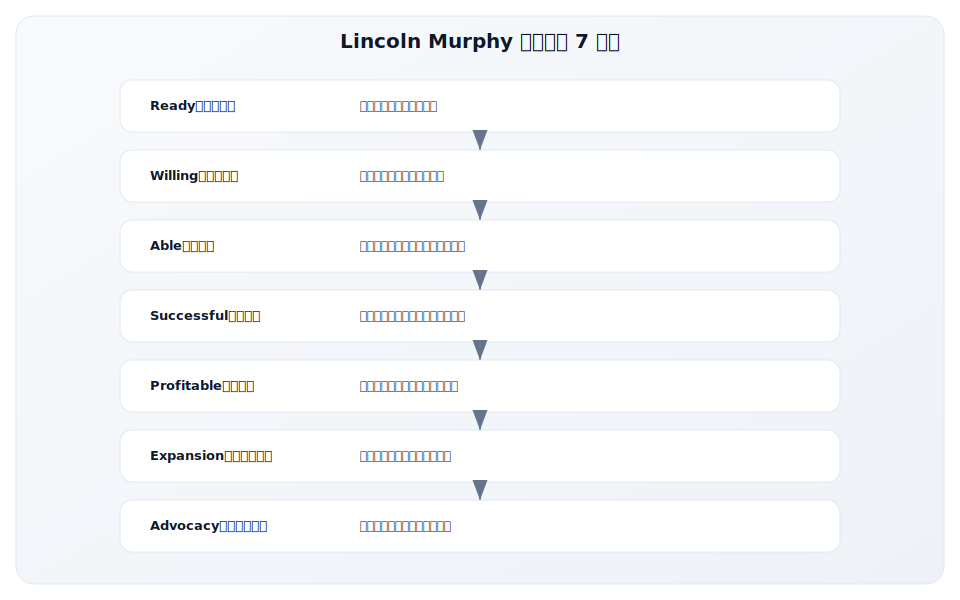
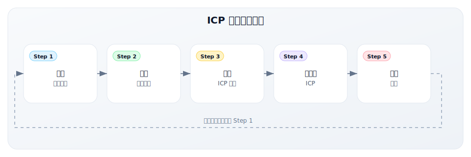
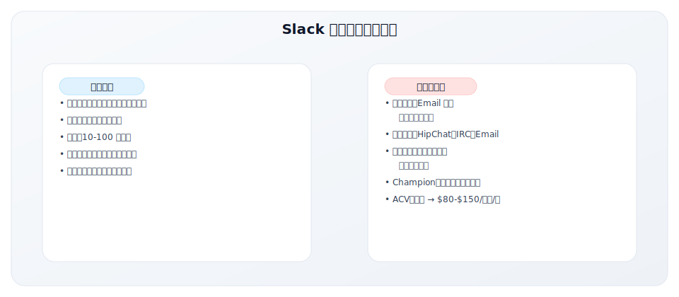
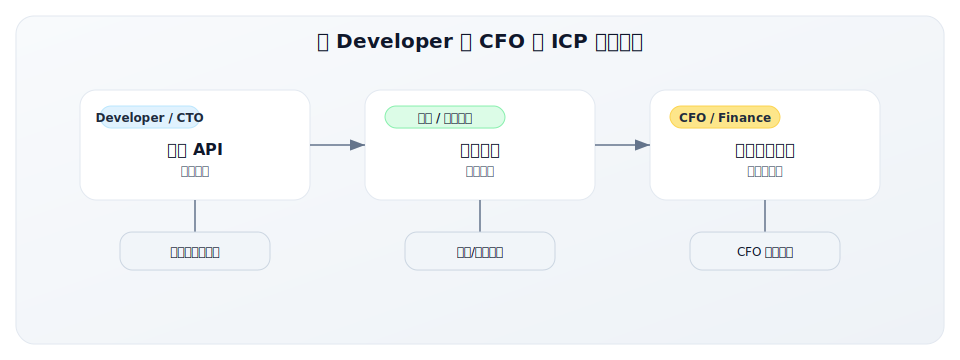
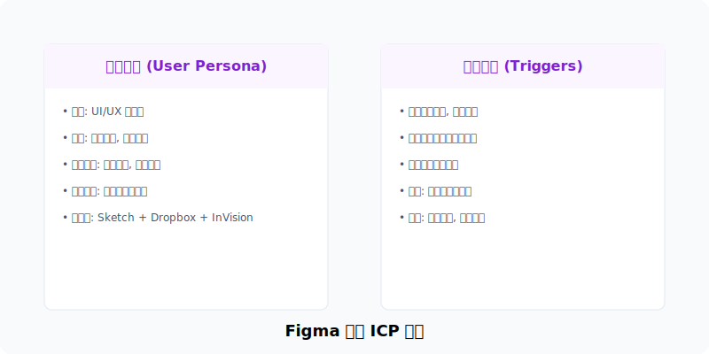
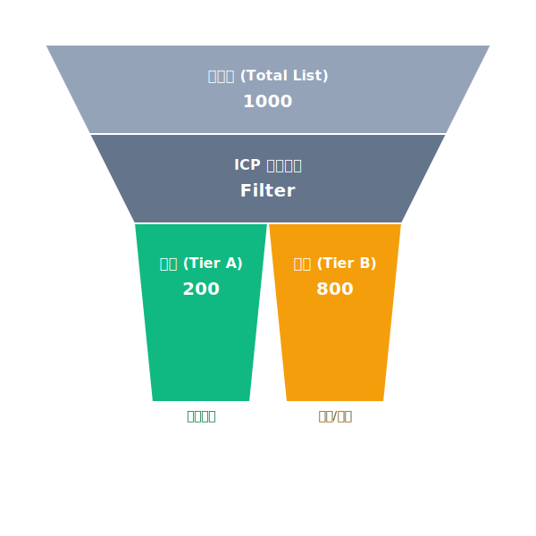

# 2.3 ICP（理想客户画像）构建方法论

> **学习目标**：掌握 ICP 构建的完整方法论，能够定义精准的理想客户画像，指导 GTM 资源分配
>
> **预计时长**：45 分钟
>
> **前置知识**：1.4 GTM 核心四问、2.1 技术采纳生命周期

---

## 核心内容

本节覆盖以下内容：
- 引言：为什么 ICP 如此重要？
- 什么是 ICP？
- ICP 的六大核心维度
- Lincoln Murphy 理想客户 7 标准
- ICP 构建五步流程
- 版本信息

## 引言：为什么 ICP 如此重要？

在模块一中，我们学到了 GTM 核心四问的第一个问题是 **WHO（卖给谁）**。

ICP（Ideal Customer Profile，理想客户画像）就是对这个问题的系统性回答。

**没有清晰 ICP 的后果**：

> 一家 B2B SaaS 公司的销售团队每个月追逐 200 个不同类型的线索——有的是 10 人小团队，有的是 500 人中型企业，有的是 5000 人大公司。行业从科技到制造到医疗无所不包。结果：销售周期不可预测，成交率只有 5%，客户流失率高达 40%。

**有清晰 ICP 的效果**：

> 同一家公司重新定义 ICP 后，聚焦于"50-200 人的 B2B SaaS 公司，有专职销售团队，正在从 Excel 迁移到 CRM"。结果：销售周期从 4 个月缩短到 6 周，成交率提升到 25%，客户流失率降到 15%。

**ICP 的价值**：
- 让销售团队知道"追什么样的客户"
- 让市场团队知道"内容写给谁看"
- 让产品团队知道"为谁打造功能"
- 让客户成功团队知道"什么客户能成功"
- 让整个 GTM 团队对齐，避免资源分散

---

## 什么是 ICP？

### 定义

**ICP（Ideal Customer Profile）** 是对最有可能从你的产品中获得价值、同时也最能为你带来商业回报的**公司/账户层面**的详细描述。



### ICP vs Buyer Persona

这两个概念常被混淆。关键区别：

| 维度 | ICP | Buyer Persona |
|------|-----|---------------|
| **关注层面** | 公司/账户层面 | 个人/角色层面 |
| **核心问题** | 哪些公司是理想客户？ | 谁是决策者/使用者/影响者？ |
| **典型描述** | "50-200 人的 B2B SaaS 公司" | "VP of Sales，35-45 岁，管理 10 人团队" |
| **主要用途** | 账户筛选、市场定位、资源分配 | 内容营销、销售对话、产品设计 |
| **制定顺序** | 先定义 ICP | 基于 ICP 再定义 Persona |

**类比**：
- **ICP** = 你要去哪个城市（目标公司）
- **Buyer Persona** = 在那个城市里你要见谁（目标角色）

### ICP 示例

**示例 1：CRM 软件公司的 ICP**

```
我们的理想客户是：

公司规模：50-200 名员工
行业：B2B SaaS 或科技服务
年收入：$5M-$30M
地理位置：北美
成长阶段：B 轮到 C 轮融资后
技术栈：使用 Salesforce 或准备从 Excel 迁移
组织特征：有专职销售团队（5-20 人），有 Sales Ops 角色
痛点：销售流程不规范，数据分散，缺乏预测能力
购买信号：最近扩招销售，或刚融资完成
```

**示例 2：企业协作工具的 ICP**

```
我们的理想客户是：

公司规模：500-2000 名员工
行业：金融服务、专业服务、科技
年收入：$50M-$500M
地理位置：全球（英语市场优先）
组织特征：远程/混合办公模式，有多个办公地点
技术栈：使用 Microsoft 365 或 Google Workspace
痛点：跨团队协作困难，信息孤岛，会议过多
购买信号：正在进行数字化转型，或刚经历并购
```

---

## ICP 的六大核心维度

构建 ICP 需要从六个维度进行描述：


### 1. Firmographics（企业特征）

企业的基本属性和外在特征。

| 维度 | 说明 | 示例问题 |
|------|------|----------|
| **行业** | 所属行业/垂直领域 | 科技、金融、医疗、零售？ |
| **公司规模** | 员工数量 | 10-50、50-200、200-1000、1000+？ |
| **年收入** | 公司营收规模 | <$1M、$1-10M、$10-50M、$50M+？ |
| **地理位置** | 总部和运营区域 | 北美、欧洲、亚太？单一市场还是全球化？ |
| **成长阶段** | 公司发展阶段 | 种子期、成长期、成熟期、转型期？ |
| **所有制** | 公司类型 | 创业公司、上市公司、家族企业、非营利？ |

**案例**：Slack 早期的 Firmographics
- 行业：科技/互联网
- 规模：10-500 人
- 地理：北美
- 阶段：快速成长期

### 2. Technographics（技术特征）

企业的技术环境和成熟度。

| 维度 | 说明 | 示例问题 |
|------|------|----------|
| **现有技术栈** | 正在使用的工具和系统 | 用什么 CRM、ERP、协作工具？ |
| **技术成熟度** | 技术采纳程度 | 云原生还是传统 IT？敏捷还是瀑布？ |
| **集成需求** | 需要与什么系统对接 | 需要与 Salesforce、SAP 集成吗？ |
| **安全/合规** | 安全和合规要求 | 需要 SOC2、HIPAA、GDPR 吗？ |
| **IT 决策权** | 谁控制技术选型 | 集中式 IT 还是业务部门自主？ |

**数据获取方式**：
- BuiltWith、Wappalyzer：网站技术栈
- G2、TrustRadius：软件评价和使用
- LinkedIn：技术团队规模和构成
- 客户访谈：直接询问

### 3. Psychographics（心理特征）

企业的文化、价值观和决策风格。

| 维度 | 说明 | 示例问题 |
|------|------|----------|
| **创新倾向** | 对新技术的态度 | 早期采用者还是保守跟随者？ |
| **决策风格** | 如何做购买决策 | 快速决策还是层层审批？ |
| **风险偏好** | 对变革的态度 | 愿意尝试新方案还是偏好安全选项？ |
| **购买行为** | 采购习惯 | 年度预算周期？倾向多年合同？ |
| **文化特征** | 企业文化 | 扁平化还是层级化？远程友好？ |

**如何了解**：
- 查看公司博客、新闻稿、招聘信息
- 研究领导层背景和公开言论
- 分析现有客户中的模式
- 销售过程中的观察和记录

### 4. Pain Points（痛点）

客户面临的问题和挑战。

| 维度 | 说明 | 示例问题 |
|------|------|----------|
| **核心痛点** | 最迫切需要解决的问题 | 是什么让他们夜不能寐？ |
| **紧迫程度** | 问题的急迫性 | 必须立即解决还是可以等待？ |
| **影响范围** | 问题影响多大 | 影响一个人还是整个组织？ |
| **现有解决方案** | 当前如何解决 | 用 Excel？竞品？自建系统？不解决？ |
| **不解决的后果** | 问题持续的代价 | 会损失多少钱？错失多少机会？ |

**痛点挖掘方法**：
- 客户访谈和 Win/Loss 分析
- 销售电话录音分析
- 客户支持工单分析
- 行业报告和调研
- 社交媒体和论坛讨论

### 5. Buying Signals（购买信号）

表明客户可能准备购买的迹象。

| 信号类型 | 说明 | 示例 |
|----------|------|------|
| **意图数据** | 在线搜索和研究行为 | 搜索"CRM 软件对比"、访问竞品网站 |
| **触发事件** | 业务变化或里程碑 | 刚融资、扩招、并购、换 CEO |
| **行为信号** | 与你的互动 | 下载白皮书、参加 Webinar、多次访问定价页 |
| **技术信号** | 技术栈变化 | 开始使用某个集成工具、卸载竞品 |
| **社交信号** | 公开言论 | 在 LinkedIn 讨论相关话题 |

**购买信号数据源**：
- 意图数据平台：Bombora、G2 Intent
- 网站分析：访问行为、内容消费
- CRM 数据：互动历史、阶段变化
- 社交监听：Twitter、LinkedIn
- 新闻监控：融资、招聘、产品发布

### 6. Decision Makers（决策者）

参与购买决策的角色和流程。

| 角色类型 | 说明 | 示例 |
|----------|------|------|
| **Champion** | 内部推动者，你的盟友 | 使用者、问题承受者 |
| **Economic Buyer** | 有预算签字权的人 | CFO、VP、部门负责人 |
| **Technical Buyer** | 评估技术可行性 | IT、安全、架构师 |
| **User Buyer** | 实际使用者 | 一线员工、团队成员 |
| **Blocker** | 可能阻碍决策的人 | 现有供应商关系人、变革抵触者 |

**决策链分析**：


---

## Lincoln Murphy 理想客户 7 标准

Lincoln Murphy 是客户成功领域的先驱，他提出了评估理想客户的 7 个标准框架。

这 7 个标准可以帮助你验证一个客户是否真的"理想"。



### 1. Ready（准备好）

**核心问题**：客户知道自己有问题，并且正在寻找解决方案吗？

**评估标准**：
- 客户是否意识到问题的存在？
- 客户是否在主动寻找解决方案？
- 问题是否已经上升到决策层的视野？

**红旗信号**：
- 需要你"教育"客户认识问题
- 客户说"我们没有这个问题"
- 问题只在基层被感知，高层不知道

**最佳状态**：
- 客户已经在评估解决方案
- 有明确的评估时间线
- 有指定的评估负责人

### 2. Willing（愿意）

**核心问题**：客户愿意投入时间和精力来解决这个问题吗？

**评估标准**：
- 客户是否愿意改变现状？
- 客户是否愿意投入时间做评估和实施？
- 组织是否支持这个变革？

**红旗信号**：
- "我们习惯了现在的做法"
- 没有人愿意牵头推动
- 过去类似项目失败过

**最佳状态**：
- 有明确的 Champion 推动
- 高层支持变革
- 组织已经预留了实施资源

### 3. Able（有能力）

**核心问题**：客户有预算、决策权和实施能力吗？

**评估标准**：
- 是否有预算（或能争取预算）？
- 是否有决策权（或能接触决策者）？
- 是否有技术能力实施？
- 是否有时间投入？

**红旗信号**：
- "我们没有预算"
- 接触不到决策者
- 技术团队无力支持
- 没有时间做实施

**最佳状态**：
- 预算已批准或在计划中
- 能直接接触 Economic Buyer
- 有专职团队负责实施

### 4. Successful（能成功）

**核心问题**：以你产品的当前能力，客户能获得成功吗？

**评估标准**：
- 你的产品能解决他们的核心问题吗？
- 客户具备使用产品的基础条件吗？
- 客户的期望与你能交付的匹配吗？

**红旗信号**：
- 需要大量定制才能满足需求
- 客户的使用场景你没验证过
- 客户期望远超产品能力

**最佳状态**：
- 类似客户已经成功
- 需求与产品高度匹配
- 期望值合理可管理

### 5. Profitable（有利润）

**核心问题**：服务这个客户对你而言是盈利的吗？

**评估标准**：
- 客户的付费能力如何？
- 服务这个客户的成本是多少？
- CAC 回收周期是否可接受？
- 客户是否会大量消耗支持资源？

**红旗信号**：
- 要求大幅折扣
- 需求复杂导致高服务成本
- 小客户但期望大客户待遇
- 历史上类似客户支持成本高

**最佳状态**：
- 愿意按标准价格付费
- 服务成本在预期范围内
- CAC Payback < 12 个月

### 6. Expansion Potential（扩展潜力）

**核心问题**：客户有扩展使用或升级的潜力吗？

**评估标准**：
- 客户公司在增长吗？
- 有更多团队/用户可以使用产品吗？
- 有相邻需求可以交叉销售吗？
- 客户愿意升级到更高版本吗？

**红旗信号**：
- 公司在收缩或裁员
- 已经覆盖了所有潜在用户
- 没有相邻产品可以卖
- 明确表示只需要基础版

**最佳状态**：
- 公司快速增长
- 当前只是试点，有全面推广计划
- 对多个产品线有需求

### 7. Advocacy Potential（推荐潜力）

**核心问题**：客户愿意推荐你的产品或成为案例吗？

**评估标准**：
- 客户是否愿意作为参考客户？
- 客户是否会在社交媒体推荐？
- 客户是否愿意做案例研究？
- 客户在行业内是否有影响力？

**红旗信号**：
- 明确表示不能公开
- 公司政策禁止背书
- 在行业内没有影响力
- 关系仅限于交易

**最佳状态**：
- 积极愿意推荐
- 在行业内有话语权
- 愿意参与案例、活动
- 主动在社交媒体分享

---

## ICP 构建五步流程

### 流程概览



### Step 1：分析最佳客户

**目标**：识别现有客户中"最理想"的那些。

**最佳客户的标准**：
- 付费意愿高，不大幅砍价
- 使用深度高，真正在用产品
- 续约/扩展率高
- 支持成本低
- 愿意推荐，NPS 高
- 成交周期短

**数据分析方法**：

| 数据源 | 分析内容 |
|--------|----------|
| CRM 数据 | 成交周期、ACV、赢单率 |
| 产品数据 | 使用频率、功能采纳、活跃度 |
| 财务数据 | LTV、NRR、支持成本 |
| 客户成功数据 | NPS、流失原因、扩展记录 |

**输出**：最佳客户清单（Top 10-20 客户）

### Step 2：识别共同特征

**目标**：找出最佳客户的共同模式。

**分析维度**（按六大维度）：

```
对每个最佳客户，回答：

Firmographics：
- 什么行业？
- 多少员工？
- 多少收入？
- 什么地区？
- 什么阶段？

Technographics：
- 用什么技术栈？
- 技术成熟度如何？
- 有什么集成需求？

Psychographics：
- 决策风格如何？
- 对变革的态度？
- 购买行为特点？

Pain Points：
- 核心痛点是什么？
- 为什么紧迫？
- 之前怎么解决？

Buying Signals：
- 什么触发了购买？
- 什么时候开始评估？

Decision Makers：
- 谁是 Champion？
- 谁是决策者？
- 决策流程怎样？
```

**输出**：共同特征清单

### Step 3：验证假设

**目标**：验证识别出的特征是否真的预测成功。

**验证方法**：

1. **定量验证**：
   - 检查符合特征的客户是否普遍表现好
   - 检查不符合特征的客户是否表现差
   - 计算相关性

2. **定性验证**：
   - 客户访谈：询问购买原因、成功因素
   - 销售访谈：询问什么类型客户好成交
   - 客户成功访谈：询问什么客户容易成功

3. **Win/Loss 分析**：
   - 赢单客户有什么特征？
   - 输单客户有什么特征？
   - 流失客户有什么特征？

**输出**：验证后的 ICP 假设

### Step 4：文档化 ICP

**目标**：将 ICP 清晰地文档化，便于团队使用。

**ICP 文档模板**：

```
# [公司名] 理想客户画像（ICP）

## 版本信息
- 版本：v1.0
- 更新日期：2024-12-06
- 负责人：[姓名]

## ICP 概述
[一段话描述理想客户是谁]

## Firmographics（企业特征）
- 行业：
- 规模（员工）：
- 规模（收入）：
- 地理：
- 成长阶段：

## Technographics（技术特征）
- 必须有的技术栈：
- 技术成熟度：
- 关键集成：

## Pain Points（核心痛点）
1.
2.
3.

## Buying Signals（购买信号）
1.
2.
3.

## Decision Makers（关键角色）
- Champion：
- Economic Buyer：
- 决策流程：

## 红旗信号（不适合的客户）
1.
2.
3.

## 评分标准
[可选：如何给潜在客户打分]
```

### Step 5：持续迭代

**目标**：ICP 不是一成不变的，需要持续更新。

**迭代触发点**：
- 产品能力变化（新功能、新版本）
- 市场变化（新竞争者、新趋势）
- 客户反馈（新的成功/失败模式）
- 战略变化（进入新市场、新定价）

**迭代频率**：
- 每季度审视一次
- 重大变化时立即更新

---

## 美国 ICP 案例：SaaS 巨头的 ICP 演进

理解 ICP 如何随公司发展演进，最好的方式是研究成功公司的实际路径。以下是几家美国 SaaS 巨头的 ICP 演进案例。

### 案例 1：Slack 的 ICP 演进

Slack 从一个游戏公司内部工具，成长为价值 277 亿美元（被 Salesforce 收购）的企业协作平台，其 ICP 经历了三个阶段的演进。

#### 早期 ICP（2013-2015）



**为什么选择这个 ICP？**
- 科技公司对新工具接受度高
- 口碑传播效果好（工程师社区）
- 病毒式传播：员工跳槽带走使用习惯

#### 成长期 ICP（2016-2018）

```
Slack 成长期理想客户画像：

公司类型：中大型科技公司、金融科技
行业：科技、金融、专业服务
规模：100-5,000 员工
年收入：$10M-$500M
技术成熟度：中高
组织特征：多部门、跨地域团队
核心痛点：跨部门协作、工具碎片化
购买信号：并购后整合、数字化转型
Champion：IT 主管、部门负责人
Economic Buyer：CIO、VP of Engineering
ACV：$15,000-$500,000/年
```

**ICP 扩展策略**：
- 开发企业级功能（SSO、合规、审计）
- 建立企业销售团队
- 推出 Enterprise Grid 产品

#### 成熟期 ICP（2019 至今）

```
Slack 成熟期理想客户画像：

公司类型：财富 500 强、全球企业
行业：全行业（科技、金融、零售、医疗）
规模：5,000+ 员工
年收入：$500M+
合规要求：SOC2、HIPAA、FedRAMP
组织特征：全球分布、复杂组织架构
核心痛点：企业协作平台统一、与现有系统集成
购买信号：企业范围的数字化转型
Champion：VP of IT、数字化转型负责人
Economic Buyer：CIO、CEO
ACV：$500,000-$10M+/年
```

### 案例 2：Datadog 的 ICP 演进

Datadog 是云监控领域的领导者，2023 年营收突破 $20 亿。其 ICP 演进展示了从开发者工具到企业平台的典型路径。

#### 早期 ICP（2010-2014）

```
Datadog 早期理想客户画像：

公司类型：云原生创业公司
行业：SaaS、互联网
规模：10-100 人工程团队
技术栈：AWS/GCP、Docker、微服务
技术成熟度：高，DevOps 文化
核心痛点：云基础设施监控复杂、工具分散
现有解决方案：Nagios、Zabbix（传统方案）
购买信号：迁移到云、容器化改造
Champion：DevOps 工程师、SRE
ACV：$1,000-$50,000/年
```

#### 成长期 ICP（2015-2018）

```
Datadog 成长期理想客户画像：

公司类型：中大型科技公司、数字化先锋企业
行业：科技、金融科技、电商
规模：100-2,000 名工程师
技术栈：混合云、Kubernetes、微服务架构
组织特征：有专职 SRE/Platform 团队
核心痛点：多云环境统一监控、告警疲劳
购买信号：云支出增长、SRE 团队扩建
Champion：Platform Engineering 负责人
Economic Buyer：VP of Engineering、CTO
ACV：$50,000-$500,000/年
```

**关键产品扩展**：
- APM（应用性能监控）
- Log Management（日志管理）
- Security Monitoring（安全监控）

#### 成熟期 ICP（2019 至今）

```
Datadog 当前理想客户画像：

公司类型：大型企业、云优先组织
行业：全行业（重点：金融、医疗、零售、制造）
规模：500+ 工程师，10,000+ 员工
年 IT 预算：$50M+
合规要求：SOC2、HIPAA、PCI-DSS
组织特征：多云战略、云安全优先
核心痛点：可观测性统一平台、安全与合规
购买信号：云安全审计、DevSecOps 转型
Champion：CISO、VP of Platform
Economic Buyer：CIO、CISO
ACV：$500,000-$5M+/年
```

**Datadog ICP 演进的关键洞察**：

| 演进阶段 | ICP 特征 | 产品策略 | 销售策略 |
|---------|---------|---------|---------|
| 早期 | DevOps 创业公司 | 单一监控产品 | PLG + 自助 |
| 成长期 | 科技公司工程团队 | 平台化（APM+Logs） | PLG + Inside Sales |
| 成熟期 | 企业安全与合规 | 全栈可观测性+安全 | Enterprise Sales |

### 案例 3：Stripe 的 ICP 演进

Stripe 是支付基础设施领域的标杆，估值超 $500 亿。其 ICP 演进展示了如何从开发者市场扩展到企业财务市场。

#### 早期 ICP（2011-2014）

```
Stripe 早期理想客户画像：

公司类型：互联网创业公司
行业：SaaS、电商、消费互联网
规模：2-50 人
融资阶段：种子轮到 A 轮
技术成熟度：高，工程师主导
核心痛点：支付集成太复杂，PayPal API 难用
购买信号：正在搭建支付功能
Champion：技术创始人、工程师
决策模式：7 行代码即可接入，工程师可自主决策
收入模式：交易手续费（2.9% + $0.30）
```

**为什么 ICP 是开发者/工程师？**
- 支付是技术决策，工程师有话语权
- API 体验差异化巨大（7 行代码 vs 几周开发）
- 开发者社区口碑传播

#### 成长期 ICP（2015-2018）

```
Stripe 成长期理想客户画像：

公司类型：成长期科技公司、平台型企业
行业：SaaS、Marketplace、订阅经济
规模：50-1,000 员工
年 GMV：$10M-$1B
技术成熟度：中高
组织特征：有支付/收入团队
核心痛点：全球支付、订阅计费、财务合规
购买信号：国际扩张、推出订阅模式
Champion：支付产品经理、工程主管
Economic Buyer：CFO、VP of Engineering
年收入贡献：$50,000-$5M/年
```

**产品扩展**：
- Stripe Connect（平台支付）
- Stripe Billing（订阅计费）
- Stripe Atlas（公司注册）
- Stripe Radar（风控）

#### 成熟期 ICP（2019 至今）

```
Stripe 当前理想客户画像（企业市场）：

公司类型：大型企业、全球化平台
行业：金融服务、零售、SaaS 平台
规模：1,000+ 员工
年 GMV：$1B+
合规要求：PCI-DSS、多国税务合规
组织特征：全球运营、复杂财务结构
核心痛点：全球支付统一、收入确认、税务自动化
购买信号：财务数字化转型、ERP 现代化
Champion：VP of Finance、Treasury
Economic Buyer：CFO
年收入贡献：$1M-$50M+/年
```

**Stripe ICP 演进的关键洞察**：

从开发者到 CFO 的 ICP 扩展路径：


### 案例 4：Figma 的 ICP 演进

Figma 以 $200 亿被 Adobe 收购（后因监管终止），是设计工具领域的颠覆者。其 ICP 演进展示了从个人用户到企业客户的 PLG 路径。

#### 早期 ICP（2016-2018）



#### 成长期 ICP（2019-2021）

```
Figma 成长期理想客户画像：

用户类型：设计团队、产品团队
行业：科技公司、互联网、数字产品公司
团队规模：5-50 名设计师
公司规模：100-2,000 员工
组织特征：产品驱动、设计系统
核心痛点：设计系统管理、设计研发协作
购买信号：扩建设计团队、推行设计系统
Champion：Design Manager、Head of Design
Economic Buyer：VP of Product/Design
ACV：$10,000-$200,000/年
```

**关键突破**：
- Design Systems 功能
- FigJam 白板协作
- Dev Mode（设计研发交接）

#### 成熟期 ICP（2022 至今）

```
Figma 当前理想客户画像：

用户类型：企业设计组织
行业：全行业（科技、金融、咨询、消费品）
设计团队规模：50-500+ 设计师
公司规模：5,000+ 员工
组织特征：设计驱动、全球分布团队
核心痛点：企业级设计运营、品牌一致性
购买信号：设计成熟度提升项目、并购后整合
Champion：VP of Design、Chief Design Officer
Economic Buyer：CIO、CDO
安全要求：SSO、SCIM、SOC2
ACV：$200,000-$5M+/年
```

### 美国 SaaS ICP 演进模式总结

| 公司 | 早期 ICP | 成熟期 ICP | 演进核心 |
|------|---------|-----------|---------|
| Slack | 科技创业公司 | 财富 500 强 | 从团队工具到企业平台 |
| Datadog | DevOps 工程师 | CISO/CIO | 从监控到安全可观测性 |
| Stripe | 技术创始人 | CFO | 从支付 API 到财务基础设施 |
| Figma | 独立设计师 | CDO/CIO | 从设计工具到企业设计平台 |

**共同规律**：
1. **从个人用户到企业买家**：Champion 从 IC（Individual Contributor）升级到 Executive
2. **从单一产品到平台**：通过产品扩展覆盖更多用例，提高 ACV
3. **从自助到销售辅助**：建立企业销售团队，配合 PLG 漏斗
4. **从功能到合规**：增加企业级功能（SSO、审计、合规认证）

---

## 中国 ICP 案例：有赞的 ICP 演进

有赞是中国领先的商家服务公司，其 ICP 定义经历了显著演进：

### 早期 ICP（2012-2015）

```
有赞早期理想客户画像：

公司类型：微信上的小微商家
行业：各类零售、餐饮
规模：个体户到小团队（1-10 人）
技术成熟度：低，无技术能力
核心痛点：想在微信卖货但不会开发
购买信号：在微信群、朋友圈卖货
ACV：几百到几千元/年
```

### 转型期 ICP（2016-2019）

```
有赞成长期理想客户画像：

公司类型：品牌商家、连锁门店
行业：零售、餐饮、美业、教育
规模：中小企业（10-200 人）
年 GMV：¥100 万-1 亿
组织特征：有专职运营团队
核心痛点：线上线下融合、会员运营
购买信号：开始重视私域流量
ACV：¥1-10 万/年
```

### 成熟期 ICP（2020 至今）

```
有赞当前理想客户画像：

公司类型：品牌零售商、连锁企业
行业：新零售、连锁餐饮、美业、教育
规模：中型到大型企业（100+ 员工）
年 GMV：¥1 亿+
组织特征：有数字化部门、有私域运营团队
技术成熟度：中高，有集成需求
核心痛点：全渠道运营、数据驱动增长
购买信号：私域 GMV 增速放缓，需要精细化运营
ACV：¥10-100 万+/年
```

### 有赞 ICP 演进的启示

| 演进方向 | 原因 | 结果 |
|---------|------|------|
| 从小微到中大 | 小微客户付费能力弱、流失率高 | ACV 提升，单位经济模型改善 |
| 从通用到行业化 | 不同行业需求差异大 | 推出有赞零售、有赞美业等行业版本 |
| 从工具到解决方案 | 客户需求升级 | 从开店工具到私域运营解决方案 |
| 从自助到服务 | 大客户需要服务 | 建立客户成功团队 |

### 中国 B2B ICP 的特殊考量

| 维度 | 中国特点 | ICP 定义建议 |
|------|----------|-------------|
| 行业属性 | 行业差异大，垂直化需求强 | 明确行业聚焦，避免"所有行业" |
| 企业规模 | 中小企业数量大但付费能力弱 | 权衡规模与付费能力，考虑"腰部客户" |
| 决策模式 | 老板/一把手决策权重大 | ICP 要包含决策者画像 |
| 地域因素 | 区域经济差异大 | 一线城市 vs 下沉市场 ICP 可能不同 |
| 数字化程度 | 传统企业数字化进程不一 | 考虑技术成熟度和变革意愿 |

---

## ICP 的使用场景

### 1. 销售：账户筛选和优先级



### 2. 市场：定向获客

- 内容策略：写给 ICP 看的内容
- 广告定向：按 ICP 特征定向
- 活动策划：邀请 ICP 画像的客户
- ABM 策略：基于 ICP 做账户营销

### 3. 产品：功能优先级

- 需求评估：这个需求来自 ICP 吗？
- 路线图规划：优先满足 ICP 需求
- 产品定位：为 ICP 设计产品

### 4. 客户成功：资源分配

- 服务分层：ICP 客户优先服务
- 流失预测：非 ICP 客户流失风险高
- 扩展重点：聚焦 ICP 客户扩展

---

## 关键要点

1. **ICP 是账户层面的画像**：描述的是公司特征，不是个人角色
2. **六大维度构建 ICP**：Firmographics、Technographics、Psychographics、Pain Points、Buying Signals、Decision Makers
3. **Lincoln Murphy 7 标准验证**：Ready、Willing、Able、Successful、Profitable、Expansion、Advocacy
4. **ICP 来自数据分析**：分析最佳客户的共同特征，而非拍脑袋
5. **ICP 指导资源分配**：销售追什么客户、市场写什么内容、产品做什么功能
6. **ICP 需要持续迭代**：随产品和市场变化更新

---

## 实践练习

### 练习 1：最佳客户分析

列出你公司的 5 个最佳客户，分析他们的共同特征：

| 维度 | 客户 A | 客户 B | 客户 C | 客户 D | 客户 E | 共同特征 |
|------|--------|--------|--------|--------|--------|----------|
| 行业 | | | | | | |
| 规模 | | | | | | |
| 痛点 | | | | | | |
| 触发事件 | | | | | | |

### 练习 2：Lincoln Murphy 7 标准评估

用 7 标准评估一个当前在追的潜在客户：

| 标准 | 评分（1-5） | 依据 |
|------|------------|------|
| Ready | | |
| Willing | | |
| Able | | |
| Successful | | |
| Profitable | | |
| Expansion | | |
| Advocacy | | |
| **总分** | /35 | |

### 练习 3：ICP 文档撰写

使用本节提供的模板，尝试撰写你公司的 ICP 文档。

→ 详见 [5.2 ICP 定义工作表](../module-05/5.2-icp-worksheet)

---

## 延伸阅读

- **书籍**：《Customer Success》by Nick Mehta, Dan Steinman, Lincoln Murphy
- **文章**：[Lincoln Murphy - Ideal Customer Profile](https://sixteenventures.com/ideal-customer-profile)
- **工具**：[Ideal Customer Profile Template (Miro)](https://miro.com/templates/ideal-customer-profile/)
- **报告**：[SaaS ICP Benchmarks by OpenView](https://openviewpartners.com/)

---

## 下一步

现在你已经掌握了 ICP 构建方法论，接下来我们将学习 **2.4 价值主张设计**，帮助你回答"为什么客户应该选择你"。

→ [2.4 价值主张设计](./2.4-value-proposition)

---

**写作状态**：审校完成
**最后更新**：2025-12-23
**版本**：v1.1
