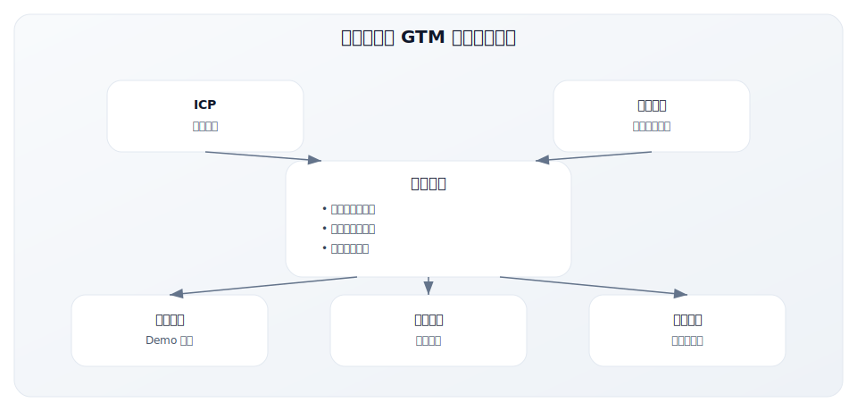
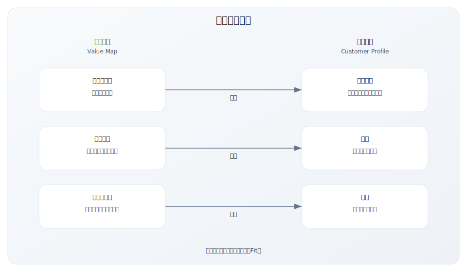
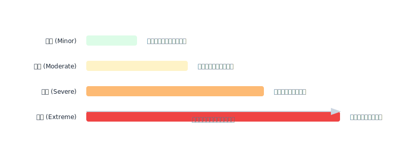
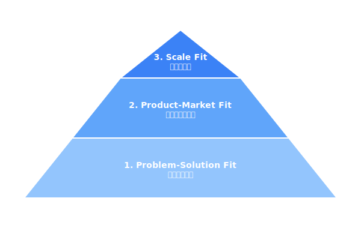
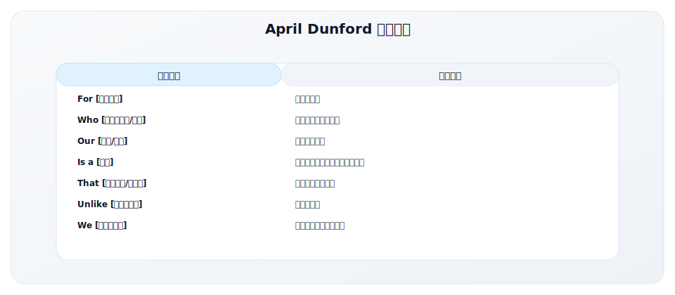
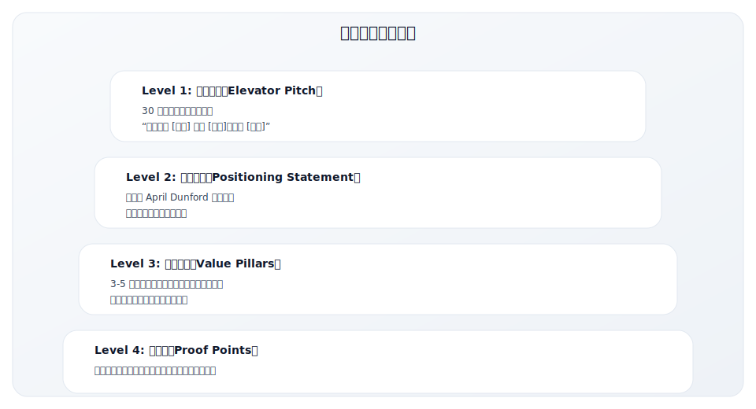
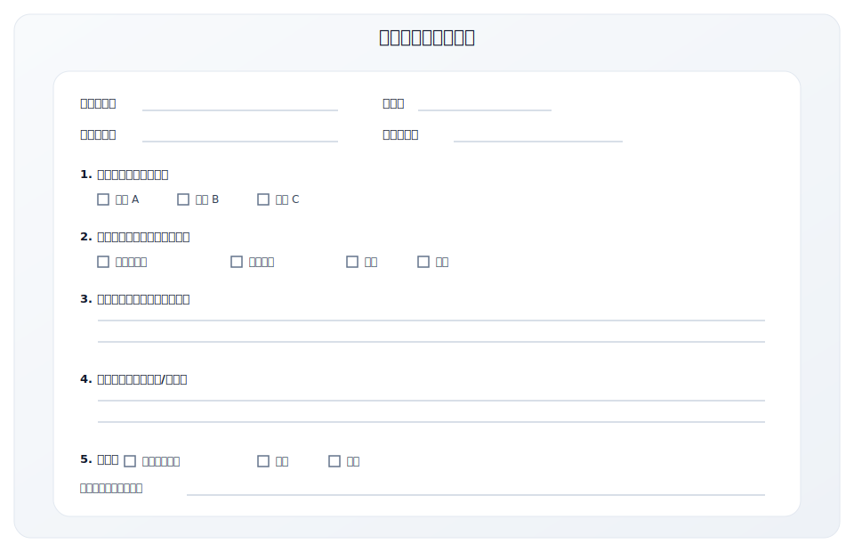
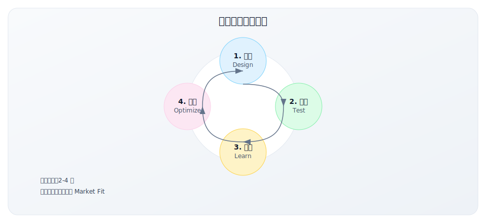

# 2.4 价值主张设计

> **学习目标**：掌握价值主张设计的方法论，能够构建清晰、有差异化、可验证的价值主张
>
> **预计时长**：45 分钟
>
> **前置知识**：2.3 ICP 构建方法论

---

## 核心内容

本节覆盖以下内容：
- 引言：价值主张是 GTM 的核心武器
- 价值主张画布（Value Proposition Canvas）
- April Dunford 定位公式
- 价值主张的层次结构
- 价值主张设计的常见错误
- 价值主张测试与验证

## 引言：价值主张是 GTM 的核心武器

在上一节中，我们学习了如何定义理想客户（ICP）。现在你知道"卖给谁"，但还需要回答一个更关键的问题：

**"凭什么客户要买你的产品？"**

这就是价值主张（Value Proposition）要回答的问题。

### 什么是价值主张？

> **价值主张**是对客户的承诺：清晰说明你的产品或服务将如何解决他们的问题、满足他们的需求，以及为什么选择你而不是其他替代方案。

价值主张不是：
- ❌ 产品功能列表
- ❌ 技术规格说明
- ❌ 公司愿景或使命
- ❌ 营销口号或广告词

价值主张是：
- ✅ 客户能获得的具体价值
- ✅ 你与竞品的核心差异
- ✅ 客户选择你的理由
- ✅ 可验证、可测量的承诺

### 为什么价值主张如此重要？

**价值主张是 GTM 的中枢神经**——它连接了 ICP、定位、销售、营销的所有环节：



**数据说话**：

| 指标 | 弱价值主张 | 强价值主张 | 差异 |
|------|-----------|-----------|------|
| 网站跳出率 | 70-80% | 30-40% | -50% |
| Demo 转化率 | 5-10% | 20-30% | +200% |
| 销售周期 | 长且不稳定 | 短且可预测 | -40% |
| Win Rate | 15-20% | 35-45% | +100% |
| 客户流失率 | 高（期望不匹配） | 低 | -60% |

---

## 价值主张画布（Value Proposition Canvas）

价值主张画布是设计价值主张最经典的工具，由《商业模式新生代》作者 Alexander Osterwalder 在 2014 年的《价值主张设计》中提出。

### 画布结构



### 第一步：深度理解客户画像侧

在设计价值主张之前，你必须先深入理解客户。这与 2.3 节的 ICP 方法论相呼应。

#### 1. Customer Jobs（客户任务）

客户要完成的"任务"分为三类：

| 任务类型 | 定义 | 示例（招聘场景） |
|---------|------|-----------------|
| **功能性任务** | 客户需要完成的具体工作 | 筛选简历、安排面试、发 Offer |
| **社会性任务** | 客户希望在他人面前呈现的形象 | 被视为优秀的招聘经理、找到明星员工 |
| **情感性任务** | 客户希望获得的情感状态 | 减少招聘焦虑、对招聘结果有信心 |

**深挖技巧**：

- **问"为什么"而非"做什么"**：客户说"我需要筛选简历"，追问"为什么？"——"因为我要找到合适的候选人"——"为什么？"——"因为招错人成本太高"
- **区分任务的重要性**：哪些是关键任务（must-have），哪些是次要任务（nice-to-have）
- **识别隐性任务**：客户没有直接说出来，但实际存在的任务

**案例：Notion 的客户任务分析**

| 任务类型 | 具体任务 |
|---------|---------|
| 功能性任务 | 记录笔记、管理项目、协作文档、建立知识库 |
| 社会性任务 | 被视为高效的团队/个人、展示专业的工作方式 |
| 情感性任务 | 感觉工作有条理、减少信息焦虑、有掌控感 |

#### 2. Pains（痛点）

痛点是客户在完成任务过程中遇到的障碍、风险和负面结果。

| 痛点类型 | 定义 | 示例 |
|---------|------|------|
| **不想要的结果** | 任务完成后的负面后果 | 招错人浪费 3 个月 |
| **障碍** | 阻止开始或完成任务的因素 | 简历太多筛不过来 |
| **风险** | 可能出错的事情 | 好候选人被竞争对手抢走 |

**痛点严重程度分级**：



**关键原则**：**只针对极端和重度痛点设计价值主张**。解决轻微痛点不会驱动购买决策。

#### 3. Gains（收益）

收益是客户期望从完成任务中获得的好处。

| 收益类型 | 定义 | 示例 |
|---------|------|------|
| **必需的收益** | 没有它解决方案就不起作用 | 能发布职位、能收到简历 |
| **期望的收益** | 客户预期会有的收益 | 比之前快、比之前便宜 |
| **渴望的收益** | 超出预期但会很高兴 | 自动筛选出 Top 10% 候选人 |
| **意外的收益** | 客户没想到的惊喜 | 候选人数据分析洞察 |

**收益挖掘技巧**：

- **量化收益**：不是"更快"，而是"快 3 倍"
- **对比现状**：与当前做法相比，改善多少？
- **找到"wow 时刻"**：什么收益会让客户说"太棒了"？

### 第二步：设计价值地图侧

理解了客户后，现在设计你的价值主张。

#### 1. Products & Services（产品与服务）

列出你提供的所有产品、服务和功能：

| 类型 | 说明 | 示例（招聘 SaaS） |
|------|------|------------------|
| 核心产品 | 主要提供的产品或服务 | ATS 系统、候选人管理 |
| 增值服务 | 增强核心产品价值的服务 | 培训、实施支持、客户成功 |
| 辅助功能 | 支持核心功能的辅助功能 | 报表、集成、移动 App |

**重要原则**：**不要列出所有功能，只列出与客户关键任务和痛点相关的**。

#### 2. Pain Relievers（痛点解药）

明确说明你的产品如何消除或减轻客户的痛点：

| 痛点 | 痛点解药 | 效果量化 |
|------|---------|---------|
| 简历太多筛不过来 | AI 自动筛选，匹配度评分 | 筛选时间减少 80% |
| 好候选人被竞争对手抢走 | 自动化流程，24 小时内完成初筛 | 响应速度提升 5 倍 |
| 招错人成本高 | 结构化面试、能力评估工具 | 招聘成功率提升 40% |

**设计原则**：

- **聚焦最严重的痛点**：1-3 个核心痛点解药比 10 个分散的更有力
- **可量化**：用数字说明效果
- **可验证**：客户能在试用/POC 中验证

#### 3. Gain Creators（收益创造者）

说明你的产品如何为客户创造收益：

| 期望收益 | 收益创造者 | 交付方式 |
|---------|-----------|---------|
| 找到更好的候选人 | 被动候选人库、人才推荐算法 | 主动推荐匹配候选人 |
| 提升招聘效率 | 自动化工作流、批量操作 | 减少 60% 手工操作 |
| 数据驱动决策 | 招聘漏斗分析、渠道 ROI 报告 | 实时数据看板 |

### 第三步：实现 Fit（匹配）

价值主张设计的目标是实现**客户画像与价值地图的完美匹配**。

#### Fit 的三个层次



#### Fit 评估清单

| 评估维度 | 问题 | 评分（1-5） |
|---------|------|-----------|
| 任务匹配 | 你的产品帮助客户完成他们最重要的任务吗？ | |
| 痛点匹配 | 你解决的是极端/重度痛点还是轻微痛点？ | |
| 收益匹配 | 你创造的收益是客户真正渴望的吗？ | |
| 差异化 | 你的痛点解药和收益创造者与竞品有明显差异吗？ | |
| 可验证 | 客户能在短时间内验证你的价值主张吗？ | |

**评分解读**：
- 20-25 分：强 Fit，可以加速 GTM
- 15-19 分：中等 Fit，需要优化
- 15 分以下：弱 Fit，需要重新设计

---

## April Dunford 定位公式

April Dunford 是 B2B 定位领域的顶级专家，曾帮助 IBM、Google 等公司优化产品定位。她在《Obviously Awesome》中提出了简洁有力的定位公式。

### 定位公式结构



### 每个元素的深度解析

#### 1. 目标客户（For）

不是泛泛的"企业"或"个人"，而是具体的 ICP 描述：

| 弱描述 | 强描述 |
|-------|-------|
| 企业 | 50-500 人的 B2B SaaS 公司 |
| HR 部门 | 年招聘量超过 100 人的招聘团队负责人 |
| 开发者 | 使用 React 的前端工程师 |

#### 2. 问题/需求（Who）

描述客户当前面临的痛点或未被满足的需求：

| 弱描述 | 强描述 |
|-------|-------|
| 需要更好的工具 | 每周花 20+ 小时手动筛选简历 |
| 想提高效率 | 因为招聘流程慢，30% 的候选人流失给竞争对手 |
| 需要协作 | 团队使用 5 个不同工具，信息分散无法追溯 |

#### 3. 产品/服务（Our）

你的产品或服务名称。保持简洁。

#### 4. 品类（Is a）

**品类选择是定位中最关键的决策**。它决定了：
- 客户用什么已有认知来理解你
- 你与谁竞争
- 客户的预期价格范围
- 评估你的标准

| 品类策略 | 适用场景 | 示例 |
|---------|---------|------|
| 已有品类 | 市场成熟，客户有明确认知 | "CRM 系统" |
| 品类细分 | 在大品类中找差异化 | "对话式 CRM" |
| 品类创造 | 全新解决方案，无对标 | "收入运营平台"（Revenue Operations） |

#### 5. 关键利益（That）

你为客户创造的核心价值。通常是 1-2 个最重要的利益：

| 弱描述 | 强描述 |
|-------|-------|
| 提高效率 | 将招聘周期从 45 天缩短到 20 天 |
| 更好用 | 不需要培训，10 分钟上手 |
| 更便宜 | 比 Salesforce 便宜 70%，功能覆盖 90% |

#### 6. 竞争替代品（Unlike）

客户目前如何解决这个问题：

- **直接竞品**：同品类的其他产品
- **替代方案**：用其他方式解决问题（如 Excel、人工）
- **不作为**：客户选择不解决这个问题

#### 7. 独特差异点（We）

你与竞品的核心差异。必须是：
- **客户关心的**：差异点必须对客户有价值
- **可验证的**：客户能在体验中感知到
- **难以复制的**：竞品短期内无法追上

### 定位公式实战案例

#### 案例 1：Slack（早期定位）

```
For [快速成长的科技团队]
Who [被海量邮件淹没，重要信息总是找不到]
Our [Slack]
Is a [团队消息平台]
That [让工作沟通像聊天一样简单，同时保持结构化和可搜索]
Unlike [邮件和传统即时通讯]
We [基于频道组织对话，强大的搜索和集成能力]
```

**解析**：
- **品类选择**："团队消息平台"而非"企业社交"或"协作工具"——更具体，更易理解
- **痛点聚焦**：邮件海量、信息难找——非常具体的痛点
- **差异化**：频道 + 搜索 + 集成——可验证的独特价值

#### 案例 2：Figma（早期定位）

```
For [需要与团队紧密协作的产品设计师]
Who [厌倦了文件版本混乱、反馈流程繁琐]
Our [Figma]
Is a [协作式界面设计工具]
That [让整个团队在同一画布上实时设计和反馈]
Unlike [Sketch 和 Adobe XD 等本地设计工具]
We [基于浏览器、实时多人协作、无需文件传输]
```

**解析**：
- **ICP 精准**：不是"所有设计师"，而是"需要协作的产品设计师"
- **品类定位**："协作式界面设计工具"——强调差异化的协作属性
- **竞品明确**：Sketch、Adobe XD——直接指出替代谁

#### 案例 3：Notion（重新定位后）

```
For [追求高效的个人和团队]
Who [被割裂的工具搞得焦头烂额——笔记一个、项目管理一个、文档又一个]
Our [Notion]
Is a [连接式工作空间]
That [将笔记、文档、项目、知识库融为一体]
Unlike [使用多个单一功能工具的组合]
We [一个工具替代多个，且能根据需求灵活搭建]
```

**解析**：
- **品类创造**："连接式工作空间"——创造新品类
- **痛点具体**：工具割裂——现代知识工作者的普遍痛点
- **差异化**：一个替代多个 + 灵活搭建——可感知的独特价值

### 中国本土案例：飞书 vs 钉钉的价值主张对比

飞书和钉钉作为中国企业协作市场的两大玩家，采用了截然不同的价值主张策略：

#### 飞书的价值主张

```
For [追求高效的创新型团队]
Who [被传统办公工具的低效协作所困扰——信息分散、会议低效、协作割裂]
Our [飞书]
Is a [先进企业协作与管理平台]
That [让团队协作像呼吸一样自然，让每个人都能高效工作]
Unlike [传统 OA 系统或功能堆砌的协作工具]
We [将即时沟通、文档协作、日程管理、视频会议深度融合，
    用产品思维重新定义企业协作体验]
```

**飞书价值支柱**：

| 价值支柱 | 核心承诺 | 证据点 |
|---------|---------|--------|
| **高效沟通** | 信息触达、必达、已读 | 消息智能分类、紧急消息、已读回执 |
| **深度协作** | 多人实时协作，信息不丢失 | 飞书文档、多维表格、实时协作 |
| **透明对齐** | 目标透明、进度可见 | OKR 工具、飞书 People |
| **智能高效** | AI 赋能，减少重复工作 | 飞书妙记、智能翻译 |

#### 钉钉的价值主张

```
For [各类规模的企业和组织]
Who [需要数字化管理和高效办公]
Our [钉钉]
Is a [数字化工作平台]
That [让组织管理更简单、让工作更高效]
Unlike [传统的 OA 和 ERP 系统]
We [一个平台连接所有人和业务，
    低代码让企业快速搭建专属应用]
```

**钉钉价值支柱**：

| 价值支柱 | 核心承诺 | 证据点 |
|---------|---------|--------|
| **组织管理** | 从"管人"到"管事" | 考勤、审批、组织架构 |
| **业务数字化** | 业务在线化、数据化 | 低代码平台、宜搭 |
| **生态连接** | 连接上下游、第三方应用 | 钉钉应用市场、ISV 生态 |
| **普惠覆盖** | 让每个组织都用得起 | 基础功能免费、下沉市场覆盖 |

#### 价值主张差异分析

| 维度 | 飞书 | 钉钉 |
|------|------|------|
| **目标客户** | 创新型团队、互联网/科技公司 | 各类企业、从小微到大型 |
| **核心诉求** | 协作体验、团队效率 | 管理效率、数字化转型 |
| **差异化** | 产品体验、深度融合 | 生态广度、低代码能力 |
| **品类定位** | "先进企业协作平台" | "数字化工作平台" |
| **情感诉求** | "先进团队，先用飞书" | "让工作学习更简单" |

**启示**：
- 即使在同一市场竞争，也可以通过不同的价值主张定位不同客户群
- 飞书侧重"体验"，钉钉侧重"效率"，各有所长
- 价值主张需要与 ICP 高度一致——飞书聚焦创新团队，钉钉覆盖更广

---

## 价值主张的层次结构

一个完整的价值主张体系需要覆盖不同的使用场景：



### 层次结构示例（招聘 SaaS）

**Level 1：电梯演讲**
> "我们帮助快速成长的科技公司将招聘周期从 45 天缩短到 20 天，让招聘团队用更少的时间找到更好的候选人。"

**Level 2：定位声明**
> For [年招聘量 100+ 的科技公司招聘团队]
> Who [被海量简历淹没，优质候选人流失严重]
> Our [TalentFlow]
> Is a [AI 驱动的智能招聘平台]
> That [自动化 80% 的重复工作，帮助团队专注于高价值候选人互动]
> Unlike [传统 ATS 只是简历仓库]
> We [结合 AI 匹配和自动化工作流，端到端优化招聘效率]

**Level 3：价值支柱**

| 价值支柱 | 核心承诺 | 关键功能 |
|---------|---------|---------|
| **速度** | 招聘周期缩短 50% | AI 简历筛选、自动化邀约、智能排期 |
| **质量** | 招聘成功率提升 40% | 能力评估、结构化面试、候选人评分 |
| **洞察** | 数据驱动的招聘决策 | 漏斗分析、渠道 ROI、预测分析 |

**Level 4：证据库**

| 价值支柱 | 证据类型 | 具体内容 |
|---------|---------|---------|
| 速度 | 客户数据 | 字节跳动：招聘周期从 52 天降至 23 天 |
| 速度 | 演示 | 现场演示 AI 筛选 100 份简历只需 30 秒 |
| 质量 | 客户证言 | "入职 6 个月内离职率降低了 35%"—— 某客户 HR VP |
| 洞察 | 案例研究 | 如何通过数据分析优化招聘渠道 ROI |

---

## 价值主张设计的常见错误

### 错误 1：功能堆砌而非价值表达

**错误示例**：
> "我们提供 AI 简历解析、智能匹配算法、自动化工作流、多渠道同步、自定义报表、API 集成..."

**问题**：客户不在乎你有什么功能，只在乎能得到什么价值。

**正确做法**：
> "我们帮助你用一半的时间找到两倍优秀的候选人。"

**转化公式**：功能 → 利益 → 价值

| 功能 | 利益 | 价值 |
|------|------|------|
| AI 简历解析 | 自动提取关键信息 | 减少 80% 的手工操作时间 |
| 智能匹配算法 | 推荐最合适的候选人 | 不再错过优质候选人 |
| 自动化工作流 | 自动发邮件、安排面试 | 招聘团队专注于高价值工作 |

### 错误 2：过于泛化，缺乏差异化

**错误示例**：
> "最好的招聘解决方案"
> "让招聘更简单"
> "全方位的人才管理平台"

**问题**：这些话任何竞品都能说，客户无法区分你与其他选择。

**正确做法**：
> "唯一为 100-500 人科技公司设计的 AI 招聘平台——不是简化版的企业工具，不是复杂版的小工具。"

**差异化检验**：把你的价值主张中的产品名替换成竞品，如果仍然成立，说明不够差异化。

### 错误 3：从内部视角而非客户视角

**错误示例**：
> "我们使用最先进的深度学习技术，训练了超过 1000 万份简历数据..."

**问题**：客户不关心你的技术，只关心结果。

**正确做法**：
> "准确率达到 95% 的候选人匹配——比人工筛选更准，比你更了解什么样的人适合你的团队。"

**视角转化**：

| 内部视角 | 客户视角 |
|---------|---------|
| 我们的技术多先进 | 你能得到什么结果 |
| 我们投入多少研发 | 你能节省多少时间/钱 |
| 我们的团队多厉害 | 你的问题如何被解决 |

### 错误 4：无法验证或测量

**错误示例**：
> "提升招聘体验"
> "更智能的招聘"
> "改变招聘方式"

**问题**：模糊的承诺无法验证，客户不信任。

**正确做法**：
> "14 天免费试用，亲眼见证招聘效率提升——我们承诺：如果第一周内你没有节省至少 10 小时，全额退款。"

**可验证的价值主张要素**：
- 具体数字
- 明确时间框架
- 清晰的衡量标准
- 可验证的承诺（如退款保证）

### 错误 5：试图取悦所有人

**错误示例**：
> "适合所有规模企业的招聘解决方案"
> "无论你是初创公司还是财富 500 强"

**问题**：取悦所有人 = 打动不了任何人。

**正确做法**：
> "专为 100-500 人的快速成长科技公司设计——如果你还在用 Excel 管理招聘，或者已经被 Workday 的复杂性吓到，我们正好适合你。"

**定位取舍**：明确说明"我们适合谁"和"我们不适合谁"反而更有力。

---

## 价值主张测试与验证

设计好的价值主张必须经过市场验证。

### 测试方法一：客户访谈

**访谈要点**：

| 问题类型 | 示例问题 |
|---------|---------|
| 痛点验证 | "你提到招聘很痛苦，能具体说说吗？这个问题有多严重？" |
| 价值感知 | "如果我告诉你可以把招聘周期缩短一半，你的第一反应是什么？" |
| 差异化验证 | "与你目前的做法相比，这个方案吸引你的地方是什么？" |
| 付费意愿 | "如果这个工具每月 X 元，你会考虑吗？为什么？" |

**解读信号**：

| 信号 | 含义 |
|------|------|
| "这正是我需要的！" | 强 Fit |
| "挺有意思的" | 弱 Fit，需要探索真正的痛点 |
| "我们已经有方案了" | 需要更强的差异化 |
| "价格太贵了" | 价值感知不足，或 ICP 不匹配 |

### 测试方法二：着陆页 A/B 测试

**测试要素**：

| 元素 | 测试变量 | 关键指标 |
|------|---------|---------|
| 标题 | 不同的价值主张表达 | 跳出率、停留时间 |
| 副标题 | 不同的痛点描述 | 滚动深度 |
| CTA | 不同的行动号召 | 点击率、转化率 |
| 证据 | 不同的客户案例/数据 | 信任度、转化率 |

**案例：Dropbox 的价值主张测试**

Dropbox 早期测试了多个价值主张：

| 版本 | 价值主张 | 结果 |
|------|---------|------|
| A | "云存储解决方案" | 转化率 2.3% |
| B | "你的文件，随处可用" | 转化率 4.1% |
| C | "让文件同步变得简单" | 转化率 3.5% |

最终选择了版本 B，因为它直接描述了客户能得到的价值。

### 测试方法三：销售对话分析

**分析维度**：

| 维度 | 观察点 | 优化方向 |
|------|-------|---------|
| 开场白效果 | 客户在听到价值主张后的反应 | 调整开场话术 |
| 异议类型 | 最常见的反对意见是什么 | 增强相应的证据点 |
| 决策因素 | 客户最终选择你的理由 | 强化关键差异化 |
| 流失原因 | 客户选择竞品的理由 | 优化或放弃某些客户群 |

**销售反馈收集模板**：



### 测试方法四：竞品对比分析

将你的价值主张与竞品放在一起比较：

| 维度 | 你的产品 | 竞品 A | 竞品 B | 差异明显？ |
|------|---------|-------|-------|----------|
| 核心价值主张 | | | | □ 是 □ 否 |
| 目标客户 | | | | □ 是 □ 否 |
| 关键差异化 | | | | □ 是 □ 否 |
| 证据支撑 | | | | □ 是 □ 否 |

**红旗信号**：如果某个维度"差异不明显"，需要重新设计。

---

## 价值主张迭代框架

价值主张不是一次性设计完成的，而是需要持续迭代。



### 迭代触发条件

| 信号 | 可能的问题 | 迭代方向 |
|------|-----------|---------|
| 网站跳出率 > 70% | 价值主张不够吸引人 | 优化标题和核心表达 |
| Demo 转化率 < 10% | 价值主张与产品体验不匹配 | 调整期望或产品 |
| 销售周期过长 | 价值主张不够清晰/有力 | 强化差异化和证据 |
| 客户流失率高 | 价值主张过度承诺 | 调整为可持续交付的承诺 |
| Win Rate < 20% | 竞品价值主张更强 | 竞品分析，寻找新差异点 |

---

## 关键要点

1. **价值主张是 GTM 的核心武器**，连接 ICP、定位、销售、营销的所有环节

2. **价值主张画布**帮助你系统性地理解客户需求和设计对应价值：
   - 客户侧：任务、痛点、收益
   - 价值侧：产品、痛点解药、收益创造者
   - 目标：实现两侧的完美匹配

3. **April Dunford 定位公式**是撰写定位声明的经典框架：
   - For → Who → Our → Is a → That → Unlike → We

4. **避免五大常见错误**：
   - 功能堆砌而非价值表达
   - 过于泛化，缺乏差异化
   - 从内部视角而非客户视角
   - 无法验证或测量
   - 试图取悦所有人

5. **价值主张需要持续测试和迭代**：
   - 客户访谈、A/B 测试、销售分析、竞品对比
   - 每 2-4 周迭代一次，直到达到 Market Fit

---

## 实践练习

### 练习 1：价值主张画布实操

选择一个你熟悉的产品，完成以下画布：

**客户画像侧**

| 维度 | 内容 |
|------|------|
| 功能性任务 | |
| 社会性任务 | |
| 情感性任务 | |
| 极端/重度痛点 | |
| 必需/期望收益 | |

**价值地图侧**

| 维度 | 内容 |
|------|------|
| 核心产品/服务 | |
| 痛点解药（对应上面的痛点） | |
| 收益创造者（对应上面的收益） | |

**Fit 评估**：两侧匹配度如何？有哪些 Gap？

### 练习 2：April Dunford 定位公式

用定位公式撰写你的产品定位声明：

```
For _______________________________________________

Who _______________________________________________

Our _______________________________________________

Is a ______________________________________________

That ______________________________________________

Unlike ____________________________________________

We ________________________________________________
```

**自检**：
- 目标客户是否足够具体？
- 痛点是否足够真实和严重？
- 品类选择是否帮助客户理解？
- 差异化是否可验证？

### 练习 3：价值主张差异化检验

1. 写下你当前的价值主张
2. 把你的产品名替换成竞品名，看是否仍然成立
3. 如果成立，说明不够差异化——重新设计
4. 如果不成立，恭喜，你有了真正的差异化

### 练习 4：价值主张测试计划

制定一个测试你价值主张的计划：

| 测试方法 | 目标数量 | 关键指标 | 时间框架 |
|---------|---------|---------|---------|
| 客户访谈 | | | |
| A/B 测试 | | | |
| 销售反馈 | | | |

---

## 延伸阅读

### 核心书籍

- **《Value Proposition Design》** - Alexander Osterwalder
  - 价值主张画布的原著，详细的设计方法论

- **《Obviously Awesome》** - April Dunford
  - B2B 定位的实战指南，大量案例和操作步骤

### 文章与资源

- **Strategyzer 官网**：https://www.strategyzer.com/
  - 价值主张画布的在线工具和模板

- **April Dunford 博客**：https://www.aprildunford.com/
  - 定位相关的最新思考和案例

### 视频

- **Alexander Osterwalder TED Talk**："A Better Way to Create Value"
- **April Dunford 在 SaaStr 的演讲**："The Importance of Product Positioning"

---

## 下一步

现在你已经掌握了价值主张设计方法论，下一节我们将学习**市场定位策略**——如何在竞争中选择你的战场。

→ [2.5 市场定位策略](./2.5-positioning.md)

**实操工具**：使用 [5.7 价值主张设计工作表](../module-05/5.7-value-proposition-worksheet.md) 将本节方法论应用到你的产品。

---

**写作状态**：审校完成
**最后更新**：2025-12-23
**版本**：v1.1
