# 3.1 GTM 渠道策略

> **学习目标**：理解不同渠道类型的特点，掌握渠道选择的决策框架，学会设计合理的渠道组合
>
> **预计时长**：40 分钟
>
> **前置知识**：模块二全部内容

---

## 核心内容

本节覆盖以下内容：
- 引言：渠道是 GTM 的基础设施
- 四大渠道类型详解
- 一、Direct Sales 直销
- 二、Channel Sales 渠道销售
- 三、Partnerships 战略合作
- 中国市场渠道案例

## 引言：渠道是 GTM 的基础设施

在模块二中，我们确定了"卖给谁"（ICP）、"卖什么价值"（价值主张）和"在哪竞争"（定位）。现在需要回答一个关键执行问题：

**"通过什么路径触达客户？"**

这就是渠道策略（Channel Strategy）要解决的问题。

### 什么是渠道？

> **渠道（Channel）** 是产品从公司到达客户手中的路径。它不仅包括"谁来销售"，还包括"如何触达"、"如何交付"和"如何服务"。

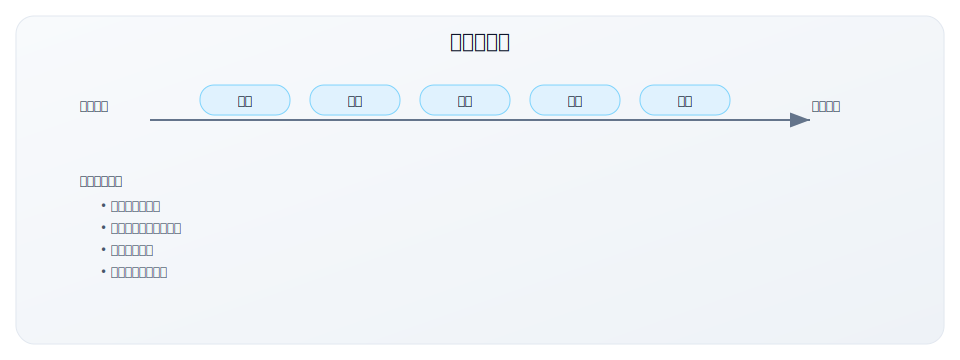

### 渠道策略的战略重要性

**为什么渠道选择如此关键？**

| 影响维度 | 说明 |
|---------|------|
| 客户触达 | 决定能否有效接触到目标客户 |
| 获客成本 | 不同渠道的 CAC 差异巨大 |
| 规模化能力 | 影响增长速度和天花板 |
| 控制力 | 影响客户关系和品牌体验 |
| 利润结构 | 渠道分成直接影响毛利 |

**渠道选择的错误代价**：

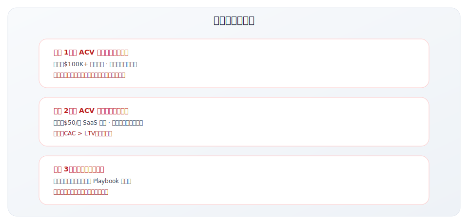

---

## 四大渠道类型详解

B2B 软件的渠道主要分为四种类型：

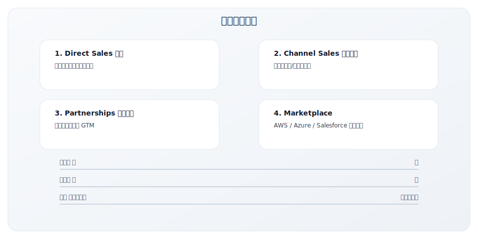

### 快速对比

| 维度 | Direct Sales | Channel Sales | Partnerships | Marketplace |
|------|-------------|---------------|--------------|-------------|
| **控制力** | 最高 | 中等 | 中等 | 最低 |
| **规模化速度** | 慢 | 快 | 中等 | 快 |
| **成本结构** | 高固定成本 | 高可变成本 | 中等 | 分成模式 |
| **适合 ACV** | 高（$50K+） | 中（$10-50K） | 各类 | 中低（$5-50K） |
| **典型场景** | 企业软件 | 区域扩张 | 生态集成 | 云原生产品 |
| **建立周期** | 长 | 中 | 长 | 短 |

---

## 一、Direct Sales 直销

### 定义

**直销**是指公司自建销售团队，直接与客户进行销售对话、商务谈判和关系维护。

### 直销组织结构

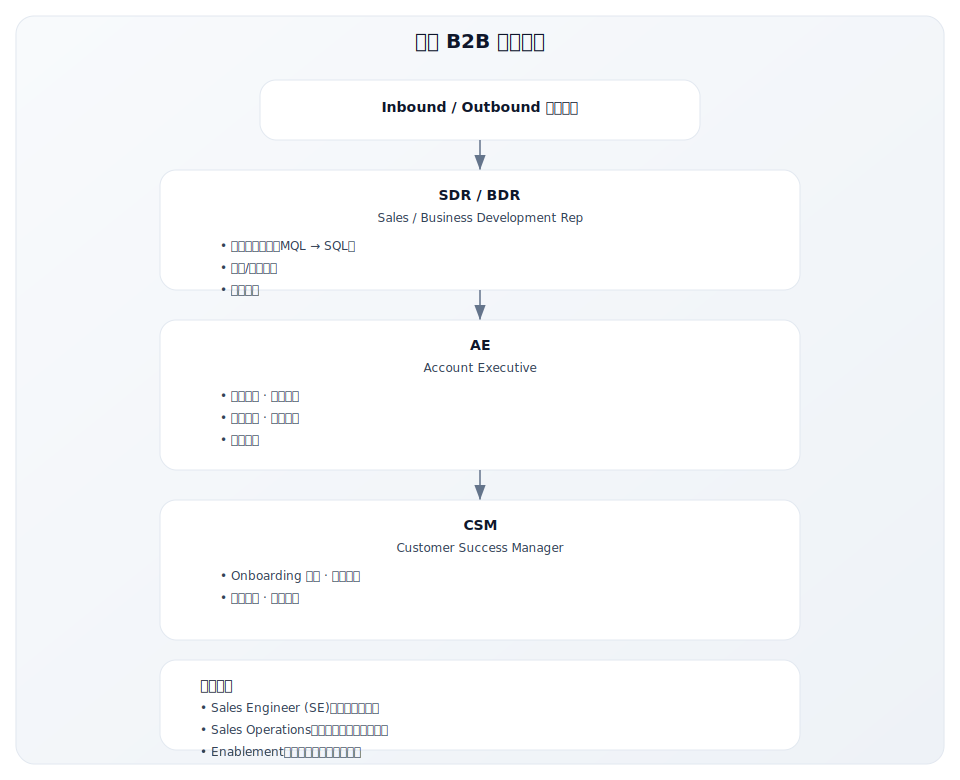

### 适用场景

| 场景 | 原因 |
|------|------|
| 高 ACV 产品（$50K+ 年合同） | 高客单价支撑销售成本 |
| 复杂企业解决方案 | 需要深度咨询和定制 |
| 长销售周期（3-12 个月） | 需要持续的关系维护 |
| 多利益相关者决策 | 需要协调多方 |
| 高度定制化需求 | 需要深入理解客户 |
| 需要深度客户关系 | 为未来扩展打基础 |

### 直销的销售模式变体

| 模式 | 特点 | 适用场景 |
|------|------|---------|
| **Field Sales** | 现场拜访，高接触 | $100K+ ACV，战略客户 |
| **Inside Sales** | 远程销售，电话/视频 | $20-100K ACV，效率优先 |
| **Hybrid** | 结合现场和远程 | 关键节点现场，日常远程 |

### 直销经济学

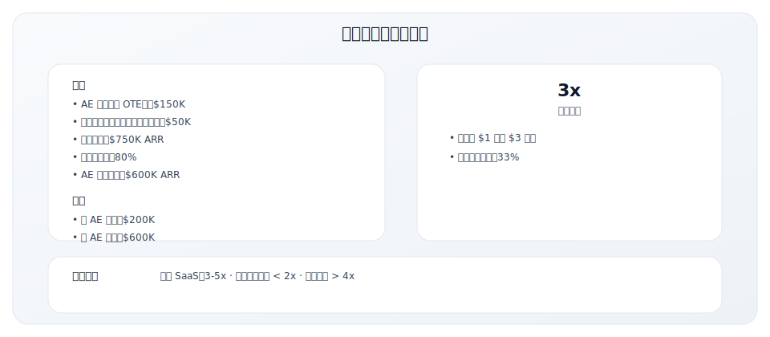

### 优势与劣势

| 优势 | 劣势 |
|------|------|
| 完全控制销售流程和客户体验 | 高固定成本，需要持续投入 |
| 深度客户关系，有利于扩展销售 | 规模化速度慢，依赖招聘 |
| 获取第一手客户反馈 | 地理覆盖受限于团队分布 |
| 品牌一致性有保障 | 建立成熟团队需要时间 |
| 大客户必需 | 需要完善的销售管理体系 |

### 直销启动清单

在建立直销团队前，确保：

- [ ] 产品已验证 PMF，有成功案例
- [ ] 销售 Playbook 初步成型（销售流程、话术、材料）
- [ ] 理解销售周期和关键转化节点
- [ ] 有能力招聘和培训销售人员
- [ ] 有足够的现金流支持 6-12 个月的团队建设

---

## 二、Channel Sales 渠道销售

### 定义

**渠道销售**是指通过第三方合作伙伴（分销商、经销商、代理商等）销售产品，借助其网络和能力扩大市场覆盖。

### 渠道合作伙伴类型

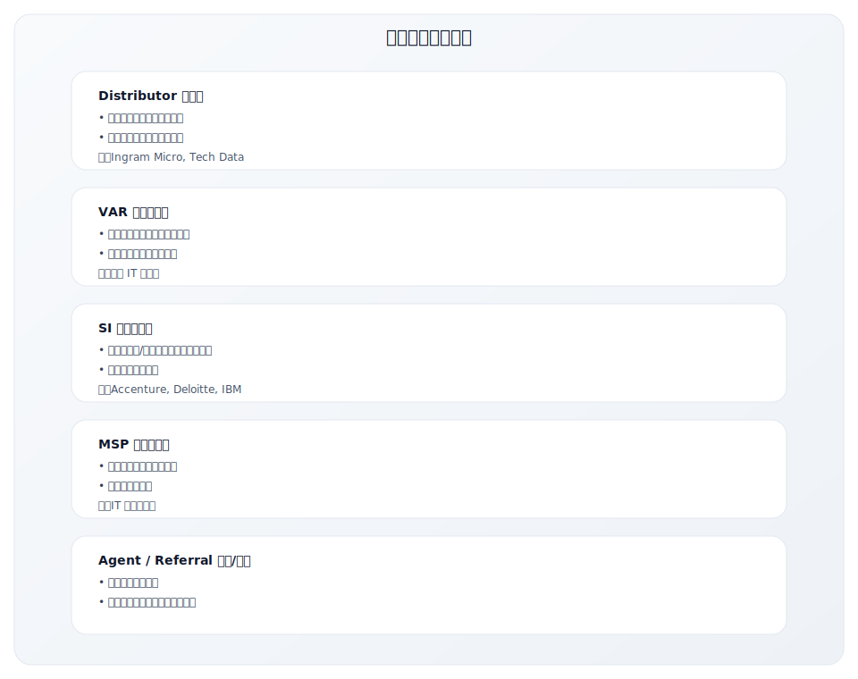

### 适用场景

| 场景 | 说明 |
|------|------|
| 快速扩大市场覆盖 | 借助渠道的现有网络 |
| 进入新地理市场 | 渠道了解本地市场和客户 |
| 中小客户市场 | 直销成本过高 |
| 标准化产品 | 渠道能够独立销售 |
| 需要本地服务 | 渠道提供本地支持 |
| 合规/资质要求 | 某些市场需要本地资质 |

### 渠道销售成功要素

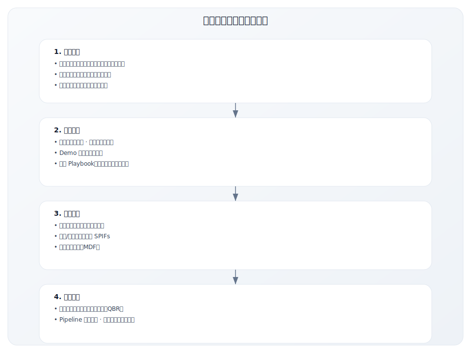

### 渠道分成模式

| 模式 | 说明 | 典型比例 | 适用场景 |
|------|------|---------|---------|
| **Resale** | 渠道买断后再销售 | 20-40% 折扣 | 标准产品 |
| **Referral** | 介绍成功获取佣金 | 10-20% 首年 | 轻量合作 |
| **Co-sell** | 联合销售，分享收益 | 协商 | 大项目 |
| **Influenced** | 渠道影响但不直接销售 | 5-10% | 复杂销售 |

### 渠道成熟度模型

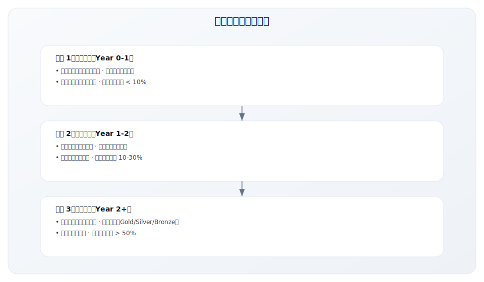

### 优势与劣势

| 优势 | 劣势 |
|------|------|
| 快速扩大市场覆盖 | 对销售过程控制力弱 |
| 可变成本结构（卖出才付费） | 品牌体验可能不一致 |
| 本地市场知识和关系 | 渠道培训和管理成本 |
| 进入新市场更容易 | 渠道冲突（与直销、渠道间） |
| 规模化后效率高 | 需要时间建立健康渠道网络 |

### 渠道销售启动清单

在启动渠道销售前，确保：

- [ ] 直销已经验证产品和销售流程
- [ ] 有可复制的销售 Playbook
- [ ] 明确的合作伙伴画像和招募计划
- [ ] 渠道赋能内容和培训准备就绪
- [ ] 分成模式和激励计划设计完成
- [ ] 有专人负责渠道项目

---

## 三、Partnerships 战略合作

### 定义

**战略合作**是与其他公司建立互利的合作关系，共同创造价值并分享市场机会。不同于纯粹的渠道分销，战略合作更强调双向价值和长期关系。

### 合作类型

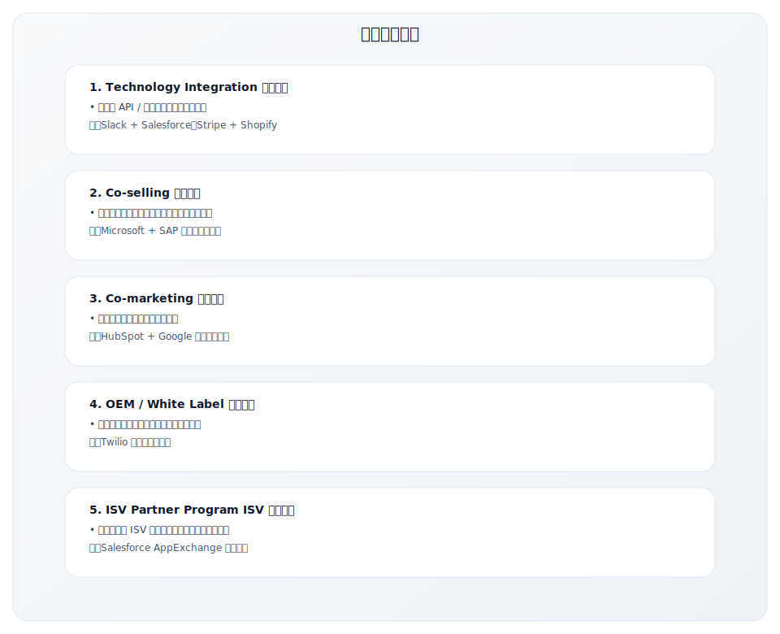

### 合作伙伴选择标准

| 维度 | 评估要点 |
|------|---------|
| **客户重叠** | 目标客户群是否重叠但不竞争？ |
| **产品互补** | 产品是否能相互增强价值？ |
| **战略对齐** | 双方战略目标是否一致？ |
| **资源匹配** | 双方能投入的资源是否匹配？ |
| **文化契合** | 合作风格和文化是否兼容？ |
| **品牌匹配** | 品牌形象和市场定位是否匹配？ |

### 合作成功的关键要素

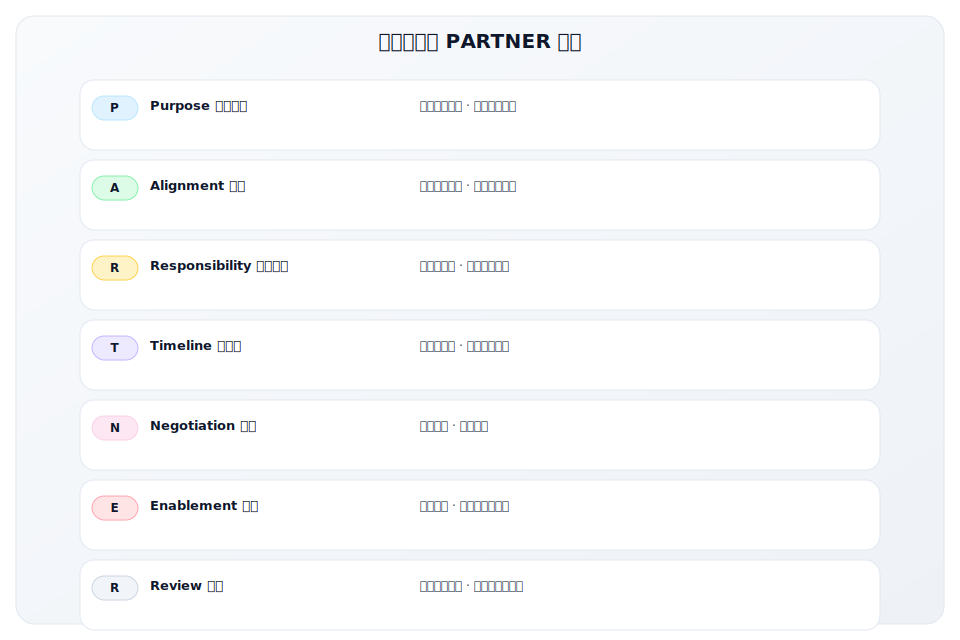

### 案例：Salesforce AppExchange 合作伙伴策略

**Salesforce 生态的价值**：

| 维度 | 数据 |
|------|------|
| AppExchange 应用数量 | 7,000+ |
| 合作伙伴数量 | 2,000+ |
| 客户安装次数 | 10M+ |

**成为 AppExchange 合作伙伴的考量**：

| 优势 | 挑战 |
|------|------|
| 触达 150K+ Salesforce 客户 | 需要在 Salesforce 平台构建 |
| Salesforce 销售团队可能推荐 | 竞争激烈，可见度有限 |
| 客户信任背书 | 平台依赖性 |
| 采购流程简化 | 需要持续投入合作伙伴项目 |

---

## 中国市场渠道案例

### 案例一：阿里云的多层渠道生态

阿里云作为中国最大的云服务商，构建了完整的渠道生态体系：

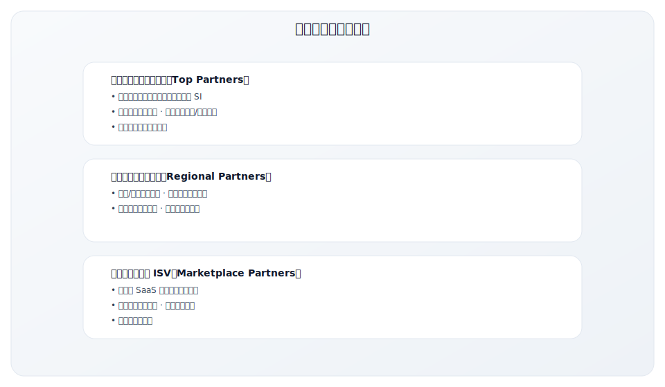

**阿里云渠道策略的特点**：

| 维度 | 策略 | 效果 |
|------|------|------|
| 分层分级 | 按规模、能力、行业划分等级 | 资源精准匹配 |
| 生态协同 | ISV + SI + 云服务联合方案 | 客户一站式服务 |
| 激励设计 | 返点 + MDF + 联合营销 | 渠道积极性高 |
| 赋能体系 | 培训认证 + 技术支持 + 销售工具 | 渠道能力持续提升 |

### 案例二：用友的代理商网络演进

用友作为中国最大的企业软件厂商，其渠道体系经历了从传统代理到生态合作的演变：

**传统阶段（2000-2015）**：

| 特点 | 说明 |
|------|------|
| 渠道模式 | 区域独家代理 |
| 主要产品 | U8、T 系列等套装软件 |
| 渠道职责 | 销售、实施、维护一体化 |
| 问题 | 渠道能力参差不齐，客户体验不一致 |

**转型阶段（2015-2020）**：

| 变化 | 说明 |
|------|------|
| 云化转型 | 从买断制到订阅制 |
| 渠道定位 | 从"卖产品"到"卖服务" |
| 能力要求 | 增加云服务和 SaaS 交付能力 |
| 淘汰压力 | 传统渠道面临转型或淘汰 |

**生态阶段（2020-至今）**：

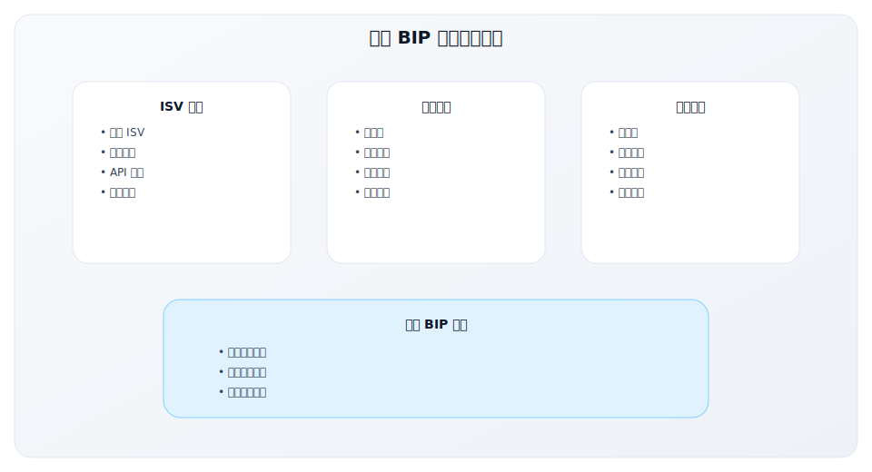

### 案例三：中国 SaaS 厂商的渠道选择

中国 SaaS 市场的渠道策略有其独特性：

**中国 SaaS 渠道的特殊考量**：

| 维度 | 中国市场特点 | 渠道策略建议 |
|------|-------------|-------------|
| 客户分布 | 地域广阔，客户分散 | 需要本地服务能力 |
| 决策模式 | 关系驱动，需要面对面沟通 | 渠道本地资源重要 |
| 政企客户 | 采购流程复杂，需要资质 | 与有资质的渠道合作 |
| 服务要求 | 对实施和培训要求高 | 渠道需具备服务能力 |
| 竞争激烈 | 价格战普遍 | 需要差异化价值 |

**不同规模 SaaS 公司的渠道策略**：

| 公司阶段 | 推荐渠道策略 | 案例参考 |
|---------|-------------|---------|
| 早期（ARR < 1000 万） | 直销为主，验证销售模型 | 先跑通直销，再考虑渠道 |
| 成长期（ARR 1000 万-1 亿） | 直销 + 少量战略渠道 | 选择 2-3 个优质渠道试点 |
| 规模化（ARR > 1 亿） | 直销 + 渠道并重 | 建立完整的渠道体系 |

**中国 SaaS 渠道常见问题与解决方案**：

| 问题 | 原因 | 解决方案 |
|------|------|---------|
| 渠道不愿意卖 | SaaS 返点低于传统软件 | 设计有竞争力的激励方案 |
| 渠道卖不动 | 缺乏 SaaS 销售能力 | 深度培训和赋能 |
| 价格混乱 | 渠道为成交随意降价 | 统一价格体系，严格管控 |
| 服务质量差 | 渠道服务能力不足 | 建立服务标准和考核 |
| 渠道冲突 | 直销和渠道抢客户 | 清晰的客户划分规则 |

### 优势与劣势

| 优势 | 劣势 |
|------|------|
| 借助合作伙伴的品牌和客户 | 协调复杂，执行速度慢 |
| 产品互补，增强客户价值 | 依赖合作伙伴的配合度 |
| 共享市场开发成本 | 利益分配可能产生冲突 |
| 建立生态护城河 | 需要长期投入维护关系 |

---

## 四、Marketplace 云市场/应用商店

### 定义

**Marketplace** 是由大型云服务商或平台运营的应用市场，允许第三方软件在其平台上销售。

### 主要 B2B Marketplace

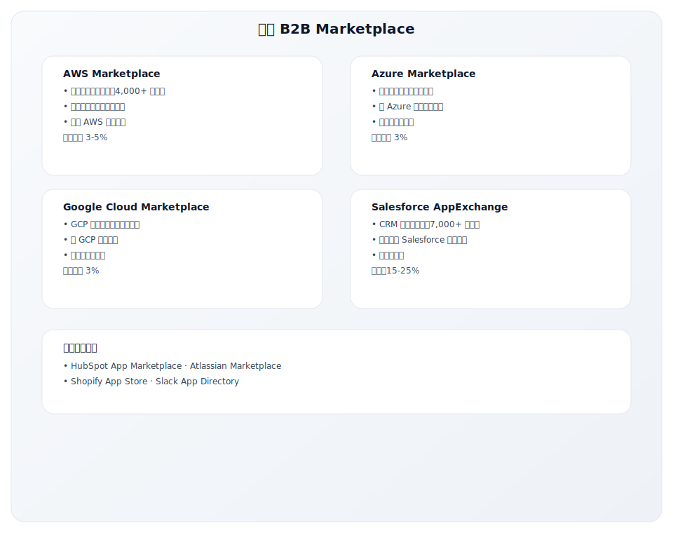

### 云市场的价值主张

**对买家的价值**：

| 价值 | 说明 |
|------|------|
| 采购简化 | 通过现有云账户采购，无需新供应商入库 |
| 预算利用 | 使用已承诺的云消费额度 |
| 统一账单 | 与云服务统一计费 |
| 合规简化 | 云厂商已做安全和合规审核 |
| 快速部署 | 一键部署到现有云环境 |

**对卖家的价值**：

| 价值 | 说明 |
|------|------|
| 客户触达 | 接触大量云厂商客户 |
| 采购加速 | 绕过传统采购流程 |
| 信任借力 | 云厂商品牌背书 |
| 联合销售 | 云厂商销售团队可能推荐 |
| MACC 消耗 | 客户可用云承诺消费 |

### Marketplace 策略

### 云市场经济学

| 考量 | AWS/Azure/GCP | Salesforce |
|------|--------------|------------|
| 佣金比例 | 3-5% | 15-25% |
| 对利润影响 | 较小 | 显著 |
| 交易规模 | 可以很大 | 中等 |
| 续约处理 | 需要管理 | 自动 |

### 优势与劣势

| 优势 | 劣势 |
|------|------|
| 触达大量潜在客户 | 佣金成本 |
| 简化客户采购流程 | 平台依赖 |
| 云厂商品牌背书 | 竞争激烈 |
| 利用客户云预算 | 对列表展示控制有限 |
| 可能获得联合销售支持 | 需要满足平台技术要求 |

---

## 渠道选择决策框架

### 渠道-产品匹配矩阵

### 决策清单

回答以下问题以确定渠道策略：

**1. 客户购买行为**

| 问题 | 答案选项 |
|------|---------|
| 客户如何发现类似产品？ | 搜索 / 口碑 / 销售触达 / 生态市场 |
| 客户的采购流程是？ | 自助 / 需要 Demo / 需要 POC / 需要招标 |
| 决策链条长度？ | 单人决策 / 小团队 / 多部门 / C-level |

**2. 产品特性**

| 问题 | 答案选项 |
|------|---------|
| 产品复杂度？ | 开箱即用 / 需要配置 / 需要定制 / 需要集成 |
| 是否需要实施服务？ | 不需要 / 简单培训 / 深度实施 |
| 是否需要持续服务？ | 自助为主 / 需要支持 / 需要客户成功 |

**3. 商业模式**

| 问题 | 答案选项 |
|------|---------|
| ACV 水平？ | < $5K / $5-20K / $20-100K / > $100K |
| 销售周期？ | < 1 周 / 1-4 周 / 1-3 月 / 3-12 月 |
| 目标客户规模？ | SMB / Mid-market / Enterprise |

**4. 资源约束**

| 问题 | 答案选项 |
|------|---------|
| 销售团队资源？ | 无 / 少量 / 充足 / 大规模 |
| 是否有渠道管理经验？ | 无 / 初步 / 成熟 |
| 地理覆盖需求？ | 单一市场 / 多个市场 / 全球 |

### 典型组合

| 场景 | 推荐渠道组合 |
|------|-------------|
| 低 ACV + 简单产品 | PLG + Marketplace |
| 中 ACV + 标准产品 | Inside Sales + Channel + Marketplace |
| 高 ACV + 复杂产品 | Field Sales + SI Partners |
| 进入新地区 | Channel + Partnerships |
| 快速规模化 | Channel + Marketplace |

---

## 多渠道策略管理

### 渠道冲突的类型

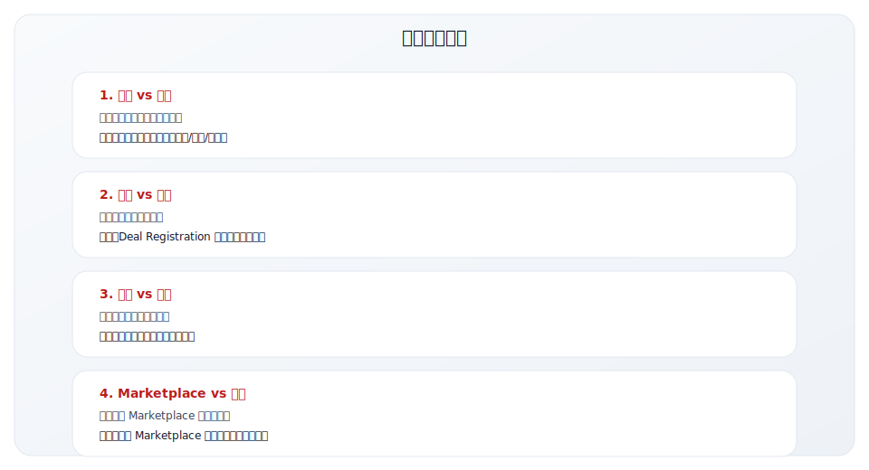

### 冲突管理机制

| 机制 | 说明 |
|------|------|
| **客户划分规则** | 按客户规模、地区、行业明确归属 |
| **Deal Registration** | 先注册保护期，避免重复覆盖 |
| **渠道优先权** | 特定场景下渠道优先 |
| **补偿机制** | 即使客户转渠道，也给原销售信用 |
| **仲裁流程** | 有争议时的升级和裁决流程 |

---

## 关键要点

1. **渠道是 GTM 的基础设施**，直接影响客户触达、获客成本和规模化能力

2. **四大渠道类型各有特点**：
   - Direct Sales：高控制、高成本、适合高 ACV
   - Channel Sales：快速扩展、可变成本、适合标准产品
   - Partnerships：生态协同、长期投入、适合互补产品
   - Marketplace：采购简化、平台依赖、适合云原生产品

3. **渠道选择应基于**：
   - 客户购买行为
   - 产品复杂度
   - ACV 和销售周期
   - 资源和能力

4. **多渠道策略需要**：
   - 明确的客户划分规则
   - 渠道冲突管理机制
   - 协调一致的客户体验

5. **渠道建设需要时间**：不要期望渠道立即见效，需要持续投入和优化

---

## 实践练习

### 练习 1：渠道现状评估

分析你当前的渠道结构：

| 问题 | 你的回答 |
|------|---------|
| 当前主要通过什么渠道销售？ | |
| 各渠道收入占比？ | |
| 各渠道的 CAC 分别是多少？ | |
| 哪个渠道增长最快？为什么？ | |
| 是否存在渠道冲突？如何处理？ | |

### 练习 2：渠道-产品匹配分析

评估你的产品适合什么渠道：

| 维度 | 你的情况 | 推荐渠道 |
|------|---------|---------|
| ACV 水平 | | |
| 产品复杂度 | | |
| 销售周期 | | |
| 客户购买习惯 | | |
| 综合推荐 | | |

### 练习 3：渠道扩展规划

如果要增加新渠道，评估以下选项：

| 选项 | 可行性（1-5） | 潜在价值 | 所需投入 | 优先级 |
|------|-------------|---------|---------|--------|
| 建立渠道销售 | | | | |
| 上架云市场 | | | | |
| 发展战略合作伙伴 | | | | |
| 扩展直销团队 | | | | |

---

## 延伸阅读

### 书籍
- **《Traversing the Traction Gap》** - Bruce Cleveland
  - 早期公司的渠道和增长策略

### 文章资源
- AWS Marketplace 合作伙伴指南
- Salesforce AppExchange 开发者文档
- a]6z 关于渠道策略的文章

### 案例研究
- HashiCorp 的多渠道策略
- Datadog 的云市场策略
- Snowflake 的合作伙伴生态

---

**写作状态**：审校完成
**最后更新**：2025-12-23
**版本**：v1.1
