# 3.2 定价策略

> **学习目标**：理解 SaaS 定价模型的特点和适用场景，掌握价值导向定价方法，学会设计和优化产品定价
>
> **预计时长**：35 分钟
>
> **前置知识**：2.4 价值主张设计

---

## 核心内容

本节覆盖以下内容：
- 引言：定价是被低估的增长杠杆
- SaaS 常见定价模型
- 中国 SaaS 定价案例
- 定价模型选择框架
- 价值导向定价方法
- 定价心理学

## 引言：定价是被低估的增长杠杆

在 GTM 执行中，定价往往是最被低估的杠杆之一。很多公司在产品、渠道、营销上投入大量精力，却对定价草草了事。

### 定价的战略价值

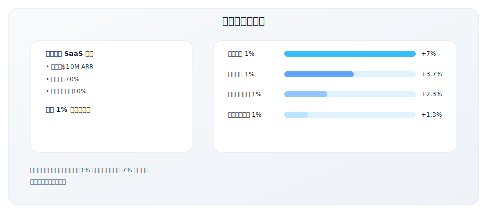

### 定价的多重作用

| 作用 | 说明 |
|------|------|
| **收入** | 直接决定收入水平 |
| **利润** | 定价是利润最敏感的杠杆 |
| **价值信号** | 价格传递产品价值和定位 |
| **客户筛选** | 价格帮助筛选目标客户 |
| **竞争定位** | 价格是竞争差异化的一部分 |
| **增长引擎** | 定价模型影响扩展收入 |

### 常见定价错误

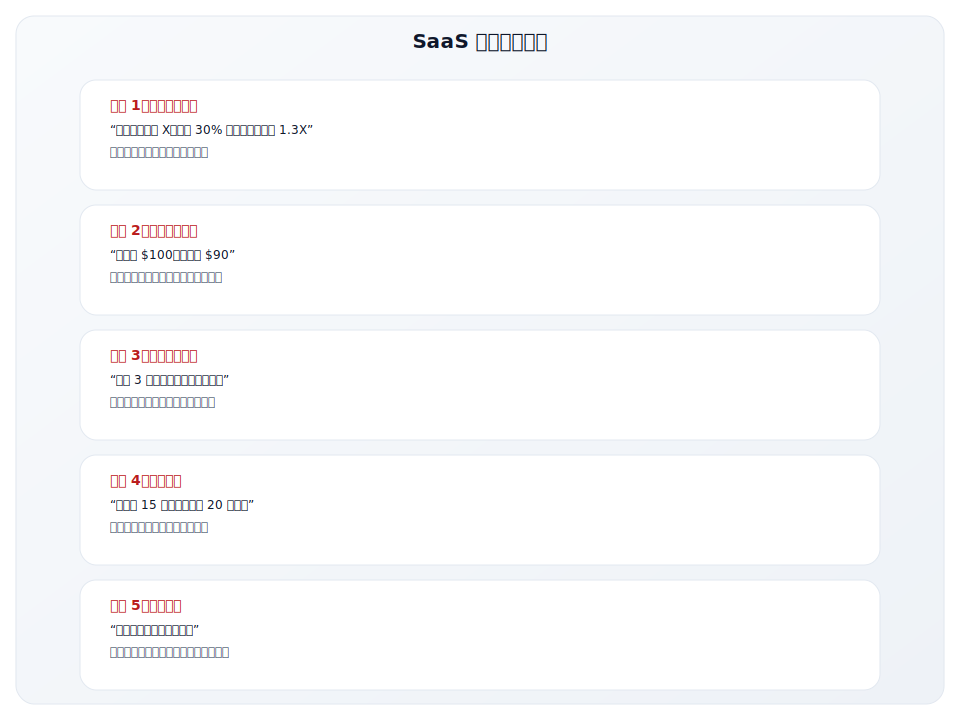

---

## SaaS 常见定价模型

### 模型概览

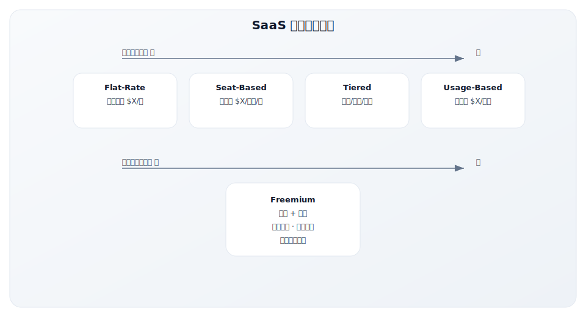

### 一、Flat-Rate Subscription 固定订阅

**定义**：固定的月费或年费，不随使用量或用户数变化。

**特点**：

| 维度 | 说明 |
|------|------|
| 计费方式 | 固定月费/年费 |
| 收入可预测性 | 最高 |
| 与价值对齐 | 较低 |
| 复杂度 | 最低 |

**案例**：

- **Basecamp**：$99/月，不限用户数
- 早期创业公司常用

**优势与劣势**：

| 优势 | 劣势 |
|------|------|
| 简单透明，易于理解 | 无法从大客户获取更多收入 |
| 收入高度可预测 | 与使用价值脱钩 |
| 销售简单 | 扩展收入有限 |

**适用场景**：

- 产品简单，功能差异不大
- 目标客户规模相近
- 强调简单透明

### 二、Seat-Based Pricing 按席位付费

**定义**：按使用产品的用户数量收费。

**特点**：

| 维度 | 说明 |
|------|------|
| 计费方式 | $X/用户/月 |
| 收入可预测性 | 高 |
| 与价值对齐 | 中等 |
| 复杂度 | 低 |

**案例**：

| 产品 | 定价 |
|------|------|
| Slack | $7.25-15/用户/月 |
| Salesforce | $25-300/用户/月 |
| Zoom | $13.33-21.99/用户/月 |
| Figma | $15-45/编辑者/月 |

**优势与劣势**：

| 优势 | 劣势 |
|------|------|
| 简单透明 | 可能阻碍用户增长 |
| 随客户规模自然扩展 | "账号共享"问题 |
| 易于客户预算规划 | 不同用户价值不同 |

**变体**：

| 变体 | 说明 | 案例 |
|------|------|------|
| 按活跃用户 | 只收活跃用户费用 | Slack |
| 按角色定价 | 不同角色不同价格 | Figma（编辑者 vs 查看者） |
| 最低用户数 | 企业版要求最低用户数 | Salesforce Enterprise |

**适用场景**：

- 协作工具
- 用户数与价值正相关的产品
- 企业级 SaaS

### 三、Usage-Based Pricing 按用量付费

**定义**：根据实际使用量收费，用多少付多少。

**特点**：

| 维度 | 说明 |
|------|------|
| 计费方式 | $X/使用单位 |
| 收入可预测性 | 较低 |
| 与价值对齐 | 最高 |
| 复杂度 | 较高 |

**常见计量单位**：

| 类型 | 计量单位 | 案例 |
|------|---------|------|
| 云计算 | 计算小时、存储 GB | AWS EC2 |
| 数据平台 | 查询量、数据量 | Snowflake |
| API 服务 | API 调用次数 | Twilio, Stripe |
| 邮件服务 | 发送邮件数 | SendGrid |
| AI 服务 | Token 数量 | OpenAI API |

**案例分析：Snowflake**

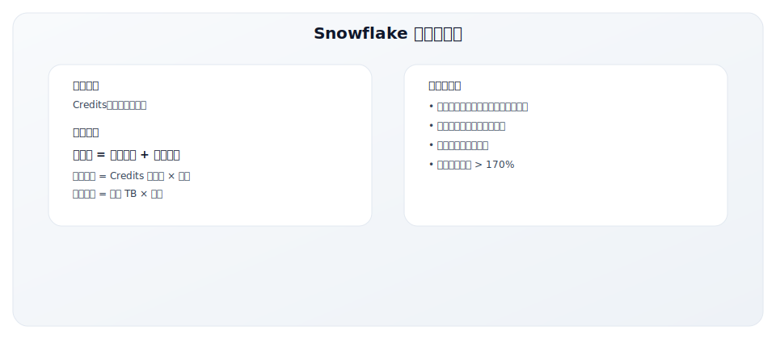

**优势与劣势**：

| 优势 | 劣势 |
|------|------|
| 与价值高度对齐 | 收入波动大，预测难 |
| 低门槛启动 | 计费复杂，客户难预算 |
| 自然扩展收入 | 可能导致客户减少使用 |
| 透明公平 | 大客户可能要求折扣 |

**使用量定价的关键设计**：

| 设计要点 | 说明 |
|---------|------|
| 计量单位选择 | 选择客户理解且与价值相关的单位 |
| 可预测性 | 提供用量估算工具和预算控制 |
| 阶梯折扣 | 用量越大单价越低，激励增长 |
| 最低消费 | 设置最低月费，保证基础收入 |

**适用场景**：

- 使用量与客户价值强相关
- API 和基础设施服务
- 产品有明确可计量的价值单位
- 客户使用差异大

### 四、Tiered Pricing 阶梯套餐

**定义**：提供多个预设套餐，包含不同功能和限额组合。

**特点**：

| 维度 | 说明 |
|------|------|
| 计费方式 | 多个套餐层级 |
| 收入可预测性 | 高 |
| 与价值对齐 | 中等 |
| 复杂度 | 中等 |

**典型三层结构**：

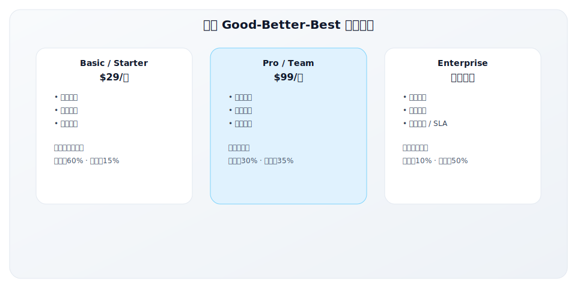

**套餐差异化维度**：

| 维度 | 示例 |
|------|------|
| 功能 | 基础功能 vs 高级功能 |
| 限额 | 用户数、存储、API 调用 |
| 支持 | 自助 vs 邮件 vs 电话 vs 专属 |
| SLA | 无 vs 99.9% vs 99.99% |
| 安全/合规 | 基础 vs SOC2 vs HIPAA |
| 集成 | 标准集成 vs API vs 自定义 |

**案例：HubSpot**

| 套餐 | 价格 | 目标客户 |
|------|------|---------|
| Free | $0 | 个人/试用 |
| Starter | $20/月 | 小企业 |
| Professional | $890/月 | 成长企业 |
| Enterprise | $3,600/月 | 大企业 |

**优势与劣势**：

| 优势 | 劣势 |
|------|------|
| 覆盖不同客户群体 | 套餐设计复杂 |
| 清晰的升级路径 | 客户可能选错套餐 |
| 便于销售 | 功能划分可能不合理 |
| 可预测收入 | 需要持续优化 |

### 五、Freemium 免费+增值

**定义**：提供功能受限的免费版本，通过付费解锁更多功能。

**特点**：

| 维度 | 说明 |
|------|------|
| 计费方式 | 免费 + 付费套餐 |
| 收入可预测性 | 中等 |
| 与价值对齐 | 低-中 |
| 复杂度 | 中等 |

**Freemium 的本质**：

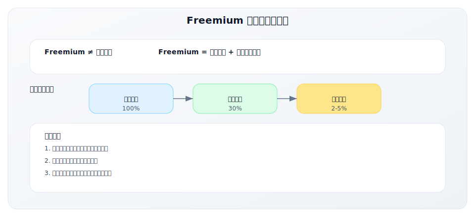

**免费版功能设计原则**：

| 原则 | 说明 | 示例 |
|------|------|------|
| **足够有用** | 免费版本身有价值 | Notion 免费版可正常使用 |
| **能体验核心** | 可以体验核心功能 | Figma 免费可设计 |
| **自然触达付费点** | 使用中会遇到限制 | Slack 历史消息限制 |
| **服务成本低** | 边际成本可控 | 存储、计算成本低 |

**案例：Dropbox Freemium**

| 维度 | 免费版 | 付费版 |
|------|--------|--------|
| 存储 | 2GB | 2TB |
| 设备 | 3 台 | 无限 |
| 功能 | 基础同步 | 高级功能 |
| 转化驱动 | 存储用完 | 自然升级 |

**优势与劣势**：

| 优势 | 劣势 |
|------|------|
| 低门槛获客 | 转化率通常很低（2-5%） |
| 自然产品传播 | 服务免费用户有成本 |
| 客户可充分评估 | 需要平衡免费和付费 |
| PLG 友好 | 可能吸引低质量用户 |

### 六、Hybrid 混合模式

现代 SaaS 越来越多采用混合定价模式：

**常见组合**：

| 组合 | 说明 | 案例 |
|------|------|------|
| 订阅 + 用量 | 基础订阅费 + 超额用量费 | HubSpot（联系人数超额） |
| 席位 + 功能分层 | 按用户付费 + 功能套餐 | Salesforce |
| 免费 + 席位 | 免费版 + 按席位付费版 | Slack |
| 平台费 + 用量 | 平台接入费 + API 调用费 | Stripe |

**案例：Stripe 的混合定价**

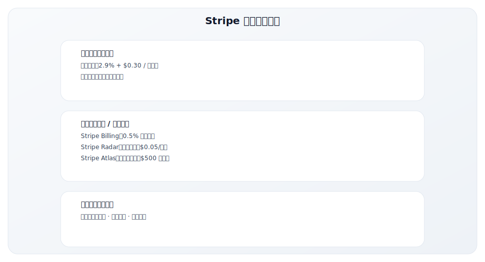

---

## 中国 SaaS 定价案例

### 案例一：有赞的定价演进

有赞作为中国领先的电商 SaaS 厂商，其定价策略经历了多次迭代：

**早期阶段（2012-2016）：免费增值**

| 策略 | 说明 |
|------|------|
| 定价模式 | 基础功能免费，高级功能付费 |
| 目的 | 快速获客，建立市场份额 |
| 问题 | 免费用户转化率低，服务成本高 |

**成长阶段（2016-2019）：阶梯套餐**

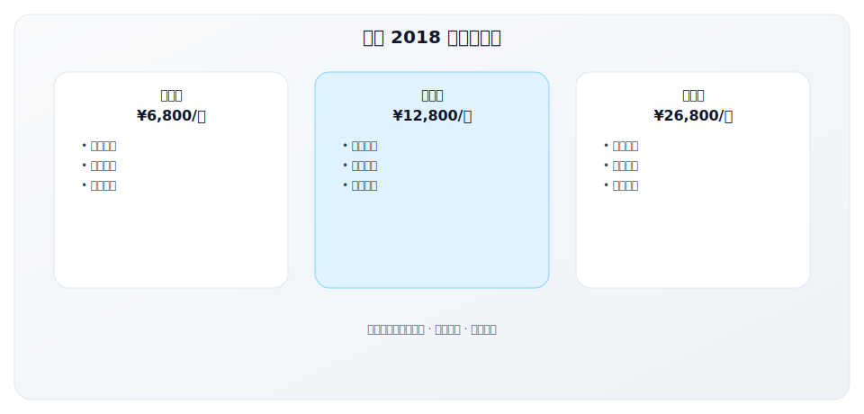

**成熟阶段（2019-至今）：混合模式**

| 维度 | 定价策略 | 说明 |
|------|---------|------|
| 基础订阅 | 年费套餐 | 按功能分层 |
| 交易抽成 | 0.6% 交易额 | 与商家利益绑定 |
| 增值服务 | 按需付费 | 营销工具、培训等 |
| 行业方案 | 定制定价 | 垂直行业深度方案 |

**有赞定价的关键洞察**：

| 洞察 | 说明 |
|------|------|
| 价值对齐 | 交易抽成让定价与客户成功挂钩 |
| 降低门槛 | 基础版价格亲民，吸引小商家 |
| 扩展路径 | 清晰的升级路径，提高客户生命周期价值 |
| 行业差异 | 不同行业定价策略不同 |

### 案例二：北森的企业级定价策略

北森作为中国 HR SaaS 领导者，其定价体现了企业级 SaaS 的特点：

**定价模式：模块化 + 席位**

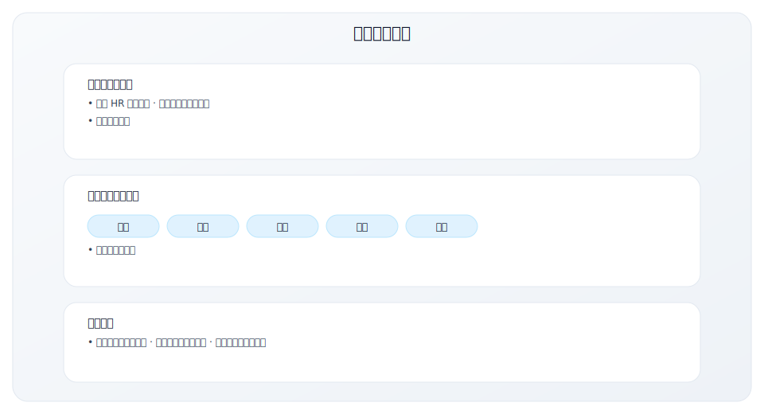

**企业级定价的特点**：

| 特点 | 北森实践 | 价值 |
|------|---------|------|
| 模块化 | 客户可选择需要的模块 | 灵活性高，进入门槛低 |
| 按规模 | 员工数影响定价 | 与客户价值挂钩 |
| 协商定价 | 大客户一对一谈判 | 适应复杂采购流程 |
| 实施分离 | 软件费和服务费分开 | 透明化成本结构 |

### 中国 SaaS 定价的特殊考量

**中国市场 vs 美国市场定价差异**：

| 维度 | 中国市场 | 美国市场 |
|------|---------|---------|
| 价格水平 | 普遍较低（约为美国 1/3-1/5） | 较高 |
| 客户预期 | 期望更多定制和服务 | 接受标准化产品 |
| 付款方式 | 年付为主，季付/月付少 | 月付普遍 |
| 折扣压力 | 大客户期望深度折扣 | 折扣相对可控 |
| 竞争态势 | 价格战激烈 | 差异化竞争为主 |

**中国 SaaS 定价常见问题**：

| 问题 | 症状 | 解决方案 |
|------|------|---------|
| 定价过低 | LTV:CAC < 3，难以盈利 | 价值导向重新定价 |
| 价格战 | 为抢客户不断降价 | 聚焦差异化价值 |
| 折扣混乱 | 同类客户价格差异大 | 建立价格管控体系 |
| 服务不收费 | 实施培训免费提供 | 专业服务独立定价 |
| 涨价困难 | 老客户抵制涨价 | 新功能绑定新定价 |

**中国 SaaS 定价建议**：

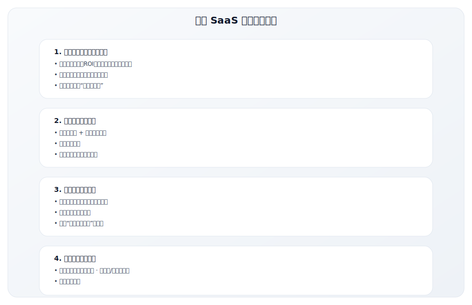

---

## 定价模型选择框架

### 对比矩阵

| 维度 | Flat-Rate | Seat-Based | Usage-Based | Tiered | Freemium |
|------|-----------|------------|-------------|--------|----------|
| **收入可预测** | ★★★★★ | ★★★★☆ | ★★☆☆☆ | ★★★★☆ | ★★★☆☆ |
| **价值对齐** | ★★☆☆☆ | ★★★☆☆ | ★★★★★ | ★★★☆☆ | ★★☆☆☆ |
| **扩展收入** | ★☆☆☆☆ | ★★★★☆ | ★★★★★ | ★★★☆☆ | ★★★☆☆ |
| **客户理解** | ★★★★★ | ★★★★☆ | ★★★☆☆ | ★★★☆☆ | ★★★★☆ |
| **销售难度** | ★☆☆☆☆ | ★★☆☆☆ | ★★★☆☆ | ★★☆☆☆ | ★☆☆☆☆ |
| **实施复杂** | ★☆☆☆☆ | ★★☆☆☆ | ★★★★☆ | ★★☆☆☆ | ★★★☆☆ |

### 决策指南

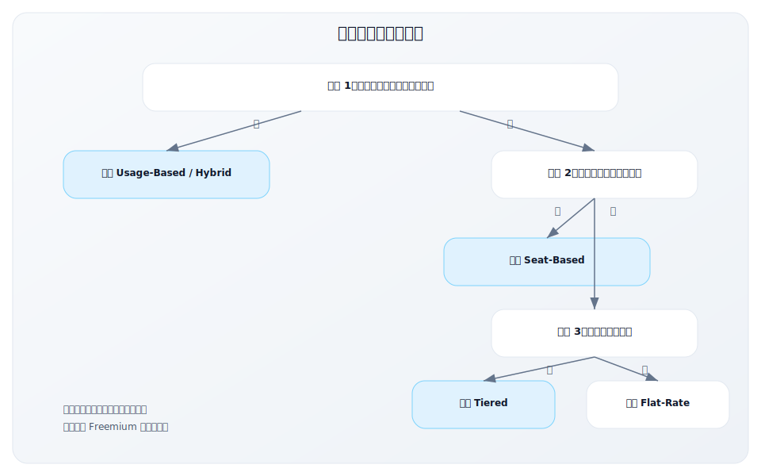

### 与 GTM Motion 的匹配

| GTM Motion | 推荐定价模型 | 原因 |
|------------|-------------|------|
| PLG | Freemium + Usage/Seat | 低门槛启动，随使用扩展 |
| SLG | Tiered + 企业协商 | 灵活应对不同规模 |
| MLG | Tiered | 清晰的套餐便于营销 |
| PLS | Freemium → Seat/Usage | 从免费到付费的升级路径 |

---

## 价值导向定价方法

### Value-Based Pricing 原则

**核心思想**：定价应基于客户感知到的价值，而非成本或竞品。

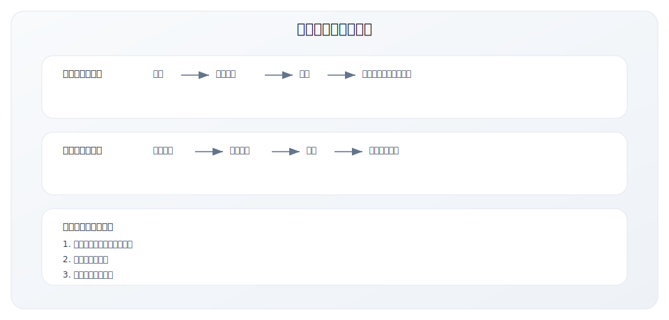

### 价值量化方法

**方法一：ROI 计算**

| 步骤 | 说明 | 示例 |
|------|------|------|
| 1. 识别价值 | 产品帮客户解决什么问题？ | 减少招聘时间 |
| 2. 量化影响 | 这个问题值多少钱？ | 每个职位节省 20 小时 |
| 3. 转化为金额 | 用金额表达 | 20 小时 × $50/小时 = $1,000 |
| 4. 计算 ROI | 对比产品价格 | 产品 $200/月，ROI = 5x |

**方法二：价值瀑布**

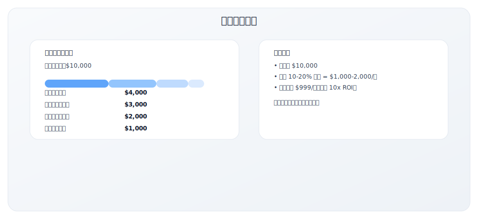

### 客户支付意愿调研

**Van Westendorp 价格敏感度测试**：

通过四个问题确定可接受的价格区间：

| 问题 | 识别的价格点 |
|------|-------------|
| 价格多少时觉得太便宜，可能质量有问题？ | 最低可接受价格 |
| 价格多少时觉得便宜，是个好交易？ | 低端价格 |
| 价格多少时觉得开始贵了？ | 高端价格 |
| 价格多少时觉得太贵，不会购买？ | 最高可接受价格 |

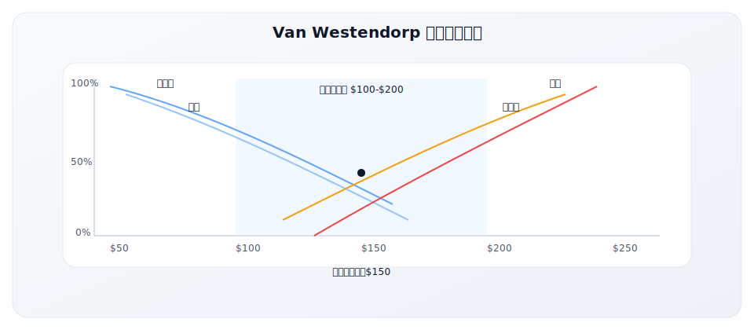

---

## 定价心理学

### 关键心理效应

**1. 锚定效应**

| 策略 | 做法 | 示例 |
|------|------|------|
| 高价锚定 | 先展示高价套餐 | 企业版 $999 → 专业版 $99 显得便宜 |
| 竞品锚定 | 对比竞品高价 | "比 Salesforce 便宜 70%" |
| 价值锚定 | 展示节省的价值 | "每年节省 $50,000，只需 $5,000" |

**2. 套餐设计心理**

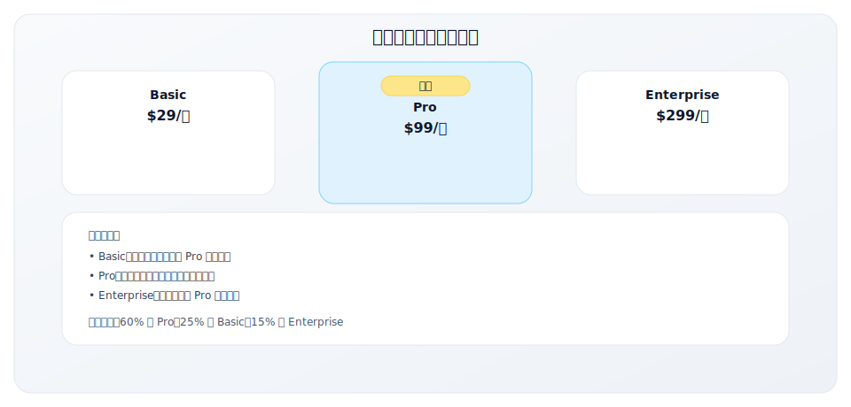

**3. 年付折扣**

| 策略 | 折扣幅度 | 效果 |
|------|---------|------|
| 常见做法 | 年付享 2 个月免费（约 17%） | 提高预付、降低流失 |
| 心理表达 | "年付省 $200" vs "17% 折扣" | 金额表达更有冲击力 |
| 注意事项 | 折扣不宜过大（暗示月付价虚高） | 10-20% 比较合理 |

**4. 定价数字技巧**

| 技巧 | 说明 | 示例 |
|------|------|------|
| 尾数定价 | $99 vs $100 | 感知差异大于实际 |
| 整数定价 | $100 vs $99 | 高端产品显得更专业 |
| 去除货币符号 | 99 vs $99 | 减少"付钱"的联想 |

---

## 定价优化与迭代

### 定价测试方法

| 方法 | 说明 | 适用场景 |
|------|------|---------|
| **A/B 测试** | 对不同用户展示不同价格 | 新用户、新市场 |
| **地区测试** | 不同地区不同定价 | 多市场产品 |
| **客户访谈** | 直接询问支付意愿 | 定性理解 |
| **流失分析** | 分析流失客户的价格敏感度 | 优化现有定价 |
| **升级分析** | 分析升级转化和节点 | 优化套餐设计 |

### 定价调整时机

| 时机 | 说明 |
|------|------|
| 产品价值增加 | 新功能、性能提升后 |
| 成本变化 | 成本结构显著变化时 |
| 市场变化 | 竞品定价调整、市场供需变化 |
| 客户反馈 | 大量客户反馈价格相关问题 |
| 定期回顾 | 每年至少回顾一次定价策略 |

### 提价策略

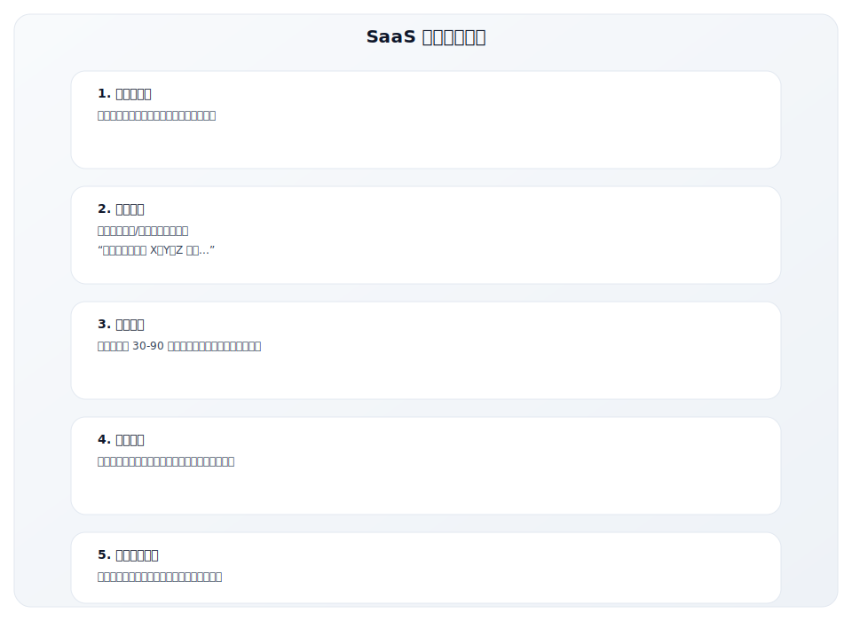

---

## 关键要点

1. **定价是最强的利润杠杆**，1% 的定价提升通常带来 7% 的利润增长

2. **选择定价模型时考虑**：
   - 使用量与价值的相关性
   - 收入可预测性需求
   - 客户差异程度
   - GTM Motion 匹配度

3. **价值导向定价**：定价应基于客户感知价值，而非成本或竞品

4. **定价心理学**：善用锚定效应、套餐设计、年付折扣等技巧

5. **定价需要持续优化**：定期测试和迭代，随产品价值增长调整定价

---

## 实践练习

### 练习 1：当前定价诊断

分析你的产品定价：

| 问题 | 你的回答 |
|------|---------|
| 当前使用什么定价模型？ | |
| 定价是如何确定的？（成本/竞品/价值） | |
| 定价多久没有调整过了？ | |
| 客户对价格的反馈如何？ | |
| LTV:CAC 比例是否健康？ | |

### 练习 2：价值量化

量化你的产品价值：

| 价值点 | 量化方法 | 估算金额 |
|--------|---------|---------|
| | | |
| | | |
| | | |
| **总价值** | | |
| **建议定价（10-20% 价值）** | | |

### 练习 3：套餐设计

设计一个 Good-Better-Best 套餐：

| 维度 | Basic | Pro | Enterprise |
|------|-------|-----|------------|
| 价格 | | | |
| 目标客户 | | | |
| 核心功能 | | | |
| 限额 | | | |
| 支持 | | | |
| 升级驱动 | | | |

---

## 延伸阅读

### 书籍
- **《Monetizing Innovation》** - Madhavan Ramanujam
  - 价值导向定价的系统方法

- **《The Psychology of Price》** - Leigh Caldwell
  - 定价心理学深度解读

### 文章资源
- **OpenView Partners** 的 Usage-Based Pricing 研究
- **ProfitWell** 的 SaaS 定价研究和数据
- **Kyle Poyar** 的定价策略文章

### 工具
- **ProfitWell**：定价分析和优化工具
- **Price Intelligently**：定价研究平台

---

**写作状态**：审校完成
**最后更新**：2025-12-23
**版本**：v1.1
