# 3.3 销售与营销对齐（Sales & Marketing Alignment）

> **学习目标**：理解销售与营销对齐的重要性和价值，掌握实现对齐的关键要素和方法，学会设计 SLA 和对齐机制
>
> **预计时长**：35 分钟
>
> **前置知识**：2.2 GTM Motion 类型

---

## 核心内容

本节覆盖以下内容：
- 引言：对齐是 GTM 成功的关键
- 关键对齐点一：共同的 ICP 与目标
- 关键对齐点二：漏斗定义与交接标准
- 关键对齐点三：SLA（服务级别协议）
- 关键对齐点四：沟通与协作机制
- 常见对齐问题与解决方案

## 引言：对齐是 GTM 成功的关键

销售与营销的错位是 B2B 公司最常见的 GTM 问题之一。两个团队的目标、语言、节奏不一致，导致大量资源浪费和增长受阻。

### 错位的典型症状

### 对齐的商业价值

**数据支撑**：

| 指标 | 对齐团队 | 不对齐团队 | 来源 |
|------|---------|-----------|------|
| 收入增长 | +32% | 基准 | HubSpot Research |
| 成交率 | +38% | 基准 | MarketingProfs |
| 客户留存 | +36% | 基准 | Aberdeen Group |
| 营销 ROI | +208% | 基准 | Marketo |

> **对齐的团队，收入增长快 32%，成交率高 38%**
> — HubSpot State of Inbound Report

### 什么是真正的对齐？

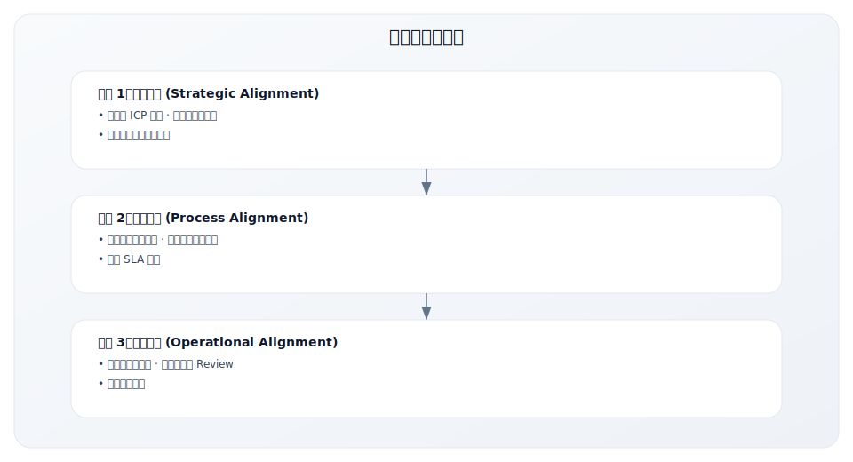

---

## 关键对齐点一：共同的 ICP 与目标

### 统一的 ICP 定义

**问题**：销售和营销对"理想客户"理解不一致

| 角色 | 常见偏差 |
|------|---------|
| 营销 | 更关注"能产生线索"的客户画像 |
| 销售 | 更关注"能成交"的客户画像 |
| 结果 | 营销产生的线索销售不想跟进 |

**解决方案**：共同制定 ICP 文档

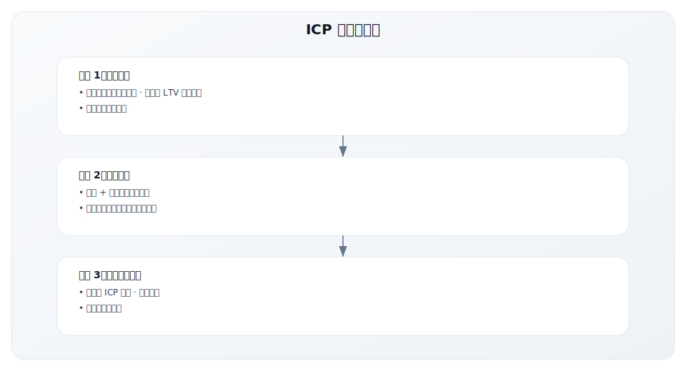

### 共同的收入目标

**原则**：销售和营销应该有共同的北极星指标

| 错误做法 | 正确做法 |
|---------|---------|
| 营销只关注 MQL 数量 | 营销也关注 Pipeline 和收入 |
| 销售不关心营销投入 | 销售参与营销策略讨论 |
| 各自独立的 KPI | 共同的收入目标和漏斗指标 |

**推荐的共享指标**：

| 指标 | 说明 | 责任 |
|------|------|------|
| Pipeline 金额 | 销售机会总价值 | 共同 |
| Pipeline Velocity | 漏斗流转速度 | 共同 |
| Revenue | 实际收入 | 共同 |
| CAC | 客户获取成本 | 共同 |
| Win Rate by Source | 各来源成交率 | 共同 |

---

## 关键对齐点二：漏斗定义与交接标准

### 统一的漏斗阶段定义

**问题**：每个人对 MQL、SQL 的理解不同

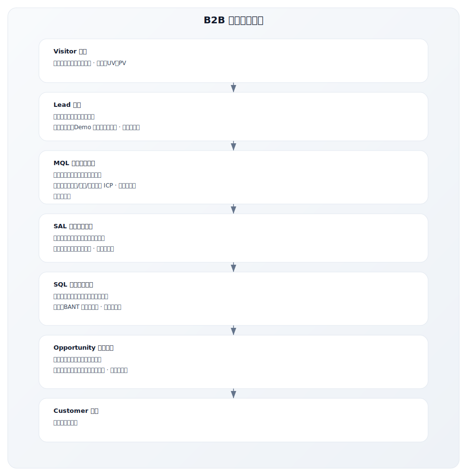

### MQL 标准定义

**MQL 应该满足的基本条件**：

| 维度 | 标准示例 | 权重 |
|------|---------|------|
| **公司规模** | 员工数 > 50 或年收入 > $5M | 必须 |
| **行业** | 属于目标行业列表 | 必须 |
| **职位** | 决策者或影响者 | 必须 |
| **地区** | 可服务地区 | 必须 |
| **行为** | 高价值行为（Demo 请求、定价页访问） | 加分 |

**MQL 评分示例**：

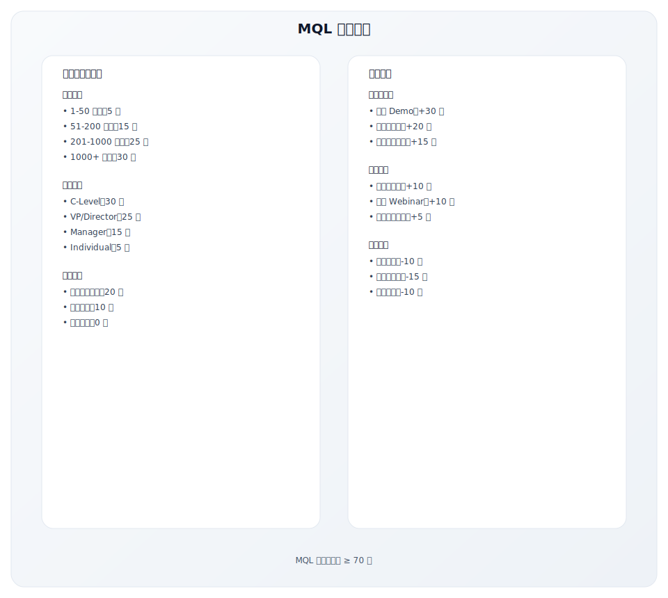

### SQL 标准定义

**常用框架：BANT**

| 维度 | 问题 | SQL 标准 |
|------|------|---------|
| **B**udget | 有预算吗？ | 确认有预算或能获得预算 |
| **A**uthority | 是决策者吗？ | 是决策者或能接触决策者 |
| **N**eed | 有需求吗？ | 确认有明确的业务需求 |
| **T**iming | 时间紧迫吗？ | 有明确的采购时间表 |

**现代替代框架：MEDDIC**

| 维度 | 说明 |
|------|------|
| **M**etrics | 量化的业务指标 |
| **E**conomic Buyer | 经济决策者 |
| **D**ecision Criteria | 决策标准 |
| **D**ecision Process | 决策流程 |
| **I**dentify Pain | 识别痛点 |
| **C**hampion | 内部支持者 |

---

## 关键对齐点三：SLA（服务级别协议）

### SLA 的作用

**SLA（Service Level Agreement）** 是销售和营销之间的正式协议，明确双方的责任和承诺。

### SLA 设计框架

**营销对销售的承诺（Marketing → Sales）**：

| 承诺项 | 具体内容 | 示例 |
|--------|---------|------|
| MQL 数量 | 每月交付的 MQL 数量 | 每月 200 个 MQL |
| MQL 质量 | 符合定义标准的比例 | ≥ 90% 符合 ICP |
| 信息完整度 | 关键字段填写率 | 公司名、职位、电话完整度 > 95% |
| 交付时效 | 线索进入系统的时间 | 线索产生后 4 小时内进入 CRM |
| 线索来源标注 | 来源渠道清晰标注 | 100% 标注来源和活动 |

**销售对营销的承诺（Sales → Marketing）**：

| 承诺项 | 具体内容 | 示例 |
|--------|---------|------|
| 跟进时效 | 收到 MQL 后的首次跟进时间 | 24 小时内首次跟进 |
| 跟进次数 | 放弃前的最少尝试次数 | ≥ 6 次尝试（电话+邮件） |
| 状态更新 | 更新线索状态的频率 | 每周更新 CRM 状态 |
| 反馈提供 | 线索质量反馈 | 每月提供质量反馈报告 |
| 退回规则 | 不合格线索的退回标准 | 48 小时内可退回并说明原因 |

### SLA 文档模板

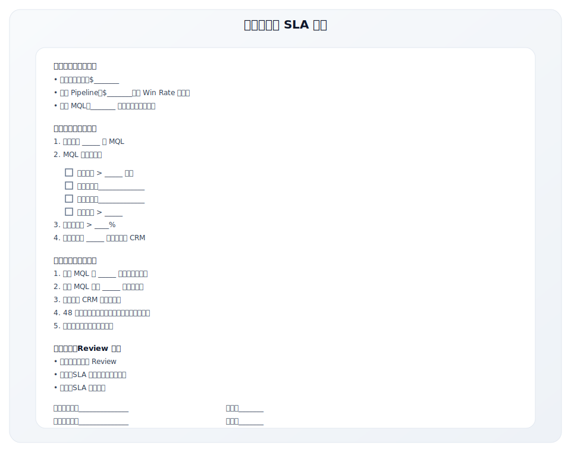

---

## 关键对齐点四：沟通与协作机制

### 定期对齐会议

| 会议类型 | 频率 | 参与者 | 议程 |
|---------|------|--------|------|
| **漏斗 Review** | 每周 | 营销经理 + 销售经理 | 本周线索、转化、问题 |
| **SLA Review** | 每月 | 营销总监 + 销售总监 | SLA 完成、质量分析、调整 |
| **Pipeline Review** | 每月 | 营销 + 销售团队 | 重点机会、营销支持需求 |
| **战略对齐** | 每季度 | CMO + CRO | 目标、策略、资源 |

### 周会议程示例

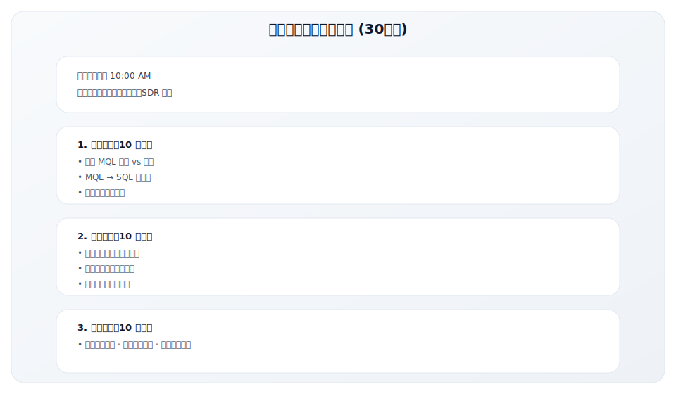

### 共享工具和数据

| 工具类型 | 作用 | 示例 |
|---------|------|------|
| **CRM** | 统一的客户和线索数据 | Salesforce, HubSpot |
| **营销自动化** | 线索培育和评分 | HubSpot, Marketo |
| **仪表板** | 共享的漏斗可视化 | Looker, Tableau |
| **协作平台** | 日常沟通和文档 | Slack, Notion |

**数据共享原则**：

- CRM 是唯一数据来源（Single Source of Truth）
- 营销自动化与 CRM 双向同步
- 所有人可以看到同样的仪表板
- 数据定义和计算方式一致

---

## 常见对齐问题与解决方案

### 问题诊断表

| 症状 | 可能原因 | 解决方案 |
|------|---------|---------|
| MQL → SQL 转化率低 | MQL 标准太宽松；销售跟进不力 | Review 评分模型；跟进 SLA |
| 销售说线索质量差 | ICP 不一致；营销追求数量 | 统一 ICP；质量 KPI |
| 线索跟进不及时 | 销售任务重；没有 SLA | 设置跟进 SLA；自动提醒 |
| 营销不知道哪些有效 | 反馈循环缺失 | 建立反馈机制；定期 Review |
| 归因争议 | 归因模型不清晰 | 多触点归因；共同 KPI |

### 解决方案：建立反馈循环

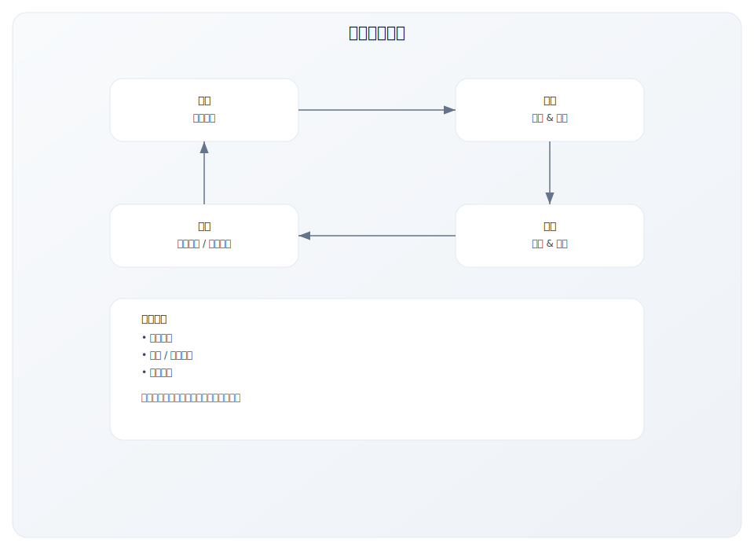

### 线索退回机制

| 退回原因 | 处理方式 |
|---------|---------|
| 信息错误 | 退回营销修正 |
| 不符合 ICP | 退回营销培育或放弃 |
| 时机不对 | 退回营销继续培育 |
| 已是客户 | 转给客户成功 |
| 竞品员工 | 标记排除 |

---

## 美国 B2B 销售与营销对齐案例

### 案例一：HubSpot 的 "Smarketing" 实践

HubSpot 创造了 "Smarketing"（Sales + Marketing）这一概念，是销售与营销对齐领域的先驱。

**HubSpot 的对齐哲学**：

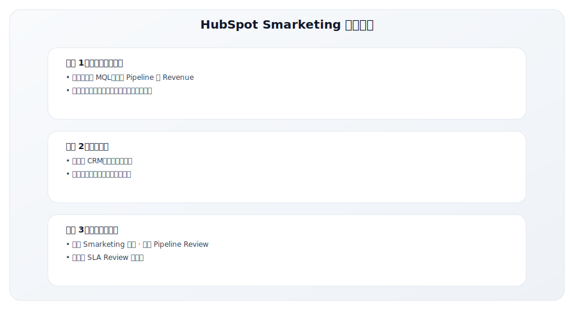

**HubSpot SLA 实践**：

HubSpot 的 SLA 模型是行业标杆，基于数学公式推导：

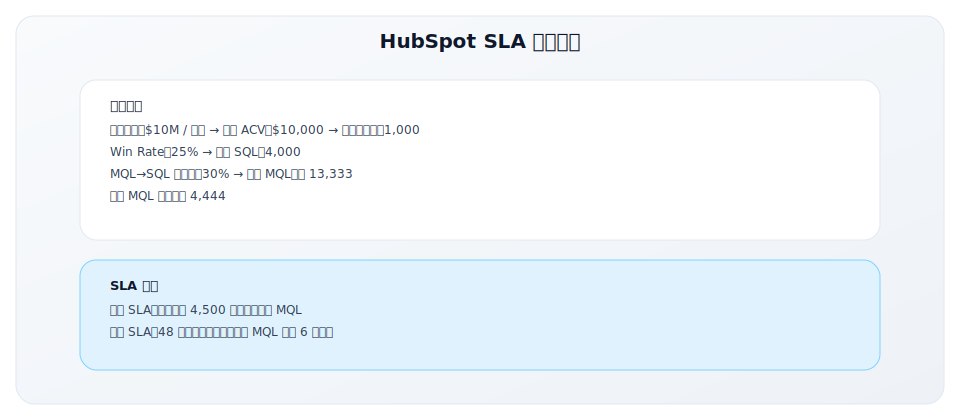

**HubSpot 对齐的关键成果**：

| 指标 | 实施前 | 实施后 | 提升 |
|------|-------|-------|------|
| MQL → SQL 转化率 | 18% | 35% | +94% |
| 平均跟进时效 | 72 小时 | 12 小时 | -83% |
| Pipeline 可预测性 | 低 | 高 | 显著 |
| 归因争议 | 频繁 | 极少 | 大幅减少 |

### 案例二：Salesforce 的企业级对齐体系

Salesforce 作为全球最大的 CRM 公司，其销售与营销对齐体系代表了企业级最佳实践。

**组织架构设计**：

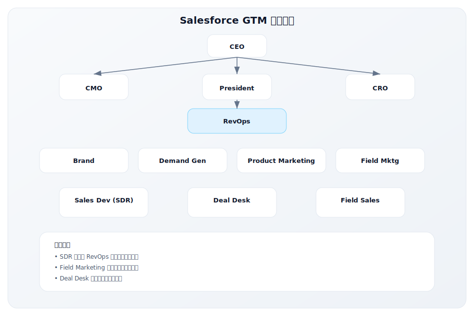

**Salesforce 的漏斗管理**：

| 阶段 | 定义 | 责任方 | 关键动作 |
|------|------|-------|---------|
| Inquiry | 任何互动（网站、活动） | Marketing | 数据清洗 |
| MQL | 评分达标 + ICP 匹配 | Marketing | 交接 SDR |
| SAL | SDR 确认接受 | SDR | 2 小时内响应 |
| SQL | BANT 验证通过 | SDR | 创建 Opportunity |
| Stage 1 | 发现需求 | AE | Demo 演示 |
| Stage 2 | 验证价值 | AE | POC/试用 |
| Stage 3 | 商务谈判 | AE | 报价 |
| Closed Won | 成交 | AE | 转交实施 |

**Salesforce 的 Account-Based 对齐**：

对于大客户（Enterprise），Salesforce 采用 ABM（Account-Based Marketing）模式，销售与营销的对齐更加紧密：

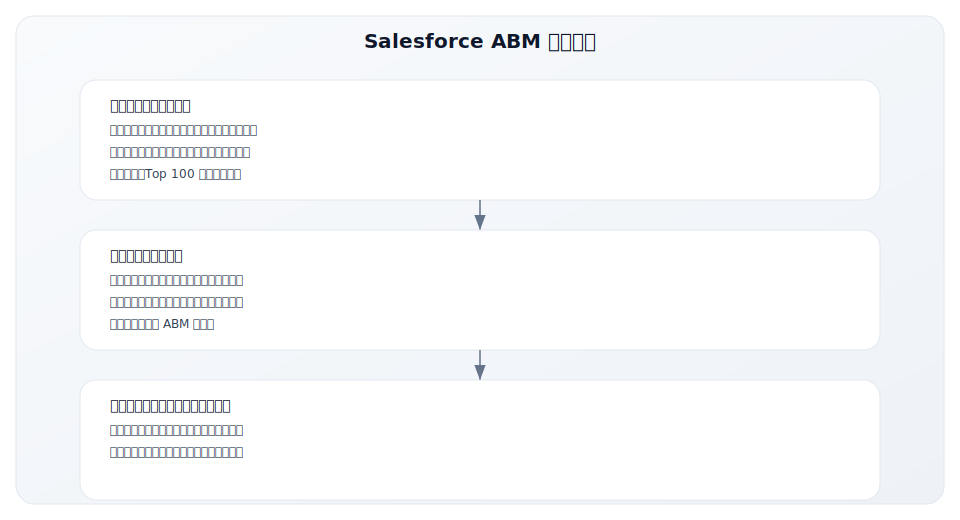

### 案例三：Drift 的 Conversational Marketing 对齐革新

Drift 作为 Conversational Marketing 的开创者，重新定义了销售与营销的交接模式。

**传统模式 vs Drift 模式**：

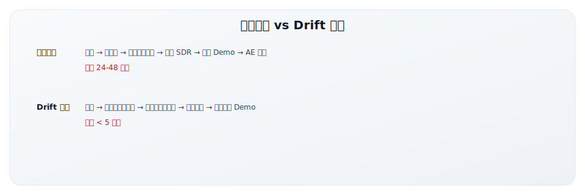

**Drift 的实时对齐机制**：

| 功能 | 作用 | 对齐价值 |
|------|------|---------|
| Visitor Intelligence | 实时识别访客公司 | 营销数据即时共享给销售 |
| Routing Rules | 基于规则路由到正确销售 | 无需手动分配 |
| Meeting Scheduler | 直接预约销售日历 | 跳过 SDR 环节 |
| Revenue Acceleration | 聊天记录自动进 CRM | 数据自动同步 |

**Drift 带来的指标变化**（客户案例）：

| 指标 | 传统模式 | Drift 模式 | 变化 |
|------|---------|-----------|------|
| 首次响应时间 | 42 小时 | 5 分钟 | -99% |
| Demo 预约率 | 1.5% | 3.8% | +153% |
| 销售周期 | 45 天 | 32 天 | -29% |
| 营销归因清晰度 | 模糊 | 清晰 | 显著提升 |

### 美国对齐最佳实践总结

| 公司 | 核心创新 | 关键成功因素 |
|------|---------|-------------|
| HubSpot | Smarketing 文化 | 数学化 SLA、共同 KPI |
| Salesforce | 企业级架构 | RevOps 中立角色、ABM 协作 |
| Drift | 实时对齐 | 技术驱动、消除延迟 |

**通用成功要素**：

1. **组织设计**：RevOps 或类似角色作为中立协调者
2. **数据统一**：CRM 作为唯一数据来源
3. **SLA 量化**：基于数学推导的承诺指标
4. **技术赋能**：自动化工具减少人工摩擦
5. **文化建设**：从对抗到协作的思维转变

---

## 中国 B2B 销售与营销对齐案例

### 案例一：纷享销客的对齐实践

纷享销客作为中国领先的 CRM 厂商，其销售与营销对齐有独特的实践：

**组织架构设计**：

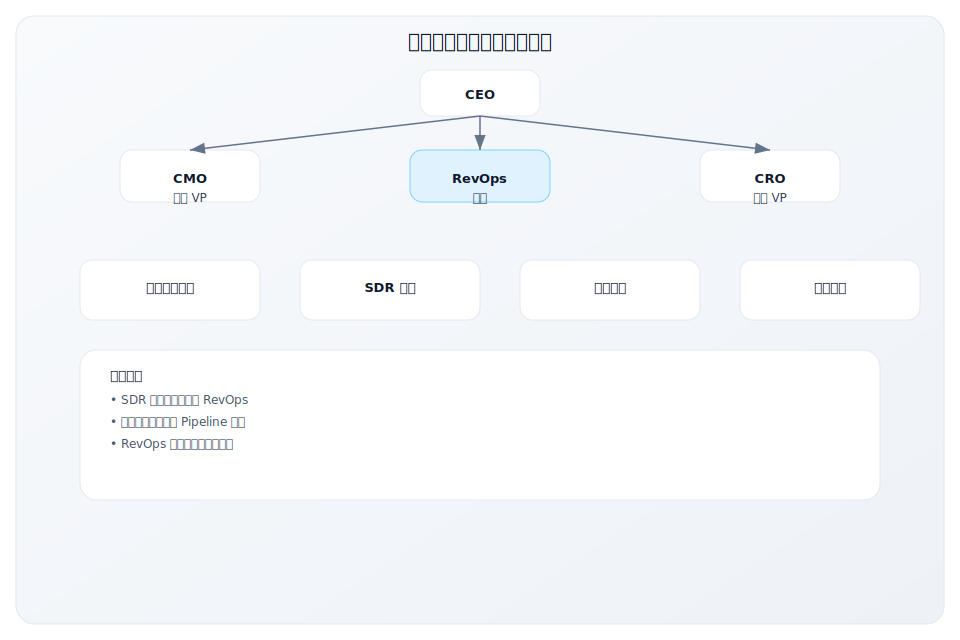

**SLA 设计示例**：

| 营销承诺 | 具体指标 |
|---------|---------|
| MQL 数量 | 每月 300 个 |
| MQL 质量 | 符合 ICP 比例 ≥ 85% |
| 信息完整度 | 关键字段完整度 ≥ 90% |
| 响应时效 | 线索进入 CRM ≤ 2 小时 |

| 销售承诺 | 具体指标 |
|---------|---------|
| 跟进时效 | 工作时间 4 小时内首次跟进 |
| 跟进次数 | 放弃前至少 8 次触达 |
| 状态更新 | 每周至少更新一次状态 |
| 质量反馈 | 每周提交线索质量反馈 |

### 案例二：中国 B2B 对齐的特殊挑战

中国 B2B 市场的销售与营销对齐面临独特挑战：

**挑战一：线索来源结构不同**

| 维度 | 中国市场 | 美国市场 |
|------|---------|---------|
| Inbound 占比 | 较低（30-40%） | 较高（50-70%） |
| Outbound 占比 | 较高（40-50%） | 较低（20-30%） |
| 关系转介绍 | 很重要（20-30%） | 相对较少（10-15%） |
| 主要来源 | 会议、转介绍、BD | 网站、内容、广告 |

**挑战二：决策模式差异**

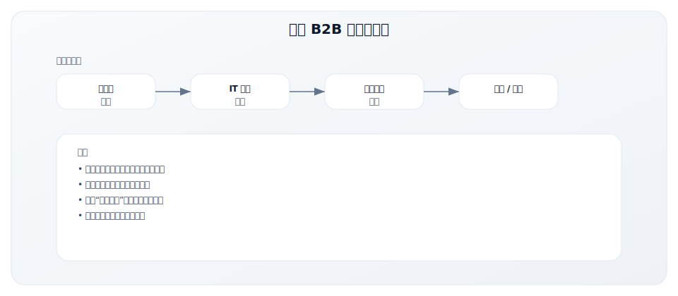

**挑战三：营销触点有限**

| 触点 | 中国效果 | 美国效果 | 原因 |
|------|---------|---------|------|
| 邮件营销 | 效果差 | 效果好 | 邮件使用习惯不同 |
| 内容营销 | 中等 | 效果好 | 内容消费习惯不同 |
| 社交媒体 | 微信强 | LinkedIn 强 | 平台生态不同 |
| 线下活动 | 效果好 | 效果中等 | 关系文化差异 |
| 搜索广告 | 效果中等 | 效果好 | 搜索行为差异 |

### 中国 B2B 对齐最佳实践

**1. 建立适合中国市场的 MQL 标准**

传统的 MQL 标准需要调整以适应中国市场：

| 传统 MQL 标准 | 中国市场调整 |
|--------------|-------------|
| 邮件打开/点击 | 微信阅读/互动 |
| 网站访问行为 | 小程序/公众号互动 |
| 表单提交 | 活动报名、资料领取 |
| 内容下载 | 直播参与、社群互动 |

**2. 强化线下活动的作用**

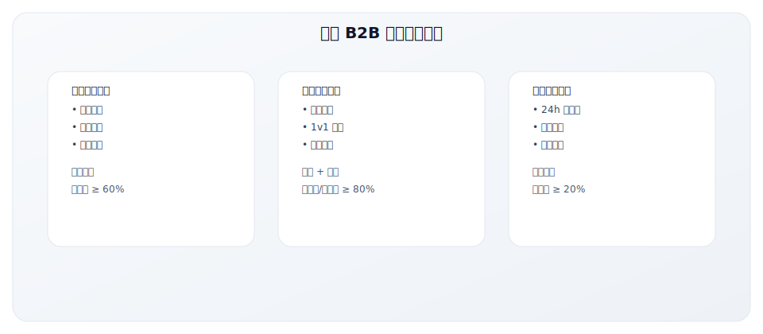

**3. 利用企业微信打通销售与营销**

| 应用场景 | 具体做法 |
|---------|---------|
| 线索分配 | 营销获取线索后自动分配给销售企微 |
| 客户培育 | 销售通过企微朋友圈触达客户 |
| 内容协同 | 营销提供内容，销售通过企微分发 |
| 数据打通 | 企微行为数据回流 CRM |

**4. 设计适合中国的跟进节奏**

| 阶段 | 中国市场建议 | 原因 |
|------|-------------|------|
| 首次跟进 | 电话为主，4 小时内 | 微信/邮件响应率低 |
| 后续跟进 | 电话 + 微信组合 | 建立个人连接 |
| 邀约面谈 | 尽早安排线下 | 面对面建立信任 |
| 长期培育 | 微信朋友圈 + 节日问候 | 保持关系温度 |

---

## 关键要点

1. **对齐的团队收入增长快 32%**，错位是 GTM 失败的常见原因

2. **对齐的三个层次**：
   - 战略对齐：共同的 ICP 和目标
   - 流程对齐：统一的漏斗定义和交接标准
   - 运营对齐：共享的工具和定期沟通

3. **SLA 是对齐的基础**：
   - 营销承诺线索数量和质量
   - 销售承诺跟进时效和反馈
   - 双方可衡量、可追责

4. **对齐需要持续维护**：
   - 定期的 Review 会议
   - 有效的反馈循环
   - 数据驱动的优化

5. **共享工具和数据**：CRM 是唯一数据来源，所有人看同样的仪表板

---

## 实践练习

### 练习 1：对齐程度评估

评估你组织中销售与营销的对齐程度：

| 维度 | 评分（1-5） | 主要问题 |
|------|-----------|---------|
| ICP 定义一致性 | | |
| 漏斗阶段定义清晰度 | | |
| SLA 是否存在并执行 | | |
| 沟通频率和质量 | | |
| 工具和数据共享 | | |
| **总分** | /25 | |

**评分解读**：
- 20-25：优秀，继续保持
- 15-19：良好，有改进空间
- 10-14：一般，需要重点关注
- < 10：较差，需要立即行动

### 练习 2：MQL 标准定义

为你的公司定义 MQL 标准：

| 维度 | 标准 | 权重 |
|------|------|------|
| 公司规模 | | |
| 行业 | | |
| 职位 | | |
| 地区 | | |
| 行为 | | |
| **MQL 阈值** | 总分 ≥ | |

### 练习 3：SLA 起草

起草一份简版 SLA：

**营销承诺**：
1. 每月交付 _____ 个 MQL
2. MQL 符合标准率 ≥ ____%
3. ...

**销售承诺**：
1. MQL 跟进时效：_____ 小时内
2. 最少跟进次数：_____ 次
3. ...

---

## 延伸阅读

### 书籍
- **《Revenue Operations》** - Stephen G. Diorio
  - 销售、营销、客户成功对齐的完整指南

- **《Predictable Revenue》** - Aaron Ross
  - 销售与营销对齐的经典著作

### 文章资源
- **HubSpot** 的 Sales & Marketing Alignment 指南
- **SiriusDecisions**（现 Forrester）的对齐框架

### 模板
- SLA 模板
- MQL 评分模型
- 对齐会议议程

---

**写作状态**：审校完成
**最后更新**：2025-12-23
**版本**：v1.1
