# 3.4 GTM 核心指标体系

> **学习目标**：掌握 SaaS/B2B GTM 的核心指标，理解指标间的关系，学会用数据驱动 GTM 决策
>
> **预计时长**：40 分钟
>
> **前置知识**：模块二和模块三前序章节

---

## 核心内容

本节覆盖以下内容：
- 引言：没有度量，就没有管理
- 一、获客效率指标
- 二、漏斗效率指标
- 三、客户成功指标
- 四、综合健康度指标
- 美国 SaaS 指标标杆案例

## 引言：没有度量，就没有管理

> "You can't manage what you can't measure."
> — Peter Drucker

GTM 是一个复杂的系统，涉及营销、销售、客户成功等多个环节。没有清晰的指标体系，就无法：
- 判断 GTM 策略是否有效
- 识别瓶颈和问题所在
- 做出数据驱动的决策
- 评估投入产出效率

### GTM 指标体系架构

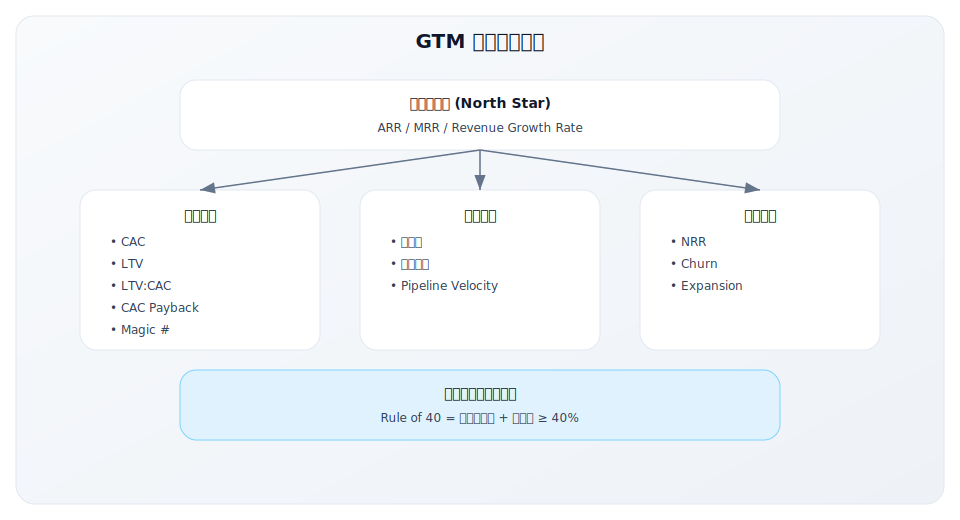

---

## 一、获客效率指标

获客效率指标衡量的是获取新客户的成本和效率。

### 1. CAC（Customer Acquisition Cost）

**定义**：获取一个新客户所需的平均成本。

**计算公式**：

```
CAC = 销售营销总支出 / 同期新增客户数
```

**详细计算**：

| 成本项 | 包含内容 |
|--------|---------|
| 营销成本 | 广告、内容、活动、工具、营销团队薪酬 |
| 销售成本 | 销售团队薪酬、佣金、工具、差旅 |
| 支持成本 | SDR/BDR 团队、销售运营 |

**CAC 的变体**：

| 变体 | 计算方式 | 用途 |
|------|---------|------|
| **Blended CAC** | 全部获客成本 / 全部新客户 | 整体效率 |
| **Paid CAC** | 付费渠道成本 / 付费渠道客户 | 付费渠道效率 |
| **Organic CAC** | 有机渠道成本 / 有机渠道客户 | 有机渠道效率 |
| **Fully Loaded CAC** | 含所有分摊成本 | 真实成本 |

**CAC 基准参考**：

| 客户类型 | 典型 CAC | 说明 |
|---------|---------|------|
| SMB | $100-500 | 自助或低触达 |
| Mid-Market | $2,000-20,000 | Inside Sales |
| Enterprise | $20,000-100,000+ | Field Sales |

**CAC 优化方向**：

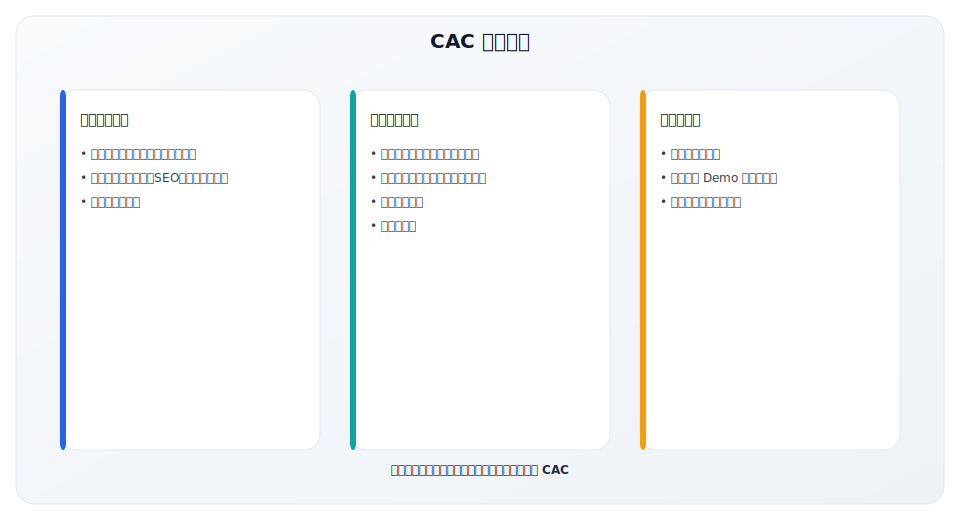

### 2. LTV（Lifetime Value）

**定义**：一个客户在整个生命周期内为公司贡献的总毛利价值。

**计算公式（多种方式）**：

**方式一：简单计算**
```
LTV = ARPU × 平均客户生命周期
```

**方式二：考虑毛利**
```
LTV = ARPU × 毛利率 × 平均客户生命周期
```

**方式三：使用流失率**
```
LTV = ARPU × 毛利率 / 月流失率
```

**方式四：考虑扩展收入**
```
LTV = (初始 ARPU + 年均扩展收入) × 毛利率 / 年流失率
```

**LTV 计算示例**：

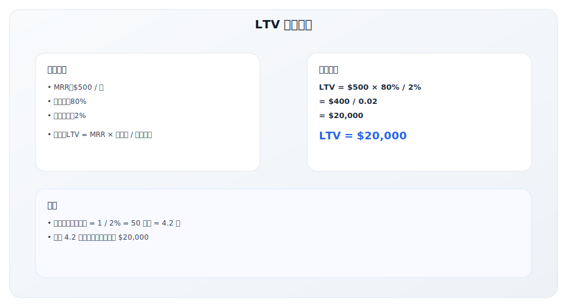

### 3. LTV:CAC 比率

**定义**：客户生命周期价值与获客成本的比率，是衡量单位经济模型健康度的核心指标。

**计算公式**：
```
LTV:CAC = LTV / CAC
```

**解读标准**：

| 比率 | 含义 | 行动建议 |
|------|------|---------|
| < 1:1 | 亏损 | 每获取一个客户都在亏钱，需立即调整 |
| 1:1 - 3:1 | 盈利但效率低 | 可持续但需优化，关注 CAC 或提高 LTV |
| 3:1 - 5:1 | 健康 | 单位经济模型健康，可规模化 |
| > 5:1 | 过于保守 | 可能投入不足，错失增长机会 |

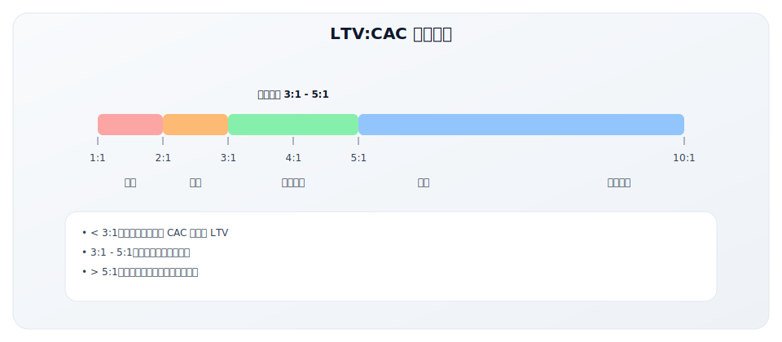

### 4. CAC Payback（获客成本回收期）

**定义**：收回获客成本所需的时间（月数）。

**计算公式**：
```
CAC Payback = CAC / (MRR × 毛利率)
```

**解读标准**：

| CAC Payback | 含义 |
|-------------|------|
| < 12 个月 | 优秀，资金效率高 |
| 12-18 个月 | 良好，可接受 |
| 18-24 个月 | 较长，需要关注 |
| > 24 个月 | 过长，可能有现金流压力 |

**CAC Payback 计算示例**：

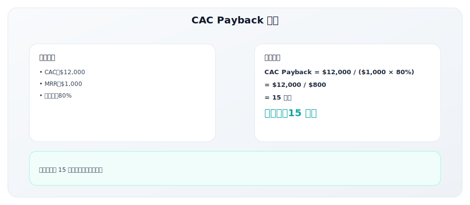

**为什么 CAC Payback 重要**：

- 影响现金流：Payback 越长，需要的运营资金越多
- 影响增长速度：短 Payback 意味着可以更快再投资
- 影响融资需求：长 Payback 可能需要更多外部资金

### 5. Magic Number（魔法数字）

**定义**：衡量销售营销投入效率的指标，反映每投入 1 美元能产生多少新增 ARR。

**计算公式**：
```
Magic Number = 本季度净新增 ARR / 上季度销售营销支出
```

**解读标准**：

| Magic Number | 含义 | 行动建议 |
|-------------|------|---------|
| < 0.5 | 效率低 | 需要优化漏斗、提高转化 |
| 0.5 - 0.75 | 可接受 | 有改进空间 |
| 0.75 - 1.0 | 健康 | 可以适度加大投入 |
| > 1.0 | 高效 | 应该加大投入 |

**Magic Number 计算示例**：

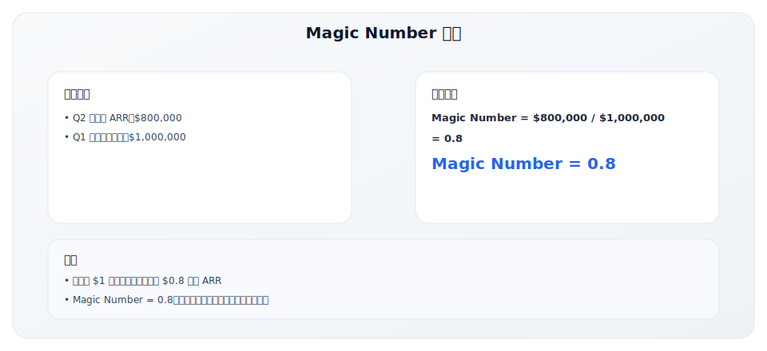

---

## 二、漏斗效率指标

漏斗效率指标衡量的是从线索到成交的转化效率。

### 1. 漏斗转化率

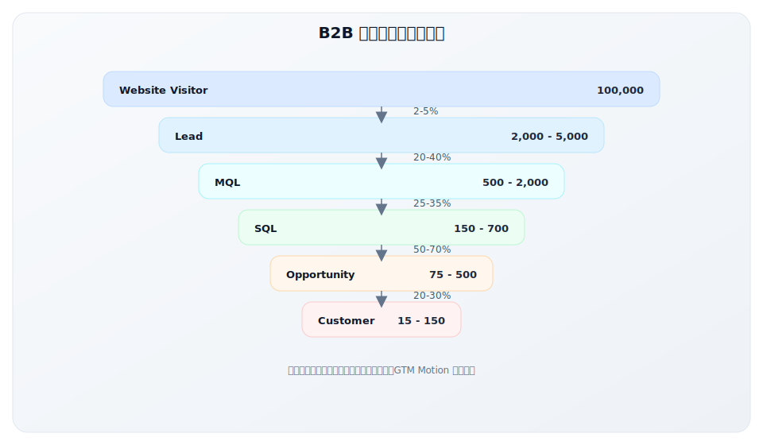

**各阶段转化率参考**：

| 转化阶段 | 良好 | 优秀 | 常见问题 |
|---------|------|------|---------|
| Visitor → Lead | 2-3% | > 5% | 流量质量差、CTA 不清晰 |
| Lead → MQL | 20-30% | > 40% | ICP 不清晰、线索来源差 |
| MQL → SQL | 25-35% | > 40% | 评分模型不准、跟进不力 |
| SQL → Opp | 50-60% | > 70% | SQL 标准松、销售能力差 |
| Opp → Won | 20-30% | > 35% | 产品不匹配、竞争力弱 |

### 2. 销售周期（Sales Cycle）

**定义**：从首次有意义接触到成交的平均时间。

**典型销售周期**：

| 客户类型 | ACV 范围 | 典型销售周期 |
|---------|---------|-------------|
| SMB | < $5K | 1-2 周 |
| Mid-Market | $5K-50K | 1-3 个月 |
| Enterprise | $50K-500K | 3-9 个月 |
| Strategic | > $500K | 6-18 个月 |

**销售周期优化**：

| 拉长因素 | 缩短方法 |
|---------|---------|
| 决策者难以接触 | 多线程销售、找对人 |
| 需求不紧急 | 创造紧迫感、事件驱动 |
| 内部审批复杂 | 提前了解流程、准备材料 |
| 竞品对比多 | 差异化、先发优势 |
| POC/试用期长 | 明确试用目标和时间 |

### 3. Pipeline Velocity（管道速度）

**定义**：销售管道产生收入的速度。

**计算公式**：
```
Pipeline Velocity = (商机数量 × 平均客单价 × 成交率) / 销售周期天数
```

**解读**：Pipeline Velocity 越高，说明漏斗效率越高。

**Pipeline Velocity 计算示例**：

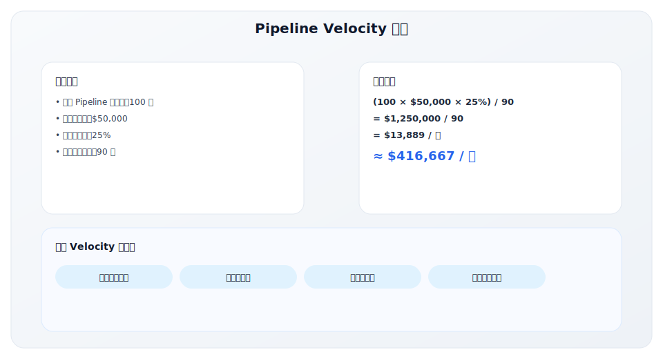

### 4. Win Rate（成交率）

**定义**：进入正式销售流程的机会最终成交的比例。

**计算方式**：

| 计算方式 | 公式 | 用途 |
|---------|------|------|
| 按数量 | 成交数 / 总机会数 | 整体效率 |
| 按金额 | 成交金额 / 总机会金额 | 加权效率 |
| 按来源 | 各来源分别计算 | 渠道效率比较 |

**Win Rate 基准**：

| 场景 | 基准范围 |
|------|---------|
| SMB | 25-35% |
| Mid-Market | 20-30% |
| Enterprise | 15-25% |
| 竞标项目 | 10-20% |

---

## 三、客户成功指标

客户成功指标衡量的是现有客户的健康度和价值最大化。

### 1. NRR（Net Revenue Retention）

**定义**：净收入留存率，衡量现有客户群体的收入变化，是 SaaS 最重要的指标之一。

**计算公式**：
```
NRR = (期初 ARR + 扩展收入 - 流失收入 - 降级收入) / 期初 ARR × 100%
```

**分解**：

| 组成部分 | 说明 |
|---------|------|
| 期初 ARR | 期初现有客户的 ARR |
| 扩展收入 | 升级（Upsell）+ 交叉销售（Cross-sell） |
| 流失收入 | 完全流失的客户收入 |
| 降级收入 | 降级客户减少的收入 |

**NRR 计算示例**：

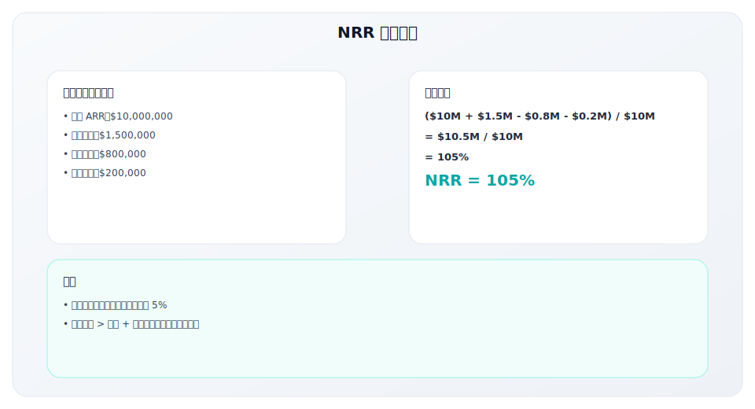

**NRR 基准参考**：

| NRR 水平 | 评价 | 代表公司 |
|---------|------|---------|
| < 100% | 客户在流失 | 需要立即关注 |
| 100-110% | 健康 | 大多数 SaaS |
| 110-130% | 优秀 | Datadog, Snowflake |
| > 130% | 顶级 | 极少数公司 |

**高 NRR 公司的特点**：

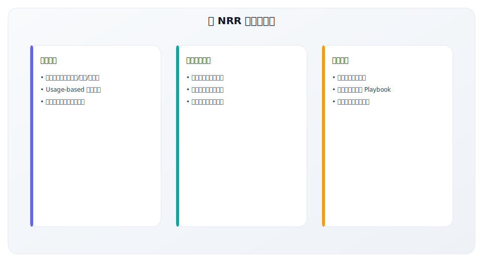

### 2. GRR（Gross Revenue Retention）

**定义**：毛收入留存率，不考虑扩展收入，只看流失和降级。

**计算公式**：
```
GRR = (期初 ARR - 流失收入 - 降级收入) / 期初 ARR × 100%
```

**GRR 基准**：

| GRR 水平 | 评价 |
|---------|------|
| < 80% | 较差，流失严重 |
| 80-90% | 可接受 |
| 90-95% | 良好 |
| > 95% | 优秀 |

**GRR vs NRR**：

| 指标 | 关注点 | 意义 |
|------|--------|------|
| GRR | 只看流失和降级 | 产品核心价值是否稳固 |
| NRR | 流失 + 扩展 | 客户群体整体健康度 |

### 3. Churn Rate（流失率）

**定义**：一定时期内流失的客户或收入比例。

**类型**：

| 类型 | 公式 | 用途 |
|------|------|------|
| **Logo Churn** | 流失客户数 / 期初客户数 | 客户流失 |
| **Revenue Churn** | 流失收入 / 期初 ARR | 收入流失 |
| **Gross Churn** | (流失 + 降级) / 期初 ARR | 总流失 |
| **Net Churn** | (流失 + 降级 - 扩展) / 期初 ARR | 净流失 |

**月流失 vs 年流失换算**：

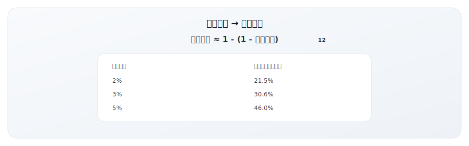

### 4. Expansion Revenue（扩展收入）

**定义**：来自现有客户的新增收入。

**来源**：

| 来源 | 说明 | 示例 |
|------|------|------|
| **Upsell** | 升级到更高套餐 | Basic → Pro |
| **Cross-sell** | 购买其他产品 | 买了 A 产品，再买 B |
| **Add-on** | 购买附加功能/服务 | 增加用户数、存储 |
| **Price Increase** | 价格上调 | 年度涨价 |

**扩展收入率**：
```
扩展收入率 = 扩展收入 / 期初 ARR × 100%
```

---

## 四、综合健康度指标

### Rule of 40

**定义**：衡量 SaaS 公司整体健康度的经验法则。

**公式**：
```
Rule of 40 = 收入增长率 + 利润率 ≥ 40%
```

**解读**：

| Rule of 40 得分 | 评价 |
|----------------|------|
| < 20% | 需要关注 |
| 20-40% | 可接受 |
| 40-60% | 健康 |
| > 60% | 优秀 |

**Rule of 40 的权衡**：

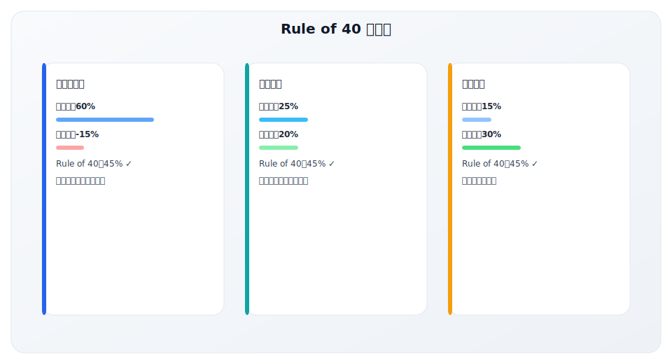

---

## 美国 SaaS 指标标杆案例

### 案例一：Datadog 的 NRR 神话

Datadog 是 SaaS 行业中 NRR 的标杆，长期保持 130%+ 的净收入留存率，是理解高 NRR 如何驱动增长的最佳案例。

**Datadog 关键指标演进**：

| 指标 | 2019 | 2020 | 2021 | 2022 | 2023 |
|------|------|------|------|------|------|
| ARR | $363M | $603M | $1.03B | $1.68B | $2.08B |
| NRR | 130%+ | 130%+ | 130%+ | 130%+ | 125%+ |
| 毛利率 | 74% | 76% | 78% | 79% | 80% |
| 大客户数（>$100K ARR） | 727 | 1,253 | 1,800 | 2,600+ | 3,100+ |

**为什么 Datadog NRR 如此高？**


**Datadog NRR 拆解分析（示例）**：

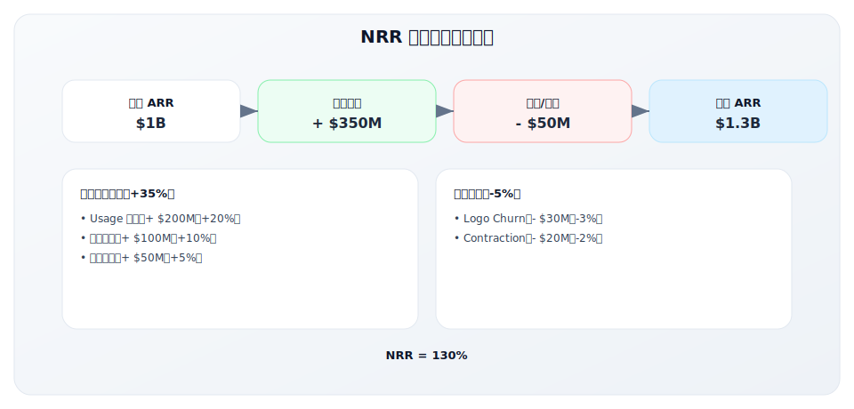

### 案例二：Snowflake 的增长奇迹

Snowflake 是近年来增长最快的企业级 SaaS 公司，其指标展示了 Consumption-Based 模式的威力。

**Snowflake 关键指标**：

| 指标 | FY2021 | FY2022 | FY2023 | FY2024 |
|------|--------|--------|--------|--------|
| 产品收入 | $554M | $1.14B | $1.94B | $2.67B |
| YoY 增长 | 117% | 106% | 70% | 38% |
| NRR | 168% | 178% | 158% | 131% |
| 客户数（>$1M 消费） | 77 | 184 | 330 | 461 |
| 毛利率 | 62% | 69% | 73% | 74% |

**Snowflake 的超高 NRR 秘密**：

| 驱动因素 | 说明 | 影响 |
|---------|------|------|
| Consumption 模式 | 按实际使用量计费 | 客户增长自动带来收入 |
| 数据重力 | 数据越多，迁移越难 | 极低流失率 |
| 网络效应 | Data Sharing 功能 | 更多数据 = 更多价值 |
| 工作负载扩展 | 从分析到 ML 到应用 | 持续扩展用例 |

**Snowflake vs 传统订阅模式对比**：

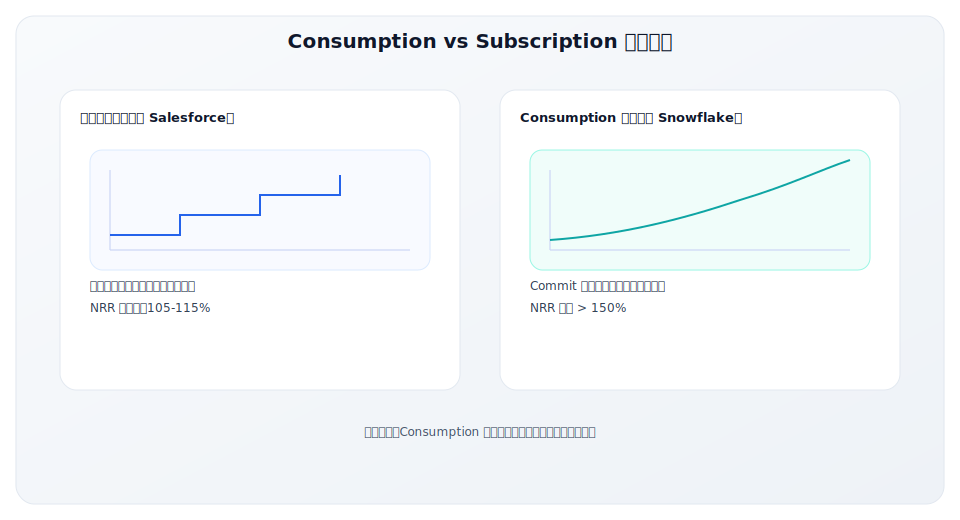

### 案例三：Okta 的企业级指标演进

Okta 是身份管理领域的领导者，其指标演进展示了从中小企业到大企业的成功转型。

**Okta 关键指标演进**：

| 指标 | 2018 | 2020 | 2022 | 2024 |
|------|------|------|------|------|
| ARR | $338M | $745M | $1.5B | $2.4B |
| NRR | 119% | 121% | 124% | 117% |
| 大客户占比（>$100K） | 68% | 73% | 76% | 79% |
| 平均 ACV | ~$15K | ~$25K | ~$45K | ~$60K |
| 销售效率（Magic #） | 0.9 | 0.8 | 0.7 | 0.75 |

**Okta 的上移市场策略**：

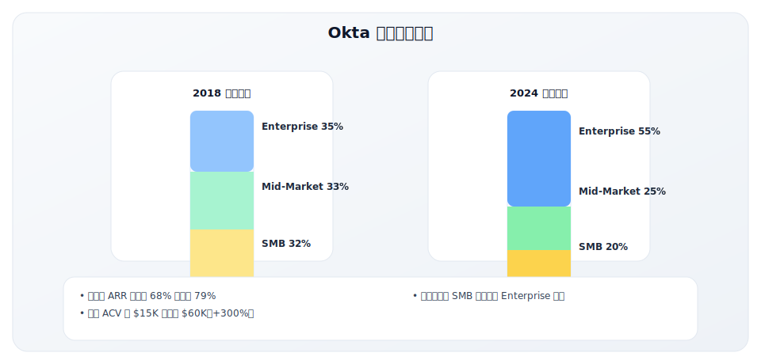

**Okta 指标优化的关键动作**：

| 阶段 | 关键动作 | 指标影响 |
|------|---------|---------|
| 2016-2018 | 强化企业级功能（SSO、MFA） | 大客户转化率提升 |
| 2019-2020 | 建立企业销售团队 | ACV 增长 40% |
| 2021 | 收购 Auth0 | 开发者市场+PLG 入口 |
| 2022-2024 | 身份治理平台化 | NRR 保持 115%+ |

### 案例四：Zoom 的 Rule of 40 典范

Zoom 在疫情期间展示了极致的增长与效率平衡，是 Rule of 40 的典范案例。

**Zoom 关键指标演进**：

| 指标 | FY2020 | FY2021 | FY2022 | FY2023 | FY2024 |
|------|--------|--------|--------|--------|--------|
| 收入 | $623M | $2.65B | $4.1B | $4.39B | $4.53B |
| 增长率 | 88% | 326% | 55% | 7% | 3% |
| 营业利润率 | 2% | 25% | 37% | 34% | 35% |
| Rule of 40 | 90% | 351% | 92% | 41% | 38% |
| NRR | 130% | 156% | 130% | 112% | 107% |

**Zoom Rule of 40 分析**：

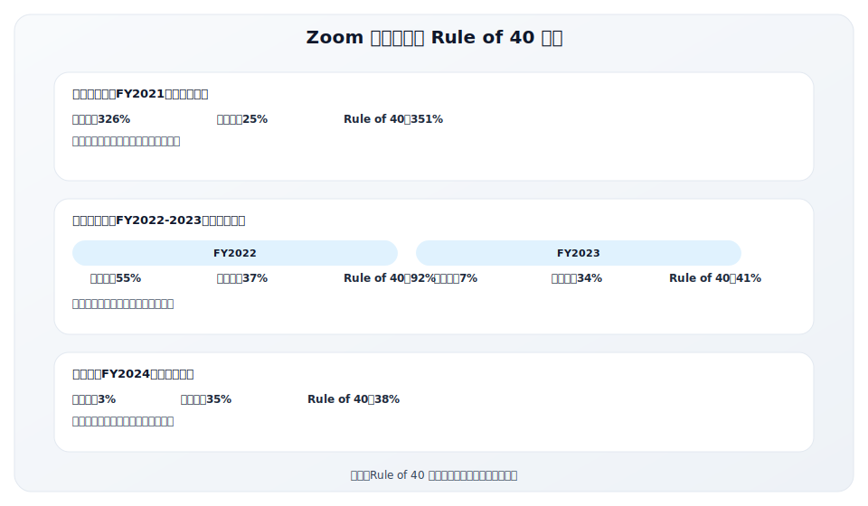

### 美国 SaaS 指标标杆总结

| 公司 | 核心指标优势 | 关键策略 | 可借鉴点 |
|------|-------------|---------|---------|
| Datadog | NRR 130%+ | Multi-product + Usage | 平台化 + 用量计费 |
| Snowflake | NRR 150%+ | Consumption 模式 | 数据重力 + 消费模式 |
| Okta | ACV +300% | 上移市场 | 企业级功能 + 并购 |
| Zoom | Rule of 40 | 增长利润平衡 | 动态调整策略 |

**行业基准参考（2024 年 Top Quartile SaaS）**：

| 指标 | Top Quartile | Median | 说明 |
|------|-------------|--------|------|
| NRR | > 120% | 105-110% | 优秀公司靠扩展驱动增长 |
| GRR | > 95% | 88-92% | 低流失是基础 |
| LTV:CAC | > 4:1 | 3:1 | 高效获客 |
| CAC Payback | < 12 月 | 18-24 月 | 快速回本 |
| Magic Number | > 1.0 | 0.6-0.8 | 销售效率 |
| Rule of 40 | > 50% | 30-40% | 综合健康度 |
| 毛利率 | > 80% | 70-75% | 软件属性 |

---

## 中国 SaaS 指标基准与案例

### 中美 SaaS 指标基准对比

中国 SaaS 市场与美国存在显著差异，指标基准也需要调整：

| 指标 | 美国 SaaS 基准 | 中国 SaaS 基准 | 差异原因 |
|------|---------------|---------------|---------|
| LTV:CAC | 3:1 - 5:1 | 2:1 - 4:1 | 中国 CAC 相对更高，LTV 相对更低 |
| CAC Payback | < 12 月 | < 18 月 | 客单价较低，回收期较长 |
| NRR | 110-130% | 90-110% | 扩展收入机会相对较少 |
| GRR | 90-95% | 80-90% | 流失率普遍较高 |
| 毛利率 | 70-85% | 60-75% | 服务成本较高 |
| Magic Number | > 0.75 | > 0.5 | 销售效率相对较低 |

### 中国 SaaS 指标案例分析

**案例一：上市 SaaS 公司指标参考**

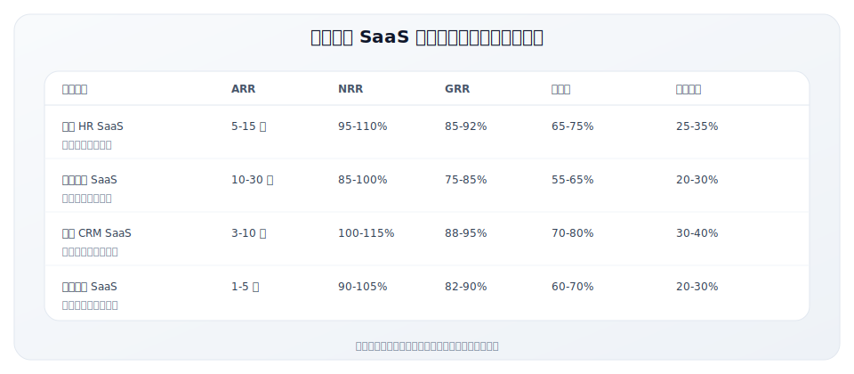

**案例二：北森的 NRR 提升实践**

北森作为中国 HR SaaS 领导者，其 NRR 表现优于行业平均：

| 维度 | 北森实践 | 效果 |
|------|---------|------|
| 产品扩展 | 从招聘延伸到全模块 HR | 客户可持续购买新模块 |
| 席位扩展 | 按员工数定价 | 客户增长带动收入增长 |
| 客户成功 | 专职 CSM 团队 | 降低流失，增加扩展 |
| 行业深耕 | 针对大客户定制 | 提高客户粘性 |

**NRR 拆解分析**：


### 中国 SaaS 指标的特殊考量

**1. CAC 计算的中国特色**

| 成本项 | 美国 SaaS | 中国 SaaS |
|--------|---------|---------|
| 销售团队成本 | 主要成本 | 主要成本，但人均效率较低 |
| 营销成本 | 数字营销为主 | 线下活动占比高 |
| BD 成本 | 相对较少 | 重要成本项 |
| 渠道成本 | 部分公司有 | 较为普遍 |
| 实施/POC 成本 | 通常不计入 | 应考虑计入 |

**2. LTV 计算的调整**

中国 SaaS 计算 LTV 时需要注意：

| 因素 | 影响 | 建议 |
|------|------|------|
| 合同周期 | 多为年付 | 以年为单位计算 |
| 专业服务 | 占比较高 | 考虑是否计入 |
| 折扣普遍 | 实际价格低于标价 | 使用实际收入计算 |
| 账期问题 | 可能有较长账期 | 考虑资金成本 |

**3. 中国 SaaS 健康度评估框架**

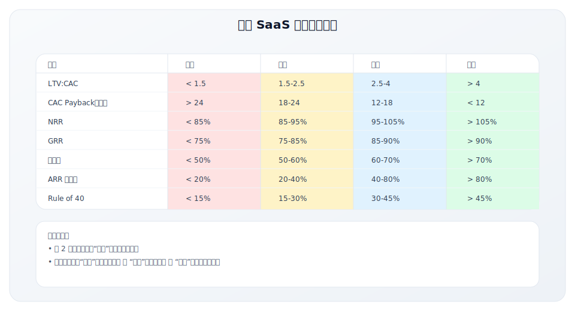

---

## 五、指标体系设计原则

### 分阶段关注重点

| 公司阶段 | 核心关注指标 | 原因 |
|---------|-------------|------|
| **种子期** | PMF 信号、早期留存 | 验证产品价值 |
| **早期** | MRR 增长、转化率 | 找到增长引擎 |
| **成长期** | CAC、LTV:CAC、NRR | 验证单位经济 |
| **扩张期** | Magic Number、Rule of 40 | 验证规模化效率 |
| **成熟期** | NRR、利润率、市场份额 | 持续盈利和领导地位 |

### 指标仪表板设计


---

## 关键要点

1. **GTM 指标体系分三大类**：
   - 获客效率：CAC、LTV、LTV:CAC、CAC Payback、Magic Number
   - 漏斗效率：转化率、销售周期、Pipeline Velocity、Win Rate
   - 客户成功：NRR、GRR、Churn、Expansion

2. **核心健康指标基准**：
   - LTV:CAC > 3:1
   - CAC Payback < 12 个月
   - Magic Number > 0.7
   - NRR > 100%（优秀 > 120%）

3. **指标需要与阶段匹配**：早期关注 PMF 和增长，成长期关注单位经济，成熟期关注效率

4. **指标间的关系比单一指标更重要**：理解指标间的因果关系和权衡

5. **数据驱动决策**：定期 Review，及时发现问题和机会

---

## 实践练习

### 练习 1：计算你的核心指标

填写你的产品核心指标：

| 指标 | 你的数值 | 基准 | 健康度 |
|------|---------|------|--------|
| CAC | | | |
| LTV | | | |
| LTV:CAC | | > 3:1 | |
| CAC Payback | | < 12 月 | |
| NRR | | > 100% | |
| GRR | | > 90% | |

### 练习 2：漏斗分析

绘制你的销售漏斗并标注转化率：

| 阶段 | 数量 | 转化率 | vs 基准 |
|------|------|--------|---------|
| Lead | | | |
| MQL | | | |
| SQL | | | |
| Opportunity | | | |
| Customer | | | |

### 练习 3：指标优化优先级

基于你的指标分析，识别最需要优化的领域：

| 问题领域 | 当前状态 | 目标 | 优先级 |
|---------|---------|------|--------|
| | | | |
| | | | |
| | | | |

→ 详见 [5.4 漏斗诊断检查表](../module-05/5.4-funnel-checklist)

---

## 延伸阅读

### 文章资源
- **OpenView Partners** 的 SaaS Benchmarks
- **Bessemer Venture Partners** 的 State of the Cloud
- **ChartMogul** 的 SaaS Metrics 指南

### 工具
- **ChartMogul**：订阅指标分析
- **ProfitWell**：留存和定价分析
- **Baremetrics**：MRR 和客户分析

### 报告
- **KeyBanc SaaS Survey**：年度 SaaS 基准报告
- **ICONIQ Growth KPI Report**：增长指标基准

---

**写作状态**：审校完成
**最后更新**：2025-12-23
**版本**：v1.1
