# 3.5 RevOps（收入运营）体系

> **学习目标**：理解 RevOps 的定义、职能和价值，掌握 RevOps 组织设计与成熟度评估方法
>
> **预计时长**：30 分钟
>
> **前置知识**：模块三全部前序章节

---

## 核心内容

本节覆盖以下内容：
- 什么是 RevOps？
- RevOps 的核心职能
- RevOps 带来的价值
- RevOps 组织设计
- 美国企业 RevOps 实践
- 中国企业 RevOps 实践

## 什么是 RevOps？

RevOps（Revenue Operations，收入运营）是将销售运营、营销运营、客户成功运营整合为统一职能的运营模式。其核心目标是通过数据整合、流程优化和技术赋能，打破部门孤岛，实现收入引擎的高效运转。

### 传统运营模式的问题

在传统模式下，Sales Ops、Marketing Ops、CS Ops 各自独立运作，带来三大问题：

**1. 数据孤岛（Data Silos）**
- 各部门使用不同系统，数据定义不统一
- 同一客户在不同系统中有多个版本
- 难以追踪完整的客户旅程

**2. 流程断裂（Process Gaps）**
- 部门交接处存在漏洞和延迟
- 各部门优化局部，忽视整体
- 客户体验不连贯

**3. 效率损失（Efficiency Loss）**
- 重复工作：多个团队做类似的事
- 工具重叠：同一功能购买多个软件
- 协调成本：大量时间用于跨部门沟通

### RevOps 的兴起背景

RevOps 的兴起与 SaaS 行业发展密切相关：

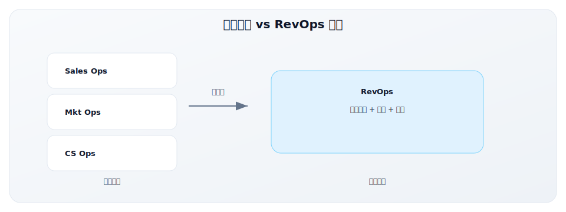

**驱动因素**：
1. **客户旅程复杂化**：从单一触点到全渠道互动，需要统一视图
2. **数据爆炸**：触点增多产生海量数据，需要整合分析
3. **效率压力**：经济下行期，企业更重视运营效率
4. **技术成熟**：CDP、集成平台等工具使数据整合成为可能

**市场趋势**：
- Gartner 预测：到 2025 年，75% 的高增长公司将部署 RevOps 模式
- LinkedIn 数据：RevOps 相关职位在 2020-2024 年增长 300%+
- 投资热度：RevOps 工具赛道持续获得资本关注

---

## RevOps 的核心职能

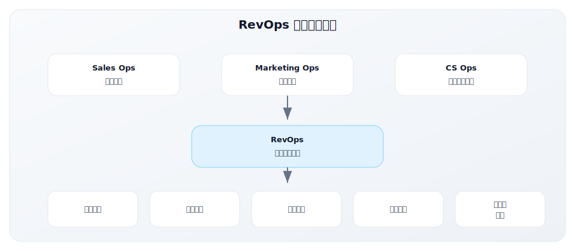

### 1. 数据整合与质量（Data Integration & Quality）

数据是 RevOps 的基石。没有高质量的统一数据，其他一切都是空中楼阁。

#### 1.1 统一数据定义

建立跨部门一致的数据字典：

| 数据对象 | 统一定义 | 常见问题 |
|---------|---------|---------|
| Lead | 表达兴趣的潜在客户，至少有联系方式 | 销售说是询价客户，市场说是下载白皮书的人 |
| MQL | 达到营销评分阈值，具备跟进价值的线索 | 各部门对"阈值"理解不同 |
| Opportunity | 有明确需求、预算、决策人的商机 | 销售为完成任务虚报商机 |
| Customer | 已签约付费的客户 | 试用用户是否算客户？ |
| ARR | 年化经常性收入，不含一次性收入 | 是否包含专业服务费？ |
| Churn | 本期流失 ARR / 期初 ARR | 分母是否扣除本期新增？ |

**实践建议**：
- 建立数据字典文档，持续维护
- 每个指标标注：定义、计算公式、数据源、负责人
- 新指标上线前需要 RevOps 审批

#### 1.2 数据清洗与治理

数据质量是持续的战斗，不是一次性项目：

**数据质量维度**：
- **完整性**：关键字段是否填写？
- **准确性**：数据是否正确？
- **一致性**：跨系统是否一致？
- **时效性**：数据是否及时更新？
- **唯一性**：是否存在重复记录？

**治理机制**：
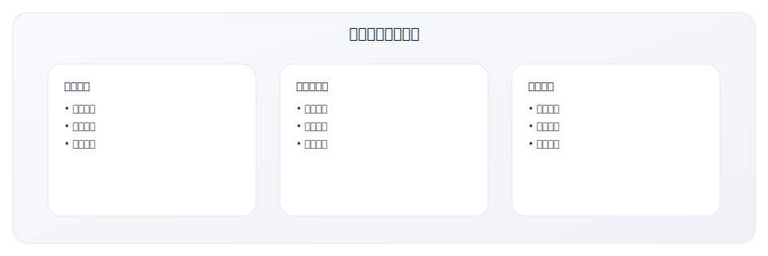

#### 1.3 Single Source of Truth（SSOT）

建立单一数据源，避免"版本之争"：

**核心原则**：
- 每个数据对象有且只有一个主数据源
- 其他系统从主数据源同步，不允许独立维护
- 当数据冲突时，以主数据源为准

**典型架构**：
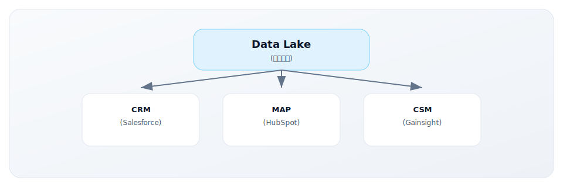

### 2. 流程设计与优化（Process Design & Optimization）

RevOps 是流程的守护者，确保收入引擎顺畅运转。

#### 2.1 端到端漏斗流程设计

设计从获客到增购的完整流程：

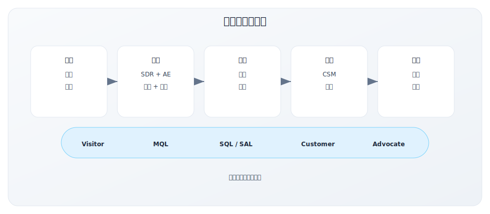

#### 2.2 交接流程设计

部门交接是漏洞高发区，需要精细设计：

**Marketing → Sales 交接**：
| 要素 | 规范 |
|-----|-----|
| 交接标准 | MQL 评分 ≥ 80，或触发高意向行为 |
| 交接方式 | 自动分配到 SDR 队列，Slack 通知 |
| 响应时效 | 5 分钟内首次触达（热线索）|
| 回退机制 | SDR 可标记"非合格"，返回 Nurture |
| 衡量指标 | MQL→SQL 转化率、平均响应时间 |

**Sales → CS 交接**：
| 要素 | 规范 |
|-----|-----|
| 交接时点 | 合同签署后 24 小时内 |
| 交接内容 | 客户背景、决策链、成功标准、风险点 |
| 交接方式 | 结构化表单 + Kickoff 会议 |
| 责任划分 | 签约后 30 天内问题由 Sales 协助，之后由 CS 主导 |
| 衡量指标 | Time-to-Value、客户满意度评分 |

#### 2.3 流程瓶颈识别与优化

定期进行流程健康检查：

**瓶颈识别方法**：
1. **漏斗分析**：哪个阶段转化率异常低？
2. **时间分析**：哪个阶段停留时间过长？
3. **容量分析**：哪个环节人力不足？
4. **异常分析**：哪些 case 走了不正常流程？

**常见瓶颈及解法**：
| 瓶颈 | 症状 | 可能原因 | 解法 |
|-----|-----|---------|-----|
| SDR 跟进不及时 | 平均响应 > 2 小时 | 线索量过大，优先级不清 | Lead Scoring 优化，自动化分配 |
| Demo 安排困难 | 商机停滞在 Demo 阶段 | AE 时间有限，客户难约 | 自动化预约工具，SE 资源池 |
| 合同审批慢 | 成交周期后段过长 | 法务资源不足，流程复杂 | 标准合同模板，并行审批 |
| 实施交付慢 | Time-to-Value 长 | 客户资源不到位，流程不清 | 客户 Onboarding Playbook |

### 3. 工具栈管理（Tech Stack Management）

GTM 技术栈是 RevOps 的重要资产，需要统一规划和管理。

#### 3.1 GTM 技术栈全景

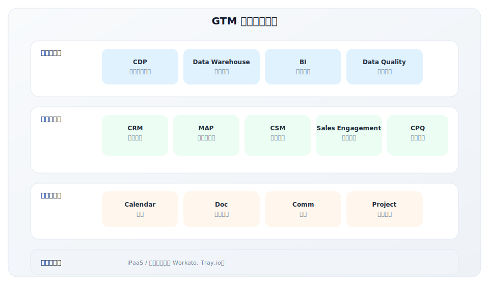

#### 3.2 工具选型原则

选型不是追新，而是选合适：

**核心原则**：

| 原则 | 说明 | 反例 |
|-----|-----|-----|
| 业务驱动 | 先有业务需求，再选工具 | "这个工具很火，我们也买一个" |
| 集成优先 | 优先选择易于集成的工具 | "功能强大但封闭的系统" |
| 简单为美 | 能用简单工具解决就不用复杂工具 | "我们 10 人团队用 Salesforce Enterprise" |
| 可扩展性 | 考虑 2-3 年的业务发展 | "现在够用就行" |
| 总成本 | 计算 TCO，不只是订阅费 | "这个便宜"（忽略实施和维护成本）|

**选型评估框架**：
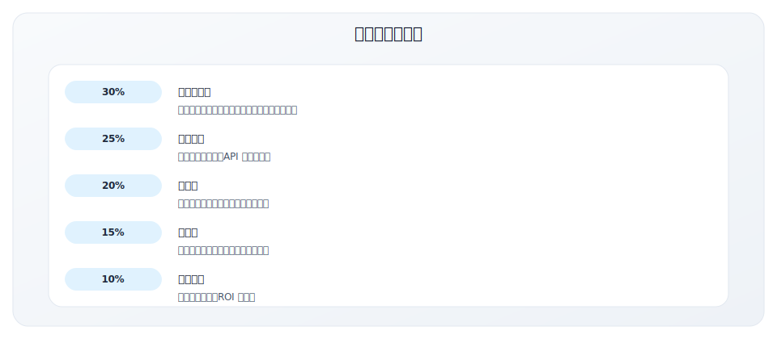

#### 3.3 系统集成最佳实践

集成是 RevOps 的核心技术能力：

**集成架构原则**：
- **Hub-and-Spoke**：以 CRM 或 CDP 为中心，其他系统同步
- **Event-Driven**：基于事件触发，而非定时批量同步
- **Master Data**：每个数据对象有唯一主数据源

**常见集成场景**：
| 集成场景 | 同步方向 | 触发方式 | 关键字段 |
|---------|---------|---------|---------|
| MAP → CRM | 单向 | Lead 达标时 | Lead 信息 + 行为评分 |
| CRM → MAP | 单向 | 商机状态变化 | 商机阶段、金额 |
| CRM → CSM | 单向 | 成交时 | 合同信息、决策链 |
| CSM → CRM | 双向 | 健康分变化 | 健康分、续约风险 |
| 全部 → DW | 单向 | 实时/小时 | 全量数据 |

### 4. 指标与报告（Metrics & Reporting）

RevOps 是指标体系的守护者，确保"一个版本的真相"。

#### 4.1 指标体系设计原则

**指标金字塔**：
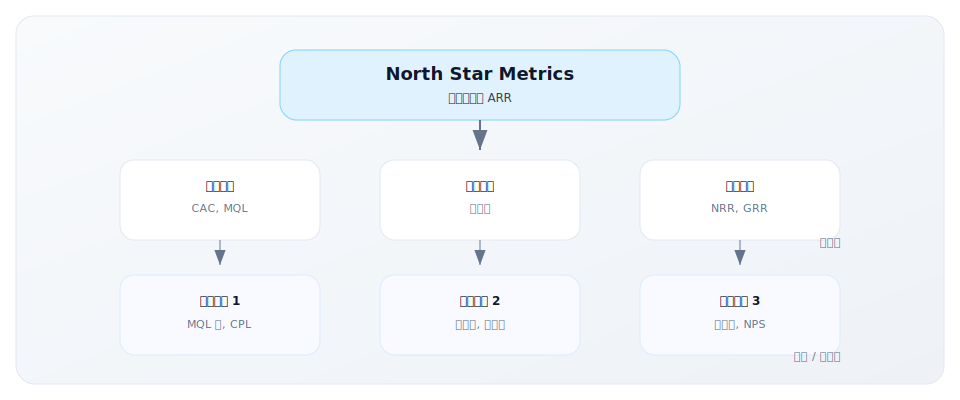

**设计原则**：
1. **可衡量**：有明确的计算公式和数据源
2. **可行动**：指标变化能指导具体行动
3. **可对齐**：下层指标能支撑上层目标
4. **适度**：不是越多越好，聚焦关键少数

#### 4.2 报告体系设计

分层报告，服务不同受众：

| 报告类型 | 受众 | 频率 | 内容重点 |
|---------|-----|-----|---------|
| Executive Dashboard | 高管层 | 实时 | ARR、增长率、效率比 |
| Department Review | 部门负责人 | 周 | 漏斗健康、目标进度 |
| Team Scorecard | 团队 Leader | 日 | 执行指标、工作队列 |
| Individual Metrics | 一线员工 | 实时 | 个人 KPI、排行榜 |

**报告设计要点**：
- **一页纸原则**：关键信息一眼可见
- **趋势优于快照**：展示变化，而非单点数据
- **异常突出**：红黄绿灯标识，问题一目了然
- **可下钻**：从汇总到明细，支持追问

#### 4.3 报告自动化

手动报告是资源浪费，应尽可能自动化：

**自动化层级**：
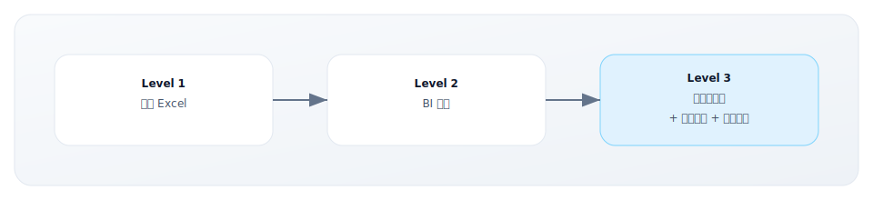

**推荐工具栈**：
- **数据仓库**：Snowflake, BigQuery, Redshift
- **ETL/ELT**：Fivetran, Airbyte, dbt
- **BI 工具**：Looker, Tableau, Metabase, Superset
- **告警**：内置告警 + Slack/Email 集成

### 5. 跨团队协调（Cross-functional Coordination）

RevOps 是跨部门的"润滑剂"，确保收入团队协同作战。

#### 5.1 定期会议机制

建立跨部门沟通的规律节奏：

| 会议 | 频率 | 参与者 | 目的 |
|-----|-----|-------|-----|
| Revenue Leadership | 周 | CRO, CMO, CCO, RevOps | 战略对齐、问题升级 |
| Funnel Review | 周 | Sales, Marketing, RevOps | 漏斗健康、交接问题 |
| Forecast Call | 周 | Sales Leadership, RevOps | 预测更新、风险识别 |
| GTM All-Hands | 月 | 全体 GTM 团队 | 业绩回顾、士气鼓舞 |
| QBR | 季 | 高管层 + GTM Leadership | 战略复盘、下季规划 |

#### 5.2 RevOps 在跨部门项目中的角色

RevOps 通常在跨部门项目中担任 PM 或 PMO 角色：

**典型项目**：
- ICP 更新项目
- Lead Scoring 模型优化
- 新产品上市 GTM 计划
- 技术栈迁移项目
- 数据质量治理项目

**RevOps 职责**：
- 协调各方资源和时间
- 确保数据和流程的一致性
- 提供分析支持和效果衡量
- 文档化和知识沉淀

---

## RevOps 带来的价值

### 量化价值

RevOps 的投资回报是可衡量的：

| 价值维度 | 改善幅度 | 数据来源 |
|---------|---------|---------|
| GTM 成本降低 | 15-30% | Boston Consulting Group, 2024 |
| 销售周期缩短 | 10-20% | Forrester Research |
| 预测准确性提升 | 20-30% | Gartner |
| 漏斗转化率提升 | 10-15% | SiriusDecisions |
| 数据质量提升 | 30-50% | 行业综合 |

**典型 ROI 案例**：

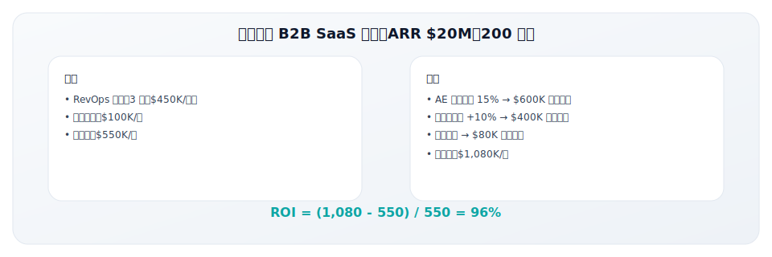

### 定性价值

除了可量化的收益，RevOps 还带来重要的定性价值：

**1. 打破部门墙**
- 建立共同语言和目标
- 减少推诿和内耗
- 形成"一个收入团队"文化

**2. 提升数据透明度**
- 从"数据是谁的"到"数据是大家的"
- 决策基于事实而非感觉
- 问题早发现、早解决

**3. 更快响应市场变化**
- 统一数据源支持快速分析
- 标准化流程支持快速调整
- 跨部门协同减少响应延迟

**4. 更好的客户体验**
- 统一客户视图，避免重复沟通
- 流程衔接顺畅，减少等待
- 数据驱动的个性化服务

---

## RevOps 组织设计

### 组织架构选项

根据公司规模和成熟度，有三种典型的组织模式：

#### 模式 1：集中式 RevOps

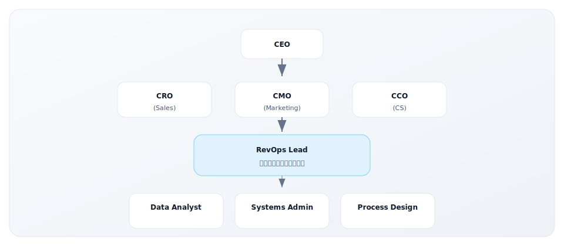

**适用场景**：
- 中大型公司（200+ 人，ARR $20M+）
- GTM 组织复杂，跨部门协调需求高
- 数据和系统整合是重点

**优点**：独立视角，避免部门利益影响
**缺点**：可能与业务脱节，响应速度较慢

#### 模式 2：嵌入式 RevOps

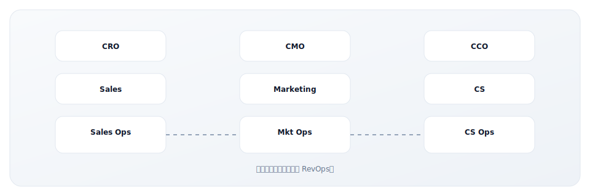

**适用场景**：
- 小型公司（< 100 人，ARR < $10M）
- 各部门运营相对独立
- 资源有限，无法设置专职团队

**优点**：贴近业务，响应快
**缺点**：易陷入部门视角，整合程度低

#### 模式 3：混合式（推荐）

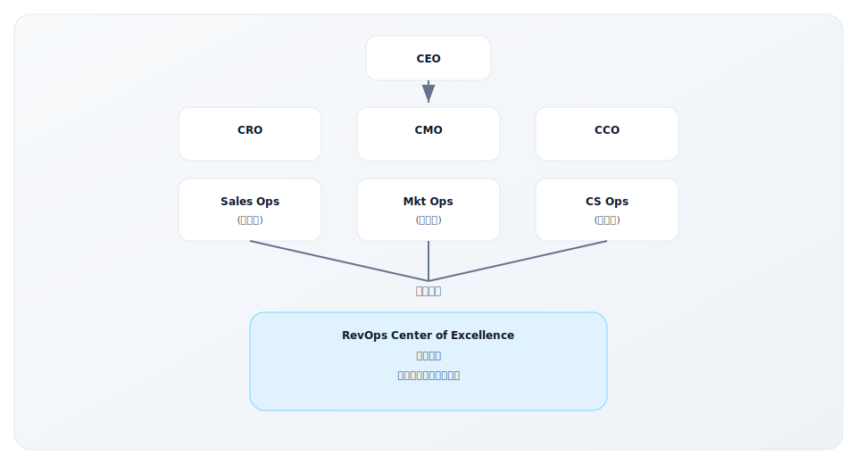

**适用场景**：
- 中型公司（100-500 人，ARR $10-50M）
- 需要平衡业务响应和整体协调
- 正在从嵌入式向集中式过渡

**优点**：兼顾贴近业务和整体视角
**缺点**：双线汇报可能带来复杂性

### 关键角色定义

| 角色 | 级别 | 核心职责 | 关键技能 |
|-----|-----|---------|---------|
| VP/Head of RevOps | 高管 | 战略规划、高管对接、团队建设 | 战略思维、跨部门影响力 |
| RevOps Manager | 经理 | 项目管理、流程设计、团队管理 | 项目管理、GTM 知识 |
| RevOps Analyst | 专员 | 数据分析、报告、洞察 | SQL、BI 工具、业务理解 |
| Systems Admin | 专员 | 工具管理、集成、自动化 | CRM/MAP 管理、集成平台 |
| Data Engineer | 专员 | 数据管道、数据质量、ETL | Python/SQL、数据工程 |

### 招聘与发展

**RevOps 人才画像**：

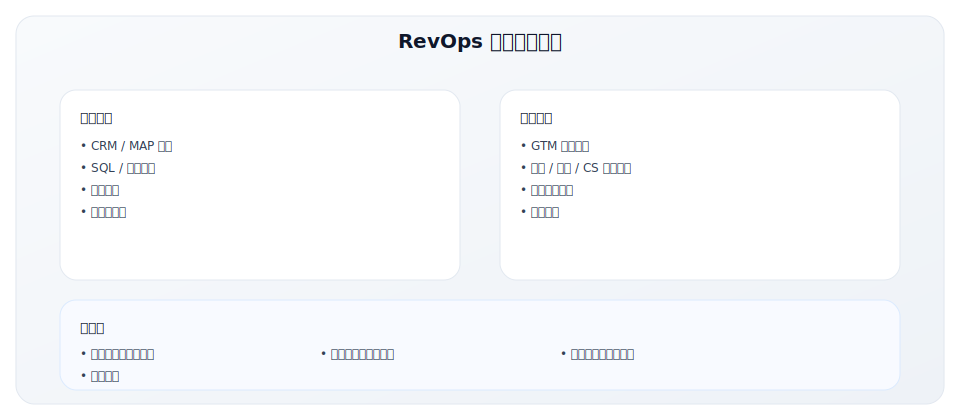

**常见背景**：
- Sales Ops / Marketing Ops 转型
- 业务分析师 / BI 分析师
- 咨询公司背景
- 技术背景 + 业务经验

---

## 美国企业 RevOps 实践

### 案例一：Stripe 的数据驱动 RevOps

Stripe 是数据驱动运营的典范，其 RevOps 实践展示了如何用数据文化驱动增长。

**Stripe RevOps 核心理念**：

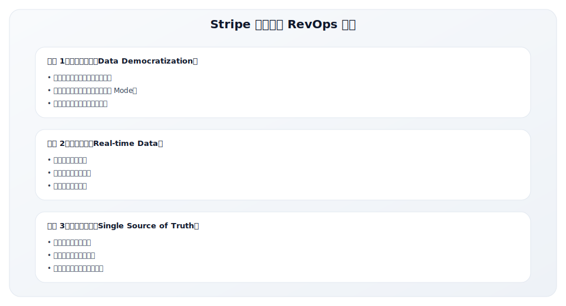

**Stripe RevOps 组织架构**：

| 职能 | 角色 | 核心职责 |
|------|------|---------|
| Strategy & Operations | VP级 | RevOps 战略规划、高管对接 |
| Revenue Analytics | 分析师团队 | 数据分析、预测建模、洞察报告 |
| Systems & Tools | 工程师团队 | CRM/工具管理、集成开发、自动化 |
| GTM Enablement | 赋能团队 | 销售培训、内容、流程文档 |
| Deal Desk | 交易支持 | 定价审批、合同支持、CPQ 管理 |

**Stripe 的关键 RevOps 实践**：

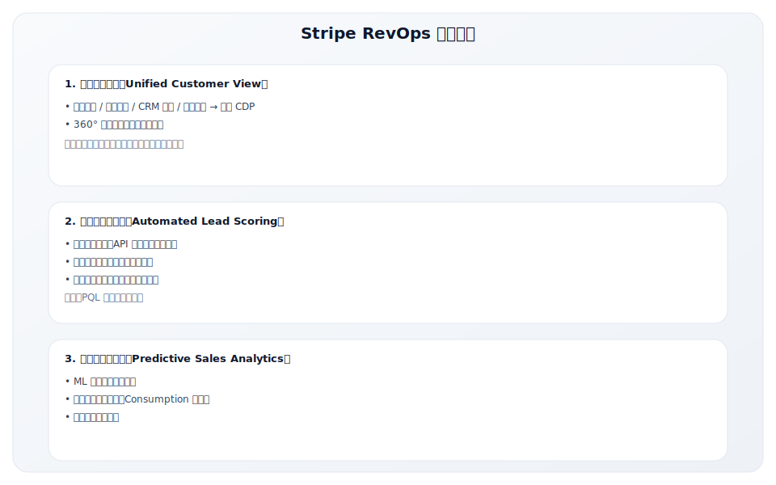

**Stripe RevOps 带来的效果**：

| 指标 | 改善 | 说明 |
|------|------|------|
| 销售人效 | +35% | 自动化释放销售时间用于高价值活动 |
| 预测准确性 | 90%+ | ML 模型提升预测精度 |
| 数据质量 | 95%+ 完整率 | 严格的数据治理 |
| 跨部门对齐 | 显著提升 | 统一数据消除争议 |

### 案例二：Notion 的 PLG RevOps 实践

Notion 作为 PLG 公司，其 RevOps 实践展示了产品驱动增长模式下的运营方法。

**PLG 公司 RevOps 的特殊性**：

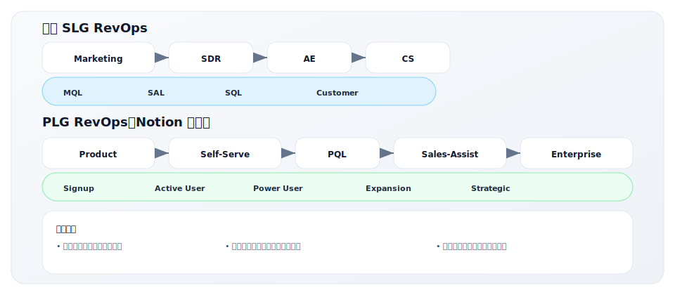

**Notion RevOps 核心职能**：

| 职能 | PLG 特色 | 传统对比 |
|------|---------|---------|
| 产品分析 | 核心职能，用户行为分析 | 通常不在 RevOps 范围 |
| PQL 定义 | 基于产品使用定义合格线索 | 基于营销行为定义 MQL |
| 自助转企业 | 设计从自助到付费的路径 | 主要靠销售驱动 |
| 扩展触发 | 基于用量增长识别扩展机会 | 基于合同周期 |
| 客户成功 | 产品内 Onboarding + 人工 | 主要人工驱动 |

**Notion 的 PQL 模型**：

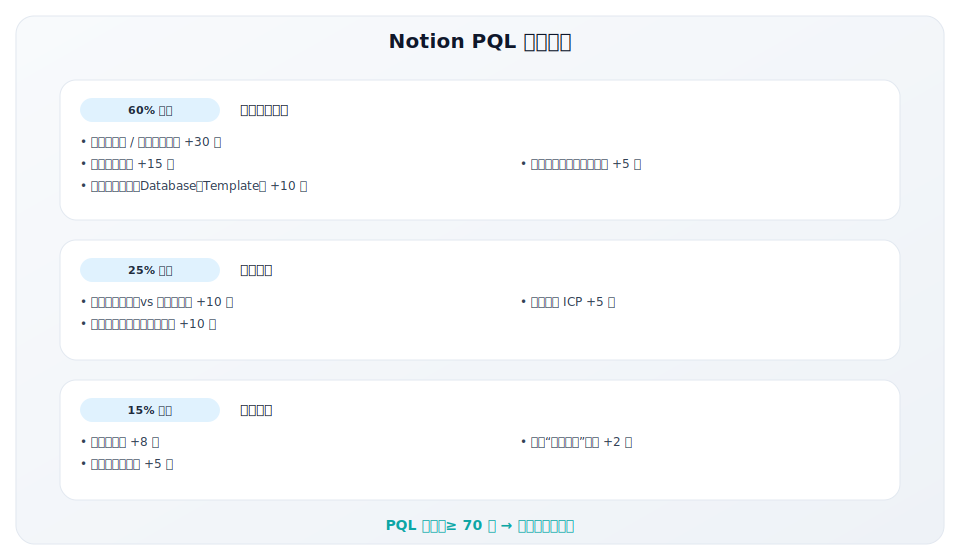

**Notion PLG RevOps 工具栈**：

| 层级 | 工具 | 用途 |
|------|------|------|
| 产品分析 | Amplitude / Mixpanel | 用户行为追踪、PQL 识别 |
| 数据仓库 | Snowflake | 统一数据存储 |
| 反向 ETL | Census / Hightouch | 产品数据同步到 CRM |
| CRM | Salesforce | 销售流程管理 |
| 自动化 | Zapier / Workato | 流程自动化 |
| BI | Looker | 报告和仪表板 |

### 案例三：HubSpot 的 RevOps 先驱实践

HubSpot 不仅推广了 Inbound Marketing，也是 RevOps 职能的先驱实践者。

**HubSpot RevOps 演进历程**：

| 阶段 | 时间 | 组织形态 | 关键变化 |
|------|------|---------|---------|
| 分散期 | 2010-2015 | Sales Ops + Marketing Ops 独立 | 各自为战 |
| 整合期 | 2016-2018 | 成立 Revenue Operations 团队 | 数据统一 |
| 成熟期 | 2019-至今 | RevOps 成为战略职能 | 驱动业务决策 |

**HubSpot RevOps 组织架构**：

**HubSpot RevOps 关键实践**：

| 实践领域 | 具体做法 | 效果 |
|---------|---------|------|
| 漏斗统一 | 营销和销售使用同一漏斗定义 | 消除归因争议 |
| Forecast | RevOps 拥有预测模型，不依赖销售输入 | 预测准确性 +25% |
| SLA | 数学化 SLA，每周自动化 Review | 对齐度显著提升 |
| 数据质量 | 自动化清洗 + 强制录入规则 | 数据完整度 95%+ |
| 报告自动化 | 100% 报告自动生成，实时仪表板 | 节省 20 小时/周 |

**HubSpot 数据驱动决策示例**：

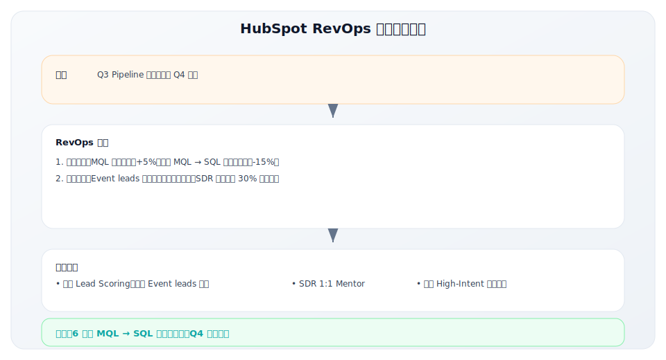

### 美国企业 RevOps 实践总结

| 公司 | RevOps 特色 | 核心启示 |
|------|-------------|---------|
| Stripe | 数据民主化 + 实时分析 | 数据文化是基础 |
| Notion | PLG RevOps + PQL 模型 | 产品数据驱动销售 |
| HubSpot | 预测驱动 + 流程标准化 | RevOps 是战略职能 |

**美国 RevOps 最佳实践通用要素**：

1. **数据为基**：统一数据仓库 + 严格数据治理 + 自助分析能力
2. **流程标准化**：端到端漏斗定义 + 清晰交接规则 + SLA 机制
3. **技术赋能**：工具深度集成 + 自动化优先 + AI/ML 增强
4. **组织保障**：独立 RevOps 职能 + 高管直接汇报 + 跨部门权限
5. **文化支撑**：数据驱动决策 + 持续优化 + 透明度

---

## 中国企业 RevOps 实践

### 中国 RevOps 现状与挑战

RevOps 在中国的发展相对滞后，但正在快速追赶：

**发展阶段对比**：

| 维度 | 美国市场 | 中国市场 |
|------|---------|---------|
| 概念普及度 | 高，已成为主流 | 中等，头部公司开始实践 |
| 专职团队 | 大多数 SaaS 公司有 | 少数头部公司有 |
| 人才供给 | 相对充足 | 稀缺 |
| 工具成熟度 | 高，选择丰富 | 中等，本土工具在发展 |
| 最佳实践 | 体系化，文档化 | 在探索中 |

**中国企业 RevOps 的主要挑战**：

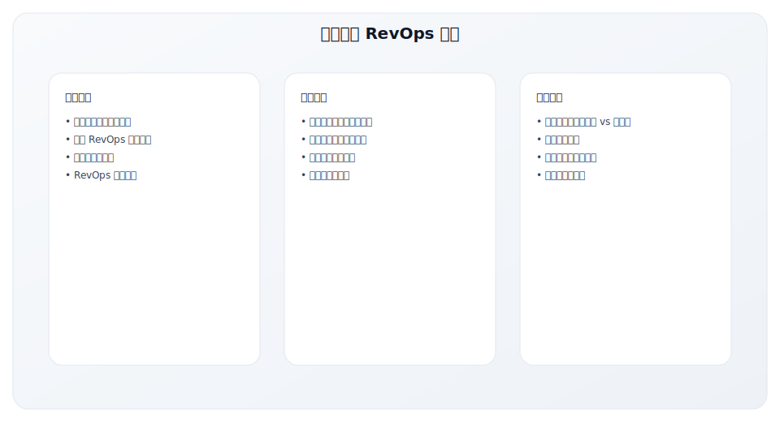

### 案例：销售易的 RevOps 实践

销售易作为中国 CRM 厂商，其内部 RevOps 实践具有参考价值：

**组织架构**：

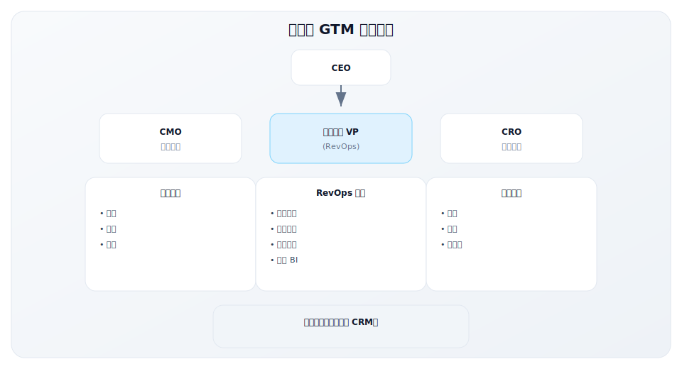

**关键实践**：

| 维度 | 实践 | 效果 |
|------|------|------|
| 数据统一 | 自家 CRM 作为 SSOT | 数据质量提升 40% |
| 流程标准化 | 统一的 L2C 流程 | 销售周期缩短 20% |
| 指标体系 | 统一的 GTM 仪表板 | 决策效率提升 |
| 跨部门协同 | 每周 Revenue Review | 对齐度明显改善 |

### 中国本土 RevOps 工具栈

**核心工具对比**：

| 类型 | 国际工具 | 本土替代 | 选型建议 |
|------|---------|---------|---------|
| CRM | Salesforce | 销售易、纷享销客 | 本土工具对中国市场更适配 |
| MAP | HubSpot, Marketo | 致趣百川、Convertlab | 需考虑微信集成能力 |
| BI | Tableau, Looker | 帆软、观远 | 本土工具性价比高 |
| 数据仓库 | Snowflake | 阿里云 MaxCompute | 合规性考量 |
| 集成平台 | Workato | 轻流、集简云 | 本土集成连接器更全 |

**推荐的中国 SaaS RevOps 工具栈**：

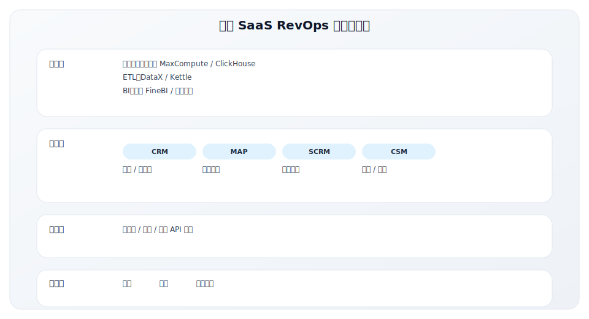

### 中国企业 RevOps 起步建议

对于刚开始 RevOps 建设的中国企业：

**90 天快速启动计划**：

| 阶段 | 重点工作 | 产出 |
|------|---------|------|
| **第 1-30 天** | 现状评估 | 成熟度评估报告、问题清单 |
| | • 评估当前数据、流程、工具状态 | |
| | • 识别关键痛点和机会 | |
| | • 对齐高管层期望 | |
| **第 31-60 天** | 基础建设 | 统一指标定义、数据字典 |
| | • 统一关键指标定义 | |
| | • 建立基础数据报表 | |
| | • 设计核心流程（L2C） | |
| **第 61-90 天** | 机制运转 | 周/月会机制、SLA 1.0 |
| | • 建立定期 Review 机制 | |
| | • 制定初版 SLA | |
| | • 启动第一个改进项目 | |

**关键成功因素**：

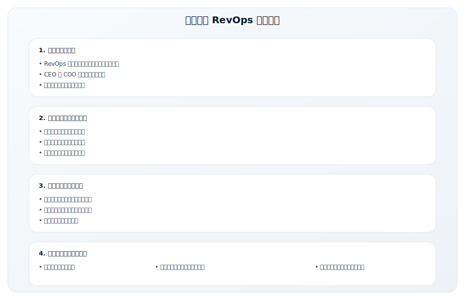

---

## RevOps 成熟度评估

评估组织的 RevOps 成熟度，制定提升路线图：

### 成熟度模型

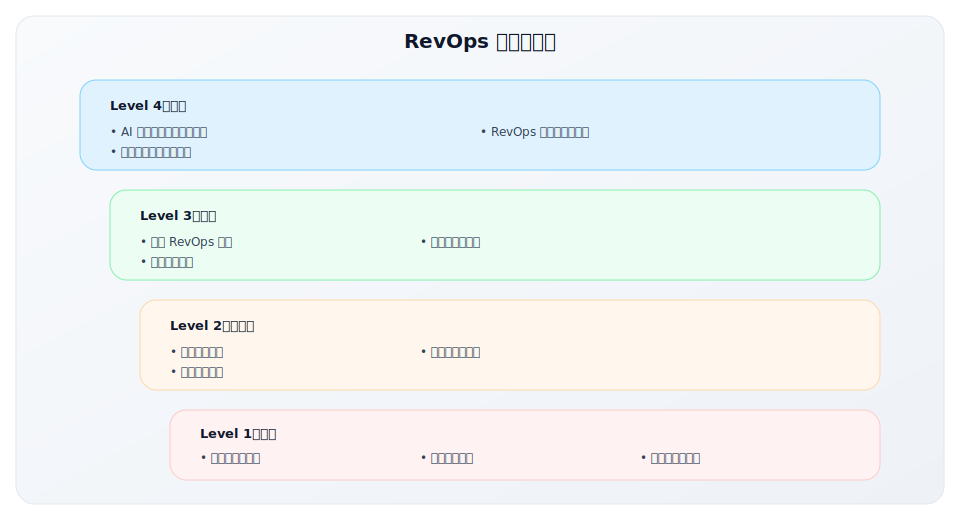

### 评估维度

对照以下维度评估当前状态：

| 维度 | Level 1 | Level 2 | Level 3 | Level 4 |
|-----|---------|---------|---------|---------|
| **组织** | 无专职运营 | 各部门有运营但独立 | 统一 RevOps 团队 | RevOps 是战略职能 |
| **数据** | 各系统独立，手动整合 | 部分系统集成 | 统一数据仓库，SSOT | 实时数据，AI 洞察 |
| **流程** | 无标准流程 | 有流程但不统一 | 端到端标准化流程 | 自适应流程优化 |
| **工具** | 各部门自选工具 | 有整合意识但执行差 | 统一规划，深度集成 | 智能工具栈 |
| **指标** | 各部门口径不一 | 开始统一定义 | 统一指标体系 | 预测性分析 |
| **协作** | 部门墙严重 | 有协作但靠关系 | 机制化协作 | 无缝协同 |

### 提升路线图

从当前状态出发，逐步提升：

**从 Level 1 到 Level 2（3-6 个月）**：
- [ ] 指定兼职的运营协调角色
- [ ] 统一关键指标定义（MQL、SQL、ARR 等）
- [ ] 实现 CRM 和 MAP 的基础集成
- [ ] 建立跨部门周会机制

**从 Level 2 到 Level 3（6-12 个月）**：
- [ ] 组建专职 RevOps 团队
- [ ] 建立数据仓库，实现 SSOT
- [ ] 设计端到端漏斗流程
- [ ] 上线统一的报告平台

**从 Level 3 到 Level 4（12-24 个月）**：
- [ ] 引入预测分析能力
- [ ] 实现流程自动化和优化
- [ ] RevOps 深度参与战略决策
- [ ] 建立持续改进机制

---

## 关键要点

- **RevOps 的本质**：打破数据、流程、组织孤岛，统一收入运营
- **五大核心职能**：数据整合、流程设计、工具管理、指标报告、跨团队协调
- **组织设计**：根据规模选择集中式、嵌入式或混合模式
- **价值体现**：可量化的效率提升 + 不可量化的协同价值
- **成熟度路径**：从孤岛到协调，从协调到统一，从统一到智能

---

## 实践练习

### 练习 1：成熟度自评

根据成熟度模型的 6 个维度，评估你的组织当前状态：

| 维度 | 当前 Level | 最大差距 |
|-----|-----------|---------|
| 组织 | | |
| 数据 | | |
| 流程 | | |
| 工具 | | |
| 指标 | | |
| 协作 | | |

### 练习 2：孤岛识别

列出你的组织中最严重的 3 个"孤岛"问题：

1. **数据孤岛**：____________________
2. **流程断点**：____________________
3. **协作障碍**：____________________

### 练习 3：90 天改进计划

基于自评结果，制定一个 90 天的 RevOps 改进计划：

| 优先级 | 行动项 | 负责人 | 预期产出 |
|-------|-------|-------|---------|
| P0 | | | |
| P1 | | | |
| P2 | | | |

---

## 延伸阅读

- [3.4 核心指标体系](./3.4-metrics)
- [3.3 销售与营销对齐](./3.3-sales-marketing-alignment)
- [2.2 GTM Motion 类型](../module-02/2.2-gtm-motions)

---

## 模块三总结

完成本模块后，你应该：
- ✅ 能够设计合理的渠道策略，选择适合的 GTM 路径
- ✅ 理解 SaaS 定价策略，掌握定价优化方法
- ✅ 实现销售与营销对齐，设计有效的 SLA
- ✅ 建立 GTM 核心指标体系，追踪关键健康指标
- ✅ 理解 RevOps 的价值，评估和提升组织成熟度

**下一步**：进入 [模块四：GTM 实战案例深度解析](../module-04/)，通过真实案例学习 GTM 实践。

---

**写作状态**：审校完成
**最后更新**：2025-12-23
**版本**：v1.1
