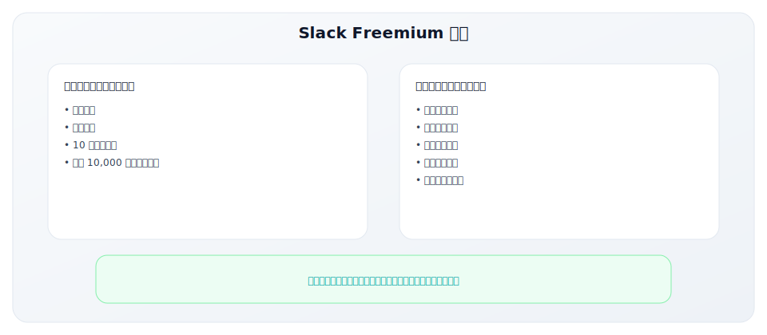
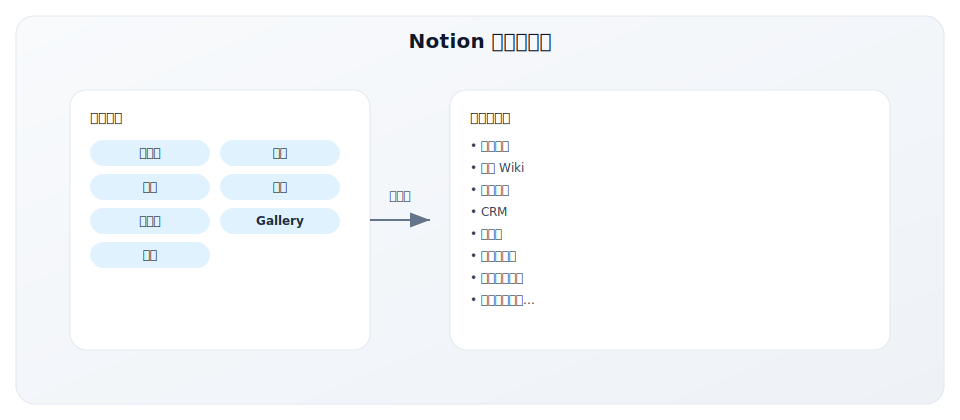
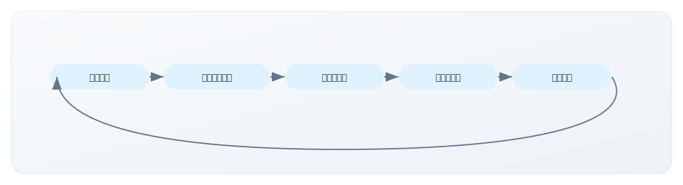
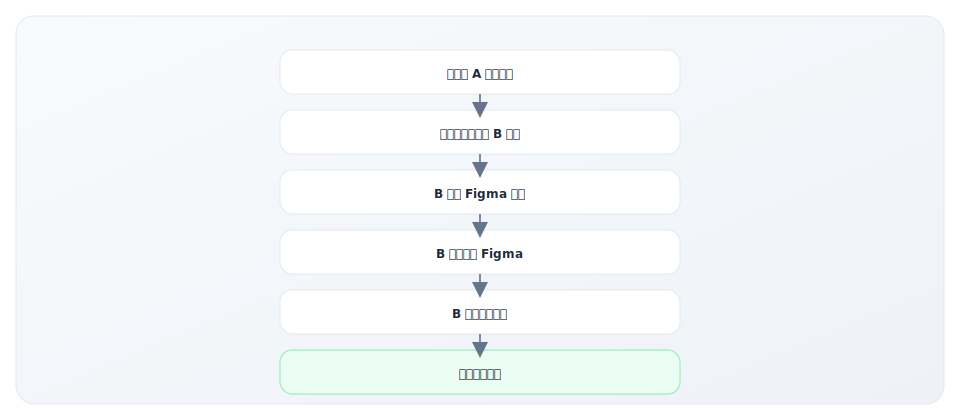
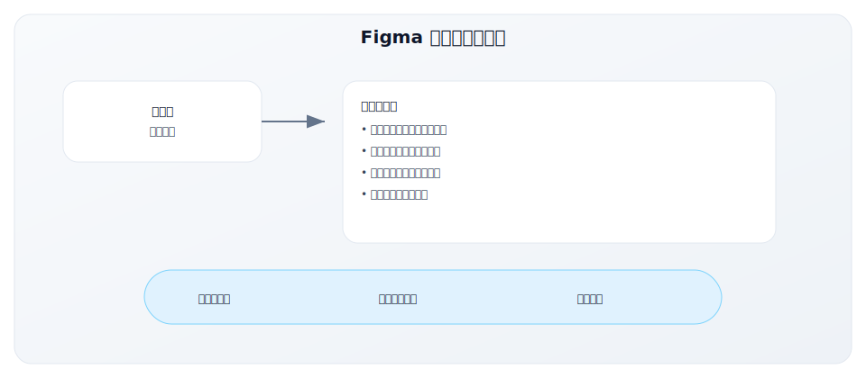
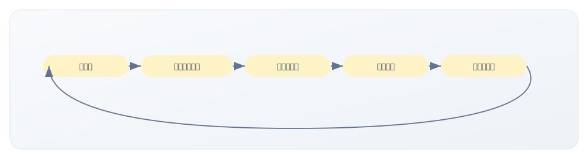
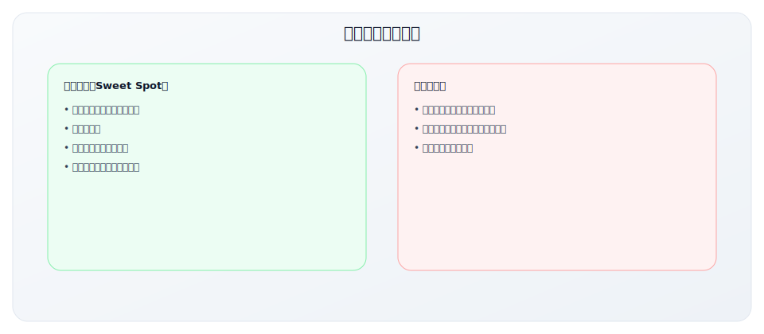
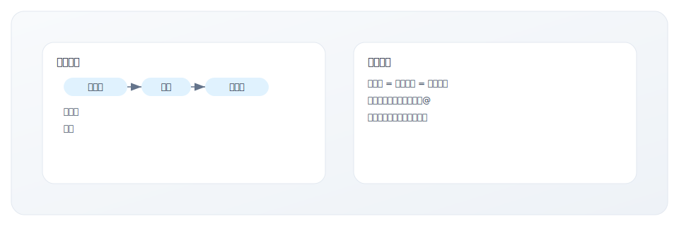
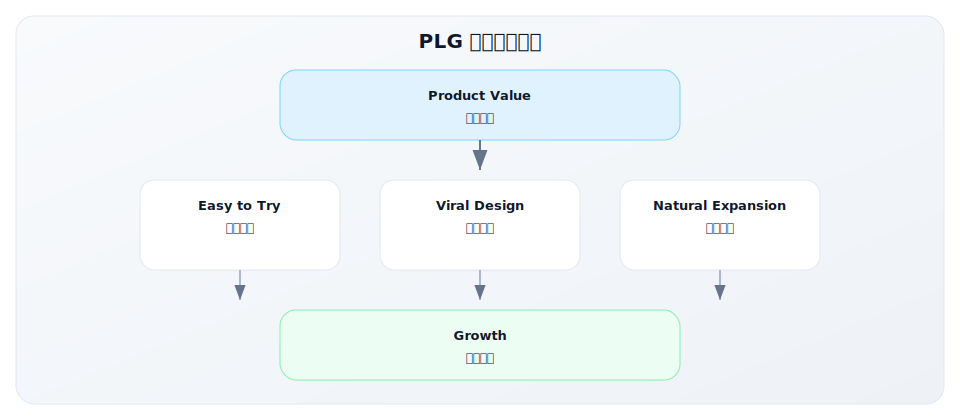

# 4.1 PLG 经典案例

> **学习目标**：深入理解 PLG 公司的 GTM 战略和增长路径
>
> **预计时长**：45 分钟
>
> **前置知识**：2.2 GTM Motion 类型

---

## 核心内容

本节覆盖以下内容：
- Slack：从0到10亿美金的 GTM 解码
- Notion：社区驱动的 PLG 典范
- Figma：网络效应驱动的协作增长
- 中国 PLG 案例：飞书的逆袭之路
- PLG 成功要素总结

## Slack：从0到10亿美金的 GTM 解码

### 背景

Slack 是 PLG 领域最具代表性的案例之一，展示了如何通过产品驱动实现爆发式增长。

**公司背景**：
- **成立时间**：2012年（由游戏公司 Tiny Speck 转型）
- **创始人**：Stewart Butterfield（Flickr 联合创始人）
- **解决的问题**：企业内部沟通碎片化（邮件、IM、工具分散）
- **核心价值**：将所有工作沟通集中在一个平台

**融资历程**：
| 轮次 | 时间 | 金额 | 估值 |
|-----|-----|-----|-----|
| Seed | 2009 | $1.5M | - |
| Series A | 2014 | $42.8M | $250M |
| Series B | 2014 | $120M | $1.12B |
| Series C | 2015 | $160M | $2.8B |
| IPO | 2019 | Direct Listing | $19B |
| 被收购 | 2021 | Salesforce $27.7B | - |

### GTM 战略选择

Slack 选择了纯粹的 PLG 路径，核心决策包括：

**1. 先验证后规模化**
- 2013年8月开始内部测试
- 花费6个月时间与早期用户深度互动
- 每一个功能反馈都直接送达创始人
- 直到产品真正解决问题才开放注册

**2. 底层架构支持病毒传播**
- 产品设计本身就包含邀请机制
- 团队协作场景天然需要拉人
- 一个人使用，必须邀请同事才能发挥价值

**3. Freemium 设计精巧**


### 核心策略深度解析

#### 策略一：渐进式 Beta 测试

Slack 的 Beta 测试策略堪称教科书级别：

**邀请制发布**：
- 2014年2月正式发布时采用邀请制
- 发布首日获得 8,000 注册用户
- 两周内达到 15,000 日活
- 通过限制供给创造稀缺性

**用户反馈闭环**：
- 创始团队直接读取所有用户反馈
- 平均每两周发布一个版本
- 用户感受到被倾听，成为传播者

**"愿意付费"验证**：
- 在规模化前验证付费意愿
- 早期就有用户主动询问如何付费
- 证明 PMF 真实存在

#### 策略二：聚焦单一价值主张

Slack 的定位非常清晰：

**核心信息**：
- "Be Less Busy"（减少忙碌）
- "Where Work Happens"（工作发生的地方）
- 一句话就能理解产品价值

**差异化定位**：


#### 策略三：病毒传播机制设计

Slack 的病毒传播是设计出来的，而非偶然：

**内置传播机制**：
1. **邀请同事**：核心功能需要协作，自然要邀请
2. **分享链接**：频道、消息可分享
3. **跨组织协作**：Slack Connect 扩展到外部
4. **品牌露出**：免费用户的消息带有 Slack 水印

**病毒系数分析**：
```
假设：
- 每个用户平均邀请 3 个同事
- 邀请接受率 50%
- 病毒系数 K = 3 × 0.5 = 1.5

意味着：
- 每获取 1 个用户，自动带来 1.5 个新用户
- 几何级数增长
```

#### 策略四：Freemium 转化优化

Slack 的免费到付费转化设计非常精巧：

**转化触发点**：
| 触发事件 | 用户感知 | 升级动机 |
|---------|---------|---------|
| 消息历史超过10,000条 | 搜索不到早期信息 | 强烈需要完整历史 |
| 需要第11个应用集成 | 无法连接更多工具 | 工作流受阻 |
| 团队扩大需要管理 | 缺少管理员控制 | 安全和管理需求 |
| 需要合规功能 | 无法满足审计要求 | 企业级需求 |

**关键洞察**：
- 免费版足够好用，让用户深度依赖
- 限制恰好卡在"用得越多越痛"的点上
- 时间是最好的转化引擎

### 关键数据

**增长里程碑**：

| 时间节点 | 关键指标 | 意义 |
|----------|----------|------|
| 2014年2月 | 发布首日 8,000 注册 | 验证初始需求 |
| 2014年8月 | 26.5万日活用户 | 6个月增长30倍+ |
| 2015年2月 | 50万日活，$12M ARR | 规模化起步 |
| 2016年4月 | 270万日活 | 进入主流市场 |
| 2019年6月 | IPO，$19B 估值 | 资本市场认可 |
| 2024年 | 75万+组织，3200万日活 | 行业标杆 |

**效率指标**：
- 第一年就达到正向 NRR（Net Revenue Retention）
- CAC Payback < 12 个月
- 主要增长来自有机渠道（Organic）

### GTM Lesson

**Lesson 1：产品是最好的增长引擎**
- Slack 的增长主要靠产品本身，而非销售团队
- 好产品自己会说话，用户会主动传播
- 早期投入应该在产品，而非营销

**Lesson 2：验证 PMF 后再规模化**
- 6个月的 Beta 测试确保产品真正解决问题
- 规模化之前确认用户愿意付费
- 耐心是最大的竞争优势

**Lesson 3：让时间成为转化助手**
- Freemium 限制设计让使用时间越长，升级动机越强
- 不急于转化，让用户自然成熟
- 长期用户价值远超短期转化收入

**Lesson 4：病毒传播要设计进产品**
- 协作场景天然具备病毒基因
- 邀请机制要简单顺畅
- 让传播成为使用产品的自然结果

---

## Notion：社区驱动的 PLG 典范

### 背景

Notion 代表了另一种 PLG 路径：通过极致的产品灵活性和社区运营实现增长。

**公司背景**：
- **成立时间**：2016年（重新发布）
- **创始人**：Ivan Zhao、Simon Last
- **定位**：All-in-one 工作空间工具
- **特点**：高度灵活、模块化设计，用户可以构建任何工作流

**独特之处**：
- 早期几乎没有销售团队
- 增长主要靠口碑和社区
- 用户自发创建模板和教程

**融资历程**：
| 轮次 | 时间 | 金额 | 估值 |
|-----|-----|-----|-----|
| Seed | 2016 | $2M | - |
| Series A | 2019 | $10M | - |
| Series B | 2020 | $50M | $2B |
| Series C | 2021 | $275M | $10B |
| 2024估值 | - | - | $10B+ |

### GTM 战略选择

Notion 的 GTM 战略有几个独特之处：

**1. 产品即平台**
- Notion 不只是一个工具，而是一个可组装的平台
- 用户可以构建笔记、Wiki、项目管理、CRM 等任何系统
- 灵活性带来多样化用例，扩大目标市场

**2. UGC（用户生成内容）驱动增长**
- 用户创建模板并分享
- YouTube、Twitter 上大量用户自发教程
- 社区创造的内容远超官方产出

**3. 极简的组织架构**
- 长期保持小团队
- 2020年估值 $2B 时只有约50人
- 产品和工程为核心，销售几乎为零

### 核心策略深度解析

#### 策略一：高度灵活性满足多元需求

Notion 的产品哲学是"乐高积木"：

**模块化设计**：


**多用例覆盖的好处**：
- 一个产品满足多种需求
- 用户从一个用例开始，逐渐扩展
- 不同用户看到不同的价值

#### 策略二：模板市场 + Ambassador 计划

Notion 的社区策略是其增长的核心引擎：

**模板市场**：
- 用户可以创建和分享模板
- 优质模板创作者可以变现
- 形成创作者经济

**Ambassador 计划**：
| 角色 | 人数 | 职责 | 激励 |
|-----|-----|-----|-----|
| Notion Ambassador | 数百人 | 组织本地活动、创作内容 | 早期功能、官方认证 |
| Notion Consultant | 数百人 | 提供 Notion 咨询服务 | 官方推荐、培训资源 |
| Template Creator | 数千人 | 创建和销售模板 | 收入分成 |

**社区飞轮**：


#### 策略三：Product Hunt 两次 #1

Notion 善于利用产品社区：

**2016年首次发布**：
- Product Hunt 当日 #1
- 获得技术早期采用者关注
- 建立初始用户基础

**2018年重新发布（2.0版本）**：
- 再次获得 Product Hunt #1
- 证明产品持续进化
- 扩大影响力

**产品社区策略**：
- 在 Hacker News、Reddit、Twitter 活跃
- 创始人亲自参与讨论
- 技术社区口碑带动增长

#### 策略四：本地化社区运营

Notion 的全球化策略独特之处在于社区先行：

**日本市场案例**：
- 日本成为第二大市场
- 依靠本地 Ambassador 而非本地团队
- 用户自发翻译产品和内容

**社区本地化模式**：


### 关键数据

**增长轨迹**：

| 指标 | 数据 | 备注 |
|------|------|------|
| 用户数 | 3500万+（2024） | 主要有机增长 |
| 团队用户 | 数百万团队 | 从个人到团队扩展 |
| ARR | $500M+（2024 预估） | 持续加速增长 |
| 模板数量 | 数十万 | 用户生成 |
| Ambassador | 数百人（全球） | 社区核心 |

**效率指标**：
- 人效极高：早期50人团队做到 $2B 估值
- CAC 极低：主要靠有机和社区
- Virality 强：用户主动分享和推荐

### GTM Lesson

**Lesson 1：用户生成内容（UGC）放大网络效应**
- 用户创造的内容比公司创造的更可信
- 模板市场形成内容飞轮
- 让用户成为产品的"联合开发者"

**Lesson 2：社区是最可持续的增长引擎**
- Ambassador 计划降低获客成本
- 社区提供免费的市场教育
- 社区是产品的护城河

**Lesson 3：产品灵活性可以扩大 TAM**
- 一个产品覆盖多个品类
- 不同用户看到不同价值
- 灵活性带来更大的市场机会

**Lesson 4：小团队可以撬动大市场**
- 产品和社区驱动，而非人力驱动
- 高效的组织比大团队更有优势
- 专注做好产品，让用户帮你推广

---

## Figma：网络效应驱动的协作增长

### 背景

Figma 是设计工具领域的颠覆者，通过云端协作彻底改变了设计师的工作方式。

**公司背景**：
- **成立时间**：2012年
- **创始人**：Dylan Field、Evan Wallace
- **定位**：基于浏览器的协作设计工具
- **解决的问题**：设计师协作效率低下、文件版本混乱

**颠覆性创新**：
- 打破 Adobe 垄断（特别是 Sketch）
- 将设计从桌面软件迁移到浏览器
- 实时协作改变设计工作流

**融资与收购**：
| 时间 | 事件 | 金额/估值 |
|-----|-----|---------|
| 2013 | Series A | $3.8M |
| 2015 | Series B | $14M |
| 2018 | Series C | $25M |
| 2019 | Series D | $40M |
| 2021 | Series E | $200M，估值 $10B |
| 2022 | Adobe 拟收购 | $20B |
| 2023 | 收购取消 | 反垄断审查未通过 |

### GTM 战略选择

Figma 的 GTM 策略围绕"协作"这个核心展开：

**1. 浏览器优先**
- 无需下载安装
- 任何人都可以立即访问
- 降低了使用门槛

**2. 协作是核心功能**
- 实时多人编辑
- 评论和反馈内置
- 分享一个链接即可协作

**3. 从设计师扩展到整个团队**
- 设计师是入口
- 产品经理、开发者、领导都需要参与
- 一个设计师可以带来一个团队

### 核心策略深度解析

#### 策略一：设计师群体的底层社交传播

Figma 精准定位设计师社区：

**设计师的社交属性**：
- 设计师群体社交活跃（Dribbble、Twitter、社群）
- 设计师喜欢分享工具和技巧
- 好工具在设计圈传播极快

**设计文件即传播载体**：


**设计评审场景**：
- 传统方式：导出图片、发邮件、等反馈
- Figma 方式：分享链接、实时评论、同步修改
- 体验差距创造转化动力

#### 策略二：跨团队协作创造组织内病毒效应

Figma 的网络效应设计非常巧妙：

**从一个用户到整个团队**：


**关键洞察**：
- 设计是跨职能协作的环节
- 分享功能让非设计师也要用 Figma
- 每个设计师都是增长引擎

#### 策略三：免费层足够强大建立习惯

Figma 的 Freemium 策略：

**免费版核心功能**：
| 功能 | 免费版 | 付费版 |
|-----|-------|-------|
| 设计文件 | 3个 | 无限 |
| 协作者 | 无限（查看） | 无限（编辑） |
| 版本历史 | 30天 | 无限 |
| 团队库 | - | ✓ |
| 高级权限 | - | ✓ |

**设计原则**：
- 免费版功能完整，不是残废版
- 限制点在"规模"而非"核心功能"
- 用户习惯形成后自然需要更多

#### 策略四：插件生态和社区

Figma 构建了强大的生态系统：

**插件市场**：
- 社区开发数千个插件
- 图标库、设计系统、自动化工具
- 增加产品粘性和完整性

**社区资源**：
- Figma Community：免费设计资源
- 模板、UI Kit、设计系统
- 用户分享 → 吸引新用户

**生态飞轮**：


### 关键数据

**增长轨迹**：

| 时间 | 里程碑 | 意义 |
|-----|-------|-----|
| 2016 | 公开发布 | 市场验证 |
| 2017 | 100万用户 | 规模化开始 |
| 2020 | 400万用户 | 疫情加速远程协作 |
| 2021 | $400M ARR，估值 $10B | 独角兽确认 |
| 2022 | Adobe 报价 $20B | 价值认可 |
| 2024 | 主导设计工具市场 | 行业标杆 |

**效率指标**：
- 高 NRR（Net Revenue Retention）：用户自然扩展
- 低 CAC：主要靠产品驱动
- 强网络效应：一个用户带来多个用户

### GTM Lesson

**Lesson 1：协作场景天然具备病毒基因**
- 设计需要协作，协作需要分享
- 产品设计要让分享成为自然动作
- 协作软件的增长曲线可以更陡

**Lesson 2：从单个用户渗透到整个组织**
- 设计师是入口，但不是终点
- 产品价值要能辐射到周边角色
- 组织内扩散是 PLG 的重要增长路径

**Lesson 3：生态建设增强护城河**
- 插件和社区增加产品粘性
- 用户投入越多，迁移成本越高
- 生态是长期竞争优势

**Lesson 4：体验差异化是颠覆的关键**
- 比 Sketch 更易协作，比 Adobe 更轻量
- 抓住主流产品的体验痛点
- 新一代用户习惯决定新的机会

---

## 中国 PLG 案例：飞书的逆袭之路

### 背景

飞书是字节跳动旗下的企业协作平台，在钉钉和企业微信主导的中国市场中走出了差异化的 PLG 路径。

**公司背景**：
- **孵化时间**：2017年（字节内部工具）
- **公开发布**：2019年
- **母公司**：字节跳动
- **定位**：新一代企业协作与管理平台
- **特点**：从内部工具到外部产品的典型路径

**市场环境**：

| 维度 | 竞争格局 |
|------|---------|
| 市场领先者 | 钉钉（阿里）、企业微信（腾讯） |
| 市场渗透率 | 钉钉超6亿用户，企业微信超5亿 |
| 飞书入场时机 | 后发者，2019年才公开 |
| 核心挑战 | 如何在巨头夹缝中生存 |

### GTM 战略选择

飞书选择了与钉钉截然不同的 GTM 路径：

**1. PLG 而非 MLG/SLG**

| 维度 | 钉钉策略 | 飞书策略 |
|------|---------|---------|
| 获客方式 | 地推、补贴、政企关系 | 产品驱动、口碑传播 |
| 目标客户 | 广覆盖，中小企业为主 | 聚焦互联网、新经济公司 |
| 核心卖点 | 考勤、审批、管理工具 | 协作、效率、先进工作方式 |
| 增长模式 | 规模优先 | 质量优先 |

**2. 聚焦高价值客户**



**3. 产品差异化定位**

飞书的核心差异化：

| 维度 | 飞书特点 | 竞品对比 |
|------|---------|---------|
| 产品理念 | 协作优先、信息透明 | 管理优先、流程控制 |
| 核心场景 | 文档协作、视频会议、OKR | 考勤、审批、打卡 |
| 用户体验 | 接近消费级产品 | 功能完善但体验一般 |
| 目标用户 | 知识工作者 | 全员覆盖 |

### 核心策略解析

#### 策略一：内部工具外部化

飞书最大的优势是源自字节跳动内部：

**字节内部验证**：
- 2017年作为内部协作工具开发
- 支撑字节跳动从几千人到10万+人的扩张
- 在高速增长的组织中得到验证
- 产品功能来自真实业务场景

**"吃自己的狗粮"价值**：
- 产品经理就是用户
- 功能迭代极快
- 可以讲真实的内部故事
- "字节跳动都在用"的背书

#### 策略二：产品创新建立差异化

飞书的产品创新：

**文档 + 协作一体化**：


**会议 + 文档联动**：
- 日历创建会议 → 自动生成会议文档
- 会议中实时记录 → 会后自动共享
- 任务自动同步到飞书多维表格

**OKR 工具**：
- 内置 OKR 管理功能
- 与日常工作无缝集成
- 传播"先进管理理念"

#### 策略三：社区和内容营销

飞书的增长很大程度依靠内容和社区：

**内容营销策略**：
| 内容类型 | 目的 | 代表作 |
|---------|------|-------|
| 方法论输出 | 建立思想领导力 | 《飞书管理百科》 |
| 客户案例 | 展示价值证明 | 元气森林、泡泡玛特案例 |
| 行业洞察 | 吸引目标客户 | 新消费品牌数字化 |
| 产品教程 | 降低使用门槛 | 飞书学院 |

**标杆客户策略**：
- 深度服务新消费品牌（元气森林、泡泡玛特、三顿半）
- 这些品牌的创始人/高管活跃在社交媒体
- 他们的推荐比广告更有说服力
- 形成"先进公司都用飞书"的认知

#### 策略四：PLG + PLS 混合模式

飞书的增长模式逐渐演变：

**早期（2019-2020）**：纯 PLG
- 产品口碑传播
- 免费版吸引用户
- 几乎没有销售团队

**成长期（2021-2022）**：PLG + PLS
- 建立销售团队服务大客户
- 产品驱动获客 + 销售驱动扩展
- 中大型客户需要销售支持

**现阶段（2023-至今）**：全面 GTM
- PLG：产品口碑持续获客
- PLS：销售支持中大客户
- MLG：增强品牌和内容营销
- 生态：ISV 合作、开放平台

### 关键数据与挑战

**增长里程碑**：

| 时间 | 里程碑 | 意义 |
|------|-------|------|
| 2019 | 公开发布 | 进入市场 |
| 2020 | 疫情期间快速增长 | 远程协作需求爆发 |
| 2021 | 服务企业数突破 | 规模化验证 |
| 2022 | 大客户占比提升 | 商业化进展 |
| 2023 | 出海（Lark） | 国际化探索 |

**面临的挑战**：

| 挑战 | 具体表现 | 应对策略 |
|------|---------|---------|
| 市场份额 | 仍远低于钉钉、企业微信 | 聚焦高价值客户 |
| 盈利压力 | 字节对商业化要求提高 | 提升付费转化 |
| 产品复杂度 | 功能越来越多，学习成本上升 | 简化上手体验 |
| 竞争加剧 | 钉钉、企业微信持续升级 | 保持创新速度 |

### GTM Lesson

**Lesson 1：后发者需要差异化定位**
- 不与巨头正面竞争
- 找到被忽视的客户群体
- 用产品理念而非功能数量取胜

**Lesson 2："内部工具外部化"是有效路径**
- 内部验证降低失败风险
- 自己是用户，产品更接地气
- 真实案例是最好的营销

**Lesson 3：PLG 在中国需要调整**
- 纯 PLG 在中国市场天花板较低
- 大客户仍需要销售支持
- PLG + PLS 混合模式更适合

**Lesson 4：高价值客户可以撬动市场认知**
- 少量标杆客户胜过大量普通用户
- 创始人/高管的推荐很有价值
- "先进公司都在用"是强大的认知

---

## PLG 成功要素总结

### 四家公司对比（含中国案例）

| 维度 | Slack | Notion | Figma | 飞书 |
|-----|-------|--------|-------|------|
| **核心价值** | 团队沟通 | All-in-one 工作空间 | 协作设计 | 企业协作+管理 |
| **病毒机制** | 邀请同事 | 分享模板 | 分享设计文件 | 文档协作+会议 |
| **网络效应** | 团队内部 | 社区 | 跨职能协作 | 组织内扩散 |
| **Freemium 限制** | 消息历史 | 文件数量 | 项目数量 | 高级功能 |
| **社区策略** | 应用生态 | Ambassador + UGC | 插件 + 设计资源 | 内容营销+标杆客户 |
| **扩展路径** | 团队 → 企业 | 个人 → 团队 | 设计师 → 全团队 | PLG → PLS |
| **市场地位** | 行业标杆 | 高速增长 | 设计工具领导者 | 后发差异化竞争者 |

### 共同成功要素



**1. 产品价值清晰可感知**
- 用户可以快速理解产品价值
- Time to Value 短
- 不需要销售解释

**2. 易于开始使用**
- 免费试用、无需付费承诺
- 自助上手、无需培训
- 快速体验核心价值

**3. 病毒机制内置**
- 使用产品的过程就是传播
- 邀请、分享是自然动作
- 病毒系数 K > 1

**4. 自然扩展路径**
- 从个人到团队
- 从团队到组织
- 从免费到付费

### 关键成功因素评估

| 因素 | 说明 | 评估问题 |
|------|------|---------|
| **Time to Value** | 用户多快能感知价值 | 用户注册后多久能体验核心价值？ |
| **Viral Coefficient** | 病毒系数是否 > 1 | 每个用户平均带来多少新用户？ |
| **Natural Expansion** | 是否有自然扩展路径 | 用户如何从免费升级到付费？ |
| **Product Stickiness** | 产品粘性是否足够 | 用户是否会持续使用？迁移成本高吗？ |
| **Freemium Balance** | 免费版是否平衡 | 免费版够用吗？升级动机够强吗？ |

---

## 关键要点

- **产品是增长引擎**：PLG 的核心是让产品自己说话，减少对销售的依赖
- **病毒传播要设计**：邀请、分享、协作等机制需要刻意设计进产品
- **Freemium 设计精巧**：功能边界要让用户用得爽，同时创造升级动机
- **社区和生态是放大器**：用户生成内容、插件生态可以显著放大 PLG 效果
- **耐心是竞争优势**：先验证 PMF，再规模化，让时间成为你的朋友

---

## 实践练习

### 练习 1：PLG 适用性评估

评估你的产品是否适合 PLG，打分（1-5）：

| 维度 | 你的评分 | 说明 |
|-----|---------|-----|
| 价值可快速体验 | | 用户能否在几分钟内感知价值？ |
| 可自助上手 | | 用户能否不需要培训就开始使用？ |
| 有天然传播场景 | | 使用产品是否自然需要邀请他人？ |
| 可设计 Freemium | | 能否设计合理的免费/付费边界？ |
| 目标用户活跃度 | | 目标用户是否活跃在社交平台？ |

**评分解读**：
- 20-25分：非常适合 PLG
- 15-19分：可以尝试 PLG
- 10-14分：PLG 难度较高
- < 10分：建议考虑 SLG

### 练习 2：病毒传播机制设计

为你的产品设计一个病毒传播机制：

1. **传播触发点**：用户在什么场景下会邀请他人？
   - _________________________________

2. **传播路径**：如何让邀请变得简单？
   - _________________________________

3. **激励机制**：如何激励用户邀请？（内在/外在）
   - _________________________________

4. **病毒系数估算**：预计每个用户能带来多少新用户？
   - _________________________________

### 练习 3：Freemium 边界设计

设计你的产品的 Freemium 功能边界：

| 维度 | 免费版 | 付费版 |
|-----|-------|-------|
| 核心功能 | | |
| 用量限制 | | |
| 协作功能 | | |
| 高级功能 | | |

**设计检查**：
- [ ] 免费版是否足够好用，能让用户形成习惯？
- [ ] 限制点是否卡在"用得越多越痛"的位置？
- [ ] 升级是否顺畅，没有障碍？

---

## 延伸阅读

- [2.2 GTM Motion 类型](../module-02/2.2-gtm-motions)
- [3.4 核心指标体系](../module-03/3.4-metrics)
- [2.3 ICP 构建方法论](../module-02/2.3-icp-methodology)

---

**写作状态**：审校完成
**最后更新**：2025-12-23
**版本**：v1.1
