# 4.2 SLG 经典案例

> **学习目标**：学习 SLG 公司如何攻占企业市场
>
> **预计时长**：30 分钟
>
> **前置知识**：2.2 GTM Motion 类型

---

## 核心内容

本节覆盖以下内容：
- Salesforce：SaaS 销售驱动的奠基者
- Workday：高端企业市场攻占
- ServiceNow：IT 服务管理到平台化
- 中国 SLG 案例：北森的企业级 HR SaaS 之路
- SLG 成功要素总结

## Salesforce：SaaS 销售驱动的奠基者

### 背景

Salesforce 不仅是 SLG 的典范，更是整个 SaaS 行业的奠基者。它定义了云软件的商业模式，也定义了企业级销售的方法论。

**公司背景**：
- **成立时间**：1999年
- **创始人**：Marc Benioff（前 Oracle 高管）
- **开创性意义**：定义了 SaaS 商业模式
- **口号**："No Software"（终结软件安装时代）

**创始背景**：
- Marc Benioff 在 Oracle 工作13年，看到传统软件的痛点
- 受到 Amazon 等互联网公司启发
- 愿景：让企业软件像网站一样简单易用

**发展里程碑**：
| 时间 | 里程碑 | 意义 |
|-----|-------|-----|
| 1999 | 公司成立 | SaaS 先驱诞生 |
| 2000 | 首个产品发布 | 云端 CRM 概念验证 |
| 2003 | 推出 AppExchange 前身 | 平台化布局 |
| 2004 | IPO | 市值 $1.1B |
| 2006 | AppExchange 正式发布 | 生态系统建立 |
| 2009 | 首次 Dreamforce | 品牌活动开创 |
| 2020 | 收购 Slack | $27.7B |
| 2024 | 年收入 $34B+ | 企业软件巨头 |

### GTM 战略选择

Salesforce 的 GTM 战略是典型的企业级销售驱动（SLG），但具有独特的创新：

**1. 颠覆性定位："No Software"**
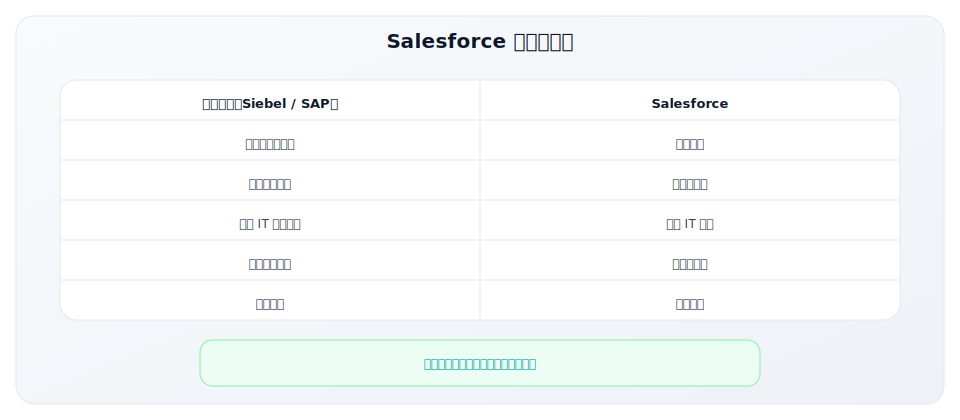

**2. 从中小企业切入，逐步上攻**
- 早期瞄准被 Siebel 忽视的中小企业
- 低价格、快速部署吸引 SMB
- 积累客户后向大企业扩展

**3. 销售+生态双轮驱动**
- 专业销售团队攻克大客户
- AppExchange 生态增加粘性
- 合作伙伴扩大覆盖范围

### 核心策略深度解析

#### 策略一：企业级直销团队建设

Salesforce 的销售组织是其核心竞争力：

**销售组织架构**：
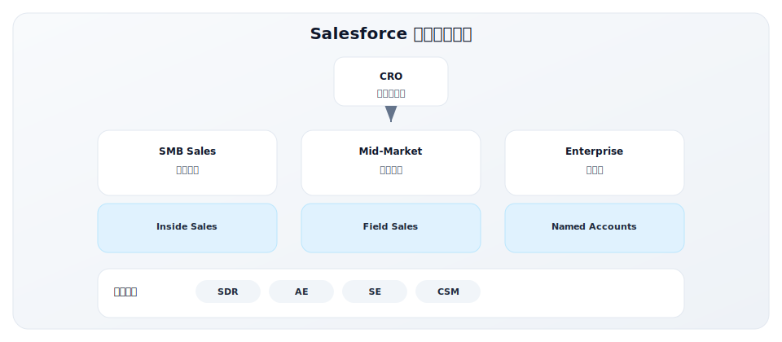

**销售方法论**：
| 方法 | 说明 | 应用场景 |
|-----|-----|---------|
| MEDDIC | 衡量商机质量 | 复杂销售资格审查 |
| Challenger Sale | 挑战式销售 | 教育客户、创造需求 |
| Solution Selling | 解决方案销售 | 顾问式咨询 |
| Value Selling | 价值销售 | ROI 导向 |

**销售工具化**：
- 用自己的产品（Salesforce CRM）管理销售流程
- 数据驱动的销售管理
- 每个销售行为都被追踪和优化

#### 策略二：生态系统建设（AppExchange）

AppExchange 是 Salesforce 的重要护城河：

**生态系统架构**：
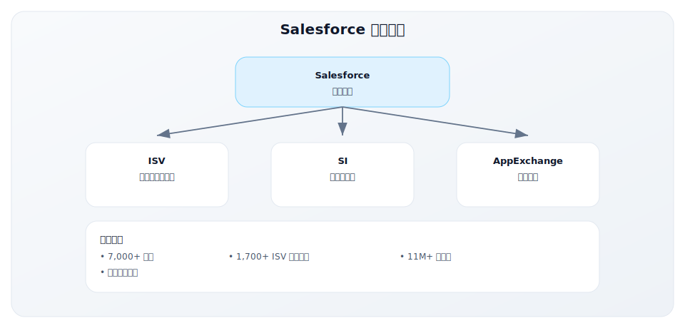

**生态的战略价值**：
1. **增加粘性**：客户使用越多应用，迁移成本越高
2. **扩大功能**：合作伙伴填补功能空白
3. **分销渠道**：SI 帮助拓展客户
4. **品牌强化**：生态繁荣证明平台价值

#### 策略三：Dreamforce 活动营销

Dreamforce 是 B2B 活动营销的标杆：

**Dreamforce 概况**：
| 维度 | 数据 |
|-----|-----|
| 首次举办 | 2003年（小规模） |
| 2024年规模 | 40,000+ 现场参与者 |
| 在线参与 | 数百万 |
| 会议数量 | 2,700+ |
| 合作伙伴展位 | 400+ |

**Dreamforce 的 GTM 价值**：

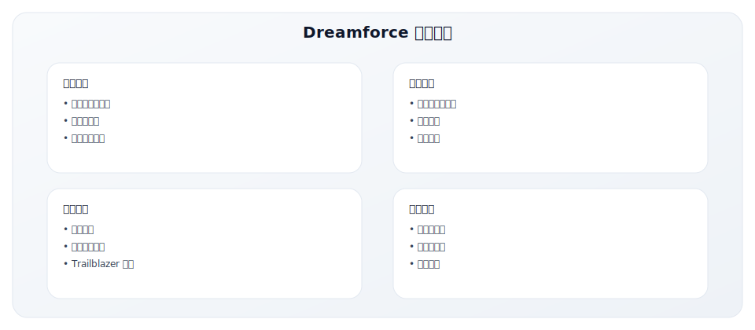

**为什么要做大型活动？**
- 企业级销售是关系驱动的
- 大型活动创造"峰值体验"
- 客户看到其他客户的成功
- 形成品牌势能

#### 策略四：客户成功先驱

Salesforce 是"客户成功"概念的发明者之一：

**客户成功的诞生**：
- 2005年左右，Salesforce 发现客户流失问题
- 成立专门团队关注客户使用情况
- 从"销售完成"到"客户成功"的理念转变

**客户成功体系**：
| 层级 | 服务内容 | 适用客户 |
|-----|---------|---------|
| Basic | 自助支持、社区 | 小客户 |
| Premier | 专属支持、培训 | 中型客户 |
| Signature | 专属 TAM、战略规划 | 大客户 |

### 关键数据

**增长轨迹**：

| 财年 | 收入 | 增长率 | 客户数 |
|-----|-----|-------|-------|
| FY2005 | $176M | - | 13,900 |
| FY2010 | $1.3B | 20% | 72,500 |
| FY2015 | $5.4B | 32% | 150,000+ |
| FY2020 | $17.1B | 29% | 150,000+ |
| FY2024 | $34.9B | 11% | 150,000+ |

**效率指标**：
- NRR > 120%（大客户）
- 销售效率（Magic Number）> 1
- 平台化带来的交叉销售

### GTM Lesson

**Lesson 1：企业级销售需要人与人的信任**
- 复杂产品需要销售解释和演示
- 大订单需要多层次的关系
- 销售团队是核心资产

**Lesson 2：生态系统是最深的护城河**
- AppExchange 让客户迁移成本极高
- 合作伙伴成为销售力量的延伸
- 生态带来的锁定比产品功能更持久

**Lesson 3：活动营销可以建立强大的品牌**
- Dreamforce 定义了 B2B 活动营销标杆
- 品牌投资的长期回报巨大
- 社区是最忠诚的客户群

**Lesson 4：客户成功是 SLG 的关键**
- 订阅模式下，续约比新签更重要
- 客户成功团队是收入保障
- 从销售导向到客户导向的转变

---

## Workday：高端企业市场攻占

### 背景

Workday 是云端 HR 和财务系统的领导者，展示了如何用 SaaS 颠覆传统企业软件巨头（Oracle、SAP）。

**公司背景**：
- **成立时间**：2005年
- **创始人**：Dave Duffield、Aneel Bhusri
  - Dave Duffield 是 PeopleSoft 创始人（被 Oracle 收购）
  - 带着"复仇"心态重新创业
- **定位**：云端 HR + 财务管理系统
- **目标客户**：大型企业（员工 1,000+）

**为什么创立 Workday？**
- PeopleSoft 被 Oracle 敌意收购
- 传统 ERP 部署痛苦、升级困难
- 相信云端是企业软件的未来

**发展里程碑**：
| 时间 | 里程碑 |
|-----|-------|
| 2005 | 公司成立 |
| 2006 | 首个客户（Flextronics） |
| 2007 | HCM 产品发布 |
| 2012 | IPO，估值 $9.5B |
| 2014 | 财务管理产品发布 |
| 2024 | 年收入 $7B+，10,500+ 客户 |

### GTM 战略选择

Workday 的 GTM 策略是纯粹的高端 SLG：

**1. 聚焦大企业，不做 SMB**
- 从第一天就瞄准大企业
- 不分散资源做中小客户
- 高 ACV 支撑高服务投入

**2. 替代定位：取代 Oracle/SAP**
- 明确的竞争对标
- 强调云端优势
- 利用传统 ERP 升级周期

**3. 长销售周期，高接触模式**
- 平均销售周期 6-12 个月
- 深度的顾问式销售
- 高层关系建设

### 核心策略深度解析

#### 策略一：聚焦大企业 HR + 财务

Workday 的市场定位非常明确：

**目标市场**：
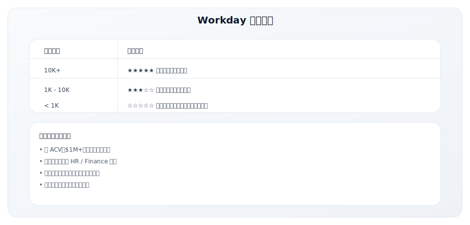

**产品聚焦**：
| 产品线 | 核心功能 | 竞争对手 |
|-------|---------|---------|
| HCM（人力资本管理） | 招聘、薪酬、绩效、学习 | Oracle HCM, SAP SuccessFactors |
| Financial Management | 财务、采购、费用管理 | Oracle ERP, SAP S/4HANA |
| Planning | 预算、预测、分析 | Anaplan, Adaptive Insights |

#### 策略二：长销售周期、高 ACV 模式

Workday 的销售模式是典型的企业级销售：

**销售周期特点**：
| 阶段 | 时长 | 活动 |
|-----|-----|-----|
| 初始接触 | 1-2月 | 高管接触、需求发现 |
| 需求评估 | 2-3月 | 深度调研、方案设计 |
| 方案演示 | 1-2月 | 定制 Demo、POC |
| 采购流程 | 2-3月 | 合同谈判、审批流程 |
| **总计** | **6-12月** | - |

**高 ACV 经济模型**：
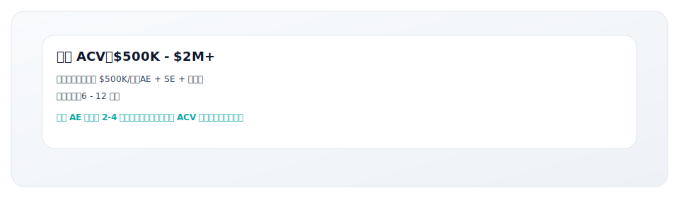

**销售团队配置**：
| 角色 | 职责 | 配比 |
|-----|-----|-----|
| AE（客户经理） | 关系建设、商务谈判 | 1 |
| SE（售前顾问） | 方案设计、产品演示 | 1-2 |
| SDR（业务发展） | 线索开发、预约会议 | 2-3 |
| Exec Sponsor | 高管对接 | 按需 |

#### 策略三：强调替换传统 ERP 的价值

Workday 的价值主张围绕"替换"展开：

**替换价值主张**：
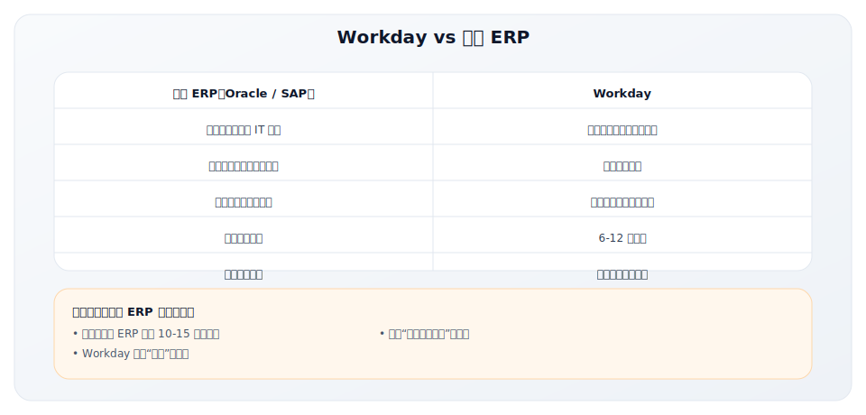

**销售话术要点**：
1. "你的 ERP 多少年没升级了？"
2. "升级成本 vs 换到云端成本"
3. "你的 IT 团队应该做创新，而非维护系统"

#### 策略四：客户成功与长期关系

大企业销售的核心是长期关系：

**客户成功模式**：
| 阶段 | 重点 | 团队 |
|-----|-----|-----|
| 实施 | 按时上线、用户培训 | 实施顾问 |
| 稳定 | 系统稳定、问题解决 | 技术支持 |
| 优化 | 使用深化、新功能采用 | CSM |
| 扩展 | 交叉销售、续约 | AE + CSM |

**客户终身价值**：
- 大企业一旦上线，很少更换
- 平均客户生命周期 10+ 年
- NRR > 100%：扩展超过流失

### 关键数据

**财务表现**：

| 财年 | 收入 | 订阅收入增长 | 客户数 |
|-----|-----|-------------|-------|
| FY2013 | $274M | - | 325 |
| FY2016 | $1.2B | 35% | 1,100+ |
| FY2020 | $3.6B | 27% | 3,000+ |
| FY2024 | $7.3B | 17% | 10,500+ |

**效率指标**：
- NRR > 100%
- 总续约率 > 95%
- 平均 ACV：$500K+ (HCM), $1M+ (Finance)

### GTM Lesson

**Lesson 1：高价值市场需要深度关系销售**
- 大企业采购是多人决策
- 信任建立需要时间和投入
- 高 ACV 支撑高服务成本

**Lesson 2：清晰的替代价值主张很重要**
- "替换 Oracle/SAP" 是明确的定位
- 利用传统软件的升级周期
- 帮客户算清楚 TCO

**Lesson 3：聚焦比分散更有效**
- 不做 SMB，专注大企业
- 产品深度比广度重要
- 资源集中带来竞争优势

**Lesson 4：耐心和长期投入是必要的**
- 6-12月销售周期是正常的
- 客户关系是长期投资
- 复利效应在后期显现

---

## ServiceNow：IT 服务管理到平台化

### 背景

ServiceNow 从 IT 服务管理（ITSM）起步，逐步扩展为企业工作流平台，展示了 SLG 公司的平台化扩张路径。

**公司背景**：
- **成立时间**：2004年
- **创始人**：Fred Luddy（前 Peregrine Systems CTO）
- **初始定位**：云端 IT 服务管理（ITSM）
- **现在定位**：企业工作流平台

**发展历程**：
| 阶段 | 时间 | 重点 |
|-----|-----|-----|
| 起步期 | 2004-2010 | ITSM 产品打磨 |
| 增长期 | 2010-2016 | IPO，快速扩张 |
| 平台期 | 2016-今 | 从 ITSM 到平台 |

**关键里程碑**：
| 时间 | 事件 |
|-----|-----|
| 2004 | 公司成立 |
| 2012 | IPO，估值 $2.4B |
| 2016 | 收入突破 $1B |
| 2018 | 市值突破 $30B |
| 2024 | 收入 $10B+，市值 $150B+ |

### GTM 战略选择

ServiceNow 的 GTM 演进体现了从单品到平台的转型：

**1. 从单点切入到平台扩展**
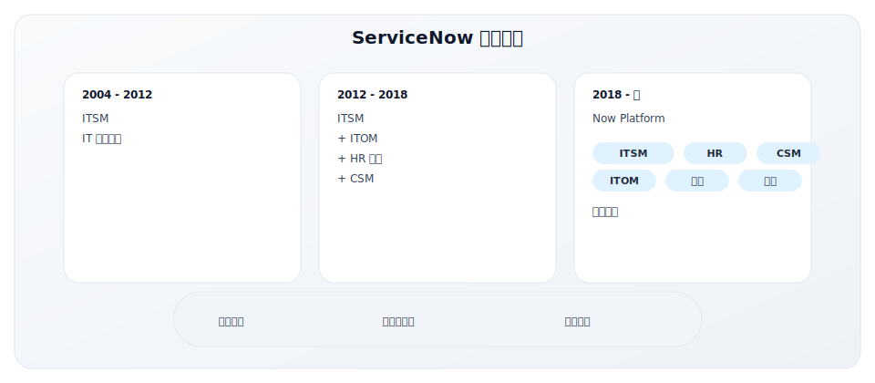

**2. 瞄准 IT 部门，逐步扩展**
- IT 部门是天然入口（ITSM 是刚需）
- 从 IT 扩展到 HR、客服、安全等部门
- "企业工作流"统一价值主张

**3. 平台 + 应用的双层架构**
- Now Platform 是基础
- 各垂直应用构建在平台上
- 客户可以自定义开发

### 核心策略深度解析

#### 策略一：从 ITSM 刚需切入

ServiceNow 选择了一个明确的切入点：

**为什么是 ITSM？**
- 每个企业都需要 IT 服务管理
- 传统工具（BMC、HP）已经老化
- IT 部门有预算和决策权

**初期竞争优势**：
| 维度 | 传统工具（BMC、HP） | ServiceNow |
|-----|-------------------|------------|
| 部署 | 本地，数月实施 | 云端，数周上线 |
| 成本 | 高前期投入 | 订阅模式 |
| 使用 | 复杂，需要专家 | 现代 UI，易用 |
| 升级 | 痛苦 | 自动更新 |

**GTM 策略**：
- 瞄准中大型企业的 IT 部门
- 强调"替换 BMC/HP"
- 快速实施、快速见效

#### 策略二：Land and Expand（落地后扩展）

ServiceNow 是 Land and Expand 的典范：

**扩展路径**：
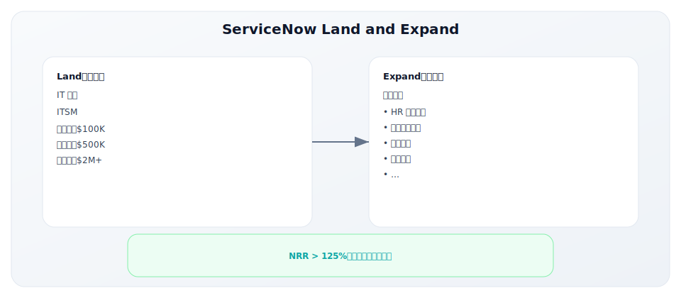

**扩展策略**：
| 阶段 | 重点 | 销售重点 |
|-----|-----|---------|
| 年1 | 稳固 ITSM | 确保成功使用 |
| 年2 | 第一次扩展 | ITOM 或 HR |
| 年3+ | 持续扩展 | 新部门、新用例 |

**关键指标**：
- NRR > 125%（行业领先）
- 大客户平均使用 5+ 个产品
- 交叉销售占新增 ARR 的重要比例

#### 策略三：平台化战略

ServiceNow 的平台化是其估值溢价的来源：

**平台价值**：
| 维度 | 单点产品 | 平台产品 |
|-----|---------|---------|
| 扩展性 | 功能有限 | 无限可能 |
| 粘性 | 可替换 | 深度锁定 |
| 定价 | 功能定价 | 价值定价 |
| 竞争 | 功能竞争 | 生态竞争 |

**Now Platform 核心能力**：
- 低代码/无代码开发
- 统一数据模型
- 工作流引擎
- 集成框架
- AI 能力

**平台带来的 GTM 优势**：
1. 客户可以自定义，减少定制需求
2. 合作伙伴可以构建应用
3. 差异化竞争，不是功能对比
4. 更高的 ACV 和 NRR

### 关键数据

**财务表现**：

| 财年 | 收入 | 增长率 | 客户数（>$1M ACV） |
|-----|-----|-------|------------------|
| FY2013 | $214M | 65% | ~100 |
| FY2016 | $1.0B | 36% | 350 |
| FY2020 | $4.5B | 31% | 1,000+ |
| FY2024 | $10.4B | 23% | 2,000+ |

**效率指标**：
- NRR > 125%（持续）
- 续约率 > 98%
- 平均 ACV 持续提升

### GTM Lesson

**Lesson 1：选对切入点是关键**
- ITSM 是刚需，IT 部门有预算
- 从一个明确的痛点切入
- 证明价值后再扩展

**Lesson 2：Land and Expand 是 SLG 的增长密码**
- 落地成本 < 扩展收益
- NRR > 100% 是可持续增长的关键
- 客户成功是扩展的前提

**Lesson 3：平台化是估值溢价的来源**
- 从产品到平台是质的飞跃
- 平台带来更深的锁定和更高的价值
- 生态是最强的护城河

**Lesson 4：持续创新保持领先**
- 不断扩展产品线
- 拥抱新技术（AI、低代码）
- 定义新品类而非追随

---

## 中国 SLG 案例：北森的企业级 HR SaaS 之路

### 背景

北森是中国企业级 HR SaaS 的领导者，展示了在中国市场如何通过 SLG 建立企业级软件公司。

**公司背景**：
- **成立时间**：2002年
- **创始人**：王朝晖、纪伟国
- **定位**：一体化人才管理云平台
- **上市**：2023年港交所上市

**发展历程**：

| 阶段 | 时间 | 重点 |
|-----|-----|-----|
| 咨询起步 | 2002-2010 | 人才测评咨询业务 |
| 产品转型 | 2010-2015 | 从咨询到 SaaS 产品 |
| 规模化 | 2015-2020 | 一体化平台，大客户战略 |
| 上市发展 | 2020-今 | 港股上市，持续增长 |

**关键里程碑**：

| 时间 | 事件 | 意义 |
|-----|-----|-----|
| 2010 | 发布云端招聘产品 | 开始 SaaS 化 |
| 2015 | 推出一体化 HR 平台 | 平台化布局 |
| 2019 | 年收入超 5 亿 | 规模化验证 |
| 2023 | 港交所上市 | 资本市场认可 |

### GTM 战略选择

北森的 GTM 是典型的中国企业级 SLG：

**1. 聚焦大中型企业**

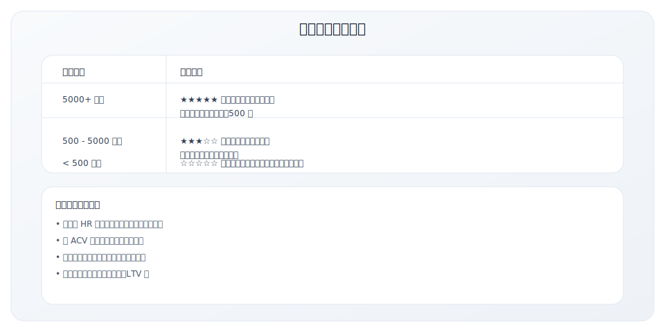

**2. 一体化产品战略**

| 模块 | 功能 | 对标国际产品 |
|-----|-----|------------|
| 招聘云 | 招聘全流程管理 | Workday Recruiting |
| 测评云 | 人才评估与发展 | SHL, DDI |
| 绩效云 | 目标管理、考核 | SuccessFactors |
| 继任云 | 人才盘点、继任规划 | Cornerstone |
| 学习云 | 培训、发展 | Cornerstone Learning |
| Core HR | 组织人事、薪酬 | Workday HCM |

**3. 直销为主的销售模式**

北森主要依靠直销团队获取和服务大客户：

| 角色 | 职责 | 配置 |
|-----|-----|-----|
| 销售总监 | 区域/行业负责 | 按区域和行业划分 |
| 客户经理（AE） | 客户关系、商务谈判 | 覆盖核心客户 |
| 售前顾问 | 方案设计、产品演示 | 支持销售 |
| 实施顾问 | 系统实施、上线支持 | 项目制 |
| 客户成功（CSM） | 续约、扩展、健康 | 覆盖付费客户 |

### 核心策略解析

#### 策略一：从测评咨询到 SaaS 产品

北森的独特路径是从咨询业务转型到产品：

**转型优势**：
- 深度理解客户需求
- 积累了行业 Know-how
- 建立了客户信任
- 有稳定的现金流支撑转型

**转型挑战**：
| 挑战 | 应对策略 |
|-----|---------|
| 组织能力转变 | 招聘产品和技术人才 |
| 商业模式变化 | 从项目制到订阅制 |
| 客户预期管理 | 逐步引导客户接受 SaaS |
| 财务压力 | 保留咨询业务作为现金流 |

#### 策略二：Land and Expand 中国版

北森的扩展策略：

**典型扩展路径**：
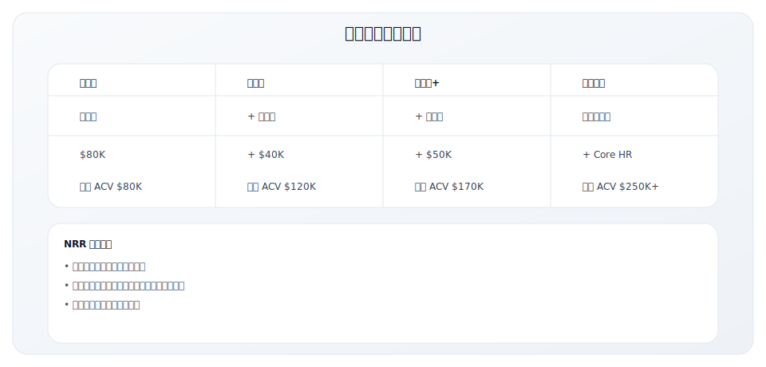

#### 策略三：行业深耕策略

北森重点布局特定行业：

**重点行业**：

| 行业 | 特点 | 典型客户 |
|-----|-----|---------|
| 互联网 | 增长快、人才竞争激烈 | 字节跳动、美团、快手 |
| 金融 | 合规要求高、预算充足 | 银行、保险、券商 |
| 制造 | 员工数量大、蓝领管理 | 汽车、电子、医药 |
| 零售消费 | 门店多、一线员工管理 | 连锁品牌、快消 |

**行业化价值**：
- 理解行业特殊需求
- 提供行业最佳实践
- 建立行业口碑
- 降低销售教育成本

#### 策略四：客户成功保障续约

在中国市场，客户成功尤为重要：

**客户成功体系**：

| 层级 | 客户 ACV | 服务内容 |
|-----|---------|---------|
| 战略客户 | $500K+ | 专属 CSM + TAM + 定期高管沟通 |
| 核心客户 | $100-500K | 专属 CSM + 季度业务回顾 |
| 成长客户 | $50-100K | 共享 CSM + 半年度回顾 |
| 标准客户 | <$50K | 客服支持 + 线上培训 |

**续约关键动作**：
- 提前 6 个月开始续约沟通
- 定期健康检查和价值回顾
- 识别风险客户并提前介入
- 续约时推动模块扩展

### 关键数据与洞察

**财务表现（参考区间）**：

| 指标 | 数值范围 | 说明 |
|-----|---------|------|
| 年收入 | 10+ 亿元 | 持续增长 |
| 大客户数 | 500+ 家 | ACV 50万以上 |
| 续约率 | 90%+ | GRR |
| NRR | 100%+ | 有扩展收入 |

**中国企业级 SaaS 的特殊挑战**：

| 挑战 | 具体表现 | 北森应对 |
|-----|---------|---------|
| 定制需求多 | 客户要求深度定制 | 平台化 + 配置化降低定制 |
| 价格竞争 | 竞品低价抢客 | 强调价值，聚焦大客户 |
| 账期长 | 大客户付款周期长 | 加强应收管理 |
| 决策复杂 | 多部门参与决策 | 多线程销售 |

### GTM Lesson

**Lesson 1：从咨询到产品是有效路径**
- 咨询积累客户洞察和信任
- 产品化带来规模化可能
- 但转型需要组织能力重建

**Lesson 2：中国企业级 SaaS 需要更重的服务**
- 客户对实施和服务期望高
- 销售和服务团队规模更大
- 毛利率相对国际同行较低

**Lesson 3：行业深耕是差异化关键**
- 通用型难以建立竞争壁垒
- 行业 Know-how 是重要资产
- 标杆客户的行业辐射效应

**Lesson 4：大客户战略需要长期坚持**
- 大客户销售周期长但价值高
- 续约和扩展是利润来源
- 品牌效应需要时间积累

---

## SLG 成功要素总结

### 四家公司对比（含中国案例）

| 维度 | Salesforce | Workday | ServiceNow | 北森 |
|-----|------------|---------|------------|------|
| **成立** | 1999 | 2005 | 2004 | 2002 |
| **初始市场** | SMB CRM | 大企业 HR | 中大企业 ITSM | 大企业 HR |
| **扩展路径** | 向上+平台化 | 横向（HCM→Finance） | 横向+平台化 | 咨询→产品→一体化平台 |
| **核心 Motion** | 直销+生态 | 高端直销 | Land & Expand | 直销+行业深耕 |
| **护城河** | 生态+品牌 | 深度产品+关系 | 平台+NRR | 一体化+行业 Know-how |
| **2024 收入** | $35B | $7B | $10B | 10+ 亿元 |

### 共同成功要素

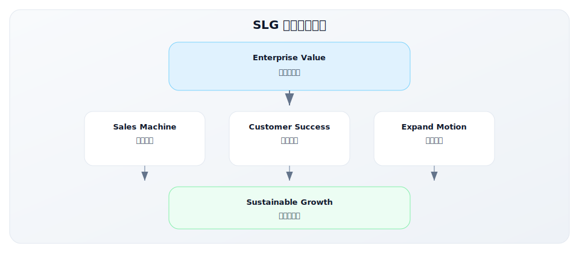

**1. 企业级价值清晰**
- 解决企业的关键痛点
- ROI 可量化
- 支持复杂的企业需求

**2. 销售机器打造**
- 专业的销售团队和方法论
- 可复制的销售流程
- 数据驱动的销售管理

**3. 客户成功保障**
- 客户成功团队确保采用
- 高续约率和低流失率
- 客户成为口碑传播者

**4. 扩展动能设计**
- Land and Expand 模式
- 交叉销售和向上销售
- NRR > 100%

### 关键成功因素评估

| 因素 | 说明 | 评估问题 |
|------|------|---------|
| **Sales Methodology** | 销售方法论是否成熟 | 有没有可复制的销售流程？ |
| **Talent Density** | 销售团队人才密度 | 能否吸引和保留顶尖销售人才？ |
| **Customer Success** | 客户成功是否保障续约 | 客户是否真正使用并获得价值？ |
| **Ecosystem** | 生态系统是否形成护城河 | 合作伙伴和应用生态是否健康？ |
| **Platform Potential** | 是否有平台化潜力 | 能否从单品扩展到平台？ |

---

## 关键要点

- **SLG 适合复杂、高价值的企业级产品**：需要销售解释价值、协调多决策者
- **销售团队建设是核心能力**：招聘、培训、管理、激励都是关键
- **客户成功决定 LTV**：订阅模式下，续约比新签更重要
- **生态系统可以形成竞争壁垒**：合作伙伴、应用市场、开发者社区
- **平台化是规模化的关键**：从单点产品到平台，打开增长天花板

---

## 实践练习

### 练习 1：SLG 适用性评估

评估你的产品是否适合 SLG：

| 维度 | 你的情况 | 是否适合 SLG |
|-----|---------|-------------|
| 产品复杂度 | □ 简单 □ 中等 □ 复杂 | 复杂 → 适合 |
| ACV 水平 | □ <$10K □ $10-50K □ >$50K | >$50K → 适合 |
| 决策者数量 | □ 1人 □ 2-3人 □ 4人+ | 多人 → 适合 |
| 买家专业度 | □ 消费者 □ 专业用户 □ 企业买家 | 企业 → 适合 |
| 实施复杂度 | □ 自助 □ 轻度实施 □ 重度实施 | 重度 → 需要 SLG |

### 练习 2：销售组织设计

为你的 SLG 业务设计销售组织：

```
目标 ACV：$________
销售周期：________ 个月

销售团队配置：
- SDR：______ 人
- AE：______ 人
- SE：______ 人
- CSM：______ 人

每 AE 年度配额：$________
预计成交数量：________ 单/年
```

### 练习 3：Land and Expand 设计

设计你的 Land and Expand 策略：

**Land（落地）**：
- 初始产品/模块：________________
- 初始 ACV：$________
- 成功标准：________________

**Expand（扩展）**：
| 扩展方向 | 产品/模块 | 目标 ACV | 触发时机 |
|---------|---------|---------|---------|
| 扩展 1 | | $ | |
| 扩展 2 | | $ | |
| 扩展 3 | | $ | |

**目标 NRR**：________ %

---

## 延伸阅读

- [3.1 渠道策略](../module-03/3.1-channel-strategy)
- [3.2 定价策略](../module-03/3.2-pricing-strategy)
- [2.5 市场定位策略](../module-02/2.5-positioning)

---

**写作状态**：审校完成
**最后更新**：2025-12-23
**版本**：v1.1
