# 4.3 跨越鸿沟案例

> **学习目标**：学习公司如何成功跨越从早期市场到主流市场的鸿沟
>
> **预计时长**：30 分钟
>
> **前置知识**：2.1 跨越鸿沟

---

## 核心内容

本节覆盖以下内容：
- HubSpot：Inbound Marketing 缔造者
- Zoom：疫情前的鸿沟跨越
- 中国跨越鸿沟案例：有赞的商家服务进化之路
- 跨越鸿沟成功要素总结

## HubSpot：Inbound Marketing 缔造者

### 背景

HubSpot 是"跨越鸿沟"的经典案例——不仅成功跨越，还通过创造新品类重新定义了市场规则。

**公司背景**：
- **成立时间**：2006年
- **创始人**：Brian Halligan, Dharmesh Shah（MIT 校友）
- **开创性意义**：创造"Inbound Marketing（集客营销）"品类
- **初始定位**：SMB 营销自动化工具

**创始洞察**：
- 2006年，传统营销（电话推销、邮件轰炸）效果越来越差
- 消费者行为改变：主动搜索信息、屏蔽打扰式营销
- 创始人提出"Inbound Marketing"概念：让客户主动找到你

**发展里程碑**：
| 时间 | 里程碑 |
|-----|-------|
| 2006 | 公司成立 |
| 2007 | 出版《Inbound Marketing》书籍 |
| 2009 | 推出免费 Website Grader 工具 |
| 2014 | IPO，估值 $880M |
| 2014 | 推出免费 CRM |
| 2024 | 年收入 $2.4B+，238,000+ 客户 |

### 跨越鸿沟的挑战

HubSpot 面临典型的鸿沟问题：

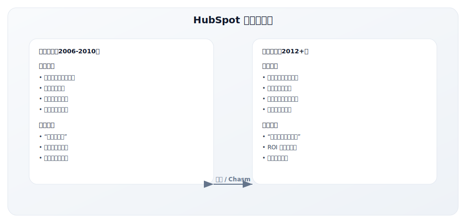

**核心挑战**：
1. **概念新**：市场不理解什么是"Inbound Marketing"
2. **证据少**：缺乏主流市场认可的成功案例
3. **竞争对手强**：传统营销自动化玩家（Marketo、Eloqua）
4. **SMB 市场分散**：获客成本高、客单价低

### GTM 战略选择

HubSpot 选择了独特的跨越鸿沟策略：

**核心策略：教育市场，创造需求**

### 核心策略深度解析

#### 策略一：教育式内容营销

HubSpot 用内容"自己喝自己的香槟"：

**内容营销体系**：
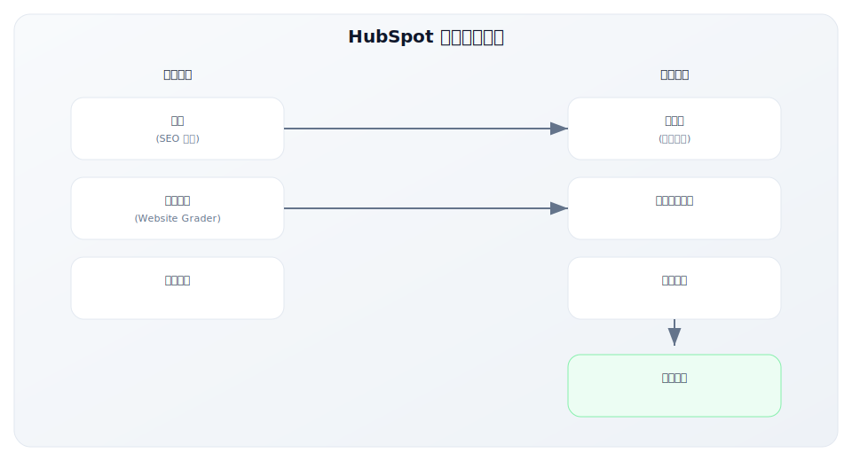

**具体内容资产**：
| 内容类型 | 数量（累计） | 作用 |
|---------|-------------|-----|
| 博客文章 | 10,000+ 篇 | SEO 获客 |
| 电子书/指南 | 500+ | 线索获取 |
| 免费工具 | 10+ | 产品体验 |
| 认证课程 | 100+ | 用户教育、品牌建设 |
| 研究报告 | 年度 State of Marketing | 行业权威 |

**关键洞察**：
- 教育市场 = 创造需求
- 成为"Inbound Marketing"的权威定义者
- 免费内容建立信任，产品转化自然发生

#### 策略二：Freemium CRM 引流

2014年，HubSpot 做出关键决策——推出免费 CRM：

**战略意图**：
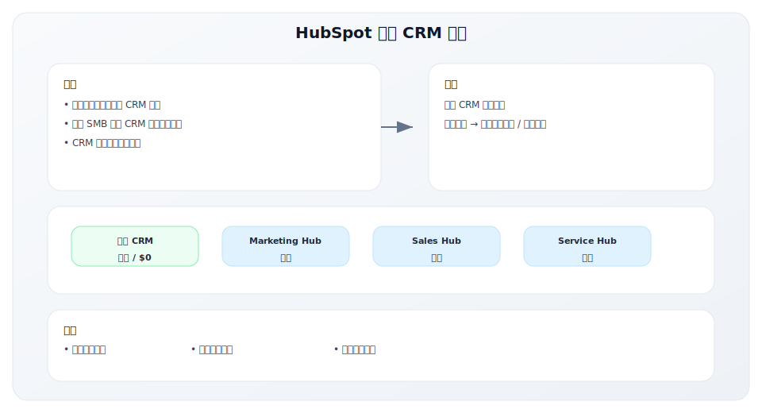

**免费 CRM 的效果**：
- 大幅降低 CAC
- 建立与客户的早期关系
- 为向上销售创造基础

#### 策略三：从 SMB 逐步向上拓展

HubSpot 的市场扩展路径是典型的"向上攻击"：

**扩展路径**：
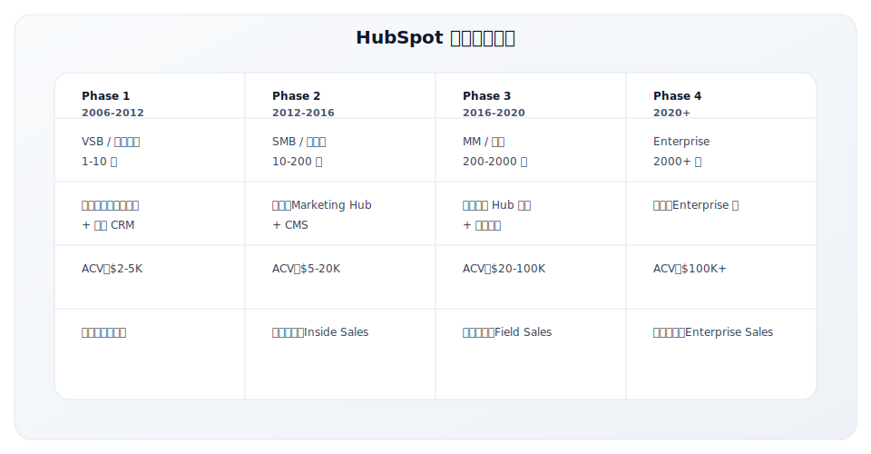

**向上扩展的关键**：
1. **产品升级**：从单一工具到完整平台
2. **销售团队建设**：从纯 Inside Sales 到 Field Sales
3. **服务能力**：增加专业服务、实施支持
4. **品牌建设**：从"SMB 工具"到"增长平台"

#### 策略四：INBOUND 大会

HubSpot 的 INBOUND 大会是其品牌建设的核心：

**INBOUND 大会概况**：
| 维度 | 数据 |
|-----|-----|
| 首次举办 | 2012年 |
| 2024年规模 | 10,000+ 现场参与者 |
| 在线参与 | 50,000+ |
| 定位 | 营销、销售、服务专业人士的年度盛会 |

**大会价值**：
- 强化"Inbound"品类领导者地位
- 客户成功故事展示
- 产品发布平台
- 社区凝聚

### 跨越鸿沟的路径

HubSpot 跨越鸿沟的完整路径：

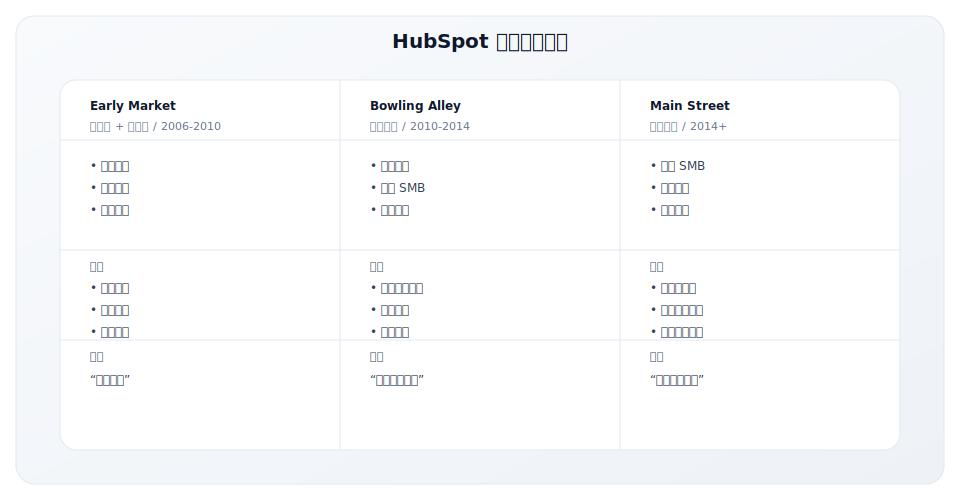

**滩头阵地选择**：
- **选择**：营销机构 + 科技 SMB
- **原因**：
  - 这些群体对新营销理念开放
  - 自身就是"内容创造者"
  - 可以成为 HubSpot 的传播者

### 关键数据

**增长轨迹**：

| 时间节点 | 客户数 | ARR | 意义 |
|----------|--------|-----|-----|
| 2008 | 1,000 | ~$1M | 验证 PMF |
| 2012 | 8,200 | $52M | 跨越鸿沟 |
| 2014 | 15,600 | $116M | IPO |
| 2018 | 56,500 | $513M | 规模化 |
| 2024 | 238,000+ | $2.4B+ | 市场领导者 |

**效率指标**：
- 年增长率：持续 20-30%
- NRR > 100%
- CAC 逐年改善（内容营销积累效应）

### GTM Lesson

**Lesson 1：教育市场 = 创造需求**
- 创造"Inbound Marketing"品类
- 成为品类的定义者和权威
- 教育投入带来长期回报

**Lesson 2：内容是最可持续的获客引擎**
- 博客、电子书、工具形成复合效应
- SEO 带来持续的免费流量
- 内容资产随时间增值

**Lesson 3：品类创造者有定价权**
- 定义游戏规则
- 竞争对手只能跟随
- 品牌溢价明显

**Lesson 4：从 SMB 向上迁移需要系统性准备**
- 产品升级（功能、稳定性、安全性）
- 销售团队升级（Inside → Field）
- 服务能力升级（自助 → 专业服务）

---

## Zoom：疫情前的鸿沟跨越

### 背景

Zoom 在疫情期间爆发，但其跨越鸿沟的工作早在疫情前就已完成。

**公司背景**：
- **成立时间**：2011年
- **创始人**：Eric Yuan（前 Cisco WebEx 工程副总裁）
- **定位**：视频会议软件
- **核心差异化**：简单、可靠、易用

**创始故事**：
- Eric Yuan 在 WebEx 工作14年
- 看到产品越来越复杂，用户体验下降
- 2011年创立 Zoom，从零开始构建

**发展里程碑**：
| 时间 | 里程碑 |
|-----|-------|
| 2011 | 公司成立 |
| 2013 | 产品发布 |
| 2017 | 1M 参会者/天 |
| 2019 | IPO，估值 $16B |
| 2020 | 疫情爆发，300M 参会者/天 |
| 2024 | 年收入 $4.5B+ |

### 跨越鸿沟的挑战

Zoom 面临的挑战是在已有成熟市场中寻找空间：

**竞争格局（2013-2019）**：
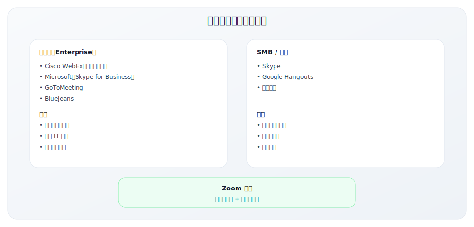

**核心挑战**：
1. **市场成熟**：视频会议不是新品类
2. **巨头林立**：Cisco、Microsoft 等强势竞争
3. **免费替代品**：Skype、Hangouts 免费可用
4. **企业采购惯性**：IT 部门倾向于选择大厂

### GTM 战略选择

Zoom 选择了 PLG + SLG 混合策略：

**核心策略：极致体验 + 底层渗透**

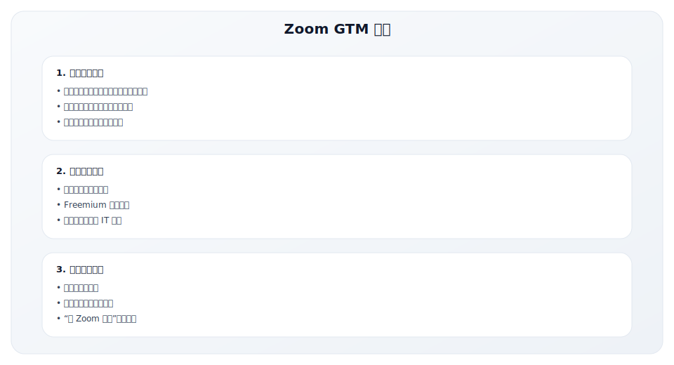

### 核心策略深度解析

#### 策略一：极致的产品体验

Zoom 的核心竞争力是"It just works"：

**体验差异化**：
| 维度 | 竞争对手 | Zoom |
|-----|---------|------|
| 入会体验 | 下载插件、等待、失败 | 点击链接即入会 |
| 网络适应 | 网络差就卡顿 | 自动适应网络 |
| 界面设计 | 功能复杂、学习成本高 | 简洁直观 |
| 可靠性 | 经常掉线、出问题 | 稳定可靠 |

**技术投入**：
- 自建全球数据中心
- 专有视频编解码技术
- 持续优化用户体验

#### 策略二：Freemium + 病毒传播

Zoom 的增长飞轮：

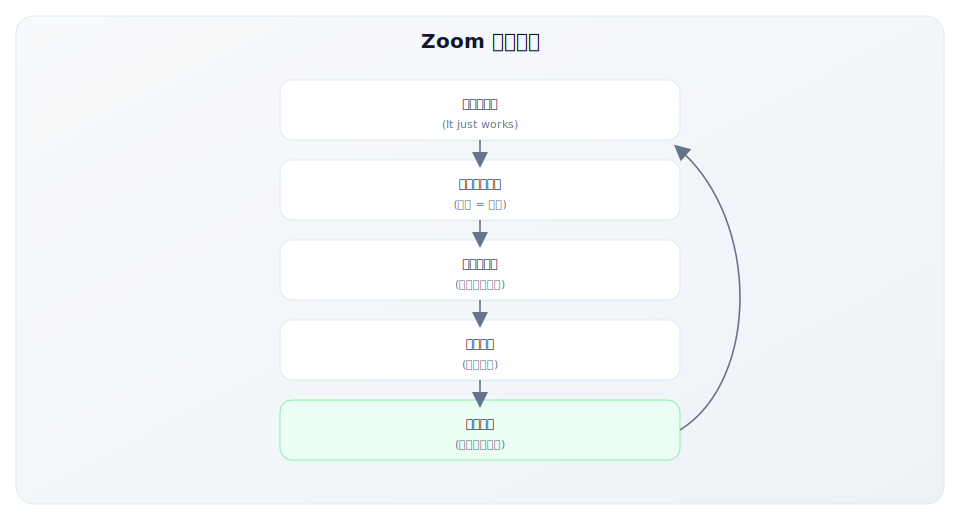

**Freemium 设计**：
| 版本 | 价格 | 限制 | 目的 |
|-----|-----|-----|-----|
| 免费版 | $0 | 40分钟群组会议 | 获取用户 |
| Pro | $15/月 | 无限时长 | 个人/小团队 |
| Business | $20/月 | 管理功能 | 中型企业 |
| Enterprise | 定制 | 完整功能 | 大企业 |

#### 策略三：PLG + SLG 混合

Zoom 的成功在于同时运用 PLG 和 SLG：

**PLG 路径**：
- 免费版获取个人用户
- 用户在公司内使用
- 使用量增长触发付费

**SLG 路径**：
- 销售团队跟进大客户
- IT 部门集中采购
- 企业级功能和服务

**两者协同**：

### 跨越鸿沟的路径

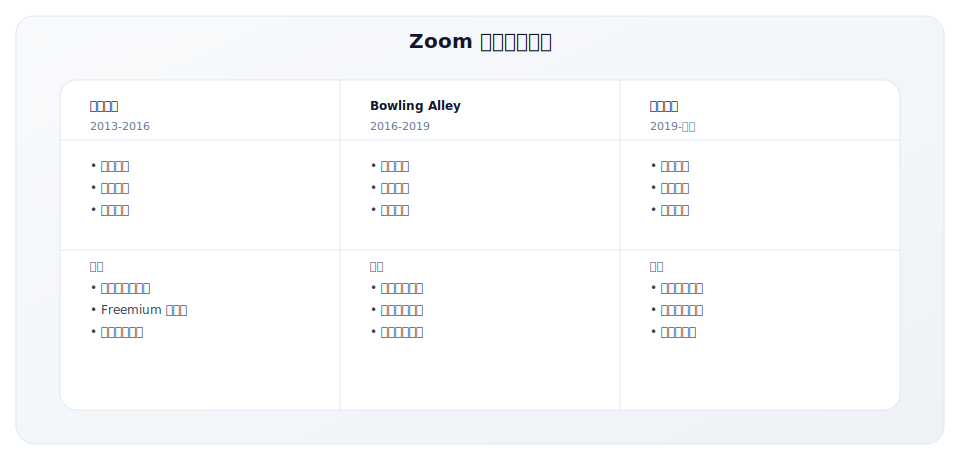

**滩头阵地选择**：
- **教育行业**：Zoom 在学校和大学获得大量部署
- **医疗行业**：远程医疗需求，HIPAA 合规
- **金融行业**：安全性认证，赢得信任

### 关键数据

**增长轨迹**：

| 时间 | 指标 | 数据 |
|-----|-----|-----|
| 2017 | 日参会者 | 100万 |
| 2019 Q4 | 年收入 | $623M |
| 2020 Q1 | 日参会者 | 3亿（疫情） |
| 2024 | 年收入 | $4.5B+ |

**疫情前的基础**（证明鸿沟已跨越）：
- IPO 前收入增长 > 100%
- 81% 的财富500强公司使用
- NRR > 130%

### GTM Lesson

**Lesson 1：极致体验可以颠覆成熟市场**
- 在成熟市场找到体验差距
- "10倍好"才能改变用户习惯
- 产品是最好的营销

**Lesson 2：底层渗透可以绕过采购壁垒**
- 从员工个人使用开始
- 让 IT 不得不正式采购
- PLG + SLG 协同效果最佳

**Lesson 3：每次使用都是传播机会**
- 会议参与者都是潜在用户
- 产品本身就是最好的广告
- 病毒系数设计进产品

**Lesson 4：垂直行业可以作为跨越鸿沟的滩头**
- 教育、医疗作为突破口
- 行业特定需求（合规、安全）
- 参考客户建立主流市场信任

---

## 中国跨越鸿沟案例：有赞的商家服务进化之路

### 背景

有赞是中国 SaaS 领域跨越鸿沟的典型案例——从服务微信生态的小众工具，成长为主流的商家服务平台。

**公司背景**：
- **成立时间**：2012年（原名"口袋通"）
- **创始人**：白鸦（前支付宝产品经理）
- **初始定位**：微信开店工具
- **演进定位**：全渠道商家服务平台

**创始洞察**：
- 2012年，微信公众号兴起，但商家缺乏在微信内开店的工具
- 淘宝等平台抽佣高、流量贵，商家渴望"私域流量"
- 白鸦看到"让商家拥有自己的客户"的机会

**发展里程碑**：

| 时间 | 里程碑 | 意义 |
|-----|-------|-----|
| 2012 | 口袋通成立 | 微信开店工具起步 |
| 2014 | 更名有赞 | 品牌升级 |
| 2016 | 推出有赞微商城 | 产品成熟 |
| 2018 | 借壳上市（港股） | 资本市场认可 |
| 2019 | 推出有赞零售 | 线下场景扩展 |
| 2021 | 年 GMV 超千亿 | 规模化验证 |

### 跨越鸿沟的挑战

有赞面临的是中国 SaaS 特有的鸿沟挑战：

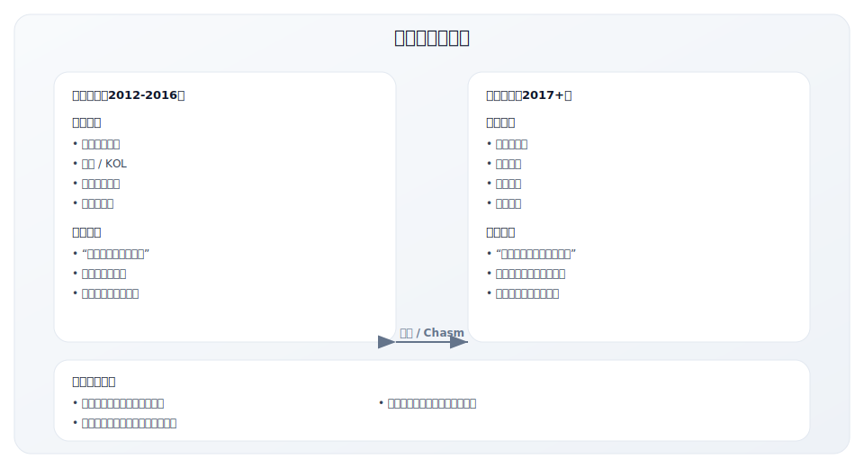

**核心挑战**：
1. **付费习惯**：中国中小商家对 SaaS 付费意愿低
2. **平台风险**：过度依赖微信生态
3. **竞争激烈**：微盟、点点客等直接竞争
4. **教育成本高**：需要教育商家理解"私域流量"价值

### GTM 战略选择

有赞选择了"内容教育 + 垂直突破"的策略：

**核心策略：成为商家的"首席布道师"**

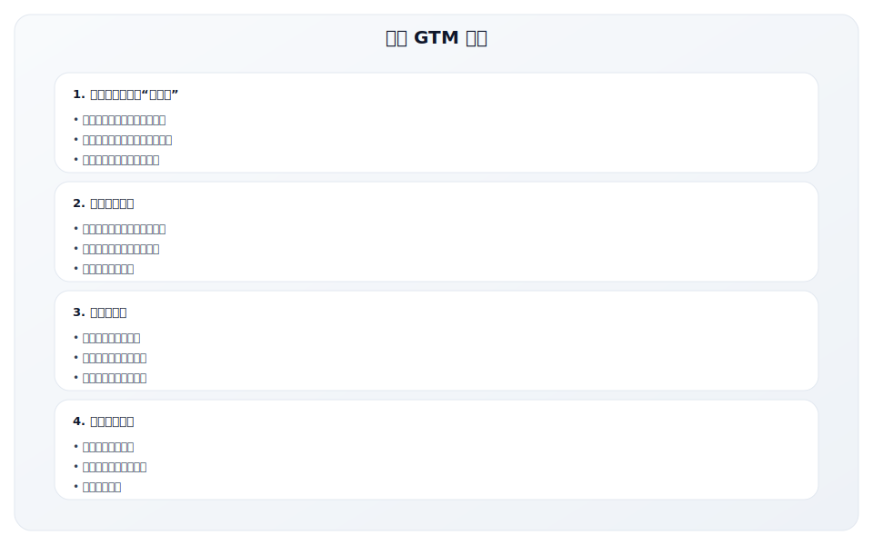

### 核心策略深度解析

#### 策略一：成为品类定义者

有赞通过内容和布道定义了中国的"私域电商"品类：

**内容营销体系**：

| 内容类型 | 形式 | 作用 |
|---------|-----|-----|
| 白鸦演讲 | 大会、论坛、直播 | 传播理念，建立权威 |
| 有赞学堂 | 在线课程 | 教育商家，培养用户 |
| 商家案例 | 图文、视频 | 证明价值，激发需求 |
| 行业报告 | 白皮书、数据报告 | 定义标准，行业影响 |

**关键动作**：
- 白鸦在各大会议分享"私域流量"理念
- 让商家成功故事成为最好的营销素材
- 有赞 MENLO 大会成为行业标杆活动

#### 策略二：垂直行业突破

有赞的滩头阵地选择非常明确：

**行业突破路径**：

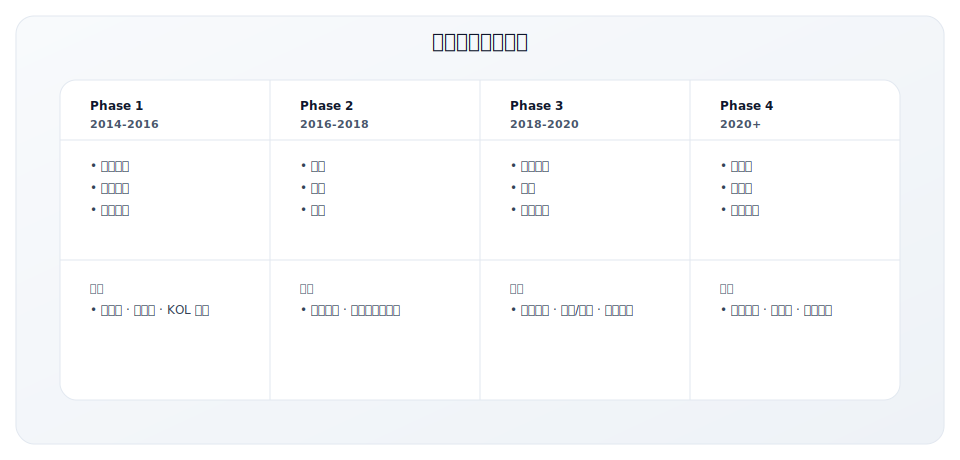

**滩头阵地选择逻辑**：
- **美妆/母婴**：高复购、强社交属性，适合私域运营
- **标杆客户效应**：这些行业的成功案例对其他行业有示范作用
- **逐步向更复杂的场景扩展**

#### 策略三：服务商生态建设

有赞的渠道策略是其跨越鸿沟的关键：

**服务商生态**：

| 角色 | 职责 | 价值 |
|-----|-----|-----|
| 销售服务商 | 获客、销售 | 扩大销售覆盖 |
| 实施服务商 | 开店、装修、培训 | 降低有赞服务成本 |
| 运营服务商 | 代运营、营销 | 提升商家成功率 |
| 技术服务商 | 定制开发、集成 | 满足复杂需求 |

**生态的战略价值**：
- 降低直接销售和服务成本
- 扩大市场覆盖范围
- 让服务商成为有赞的"延伸团队"
- 生态繁荣证明平台价值

#### 策略四：产品平台化

从工具到平台的进化是跨越鸿沟的产品基础：

**产品进化路径**：

| 阶段 | 产品形态 | 目标客户 |
|-----|---------|---------|
| 1.0 | 微信开店工具 | 个人卖家、小微商家 |
| 2.0 | 微商城 SaaS | 中小商家 |
| 3.0 | 全渠道零售 | 连锁门店、品牌商 |
| 4.0 | 商家服务平台 | 全类型商家 |

### 跨越鸿沟的路径

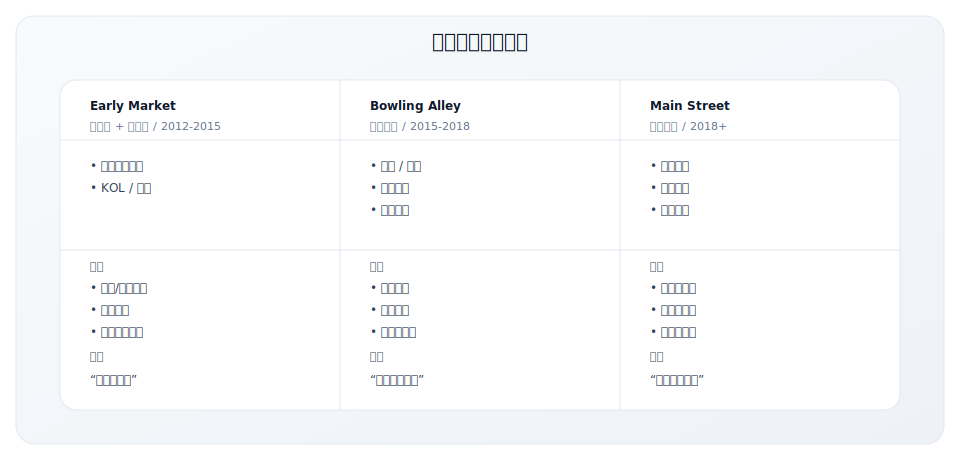

### 关键数据与洞察

**增长轨迹**：

| 年份 | 付费商家数 | GMV | 里程碑 |
|-----|---------|-----|-------|
| 2015 | ~10万 | ~100亿 | 早期市场验证 |
| 2017 | ~50万 | ~300亿 | 跨越鸿沟 |
| 2019 | ~100万 | ~600亿 | 主流市场站稳 |
| 2021 | ~100万+ | ~1000亿+ | 市场领导者 |

**中国 SaaS 跨越鸿沟的特殊经验**：

| 挑战 | 有赞的应对 | 启示 |
|-----|---------|-----|
| 付费意愿低 | 通过 GMV 抽佣 + SaaS 订阅混合模式 | 商业模式创新 |
| 教育成本高 | 创始人亲自布道，定义品类 | 品类创造者的责任 |
| 服务成本高 | 服务商生态分担服务 | 生态杠杆 |
| 竞争激烈 | 聚焦产品和服务质量 | 产品为本 |

### GTM Lesson

**Lesson 1：在中国跨越鸿沟需要"重教育"**
- 中国市场对新概念接受需要更多教育
- 创始人亲自布道有巨大价值
- 内容和案例是最好的教育工具

**Lesson 2：服务商生态是跨越鸿沟的杠杆**
- 中国 SaaS 服务成本高
- 服务商可以分担销售和服务
- 生态健康比自营规模更重要

**Lesson 3：商业模式需要适应中国市场**
- 纯 SaaS 订阅在中国中小企业市场困难
- 交易抽佣 + SaaS 混合模式更易接受
- 让商家"赚到钱"是最好的付费理由

**Lesson 4：行业深耕是滩头阵地策略的中国实践**
- 选择最适合私域运营的行业突破
- 标杆案例对其他行业有强烈示范效应
- 从"工具"到"解决方案"的进化

---

## 跨越鸿沟成功要素总结

### 三家公司对比（含中国案例）

| 维度 | HubSpot | Zoom | 有赞 |
|-----|---------|------|------|
| **市场类型** | 创造新品类 | 颠覆成熟市场 | 创造新品类（中国） |
| **核心策略** | 教育市场、定义品类 | 极致体验、底层渗透 | 内容教育 + 垂直突破 |
| **获客方式** | 内容营销 + Freemium | PLG + 病毒传播 | 服务商生态 + 内容 |
| **滩头阵地** | 营销机构、科技 SMB | 科技公司、教育医疗 | 美妆/母婴电商 |
| **扩展路径** | SMB → MM → Enterprise | 个人 → 团队 → 企业 | 小商家 → 品牌 → 连锁 |
| **关键转折** | 免费 CRM 发布 | 疫情加速（但基础已建好） | 服务商生态成熟 |

### 共同成功要素

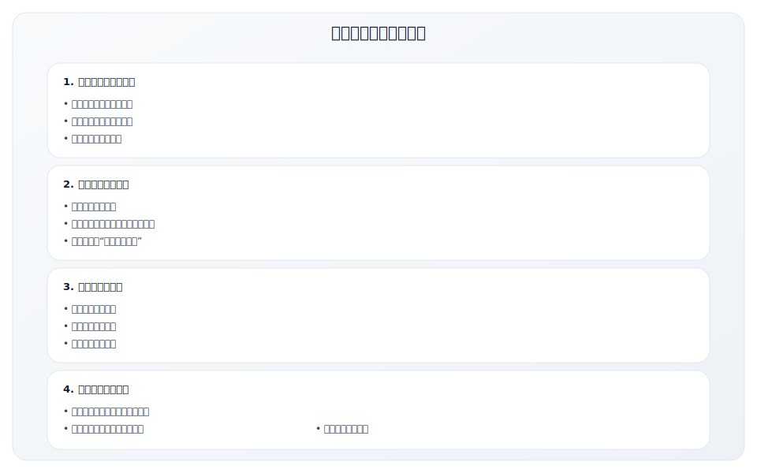

### 关键成功因素评估

| 因素 | 说明 | 评估问题 |
|------|------|---------|
| **Beachhead Selection** | 选对第一个细分市场 | 这个群体对新事物开放吗？能传播吗？ |
| **Whole Product** | 完整解决方案 | 除了产品，还需要什么才能成功？ |
| **Reference Customers** | 参考客户和案例 | 有没有主流客户愿意站台？ |
| **Pragmatist Appeal** | 务实者能接受的风险 | 如何降低"第一个吃螃蟹"的风险？ |
| **Market Education** | 市场教育投入 | 如何教育市场理解你的价值？ |

---

## 关键要点

- **跨越鸿沟需要转变思维**：从"愿景者"到"务实者"，需要不同的价值主张
- **品类创造者需要承担教育成本**：但教育投入会带来长期品牌资产
- **滩头阵地选择决定成功概率**：不是最大市场，而是最适合突破的市场
- **整体产品概念比产品本身重要**：务实者需要完整解决方案
- **参考客户是跨越鸿沟的关键**：同类公司的成功案例最有说服力

---

## 实践练习

### 练习 1：鸿沟定位判断

判断你的产品当前在鸿沟的哪一侧：

**早期市场特征（勾选适用项）**：
- [ ] 客户主要是技术先锋/愿景者
- [ ] 客户愿意为"未来潜力"买单
- [ ] 客户可以容忍产品不完善
- [ ] 销售主要靠创始人/早期团队

**主流市场特征（勾选适用项）**：
- [ ] 客户是务实的买家
- [ ] 客户需要看到同行案例
- [ ] 客户需要完整的解决方案
- [ ] 销售可以复制和规模化

**结论**：
- 如果早期市场特征多：你还在鸿沟前
- 如果主流市场特征多：你已经在鸿沟后

### 练习 2：滩头阵地选择

如果你需要跨越鸿沟，选择你的滩头阵地：

| 评估维度 | 候选细分市场 A | 候选细分市场 B | 候选细分市场 C |
|---------|--------------|--------------|--------------|
| 市场名称 | | | |
| 痛点明确度 | | | |
| 决策速度 | | | |
| 传播能力 | | | |
| 竞争强度 | | | |
| 我们的优势 | | | |

**选择的滩头阵地**：________________
**选择理由**：________________

### 练习 3：整体产品差距分析

分析你的产品距离"整体产品"还缺什么：

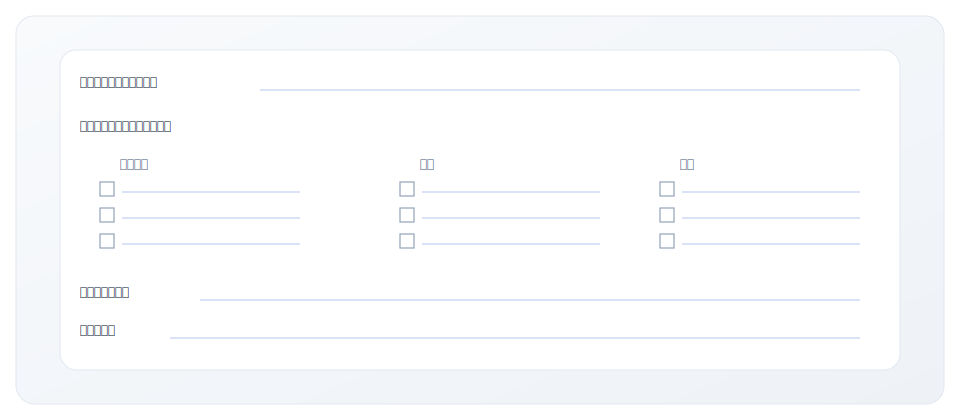

---

## 延伸阅读

- [2.1 跨越鸿沟](../module-02/2.1-crossing-the-chasm)
- [2.2 GTM Motion 类型](../module-02/2.2-gtm-motions)
- [2.5 市场定位策略](../module-02/2.5-positioning)

---

**写作状态**：审校完成
**最后更新**：2025-12-23
**版本**：v1.1
