# 4.4 AI 时代 GTM 新范式

> **学习目标**：了解 AI 时代 GTM 的新特征、趋势和应用
>
> **预计时长**：15 分钟
>
> **前置知识**：模块二、模块三

---

## 核心内容

本节覆盖以下内容：
- AI 正在重塑 GTM
- AI-Native 公司的 GTM 特征
- 2024-2025 GTM 趋势数据
- AI 在 GTM 各环节的应用
- AI GTM 工具栈演进
- AI GTM 的挑战与应对

## AI 正在重塑 GTM

2023-2024年，AI 技术的突破正在深刻改变 GTM 的每一个环节。从营销内容生成到销售预测，从客户细分到个性化触达，AI 带来的不仅是效率提升，更是方法论的根本变革。

### GTM 的三次范式转变

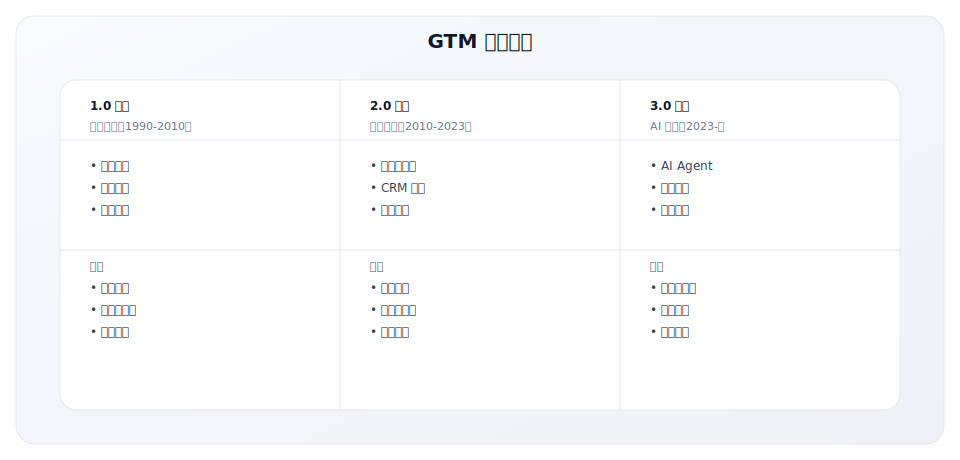

---

## AI-Native 公司的 GTM 特征

AI-Native 公司正在展现出不同于传统软件公司的 GTM 特征：

### 1. 更快的市场进入速度

AI 大幅缩短了从想法到市场的周期：

**传统 vs AI-Native 开发周期**：
| 阶段 | 传统公司 | AI-Native 公司 | 加速倍数 |
|-----|---------|---------------|---------|
| 市场研究 | 4-8周 | 1-2周 | 4x |
| 产品原型 | 8-12周 | 2-4周 | 3x |
| 内容创建 | 4-6周 | 1-2周 | 4x |
| 销售物料 | 2-4周 | 3-5天 | 5x |

**AI 加速的关键领域**：
- **市场调研**：AI 快速分析竞品、客户评论、行业报告
- **内容创作**：AI 生成初稿，人工精调
- **代码开发**：AI 辅助编程，提升效率
- **数据分析**：AI 快速发现洞察

### 2. 超个性化触达

AI 让 1:1 个性化成为可能：

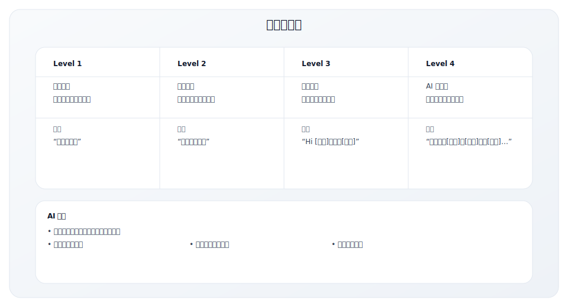

**实际应用**：
- 个性化邮件：基于客户背景定制内容
- 动态网站：根据访客属性展示不同内容
- 智能推荐：基于行为推荐产品/内容
- 对话式营销：AI Chatbot 个性化互动

### 3. 预测性线索评分

AI 让线索评分从规则驱动变为预测驱动：

**传统 vs AI 线索评分**：
| 维度 | 传统规则评分 | AI 预测评分 |
|-----|------------|-----------|
| 评分依据 | 人工定义的规则 | 机器学习模型 |
| 数据来源 | 表单填写、行为 | 全渠道数据 + 外部数据 |
| 更新频率 | 人工调整 | 持续学习优化 |
| 准确性 | 中等 | 高（持续提升） |

**AI 评分的数据维度**：
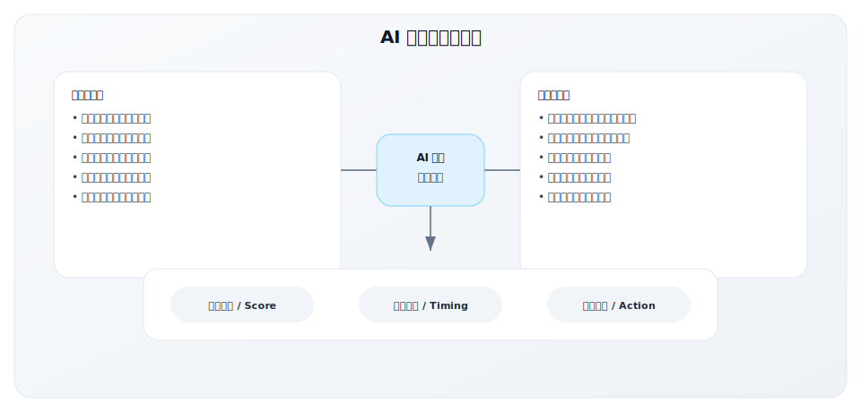

### 4. 自动化销售流程

AI 正在自动化销售的大量重复工作：

**AI SDR（AI 销售开发代表）**：
| 任务 | 传统 SDR | AI SDR |
|-----|---------|--------|
| 研究账户 | 30分钟/账户 | 即时 |
| 撰写邮件 | 10分钟/封 | 即时 |
| 发送节奏 | 人工安排 | 自动优化 |
| 跟进提醒 | 人工管理 | 智能提醒 |
| 会议安排 | 来回邮件 | 自动化工具 |

**AI 销售助手能力**：
- 自动研究目标账户
- 生成个性化触达内容
- 智能安排触达时机
- 自动跟进和提醒
- 对话分析和建议

### 5. 更精细的客户细分

AI 让微观细分成为可能：

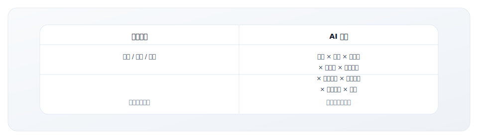

**微观细分的价值**：
- 更精准的 ICP 定义
- 更个性化的信息传递
- 更高效的资源分配
- 更好的转化率

---

## 2024-2025 GTM 趋势数据

### 行业调研数据

| 趋势 | 数据 | 来源 |
|------|------|------|
| AI 采用率 | 70%+ 公司正在 GTM 流程中使用 AI | ICONIQ 2024 |
| 效率提升 | AI 用户每周节省 10-15 小时 | McKinsey 2024 |
| 转化提升 | 使用意图数据的公司转化率高 50-80% | Forrester |
| AI-Native 增速 | AI 原生公司平均增速 80-100% | Battery Ventures |
| 工具整合 | 平均 GTM 技术栈从 15+ 工具整合到 8-10 | Gartner |

### AI-Native 公司的增长优势

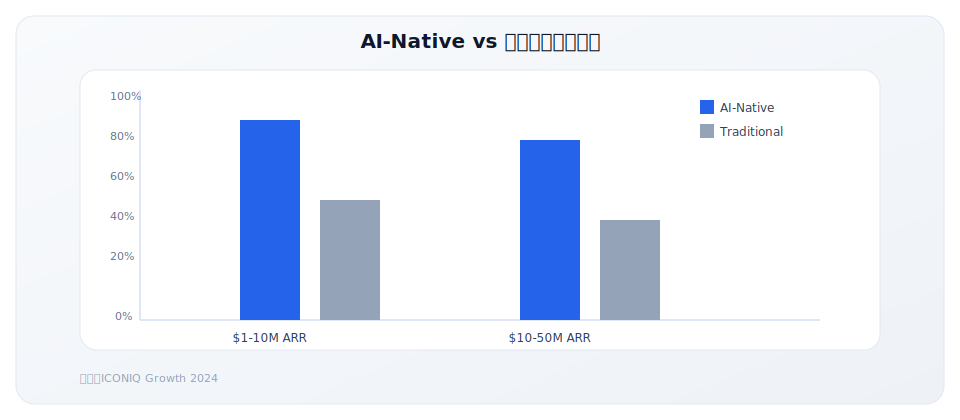

---

## AI 在 GTM 各环节的应用

### Marketing（营销）

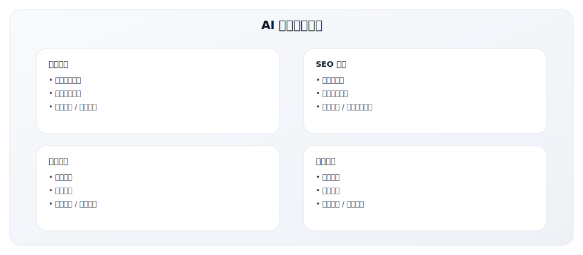

**代表工具**：
| 场景 | 工具示例 |
|-----|---------|
| 内容生成 | Jasper, Copy.ai, Writer |
| SEO | Clearscope, Surfer, MarketMuse |
| 广告 | Albert, Pattern89 |
| 分析 | 6sense, Demandbase |

### Sales（销售）

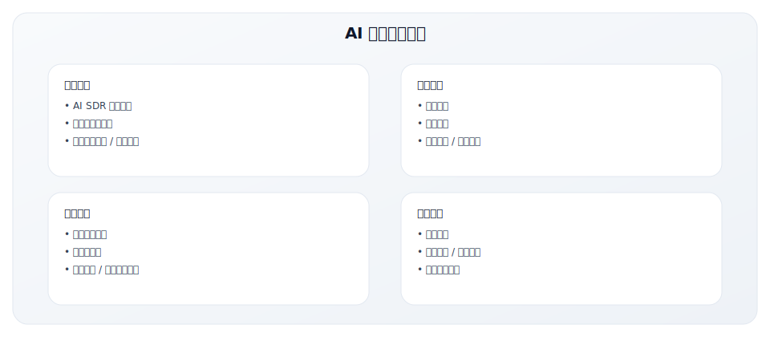

**代表工具**：
| 场景 | 工具示例 |
|-----|---------|
| AI SDR | 11x, Artisan, Regie.ai |
| 销售辅助 | Gong, Chorus, Clari |
| 线索开发 | Apollo, ZoomInfo |
| 预测 | Clari, Aviso |

### Customer Success（客户成功）

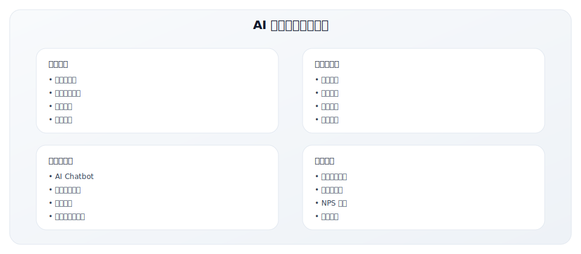

**代表工具**：
| 场景 | 工具示例 |
|-----|---------|
| 客户成功平台 | Gainsight, ChurnZero |
| AI 支持 | Intercom, Zendesk AI |
| 产品分析 | Amplitude, Pendo |

### RevOps（收入运营）


---

## AI GTM 工具栈演进

### 从传统工具到 AI 增强

| 类别 | 传统工具 | AI 增强/原生工具 | 变化 |
|------|----------|-----------------|-----|
| CRM | Salesforce | Salesforce Einstein | AI 嵌入 |
| MAP | Marketo, HubSpot | HubSpot AI, 6sense | AI 原生 |
| Sales Engagement | Outreach, SalesLoft | AI 增强版 | 功能增强 |
| Intent Data | Bombora | 6sense, Demandbase | AI 分析 |
| Conversation Intel | Gong, Chorus | AI 增强分析 | 深度分析 |
| Content | WordPress | Jasper, Writer | AI 生成 |
| SDR | 人工 | 11x, Artisan | AI 替代 |

### AI 原生 GTM 技术栈示例

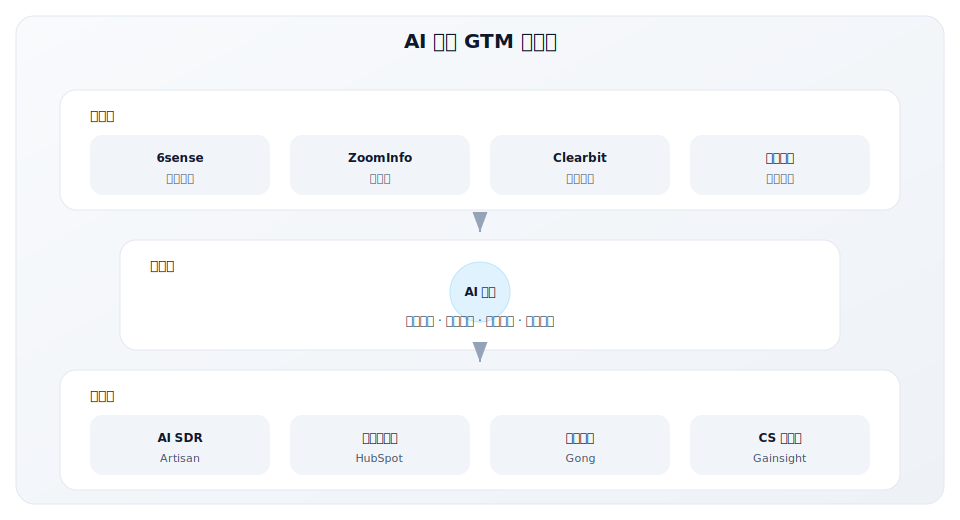

---

## AI GTM 的挑战与应对

### 1. 数据质量依赖

**挑战**：AI 模型的效果取决于数据质量
**应对**：
- 建立数据治理体系
- 持续数据清洗
- 多源数据验证
- 人工审核机制

### 2. 隐私与合规

**挑战**：AI 使用个人数据的合规风险
**应对**：
- 遵守 GDPR、CCPA 等法规
- 数据最小化原则
- 透明的 AI 使用政策
- 客户同意管理

### 3. 人机协作

**挑战**：AI 与人类销售的协作边界
**应对**：
- 明确 AI 处理范围
- 人类负责高价值互动
- AI 做"80%的工作"，人做"20%的决策"
- 持续培训团队使用 AI

### 4. 可解释性

**挑战**：AI 决策的"黑盒"问题
**应对**：
- 选择可解释的模型
- 提供决策依据
- 定期审计模型
- 保留人工覆盖能力

---

## 中国 AI GTM 实践与工具生态

### 中国 AI GTM 的特殊背景

中国市场的 AI GTM 应用有其独特的生态和挑战：

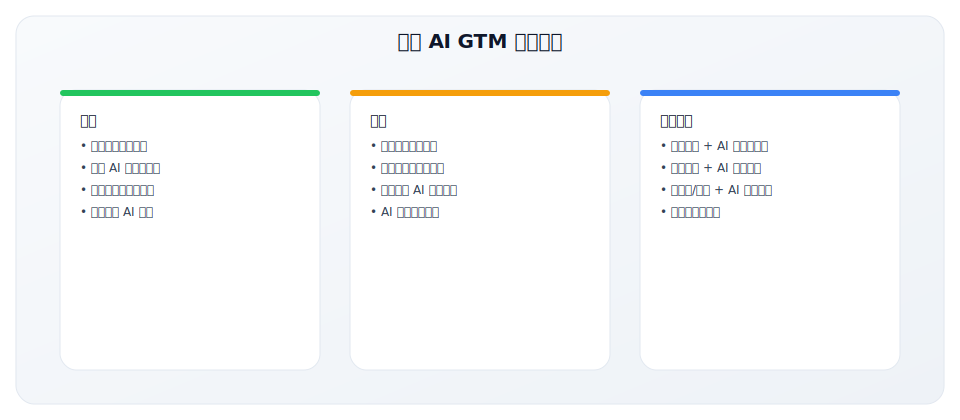

### 中国本土 AI GTM 工具栈

**营销与获客**：

| 场景 | 代表工具 | 核心能力 |
|-----|---------|---------|
| 智能获客 | 探迹、销氪、智齿 | AI 线索挖掘、企业信息 |
| 内容生成 | 文心一言、通义千问、讯飞星火 | 营销文案、图文生成 |
| 广告优化 | 巨量引擎、腾讯广告智能投放 | AI 出价、受众优化 |
| SEO/SEM | 百度营销 AI、爱站 | 关键词优化、竞品分析 |

**销售与 CRM**：

| 场景 | 代表工具 | 核心能力 |
|-----|---------|---------|
| 智能外呼 | 容联七陌、智齿、环信 | AI 机器人外呼、线索筛选 |
| 销售辅助 | 纷享销客 AI、销售易 AI | 商机预测、客户洞察 |
| 会话分析 | 循环智能、探迹 | 销售通话分析、最佳实践 |
| SCRM | 微盛、尘锋、企微云 | 企业微信 AI 助手 |

**客户成功**：

| 场景 | 代表工具 | 核心能力 |
|-----|---------|---------|
| 智能客服 | 智齿、网易七鱼、容联 | AI Chatbot、知识库 |
| 用户分析 | 神策、GrowingIO | 用户行为分析、预测 |
| 健康度预测 | 销售易、纷享销客 | 流失预警、续约预测 |

### 中国企业 AI GTM 应用案例

#### 案例一：探迹的智能销售获客

**公司简介**：探迹是中国领先的智能销售服务提供商，帮助 B2B 企业用 AI 提升获客效率。

**AI 应用场景**：

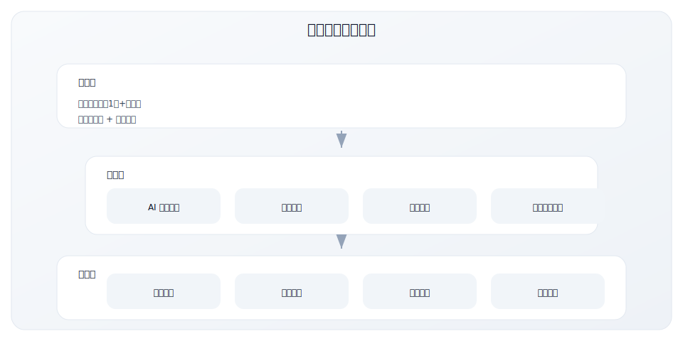

**效果数据**（参考）：
- 线索筛选效率提升 5-10 倍
- 外呼接通率提升 20-30%
- 销售人效提升 50%+

#### 案例二：容联云的 AI 通讯赋能

**公司简介**：容联云是中国领先的智能通讯云服务商，用 AI 赋能企业通讯场景。

**AI 应用场景**：

| 场景 | AI 能力 | 价值 |
|-----|--------|-----|
| 智能外呼 | AI 机器人初筛、意向识别 | 降低人力成本 80% |
| 语音质检 | 自动质检、情绪分析 | 质检效率提升 10 倍 |
| 智能客服 | 多轮对话、知识库自动问答 | 人工坐席减少 50% |
| 会话分析 | 关键词提取、话术建议 | 销售转化率提升 15% |

#### 案例三：企业微信生态的 AI 应用

企业微信已成为中国 B2B GTM 的重要阵地，AI 在其中扮演关键角色：

**SCRM + AI 典型应用**：

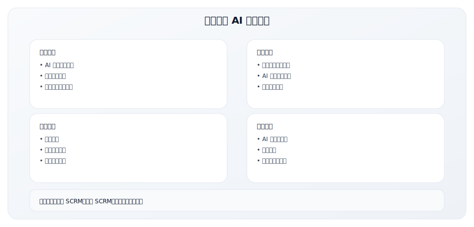

### 中国 AI GTM 的挑战与建议

**挑战**：

| 挑战 | 具体表现 | 建议应对 |
|-----|---------|---------|
| 数据孤岛 | 微信、CRM、官网数据分散 | 优先打通核心数据源 |
| 大模型选择 | 国内外大模型能力差异 | 根据场景选择，混合使用 |
| ROI 证明 | 难以量化 AI 投入产出 | 从单点场景开始，逐步扩展 |
| 人才缺乏 | 既懂 AI 又懂 GTM 的人少 | 培养复合型人才 |

**中国企业 AI GTM 起步建议**：

**第一阶段：单点突破（0-3个月）**
- 选择 1-2 个高价值场景（如智能客服、内容生成）
- 使用成熟的 SaaS 工具，降低试错成本
- 建立效果衡量基线

**第二阶段：流程整合（3-6个月）**
- 将 AI 工具整合到核心 GTM 流程
- 打通关键数据源
- 培训团队使用 AI 工具

**第三阶段：智能升级（6-12个月）**
- 构建企业自有的 AI 能力
- 探索大模型在 GTM 的深度应用
- 形成数据驱动的 GTM 运营体系

---

## GTM 团队的 AI 能力建设

### AI 能力成熟度模型

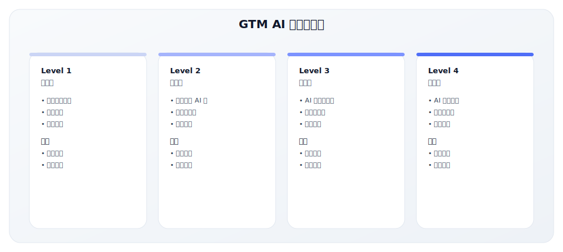

### 能力建设路径

**短期（0-3个月）**：
- [ ] 识别高价值 AI 应用场景
- [ ] 选择 1-2 个 AI 工具试点
- [ ] 培训核心团队成员
- [ ] 建立使用规范

**中期（3-6个月）**：
- [ ] 扩展 AI 工具使用范围
- [ ] 整合 AI 到核心流程
- [ ] 建立效果衡量体系
- [ ] 积累最佳实践

**长期（6-12个月）**：
- [ ] AI 成为 GTM 基础设施
- [ ] 数据驱动的持续优化
- [ ] 组织能力全面升级
- [ ] 探索前沿 AI 应用

---

## 关键要点

- **AI 正在重塑 GTM**：从效率工具到决策引擎，AI 改变游戏规则
- **AI-Native 公司增长更快**：早期采用 AI 的公司获得显著竞争优势
- **AI 是效率工具，不能替代战略**：AI 优化执行，但战略仍需人类决策
- **人机协作是关键**：AI 做重复工作，人做高价值判断
- **数据质量是基础**：没有好数据，AI 无法发挥作用

---

## 实践练习

### 练习 1：AI 应用机会识别

评估你的 GTM 流程中哪些环节可以用 AI 优化：

| GTM 环节 | 当前痛点 | AI 可能的解法 | 优先级 |
|---------|---------|-------------|-------|
| 营销内容 | | | |
| 线索获取 | | | |
| 线索评分 | | | |
| 销售触达 | | | |
| 客户成功 | | | |

### 练习 2：AI 工具选型

调研一个 AI GTM 工具，评估其适用性：

```
工具名称：________________
官网：________________

核心功能：
1. ________________
2. ________________
3. ________________

适用场景：________________

预期价值：
• 效率提升：______%
• 成本节约：$______
• 其他：________________

风险和顾虑：
1. ________________
2. ________________

决策：□ 试用 □ 观望 □ 不适用
```

### 练习 3：AI 影响评估

思考 AI 对你的 GTM 战略的影响：

1. **竞争影响**：竞争对手如果用 AI，会有什么优势？

2. **机会识别**：AI 为你的 GTM 创造了什么新机会？

3. **风险评估**：不采用 AI 的风险是什么？

4. **行动计划**：你的下一步行动是什么？

---

## 延伸阅读

- [3.5 RevOps 体系](../module-03/3.5-revops)
- [3.4 核心指标体系](../module-03/3.4-metrics)
- [2.2 GTM Motion 类型](../module-02/2.2-gtm-motions)

---

## 模块四总结

完成本模块后，你应该：
- ✅ 理解 PLG 公司的 GTM 战略和增长路径
- ✅ 学习 SLG 公司如何攻占企业市场
- ✅ 掌握跨越鸿沟的实战经验
- ✅ 了解 AI 时代 GTM 的新趋势和应用

**下一步**：进入 [模块五：GTM 执行工具包](../module-05/)，获取实用的工具和模板。

---

**写作状态**：审校完成
**最后更新**：2025-12-23
**版本**：v1.1
