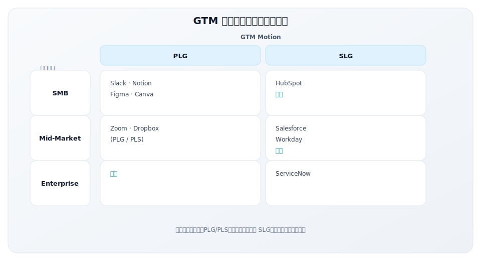

# 模块四：GTM 实战案例深度解析

> **学习目标**：通过经典案例学习 GTM 战略的实际应用
>
> **预计时长**：2 小时
>
> **教学方式**：案例研讨
>
> **前置知识**：模块二与模块三

---

## 核心内容

本节覆盖以下内容：
- 模块概述
- 章节列表
- 案例全景图
- 案例学习方法
- 学习建议

## 模块概述

理论需要案例来落地。本模块选取了不同 GTM Motion、不同市场阶段的经典案例，深度解析它们的 GTM 战略选择、执行路径和成功要素。

通过本模块的学习，你将能够：
- 理解 PLG 公司如何从0到1增长
- 学习 SLG 公司如何攻占企业市场
- 掌握跨越鸿沟的实战经验
- 了解 AI 时代 GTM 的新趋势

---

## 章节列表

| 章节 | 标题 | 核心案例 | 时长 |
|------|------|----------|------|
| 4.1 | [PLG 经典案例](./4.1-plg-cases) | Slack、Notion、Figma、**飞书** | 45分钟 |
| 4.2 | [SLG 经典案例](./4.2-slg-cases) | Salesforce、Workday、ServiceNow、**北森** | 30分钟 |
| 4.3 | [跨越鸿沟案例](./4.3-chasm-cases) | HubSpot、Zoom、**有赞** | 30分钟 |
| 4.4 | [AI 时代 GTM 新范式](./4.4-ai-gtm) | AI-Native 公司特征与趋势、**中国 AI GTM 工具** | 15分钟 |

---

## 案例全景图

---

## 案例学习方法

每个案例将从以下维度进行解析：

1. **背景**：公司背景、市场环境
2. **GTM 战略选择**：Motion、渠道、定位
3. **关键执行要素**：增长引擎、核心策略
4. **数据与结果**：关键指标、增长轨迹
5. **GTM Lesson**：可复用的经验教训

---

## 学习建议

1. 带着问题阅读案例
2. 对比不同案例的异同
3. 思考如何应用到自己的场景
4. 案例讨论时积极参与

---

## 关键要点

- 覆盖 PLG、SLG、跨越鸿沟与 AI GTM 四类代表性案例
- 对比中美公司路径差异，提炼可迁移的策略逻辑
- 用案例反推策略选择与执行取舍

## 实践练习

1. 选择一个案例，写出 3 条你可直接借鉴的策略
2. 结合自己的产品，判断更接近 PLG 还是 SLG 路径
3. 给出你认为最容易被忽视的一条关键因素

## 延伸阅读

- [术语表](../appendix/glossary)
- [推荐阅读](../appendix/reading-list)
- [参考资源](../appendix/resources)

---

**写作状态**：审校完成
**最后更新**：2025-12-23
**版本**：v1.1
