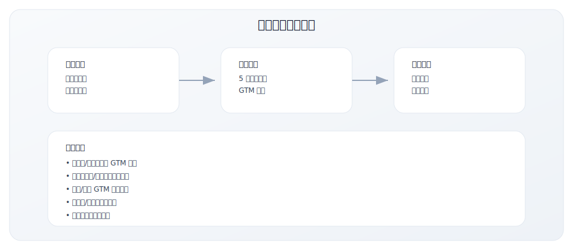
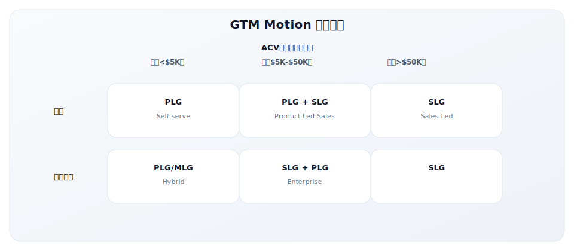
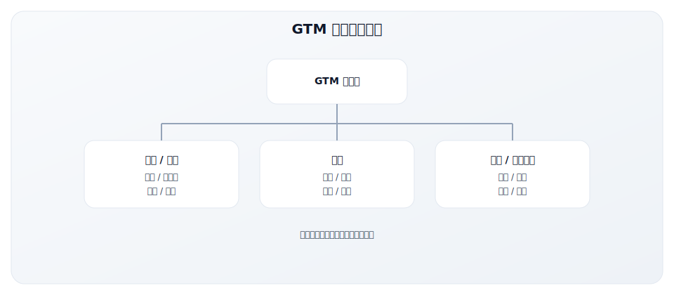

# 5.1 GTM 战略规划模板

> **学习目标**：能够用一页纸模板快速搭建 GTM 战略框架
>
> **预计时长**：30-60 分钟
>
> **前置知识**：了解 ICP、价值主张与 GTM Motion 基础概念
>
> **用途**：快速构建一页纸 GTM 战略框架
>
> **适用场景**：新产品发布、进入新市场、战略评审
>
> **使用时长**：30-60 分钟

---

## 核心内容

本节覆盖以下内容：
- 工具说明
- 一页纸 GTM 战略框架
- 战略一页纸示例
- 常见问题
- 使用说明
- 相关工具

## 工具说明

### 为什么需要一页纸 GTM 战略？



### 如何使用本模板

1. **准备工作**：收集必要的市场数据、客户反馈、竞品信息
2. **团队协作**：最好与产品、销售、营销负责人一起填写
3. **先粗后细**：第一遍快速填写，标注不确定项，后续迭代
4. **定期更新**：建议每季度回顾一次，根据市场变化调整

---

## 一页纸 GTM 战略框架

### 基本信息

| 项目 | 内容 |
|------|------|
| 产品/项目名称 | |
| 填写日期 | |
| 负责人 | |
| 版本号 | |

---

### 1. 目标市场定义

#### ICP 描述

```
我们的理想客户是：
_____________________________________________
_____________________________________________

他们面临的核心问题是：
_____________________________________________
```

**示例**：
```
我们的理想客户是：
50-500人的 B2B SaaS 公司的销售运营负责人，
正在从 Excel 管理销售数据向专业 CRM 过渡。

他们面临的核心问题是：
销售数据分散、Pipeline 可视化差、预测准确率低。
```

#### TAM/SAM/SOM 估算

| 市场 | 定义 | 估算值 | 计算依据 |
|------|------|--------|----------|
| TAM（总可寻址市场） | 全球所有潜在客户的总市场 | $ | |
| SAM（可服务市场） | 我们能触达的细分市场 | $ | |
| SOM（可获取市场） | 短期内可实际获取的份额 | $ | |

**计算方法参考**：
- **自上而下**：市场总规模 × 目标细分占比 × 预期份额
- **自下而上**：目标客户数 × ARPU × 预期转化率

**示例**：
| 市场 | 定义 | 估算值 | 计算依据 |
|------|------|--------|----------|
| TAM | 全球 CRM 市场 | $80B | Gartner 市场报告 2024 |
| SAM | 北美中小企业 CRM | $5B | TAM × 6% 区域细分 |
| SOM | 首年可获取市场 | $50M | 1000 客户 × $50K ACV |

#### 细分市场优先级

| 优先级 | 细分市场 | 规模 | 进入难度 | 选择原因 |
|--------|----------|------|----------|----------|
| P0（首要） | | | 低/中/高 | |
| P1（次要） | | | 低/中/高 | |
| P2（观察） | | | 低/中/高 | |

**优先级评估维度**：
- 市场规模与增长率
- 我们的产品-市场匹配度
- 竞争强度
- 进入壁垒
- 战略协同性

---

### 2. 价值主张

#### 核心问题/痛点

客户面临的前 3 个痛点（按紧迫程度排序）：

| 排序 | 痛点 | 紧迫程度 | 当前解决方案 |
|------|------|----------|-------------|
| 1 | | 高/中/低 | |
| 2 | | 高/中/低 | |
| 3 | | 高/中/低 | |

#### 解决方案差异化

我们的解决方案如何解决这些痛点：
```
_________________________________________________
_________________________________________________
```

**差异化来源检查**：
- [ ] 技术/产品优势
- [ ] 价格优势
- [ ] 服务优势
- [ ] 品牌/信任优势
- [ ] 生态/集成优势
- [ ] 垂直领域专业性

#### 定位声明（April Dunford 公式）

```
For [目标客户]
_______________________________________________

Who [面临的问题/需求]
_______________________________________________

Our [产品/服务]
_______________________________________________

Is a [品类]
_______________________________________________

That [关键利益/差异化]
_______________________________________________

Unlike [竞争替代品]
_______________________________________________

We [独特差异点]
_______________________________________________
```

**示例**（Slack 早期定位）：
```
For 科技公司的团队
Who 被邮件淹没、信息散落在各处
Our Slack
Is a 团队协作中心
That 让工作沟通变得简单、愉快、高效
Unlike 传统邮件和聊天工具
We 整合所有工作应用，让信息可搜索、可追溯
```

---

### 3. GTM Motion 选择

#### Motion 类型

- [ ] **PLG**（产品驱动增长）：用户自助注册、试用、转化
- [ ] **SLG**（销售驱动增长）：销售团队主导获客和转化
- [ ] **MLG**（营销驱动增长）：营销主导品牌和线索生成
- [ ] **CLG**（社区驱动增长）：社区和口碑驱动增长
- [ ] **Hybrid**（混合模式）：_______________

#### Motion 选择决策框架



#### 选择理由

```
我们选择 [Motion] 的原因：
_________________________________________________
_________________________________________________
```

#### 渠道组合

| 渠道 | 权重 | 策略描述 | KPI |
|------|------|----------|-----|
| Direct Sales | % | | |
| Channel/Partner | % | | |
| Self-serve/PLG | % | | |
| Marketplace | % | | |
| **总计** | 100% | | |

#### 合作伙伴策略

```
核心合作伙伴类型：
_________________________________________________

合作模式：
_________________________________________________
```

---

### 4. 定价与包装

#### 定价模型

- [ ] **Subscription**（订阅）：按月/年固定费用
- [ ] **Usage-Based**（用量）：按使用量计费
- [ ] **Seat-Based**（席位）：按用户数计费
- [ ] **Tiered**（阶梯）：按功能/规模分层
- [ ] **Freemium**：免费 + 付费升级
- [ ] **Hybrid**（混合）：_______________

#### 定价策略考量

| 考量因素 | 我们的选择 | 原因 |
|----------|-----------|------|
| 定价锚点 | | |
| 竞品对比 | | |
| 价值感知 | | |
| 扩展路径 | | |

#### 套餐结构

| 套餐 | 价格 | 目标客户 | 核心功能 | 限制 |
|------|------|----------|----------|------|
| Free | $0 | | | |
| Starter | $/月 | | | |
| Pro | $/月 | | | |
| Enterprise | 询价 | | | |

**定价最佳实践**：
- 套餐数量控制在 3-4 个
- 每个套餐有明确的目标客户
- 套餐之间有清晰的升级路径
- 功能差异化要有意义

#### 试用/免费策略

```
试用策略：
[ ] 免费试用期：_____ 天
[ ] Freemium 永久免费层
[ ] 无试用，直接付费

试用转化目标：_____%

关键转化触发点：
_________________________________________________
```

---

### 5. 目标与指标

#### 北极星指标

```
指标名称：_______________________________________________
定义：_______________________________________________
当前值：_______________
12个月目标值：_______________
```

**北极星指标选择参考**：

| GTM Motion | 推荐北极星指标 |
|------------|---------------|
| PLG | Weekly Active Users, Product Qualified Leads |
| SLG | ARR, Pipeline Coverage |
| Hybrid | Net Revenue Retention, Qualified Opportunities |

#### 漏斗 KPIs

| 阶段 | 指标 | 当前值 | 目标值 | 差距 |
|------|------|--------|--------|------|
| Awareness | 网站访客/月 | | | |
| Lead | 新增线索/月 | | | |
| MQL | 市场合格线索/月 | | | |
| SQL | 销售合格线索/月 | | | |
| Opportunity | 新增商机/月 | | | |
| Customer | 新增客户/月 | | | |

#### 效率指标

| 指标 | 当前值 | 目标值 | 健康基准 |
|------|--------|--------|----------|
| CAC | $ | $ | 因行业而异 |
| LTV | $ | $ | |
| LTV:CAC | :1 | :1 | > 3:1 |
| CAC Payback | 月 | 月 | < 12 月 |
| Magic Number | | | > 0.7 |

#### 里程碑时间线

| 里程碑 | 目标 | 关键成果 |
|--------|------|----------|
| M1 | | |
| M2 | | |
| M3 | | |
| M4 | | |

---

### 6. 资源与团队

#### 组织结构



#### 关键角色

| 角色 | 职责 | 当前状态 | 优先级 |
|------|------|----------|--------|
| | | [ ] 到位 [ ] 待招 | P0/P1/P2 |
| | | [ ] 到位 [ ] 待招 | P0/P1/P2 |
| | | [ ] 到位 [ ] 待招 | P0/P1/P2 |
| | | [ ] 到位 [ ] 待招 | P0/P1/P2 |

#### 预算分配

| 类别 | 预算 | 占比 | 说明 |
|------|------|------|------|
| 人员（薪酬+福利） | $ | % | |
| 营销投放 | $ | % | |
| 工具/软件 | $ | % | |
| 活动/差旅 | $ | % | |
| 内容/创意 | $ | % | |
| 其他 | $ | % | |
| **总计** | $ | 100% | |

**预算分配参考基准**：
- 早期公司：营销 15-20% of Revenue
- 成长期公司：营销 10-15% of Revenue
- 成熟期公司：营销 5-10% of Revenue

---

## 战略一页纸示例

### 示例：B2B SaaS 销售协作工具


---

## 常见问题

### Q1: 多久需要更新一次 GTM 战略？

建议频率：
- **全面更新**：每年一次，通常在年度规划时
- **检查调整**：每季度一次，根据业绩和市场变化
- **紧急更新**：当发生重大市场变化时（竞品动作、客户反馈等）

### Q2: 战略中最重要的是哪部分？

优先级排序：
1. **ICP 定义**：决定了所有后续战略的基础
2. **价值主张/定位**：决定了如何赢得客户
3. **GTM Motion**：决定了执行路径
4. **指标体系**：决定了如何衡量成功

### Q3: 如何处理不确定性？

- 明确标注假设（用不同颜色或标记）
- 设定验证假设的方法和时间线
- 准备 Plan B 应对不同场景
- 快速迭代，不追求第一版完美

---

## 使用说明

1. **第一次使用**：尽量完整填写，标注不确定的假设
2. **定期回顾**：建议每季度 Review 一次
3. **团队协作**：最好在团队讨论中共同填写
4. **迭代更新**：随着市场变化持续更新
5. **配合使用**：与本模块其他工具配合使用效果更佳

---

## 相关工具

- [5.2 ICP 定义工作表](./5.2-icp-worksheet) - 深入定义理想客户
- [5.3 竞争定位矩阵](./5.3-competitive-matrix) - 分析竞争格局
- [5.5 GTM 里程碑规划表](./5.5-milestone-plan) - 详细规划执行

---

## 关键要点

- 一页纸模板确保 GTM 核心要素完整且清晰
- 先粗后细，用假设标注不确定项并持续验证
- 以团队共识与定期复盘作为落地保障

## 实践练习

1. 选择一个真实产品，完整填写一页纸 GTM 模板
2. 标注 3 个关键假设，并写出验证方式与时间点
3. 与团队评审模板，记录行动项与负责人

## 延伸阅读

- [2.3 ICP 构建方法论](../module-02/2.3-icp-methodology)
- [2.4 价值主张设计](../module-02/2.4-value-proposition)
- [2.2 GTM Motion 类型](../module-02/2.2-gtm-motions)

---

**写作状态**：审校完成
**最后更新**：2025-12-23
**版本**：v1.1
