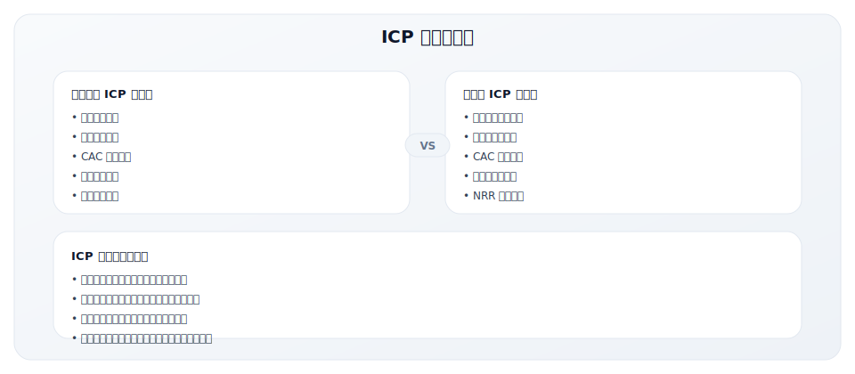
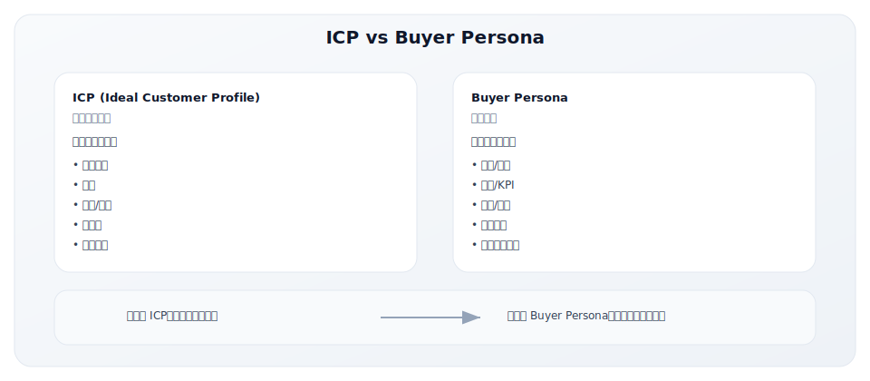
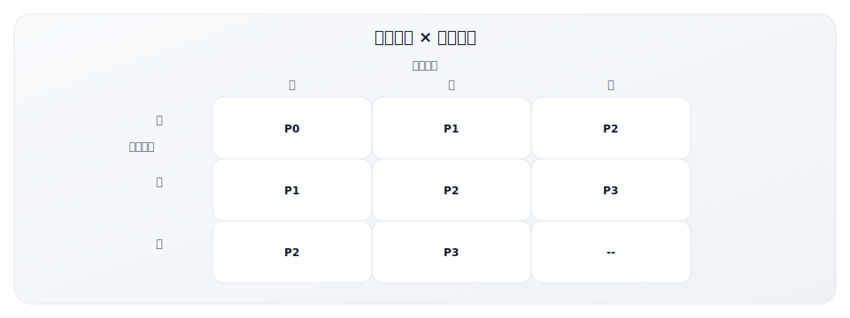
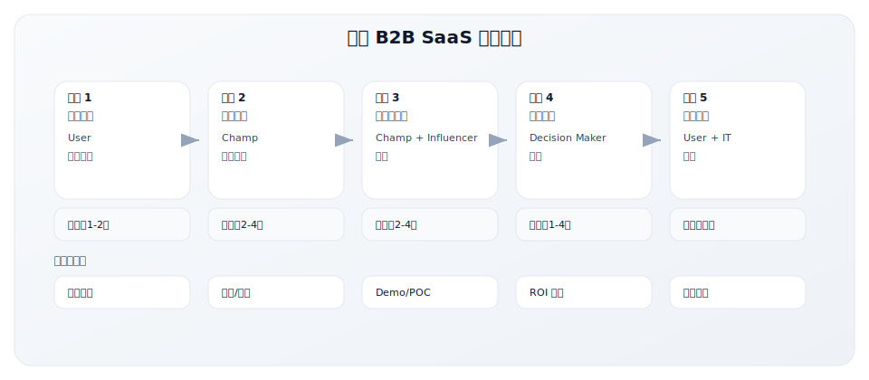

# 5.2 ICP 定义工作表

> **学习目标**：能够定义清晰可执行的理想客户画像（ICP）
>
> **预计时长**：45-60 分钟
>
> **前置知识**：了解目标市场与客户分层基础
>
> **用途**：定义精准的理想客户画像
>
> **适用场景**：GTM 规划、营销策略制定、销售团队培训
>
> **使用时长**：45-60 分钟

---

## 核心内容

本节覆盖以下内容：
- 工具说明
- ICP 定义工作表
- 第一部分：Firmographics（企业特征）
- 第二部分：Technographics（技术特征）
- 第三部分：Psychographics（心理特征）
- 第四部分：Pain Points（痛点分析）

## 工具说明

### 为什么 ICP 如此重要？



### ICP vs Buyer Persona



---

## ICP 定义工作表

### 基本信息

| 项目 | 内容 |
|------|------|
| 公司/产品名称 | |
| 填写日期 | |
| 负责人 | |
| 版本号 | |

### ICP 一句话描述

```
我们的理想客户是 [行业] 的 [规模] 公司，
他们正在 [触发事件/挑战]，
需要 [我们提供的价值]。
```

**示例**：
```
我们的理想客户是 B2B SaaS 行业的 50-500人 公司，
他们正在 快速扩张销售团队但 CRM 无法支撑规模化管理，
需要 一个易用且能与现有工具集成的现代化 CRM。
```

---

## 第一部分：Firmographics（企业特征）

### 基础企业特征

| 维度 | 理想客户特征 | 排除标准 | 数据来源 |
|------|-------------|----------|----------|
| **行业** | | | |
| **二级行业** | | | |
| **员工规模** | | | |
| **年收入** | | | |
| **地理位置** | | | |
| **公司年龄** | | | |

### 企业成长特征

| 维度 | 理想客户特征 | 排除标准 |
|------|-------------|----------|
| **成长阶段** | [ ] 初创期 [ ] 成长期 [ ] 成熟期 [ ] 转型期 | |
| **融资阶段** | [ ] 天使轮 [ ] A轮 [ ] B轮 [ ] C轮+ [ ] 已上市 [ ] 自盈利 | |
| **增长速度** | [ ] 高增长(>50%) [ ] 稳定增长(20-50%) [ ] 平稳(<20%) | |
| **盈利状况** | [ ] 盈利 [ ] 亏损但有融资 [ ] 现金流紧张 | |

**示例（B2B SaaS CRM 产品）**：
| 维度 | 理想客户特征 | 排除标准 |
|------|-------------|----------|
| 行业 | B2B SaaS、专业服务、科技 | 政府、医疗（合规复杂） |
| 员工规模 | 50-500人 | <20人（太小）、>2000人（需企业级） |
| 年收入 | $5M-$100M | <$1M（预算不足） |
| 地理位置 | 北美、西欧、中国一线城市 | 发展中市场（支付能力弱） |
| 融资阶段 | A轮-C轮 或 自盈利 | 天使轮（不稳定） |

---

## 第二部分：Technographics（技术特征）

### 现有技术栈

| 类别 | 理想客户使用的工具 | 集成重要性 |
|------|-------------------|-----------|
| CRM | | [ ] 必须 [ ] 重要 [ ] 可选 |
| 营销自动化 | | [ ] 必须 [ ] 重要 [ ] 可选 |
| 沟通协作 | | [ ] 必须 [ ] 重要 [ ] 可选 |
| 数据/分析 | | [ ] 必须 [ ] 重要 [ ] 可选 |
| 其他关键工具 | | [ ] 必须 [ ] 重要 [ ] 可选 |

### 技术成熟度

| 维度 | 理想客户特征 | 排除标准 |
|------|-------------|----------|
| **技术采用曲线** | [ ] 创新者 [ ] 早期采用者 [ ] 早期大众 [ ] 晚期大众 | |
| **数字化程度** | [ ] 领先 [ ] 中等 [ ] 落后 | |
| **IT 团队规模** | | |
| **云 vs 本地** | [ ] 全云 [ ] 混合 [ ] 主要本地 | |

### 合规与安全要求

| 要求 | 客户是否需要 | 我们是否满足 |
|------|-------------|-------------|
| SOC 2 | [ ] 是 [ ] 否 | [ ] 是 [ ] 否 |
| GDPR | [ ] 是 [ ] 否 | [ ] 是 [ ] 否 |
| HIPAA | [ ] 是 [ ] 否 | [ ] 是 [ ] 否 |
| ISO 27001 | [ ] 是 [ ] 否 | [ ] 是 [ ] 否 |
| 行业特定合规 | | [ ] 是 [ ] 否 |

---

## 第三部分：Psychographics（心理特征）

### 组织文化与决策风格

| 维度 | 理想客户特征 | 说明 |
|------|-------------|------|
| **创新倾向** | [ ] 先驱者 [ ] 快速跟随 [ ] 保守 | |
| **决策速度** | [ ] 快速(<1月) [ ] 中等(1-3月) [ ] 缓慢(>3月) | |
| **决策风格** | [ ] 自上而下 [ ] 共识驱动 [ ] 冠军主导 | |
| **购买行为** | [ ] 自助购买 [ ] 需要Demo [ ] 需要正式RFP | |
| **风险偏好** | [ ] 愿意尝试新产品 [ ] 需要案例背书 [ ] 极度风险规避 | |

### 价值观与优先级

客户最看重什么？（选择前3项）

- [ ] 产品功能完整性
- [ ] 易用性/用户体验
- [ ] 价格竞争力
- [ ] 集成能力
- [ ] 客户支持质量
- [ ] 品牌/公司信誉
- [ ] 实施速度
- [ ] 定制化能力
- [ ] 安全/合规
- [ ] 创新性

---

## 第四部分：Pain Points（痛点分析）

### 核心痛点深度分析

**痛点 #1**
| 维度 | 描述 |
|------|------|
| 痛点描述 | |
| 紧迫程度 | [ ] 严重（影响核心业务） [ ] 中等（造成不便） [ ] 轻微 |
| 影响范围 | [ ] 全公司 [ ] 部门级 [ ] 个人级 |
| 当前解决方案 | |
| 当前方案的不足 | |
| 我们如何解决 | |
| 客户愿意支付 | $____/年 |

**痛点 #2**
| 维度 | 描述 |
|------|------|
| 痛点描述 | |
| 紧迫程度 | [ ] 严重 [ ] 中等 [ ] 轻微 |
| 影响范围 | [ ] 全公司 [ ] 部门级 [ ] 个人级 |
| 当前解决方案 | |
| 当前方案的不足 | |
| 我们如何解决 | |
| 客户愿意支付 | $____/年 |

**痛点 #3**
| 维度 | 描述 |
|------|------|
| 痛点描述 | |
| 紧迫程度 | [ ] 严重 [ ] 中等 [ ] 轻微 |
| 影响范围 | [ ] 全公司 [ ] 部门级 [ ] 个人级 |
| 当前解决方案 | |
| 当前方案的不足 | |
| 我们如何解决 | |
| 客户愿意支付 | $____/年 |

### 痛点优先级矩阵



---

## 第五部分：Buying Signals（购买信号）

### 触发事件

哪些事件会触发客户的购买需求？

| 触发事件类型 | 具体表现 | 如何发现 | 优先级 |
|-------------|---------|----------|--------|
| **融资事件** | | ZoomInfo, Crunchbase | [ ] 高 [ ] 中 [ ] 低 |
| **团队扩张** | | LinkedIn, 招聘网站 | [ ] 高 [ ] 中 [ ] 低 |
| **领导层变动** | | LinkedIn, 新闻 | [ ] 高 [ ] 中 [ ] 低 |
| **竞品使用问题** | | G2, Gartner 评论 | [ ] 高 [ ] 中 [ ] 低 |
| **业务痛点** | | 客户访谈, 销售反馈 | [ ] 高 [ ] 中 [ ] 低 |
| **合规要求** | | 行业新闻 | [ ] 高 [ ] 中 [ ] 低 |
| **现有工具到期** | | 销售跟进 | [ ] 高 [ ] 中 [ ] 低 |

### 意图数据信号

| 信号类型 | 具体表现 | 权重 | 数据来源 |
|----------|---------|------|----------|
| **搜索行为** | 搜索相关关键词 | | Google Ads, SEMrush |
| **内容消费** | 下载白皮书、看案例 | | 营销自动化系统 |
| **网站访问** | 多次访问定价页、产品页 | | 网站分析工具 |
| **社交互动** | 关注、评论、分享 | | 社交监控工具 |
| **竞品研究** | 访问竞品评论网站 | | Bombora, 6sense |

### 购买信号评分模型示例

```
总分 = 企业特征分(40%) + 行为信号分(40%) + 互动分(20%)

企业特征分：
- 符合 ICP 行业：+20分
- 符合规模要求：+15分
- 符合融资阶段：+5分

行为信号分：
- 访问定价页：+15分
- 下载白皮书：+10分
- 申请Demo：+15分

互动分：
- 邮件打开率>30%：+10分
- 参加Webinar：+10分

阈值：
- 70分以上：热线索(Hot)
- 50-69分：温线索(Warm)
- 50分以下：冷线索(Cold)
```

---

## 第六部分：Decision Makers（决策者）

### 购买委员会角色

| 角色 | 职位示例 | 关注点 | 影响力 | 沟通策略 |
|------|----------|--------|--------|----------|
| **Champion（倡导者）** | | | [ ] 高 [ ] 中 [ ] 低 | |
| **Decision Maker（决策者）** | | | [ ] 高 [ ] 中 [ ] 低 | |
| **Economic Buyer（预算持有者）** | | | [ ] 高 [ ] 中 [ ] 低 | |
| **Influencer（影响者）** | | | [ ] 高 [ ] 中 [ ] 低 | |
| **End User（最终用户）** | | | [ ] 高 [ ] 中 [ ] 低 | |
| **Blocker（反对者）** | | | [ ] 高 [ ] 中 [ ] 低 | |

### 决策者画像示例

**Champion 画像**
```
职位：销售运营经理 / RevOps 负责人
年龄：28-40岁
汇报对象：VP Sales 或 CRO
日常痛点：
- 花太多时间在数据整理上
- CRM 数据质量差，预测不准
- 各团队数据割裂

他们的 KPI：
- 销售效率提升
- 预测准确率
- 数据驱动决策

信息获取渠道：
- LinkedIn
- RevOps 社区
- 行业播客

打动他们的信息：
- ROI 案例
- 同行使用案例
- 实施简单快速
```

### 典型决策流程



---

## 第七部分：Lincoln Murphy 7 标准验证

Lincoln Murphy 提出的 7 个 ICP 验证标准：

| 标准 | 定义 | 我们的理想客户 | 评分 (1-5) |
|------|------|---------------|------------|
| **Ready** | 知道自己有问题，有紧迫感 | | |
| **Willing** | 愿意改变，愿意采取行动 | | |
| **Able** | 有预算、有决策权、有能力实施 | | |
| **Successful** | 能从我们的产品获得成功 | | |
| **Profitable** | 对我们而言是盈利的客户 | | |
| **Expansion** | 有持续扩展的潜力 | | |
| **Advocacy** | 成功后愿意推荐给他人 | | |

**评分标准**：
- 5分：完全符合
- 4分：基本符合
- 3分：部分符合
- 2分：较弱
- 1分：不符合

**总分**：_____ / 35

**评估**：
- 30-35分：理想客户
- 25-29分：好客户
- 20-24分：可接受
- <20分：需要重新评估

---

## ICP 总结

### 理想客户画像完整描述

```
[基于以上分析，写一段 3-5 句话的理想客户画像描述]
_________________________________________________
_________________________________________________
_________________________________________________
_________________________________________________
_________________________________________________
```

**示例**：
```
我们的理想客户是北美地区 50-500 人的 B2B SaaS 公司，
年收入在 $5M-$100M 之间，处于 A-C 轮融资阶段。
他们的销售团队正在快速扩张（10-50 人），
但现有 CRM（通常是基础版 Salesforce 或 HubSpot）无法支撑规模化管理。
他们的销售运营负责人正在寻找一个易用、集成能力强的现代化 CRM，
愿意在 3 个月内做出购买决策，预算在 $20K-$100K/年。
```

### Top 5 ICP 识别标准

| 排序 | 识别标准 | 权重 |
|------|---------|------|
| 1 | | % |
| 2 | | % |
| 3 | | % |
| 4 | | % |
| 5 | | % |
| **总计** | | 100% |

### 明确排除标准（Negative ICP）

| 排序 | 排除标准 | 原因 |
|------|---------|------|
| 1 | | |
| 2 | | |
| 3 | | |

---

## ICP 应用指南

### 营销应用

| 应用场景 | 如何使用 ICP |
|----------|-------------|
| 广告定向 | 根据 Firmographics 设定 LinkedIn/Google 定向 |
| 内容创作 | 围绕痛点和购买阶段创建内容 |
| Lead Scoring | 根据 ICP 标准设定评分规则 |
| ABM 名单 | 筛选符合 ICP 的目标账户 |

### 销售应用

| 应用场景 | 如何使用 ICP |
|----------|-------------|
| 线索优先级 | 优先跟进高 ICP 匹配度的线索 |
| 资格审核 | 使用 ICP 标准作为 BANT 补充 |
| 销售话术 | 根据痛点和决策者定制话术 |
| 竞争应对 | 根据当前解决方案定制策略 |

### 产品应用

| 应用场景 | 如何使用 ICP |
|----------|-------------|
| 功能优先级 | 优先开发 ICP 最需要的功能 |
| 集成优先级 | 优先集成 ICP 最常用的工具 |
| 定价策略 | 根据 ICP 的支付意愿定价 |
| 产品定位 | 围绕 ICP 痛点定位产品 |

---

## 常见问题

### Q1: ICP 应该多具体？

**平衡原则**：
- 太宽泛：无法指导行动
- 太狭窄：市场太小

建议：从具体开始，验证后再逐步扩展。

### Q2: 可以有多个 ICP 吗？

可以，但建议：
- 早期公司：专注 1 个 ICP
- 成长期公司：2-3 个 ICP（按优先级排序）
- 成熟公司：可以有更多，但每个都需要配套的 GTM 策略

### Q3: 多久更新一次 ICP？

- **全面更新**：每年一次
- **检查调整**：每季度一次
- **触发更新**：
  - 赢单/丢单模式发生变化
  - 进入新市场
  - 推出新产品
  - 竞争格局变化

---

## 使用说明

1. **数据驱动**：尽量基于现有客户数据填写
2. **团队共识**：与销售、产品、客户成功团队共同讨论
3. **定期更新**：每季度检查 ICP 是否需要调整
4. **实际应用**：用于营销素材、销售培训、线索评分

---

## 相关工具

- [5.1 GTM 战略规划模板](./5.1-strategy-template.md) - 整体战略框架
- [5.3 竞争定位矩阵](./5.3-competitive-matrix.md) - 竞争分析
- [5.4 漏斗诊断检查表](./5.4-funnel-checklist.md) - 评估 ICP 效果

---

## 关键要点

- ICP 需要基于数据与事实，而非主观想象
- 明确 ICP 与 Buyer Persona 的差异与应用场景
- 通过定期复盘保持 ICP 的有效性

## 实践练习

1. 选择一个真实产品，完成 ICP 工作表的首版填写
2. 标注 3 个最关键筛选条件并说明理由
3. 与销售/市场团队对齐，记录分歧与改进

## 延伸阅读

- [2.3 ICP 构建方法论](../module-02/2.3-icp-methodology.md)
- [2.5 市场定位策略](../module-02/2.5-positioning.md)
- [5.1 GTM 战略规划模板](./5.1-strategy-template.md)

---

**写作状态**：审校完成
**最后更新**：2025-12-23
**版本**：v1.1
