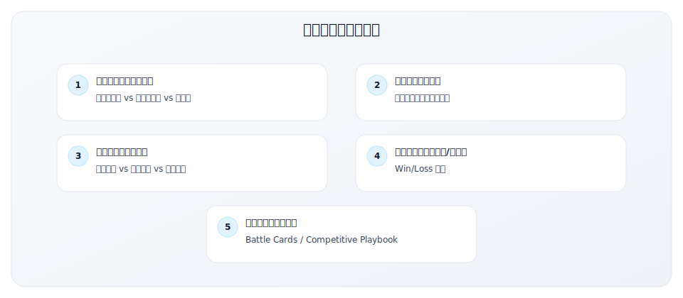
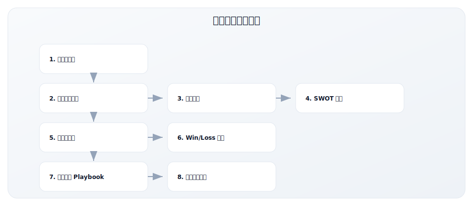
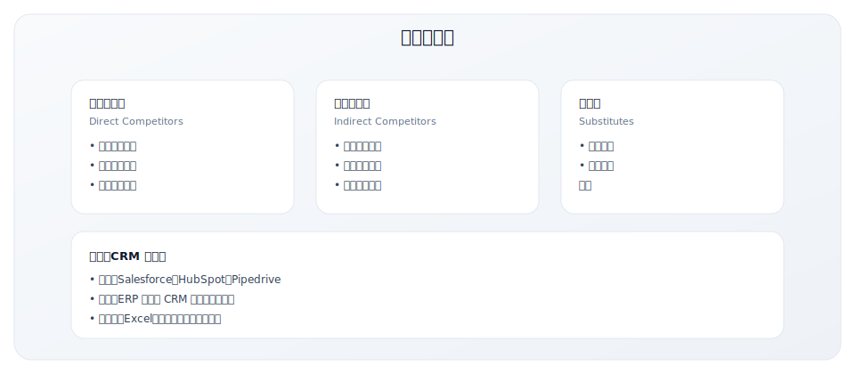
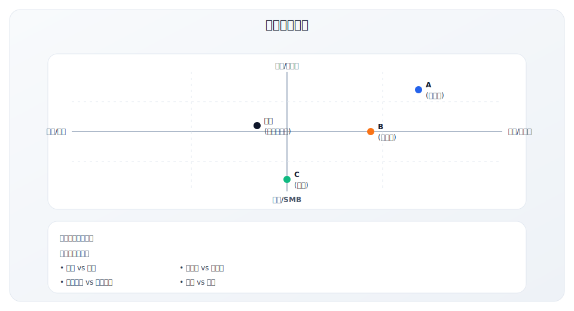
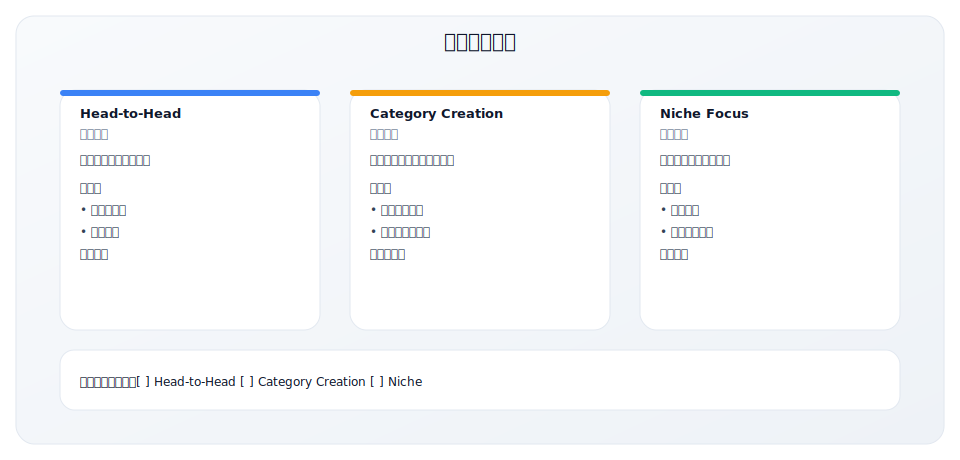
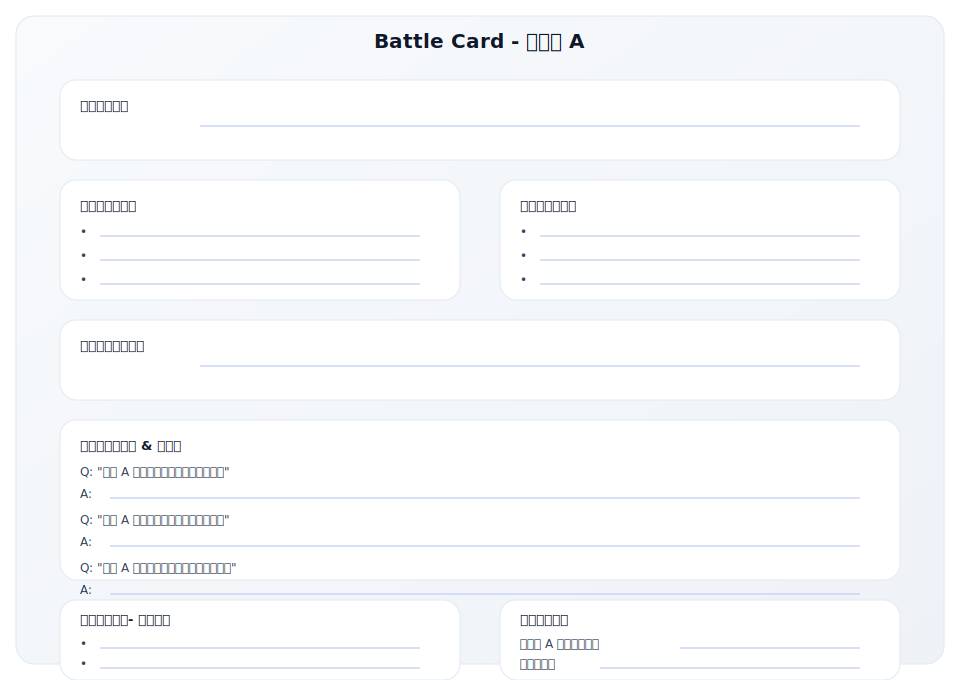
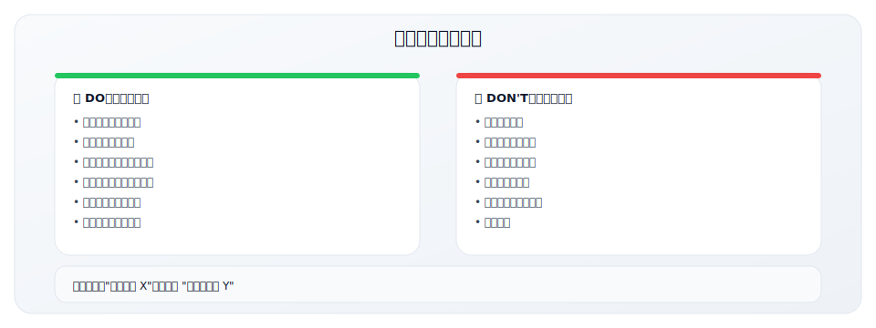
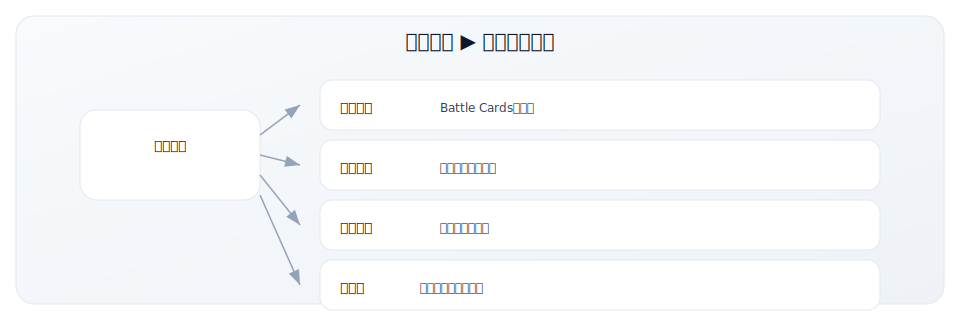

# 5.3 竞争定位矩阵

> **学习目标**：能够构建竞争定位矩阵并识别差异化
>
> **预计时长**：60-90 分钟
>
> **前置知识**：了解 ICP 与价值主张基础
>
> **用途**：分析竞争格局，明确差异化定位
>
> **适用场景**：GTM 规划、销售培训、投资者沟通
>
> **使用时长**：60-90 分钟

---

## 核心内容

本节覆盖以下内容：
- 工具说明
- 竞争定位矩阵工作表
- 第一部分：竞争者识别
- 第二部分：竞争定位矩阵
- 第三部分：功能对比矩阵
- 第四部分：SWOT 对比分析

## 工具说明

### 为什么需要竞争分析？



### 竞争分析框架



---

## 竞争定位矩阵工作表

### 基本信息

| 项目 | 内容 |
|------|------|
| 产品/公司名称 | |
| 填写日期 | |
| 负责人 | |
| 版本号 | |

---

## 第一部分：竞争者识别

### 竞争者分类框架



### 竞争者列表

| 竞争对手 | 类型 | 威胁程度 | 关注优先级 |
|----------|------|----------|-----------|
| | [ ] 直接 [ ] 间接 [ ] 替代品 | [ ] 高 [ ] 中 [ ] 低 | P0/P1/P2 |
| | [ ] 直接 [ ] 间接 [ ] 替代品 | [ ] 高 [ ] 中 [ ] 低 | P0/P1/P2 |
| | [ ] 直接 [ ] 间接 [ ] 替代品 | [ ] 高 [ ] 中 [ ] 低 | P0/P1/P2 |
| | [ ] 直接 [ ] 间接 [ ] 替代品 | [ ] 高 [ ] 中 [ ] 低 | P0/P1/P2 |
| | [ ] 直接 [ ] 间接 [ ] 替代品 | [ ] 高 [ ] 中 [ ] 低 | P0/P1/P2 |
| 现状（不改变） | 替代品 | [ ] 高 [ ] 中 [ ] 低 | |

**威胁程度评估标准**：
- **高**：经常在竞标中遇到，客户主动提及
- **中**：偶尔遇到，部分客户群重叠
- **低**：很少直接竞争，但需要关注

---

## 第二部分：竞争定位矩阵

### 核心定位对比

| 维度 | 我们 | 竞争者 A | 竞争者 B | 竞争者 C |
|------|------|----------|----------|----------|
| **公司名称** | | | | |
| **成立年份** | | | | |
| **融资/估值** | | | | |
| **员工规模** | | | | |
| **主要市场** | | | | |
| **目标客户规模** | | | | |
| **核心价值主张** | | | | |
| **定价区间** | | | | |
| **GTM Motion** | | | | |
| **主要获客渠道** | | | | |
| **知名客户** | | | | |

### 定位地图可视化



**你的定位地图**：

纵轴：________________
横轴：________________

---

## 第三部分：功能对比矩阵

### 核心功能对比

| 功能/能力 | 重要性 | 我们 | 竞争者 A | 竞争者 B | 竞争者 C |
|-----------|--------|------|----------|----------|----------|
| | [ ] 关键 [ ] 重要 [ ] 一般 | | | | |
| | [ ] 关键 [ ] 重要 [ ] 一般 | | | | |
| | [ ] 关键 [ ] 重要 [ ] 一般 | | | | |
| | [ ] 关键 [ ] 重要 [ ] 一般 | | | | |
| | [ ] 关键 [ ] 重要 [ ] 一般 | | | | |
| | [ ] 关键 [ ] 重要 [ ] 一般 | | | | |
| | [ ] 关键 [ ] 重要 [ ] 一般 | | | | |
| | [ ] 关键 [ ] 重要 [ ] 一般 | | | | |

**评分说明**：
- ✓✓ 领先（行业最佳）
- ✓ 具备（满足需求）
- △ 部分具备（基础能力）
- ✗ 不具备
- 🚀 开发中

### 非功能性对比

| 维度 | 我们 | 竞争者 A | 竞争者 B | 竞争者 C |
|------|------|----------|----------|----------|
| **易用性** | | | | |
| **实施时间** | | | | |
| **客户支持** | | | | |
| **文档质量** | | | | |
| **集成生态** | | | | |
| **安全合规** | | | | |
| **价格竞争力** | | | | |
| **品牌认知度** | | | | |

---

## 第四部分：SWOT 对比分析

### 我们的 SWOT

| Strengths（优势） | Weaknesses（劣势） |
|-------------------|-------------------|
| 1. | 1. |
| 2. | 2. |
| 3. | 3. |

| Opportunities（机会） | Threats（威胁） |
|----------------------|-----------------|
| 1. | 1. |
| 2. | 2. |
| 3. | 3. |

### 主要竞争者 SWOT

**竞争者 A：__________**

| Strengths | Weaknesses |
|-----------|------------|
| 1. | 1. |
| 2. | 2. |

| Opportunities | Threats |
|---------------|---------|
| 1. | 1. |
| 2. | 2. |

**竞争者 B：__________**

| Strengths | Weaknesses |
|-----------|------------|
| 1. | 1. |
| 2. | 2. |

| Opportunities | Threats |
|---------------|---------|
| 1. | 1. |
| 2. | 2. |

---

## 第五部分：差异化策略

### 差异化机会分析

| 差异化点 | 描述 | 客户价值 | 可持续性 | 优先级 |
|----------|------|----------|----------|--------|
| | | | [ ] 高 [ ] 中 [ ] 低 | P0/P1/P2 |
| | | | [ ] 高 [ ] 中 [ ] 低 | P0/P1/P2 |
| | | | [ ] 高 [ ] 中 [ ] 低 | P0/P1/P2 |

**差异化可持续性评估**：
- **高**：技术壁垒高、专利保护、网络效应
- **中**：需要投入但可复制、有一定先发优势
- **低**：容易被模仿、无壁垒

### 差异化策略选择



### 定位声明

```
相比 [主要竞品]，
我们的 [产品] 为 [目标客户] 提供 [差异化价值]，
因为 [证据/原因]。
```

**示例**：
```
相比 Salesforce，
我们的 CRM 为成长期 SaaS 公司提供更简洁易用的销售管理体验，
因为我们专注于 50-500 人公司的需求，无需复杂配置即可上手。
```

### 竞争劣势及应对

| 劣势 | 竞争者优势 | 短期应对策略 | 长期改进计划 |
|------|------------|-------------|-------------|
| | | | |
| | | | |
| | | | |

---

## 第六部分：Win/Loss 分析

### 成交（Win）分析

**近期 Win 案例汇总**（建议分析最近 10-20 个成交案例）

| 客户 | 竞争对手 | 赢单关键因素 | 客户原话 |
|------|----------|-------------|---------|
| | | | |
| | | | |
| | | | |

**Win 因素排序**

| 排序 | 赢单因素 | 出现频率 | 占比 |
|------|---------|---------|------|
| 1 | | 次 | % |
| 2 | | 次 | % |
| 3 | | 次 | % |
| 4 | | 次 | % |
| 5 | | 次 | % |

### 丢单（Loss）分析

**近期 Loss 案例汇总**

| 客户 | 输给谁 | 丢单关键因素 | 客户反馈 |
|------|--------|-------------|---------|
| | | | |
| | | | |
| | | | |

**Loss 因素排序**

| 排序 | 丢单因素 | 出现频率 | 占比 | 改进措施 |
|------|---------|---------|------|---------|
| 1 | | 次 | % | |
| 2 | | 次 | % | |
| 3 | | 次 | % | |
| 4 | | 次 | % | |
| 5 | | 次 | % | |

### Win Rate 分析

| 竞争对手 | 对战次数 | 赢单次数 | Win Rate | 趋势 |
|----------|---------|---------|----------|------|
| | | | % | [ ] ↑ [ ] → [ ] ↓ |
| | | | % | [ ] ↑ [ ] → [ ] ↓ |
| | | | % | [ ] ↑ [ ] → [ ] ↓ |
| 无竞争（vs 现状） | | | % | [ ] ↑ [ ] → [ ] ↓ |

---

## 第七部分：竞争应对 Playbook

### Battle Card 模板

**对竞争者 A：__________**



### 客户常见问题应对

| 客户问题 | 背后关注点 | 推荐回答 | 禁忌 |
|----------|-----------|---------|------|
| "你们和 XX 有什么区别？" | | | 不要贬低竞品 |
| "XX 功能更全，你们呢？" | | | 不要承诺未来功能 |
| "XX 价格更便宜" | | | 不要打价格战 |
| "XX 客户更多/更大" | | | 不要编造数据 |
| "为什么我应该换？" | | | 不要过度承诺 |

### 竞争应对原则



---

## 第八部分：竞争情报机制

### 情报收集来源

| 信息类型 | 信息来源 | 收集频率 | 负责人 |
|----------|---------|---------|--------|
| 定价变化 | 官网、销售反馈 | 每月 | |
| 新功能发布 | 产品更新日志、新闻 | 每周 | |
| 融资/收购 | Crunchbase、TechCrunch | 实时 | |
| 客户评价 | G2、Gartner Peer Insights | 每月 | |
| 人员变动 | LinkedIn | 每月 | |
| 营销动作 | 社交媒体、广告监控 | 每周 | |

### 情报更新机制

| 活动 | 频率 | 参与者 | 产出 |
|------|------|--------|------|
| 竞品监控 | 持续 | Marketing | 情报简报 |
| Win/Loss Review | 每月 | Sales + Product | 分析报告 |
| Battle Card 更新 | 每季度 | PMM | 更新的 Battle Cards |
| 竞品深度分析 | 每半年 | 全团队 | 竞品报告 |
| 销售培训 | 每季度 | Sales Enablement | 培训材料 |

### 情报分发机制



---

## 第九部分：竞争分析总结

### 竞争格局总结

```
[用 3-5 句话总结当前竞争格局]
_________________________________________________
_________________________________________________
_________________________________________________
_________________________________________________
```

### 我们的竞争优势

| 排序 | 竞争优势 | 可持续性 |
|------|---------|---------|
| 1 | | [ ] 高 [ ] 中 [ ] 低 |
| 2 | | [ ] 高 [ ] 中 [ ] 低 |
| 3 | | [ ] 高 [ ] 中 [ ] 低 |

### 需要改进的领域

| 排序 | 改进领域 | 优先级 | 计划 |
|------|---------|--------|------|
| 1 | | P0/P1/P2 | |
| 2 | | P0/P1/P2 | |
| 3 | | P0/P1/P2 | |

### 关键行动项

| 行动 | 负责人 | 截止日期 | 状态 |
|------|--------|---------|------|
| | | | [ ] 待开始 [ ] 进行中 [ ] 完成 |
| | | | [ ] 待开始 [ ] 进行中 [ ] 完成 |
| | | | [ ] 待开始 [ ] 进行中 [ ] 完成 |

---

## 常见问题

### Q1: 应该分析多少竞争对手？

**建议**：
- **深度分析**：2-3 个主要竞争对手
- **监控关注**：5-8 个次要竞争对手
- **了解**：行业内其他玩家

### Q2: 如何获取竞品信息？

**合法的信息来源**：
- 公开网站和定价页
- 客户评论网站（G2, Capterra, Gartner）
- 新闻和行业报告
- 销售团队的反馈
- 客户访谈
- 产品试用

**避免**：
- 不道德的情报收集
- 虚假身份获取信息
- 侵犯商业秘密

### Q3: 如何保持竞品分析的时效性？

- 设置固定的更新周期
- 指定专人负责竞品监控
- 建立销售反馈机制
- 使用竞品监控工具

---

## 使用说明

1. **定期更新**：建议每月更新竞品信息
2. **Win/Loss 分析**：每季度做一次系统性分析
3. **销售培训**：用于新员工培训和季度 Refresher
4. **避免贬低**：竞品对比应客观，避免贬低竞品

---

## 相关工具

- [5.1 GTM 战略规划模板](./5.1-strategy-template) - 整体战略框架
- [5.2 ICP 定义工作表](./5.2-icp-worksheet) - 理解目标客户
- [5.4 漏斗诊断检查表](./5.4-funnel-checklist) - 评估竞争效果

---

## 关键要点

- 先定义评估维度，再比较竞品，避免主观臆断
- 竞争分析的目的在于找到差异化与取舍
- 结论需要落实到定位表达与销售话术

## 实践练习

1. 为你熟悉的产品建立 3-5 个对比维度
2. 填写矩阵并找出 2-3 个差异化优势
3. 将差异化转化为一句定位表达

## 延伸阅读

- [2.5 市场定位策略](../module-02/2.5-positioning)
- [2.4 价值主张设计](../module-02/2.4-value-proposition)
- [5.1 GTM 战略规划模板](./5.1-strategy-template)

---

**写作状态**：审校完成
**最后更新**：2025-12-23
**版本**：v1.1
