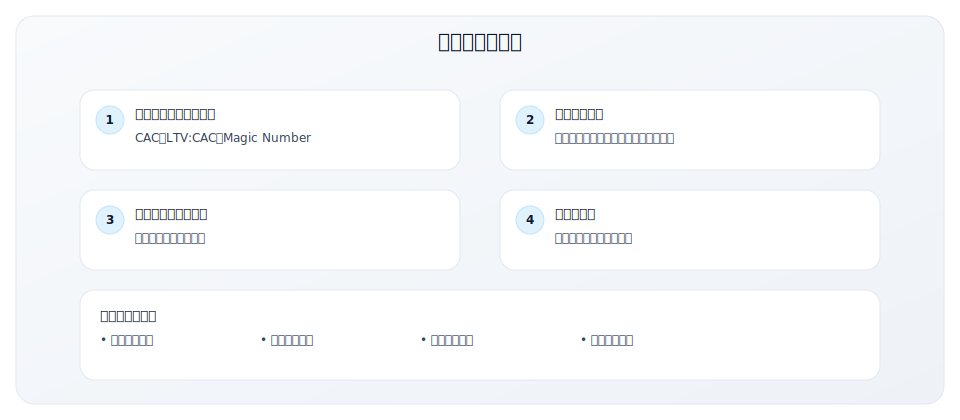
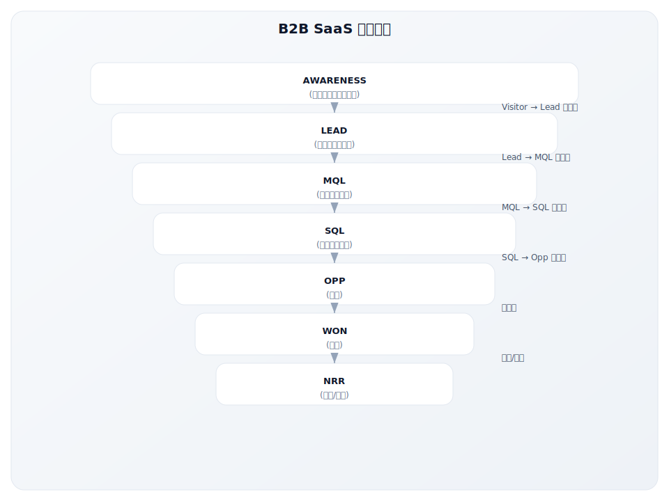
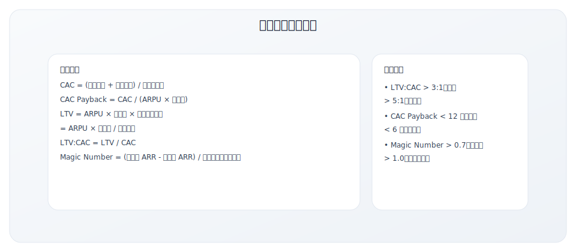
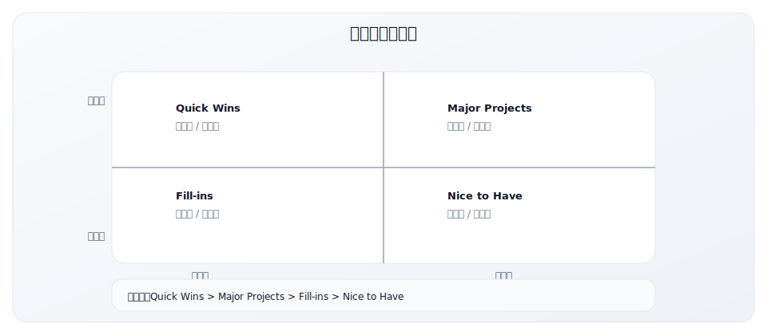

# 5.4 漏斗诊断检查表

> **用途**：诊断 GTM 漏斗健康度，识别瓶颈
>
> **适用场景**：周/月度 Review、问题诊断、优化规划
>
> **使用时长**：30-45 分钟

---

## 工具说明

### 为什么需要漏斗诊断？



### B2B SaaS 漏斗模型



---

## 漏斗诊断工作表

### 基本信息

| 项目 | 内容 |
|------|------|
| 产品/业务名称 | |
| 诊断周期 | |
| 诊断日期 | |
| 负责人 | |

---

## 第一部分：漏斗数据总览

### 核心漏斗指标

| 漏斗阶段 | 当前值 | 上期值 | 环比 | 目标值 | 差距 | 健康度 |
|----------|--------|--------|------|--------|------|--------|
| **Awareness** | | | | | | |
| 网站访客/月 | | | % | | | [ ]健康 [ ]警告 [ ]危险 |
| **Lead** | | | | | | |
| 新增线索数 | | | % | | | [ ]健康 [ ]警告 [ ]危险 |
| Visitor→Lead% | | | | | | [ ]健康 [ ]警告 [ ]危险 |
| **MQL** | | | | | | |
| MQL 数量 | | | % | | | [ ]健康 [ ]警告 [ ]危险 |
| Lead→MQL% | | | | | | [ ]健康 [ ]警告 [ ]危险 |
| **SQL** | | | | | | |
| SQL 数量 | | | % | | | [ ]健康 [ ]警告 [ ]危险 |
| MQL→SQL% | | | | | | [ ]健康 [ ]警告 [ ]危险 |
| **Opportunity** | | | | | | |
| 新增商机数 | | | % | | | [ ]健康 [ ]警告 [ ]危险 |
| Pipeline 价值 | $ | $ | % | $ | | [ ]健康 [ ]警告 [ ]危险 |
| SQL→Opp% | | | | | | [ ]健康 [ ]警告 [ ]危险 |
| **Closed Won** | | | | | | |
| 新增客户数 | | | % | | | [ ]健康 [ ]警告 [ ]危险 |
| 成交金额 | $ | $ | % | $ | | [ ]健康 [ ]警告 [ ]危险 |
| 成交率% | | | | | | [ ]健康 [ ]警告 [ ]危险 |
| 销售周期(天) | | | | | | [ ]健康 [ ]警告 [ ]危险 |

### 健康度标准参考

| 指标 | 健康 | 警告 | 危险 | 行业基准 |
|------|------|------|------|----------|
| Visitor→Lead | >3% | 1-3% | <1% | 2-5% |
| Lead→MQL | 因行业而异 | | | 20-40% |
| MQL→SQL | >30% | 15-30% | <15% | 25-35% |
| SQL→Opp | >60% | 40-60% | <40% | 50-70% |
| 成交率 | >25% | 15-25% | <15% | 20-30% |
| 销售周期 | 符合预期 | +20% | +50% | 因 ACV 而异 |

---

## 第二部分：获客效率指标

### 核心效率指标

| 指标 | 当前值 | 上期值 | 目标值 | 健康基准 | 健康度 |
|------|--------|--------|--------|----------|--------|
| **CAC**（客户获取成本） | $ | $ | $ | 因行业而异 | [ ]健康 [ ]警告 [ ]危险 |
| **CAC Payback**（回收期） | 月 | 月 | 月 | <12月 | [ ]健康 [ ]警告 [ ]危险 |
| **LTV**（客户终身价值） | $ | $ | $ | | [ ]健康 [ ]警告 [ ]危险 |
| **LTV:CAC** | :1 | :1 | :1 | >3:1 | [ ]健康 [ ]警告 [ ]危险 |
| **Magic Number** | | | | >0.7 | [ ]健康 [ ]警告 [ ]危险 |

### 效率指标计算公式



### 分渠道 CAC 分析

| 获客渠道 | 投入 | 新客户数 | CAC | LTV:CAC | ROI | 优先级 |
|----------|------|---------|-----|---------|-----|--------|
| Organic Search | $ | | $ | :1 | | |
| Paid Search | $ | | $ | :1 | | |
| Paid Social | $ | | $ | :1 | | |
| Content/Inbound | $ | | $ | :1 | | |
| Outbound | $ | | $ | :1 | | |
| Referral | $ | | $ | :1 | | |
| Event | $ | | $ | :1 | | |
| Partner | $ | | $ | :1 | | |
| **总计/加权** | $ | | $ | :1 | | |

---

## 第三部分：客户成功指标

### 留存与扩展指标

| 指标 | 当前值 | 上期值 | 目标值 | 健康基准 | 健康度 |
|------|--------|--------|--------|----------|--------|
| **NRR**（净收入留存率） | % | % | % | >100% | [ ]健康 [ ]警告 [ ]危险 |
| **GRR**（毛收入留存率） | % | % | % | >85% | [ ]健康 [ ]警告 [ ]危险 |
| **Logo Churn**（客户流失率） | % | % | % | <5%/年 | [ ]健康 [ ]警告 [ ]危险 |
| **Revenue Churn**（收入流失率） | % | % | % | <3%/月 | [ ]健康 [ ]警告 [ ]危险 |
| **Expansion Rate**（扩展率） | % | % | % | | [ ]健康 [ ]警告 [ ]危险 |
| **NPS**（净推荐值） | | | | >50 | [ ]健康 [ ]警告 [ ]危险 |

### 留存指标计算公式

```
NRR = (期初 MRR + 扩展 - 流失 - 降级) / 期初 MRR × 100%

GRR = (期初 MRR - 流失 - 降级) / 期初 MRR × 100%

Logo Churn = 流失客户数 / 期初客户数 × 100%

Expansion Rate = 扩展 MRR / 期初 MRR × 100%
```

### NRR 组成分析

| 组成部分 | 金额/比例 | 说明 |
|----------|---------|------|
| 期初 MRR | $ | |
| (+) Expansion（扩展） | $ (%) | |
| (-) Contraction（降级） | $ (%) | |
| (-) Churn（流失） | $ (%) | |
| = 期末 MRR | $ | |
| **NRR** | % | |

---

## 第四部分：瓶颈诊断

### 瓶颈识别

最大的瓶颈在哪个阶段？（选择一项）

- [ ] **Awareness**（流量不足）
  - 症状：网站访客少、品牌知名度低
  - 可能原因：SEO 差、内容少、付费渠道 ROI 低

- [ ] **Lead Generation**（线索不足）
  - 症状：访客多但转化少
  - 可能原因：CTA 不明确、Lead Magnet 无吸引力、表单太长

- [ ] **Lead→MQL**（线索质量问题）
  - 症状：线索多但合格率低
  - 可能原因：获客渠道质量差、ICP 定义不清

- [ ] **MQL→SQL**（营销销售对齐问题）
  - 症状：MQL 多但销售不接受
  - 可能原因：MQL 定义不一致、销售跟进不及时

- [ ] **SQL→Opp**（销售效率问题）
  - 症状：合格线索多但商机少
  - 可能原因：销售能力、跟进流程、竞争失败

- [ ] **Opp→Won**（成交率问题）
  - 症状：商机多但成交少
  - 可能原因：定价、产品差距、销售技能、竞争

- [ ] **Customer Success**（留存问题）
  - 症状：客户流失高、NRR 低
  - 可能原因：Onboarding 差、产品价值未实现、支持不足

### 瓶颈根因分析（5 Why）

**识别的瓶颈**：_______________

| 层级 | 问题 | 原因 |
|------|------|------|
| Why 1 | 为什么 [瓶颈现象]？ | |
| Why 2 | 为什么 [原因1]？ | |
| Why 3 | 为什么 [原因2]？ | |
| Why 4 | 为什么 [原因3]？ | |
| Why 5 | 为什么 [原因4]？ | |
| **根因** | | |

---

## 第五部分：阶段深度诊断

### Awareness 阶段诊断

| 检查项 | 状态 | 数据/证据 | 改进建议 |
|--------|------|----------|---------|
| SEO 关键词排名是否稳定？ | [ ] 是 [ ] 否 | | |
| 核心关键词是否进入首页？ | [ ] 是 [ ] 否 | | |
| 内容发布频率是否足够？ | [ ] 是 [ ] 否 | 篇/周 | |
| 付费渠道 ROI 是否健康？ | [ ] 是 [ ] 否 | ROAS: | |
| 品牌搜索量是否增长？ | [ ] 是 [ ] 否 | 环比: % | |
| 社交媒体 engagement 如何？ | [ ] 是 [ ] 否 | | |

### Lead Generation 诊断

| 检查项 | 状态 | 数据/证据 | 改进建议 |
|--------|------|----------|---------|
| 落地页转化率是否达标？ | [ ] 是 [ ] 否 | % | |
| Lead Magnet 下载率如何？ | [ ] 是 [ ] 否 | % | |
| 表单完成率如何？ | [ ] 是 [ ] 否 | % | |
| CTA 是否清晰有吸引力？ | [ ] 是 [ ] 否 | | |
| 移动端体验是否良好？ | [ ] 是 [ ] 否 | | |

### MQL 质量诊断

| 检查项 | 状态 | 数据/证据 | 改进建议 |
|--------|------|----------|---------|
| MQL 定义是否清晰？ | [ ] 是 [ ] 否 | | |
| 评分标准是否统一？ | [ ] 是 [ ] 否 | | |
| 销售对 MQL 质量满意吗？ | [ ] 是 [ ] 否 | 满意度: | |
| MQL 来源质量差异如何？ | [ ] 是 [ ] 否 | | |

### 销售效率诊断

| 检查项 | 状态 | 数据/证据 | 改进建议 |
|--------|------|----------|---------|
| 销售周期是否在预期内？ | [ ] 是 [ ] 否 | 天 vs 目标 天 | |
| 丢单原因是否清晰？ | [ ] 是 [ ] 否 | Top 3: | |
| 竞品对比是否有优势？ | [ ] 是 [ ] 否 | Win Rate: % | |
| 销售工具是否充足？ | [ ] 是 [ ] 否 | | |
| 销售培训是否到位？ | [ ] 是 [ ] 否 | | |
| Pipeline Coverage 够吗？ | [ ] 是 [ ] 否 | x vs 目标 3x | |

### Customer Success 诊断

| 检查项 | 状态 | 数据/证据 | 改进建议 |
|--------|------|----------|---------|
| Onboarding 完成率如何？ | [ ] 是 [ ] 否 | % | |
| Time to First Value 多久？ | [ ] 是 [ ] 否 | 天 | |
| 产品使用率健康吗？ | [ ] 是 [ ] 否 | DAU/MAU: | |
| 客户健康评分分布？ | [ ] 是 [ ] 否 | | |
| 流失预警机制有效吗？ | [ ] 是 [ ] 否 | | |

---

## 第六部分：漏斗优化框架

### 优化机会评估

| 阶段 | 当前转化率 | 目标转化率 | 提升潜力 | 优化难度 | 优先级 |
|------|-----------|-----------|---------|---------|--------|
| Visitor→Lead | % | % | % | 高/中/低 | P0/P1/P2 |
| Lead→MQL | % | % | % | 高/中/低 | P0/P1/P2 |
| MQL→SQL | % | % | % | 高/中/低 | P0/P1/P2 |
| SQL→Opp | % | % | % | 高/中/低 | P0/P1/P2 |
| Opp→Won | % | % | % | 高/中/低 | P0/P1/P2 |

### 优化优先级矩阵



### 优化影响模拟

如果将每个阶段转化率提升 10%，对最终成交的影响：

| 场景 | 当前 | 优化后 | 新增客户 | 收入影响 |
|------|------|--------|---------|---------|
| 基准 | | | | $ |
| Visitor→Lead +10% | | | +__客户 | +$ |
| Lead→MQL +10% | | | +__客户 | +$ |
| MQL→SQL +10% | | | +__客户 | +$ |
| SQL→Opp +10% | | | +__客户 | +$ |
| Opp→Won +10% | | | +__客户 | +$ |
| **全链路各+10%** | | | +__客户 | +$ |

---

## 第七部分：改进行动计划

### 短期改进（本月）

| 优先级 | 改进措施 | 目标阶段 | 预期效果 | 负责人 | 截止日期 |
|--------|----------|---------|---------|--------|---------|
| P0 | | | | | |
| P0 | | | | | |
| P1 | | | | | |

### 中期改进（本季度）

| 优先级 | 改进措施 | 目标阶段 | 预期效果 | 负责人 | 截止日期 |
|--------|----------|---------|---------|--------|---------|
| P0 | | | | | |
| P1 | | | | | |
| P2 | | | | | |

### 长期改进（本年度）

| 改进措施 | 目标阶段 | 预期效果 | 所需资源 |
|----------|---------|---------|---------|
| | | | |
| | | | |

---

## 第八部分：诊断总结

### 漏斗健康度评分

| 维度 | 评分 (1-5) | 说明 |
|------|-----------|------|
| 漏斗效率 | | |
| 获客效率 | | |
| 客户留存 | | |
| 数据质量 | | |
| 流程成熟度 | | |
| **综合评分** | /5 | |

### 关键发现

**优势**：
1.
2.
3.

**问题**：
1.
2.
3.

**机会**：
1.
2.
3.

### 下一步行动

| 行动项 | 优先级 | 负责人 | 截止日期 |
|--------|--------|--------|---------|
| | P0 | | |
| | P0 | | |
| | P1 | | |

---

## 常见问题

### Q1: 多久做一次漏斗诊断？

**建议频率**：
- **简易检查**：每周
- **详细诊断**：每月
- **深度分析**：每季度

### Q2: 没有足够数据怎么办？

- 先建立数据采集机制
- 使用行业基准作为参考
- 从关键指标开始，逐步完善
- 标注哪些是估算值

### Q3: 指标之间有冲突怎么办？

例如：提高 MQL 数量 vs 提高 MQL 质量

处理原则：
- 短期可能有冲突，长期应该一致
- 以客户和收入为最终衡量标准
- 设置平衡的指标组合

---

## 使用说明

1. **数据准备**：提前从 CRM、MA 工具导出数据
2. **定期执行**：建议每周快速检查，每月详细诊断
3. **团队参与**：与销售、营销、客户成功一起诊断
4. **跟踪改进**：持续跟踪改进措施的效果
5. **迭代优化**：根据实际情况调整诊断标准

---

## 相关工具

- [5.1 GTM 战略规划模板](./5.1-strategy-template.md) - 整体战略框架
- [5.2 ICP 定义工作表](./5.2-icp-worksheet.md) - 优化漏斗质量
- [5.5 GTM 里程碑规划表](./5.5-milestone-plan.md) - 规划改进项目

---

**写作状态**：审校完成
**最后更新**：2024-12-07
**版本**：v1.1
