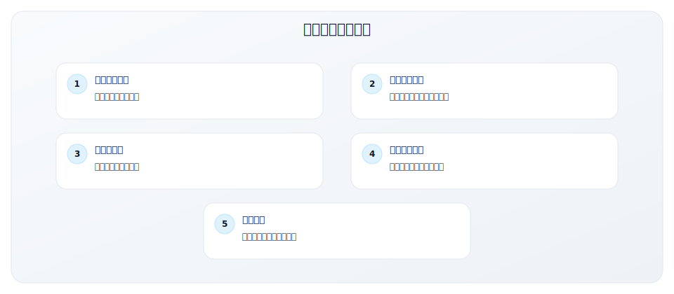
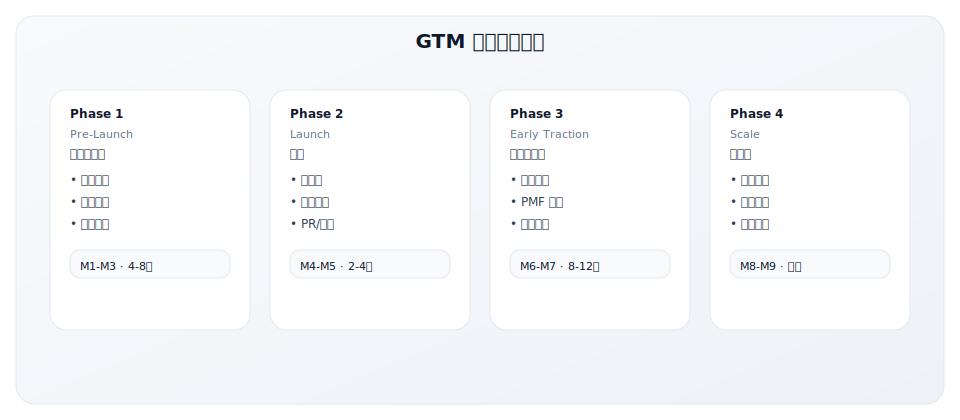
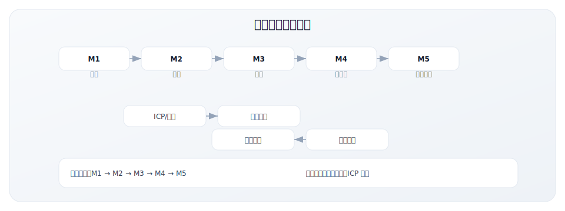
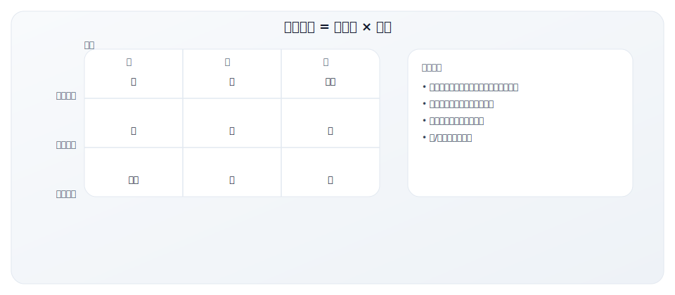
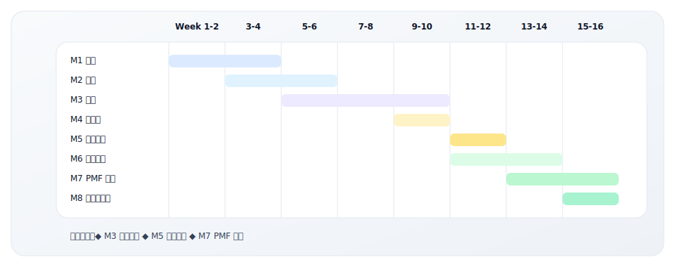

# 5.5 GTM 里程碑规划表

> **学习目标**：能够规划 GTM 关键里程碑与执行节奏
>
> **预计时长**：45-60 分钟
>
> **前置知识**：了解 GTM 目标与核心指标
>
> **用途**：规划 GTM 执行的关键里程碑
>
> **适用场景**：新产品发布、进入新市场、GTM 项目管理
>
> **使用时长**：45-60 分钟

---

## 核心内容

本节覆盖以下内容：
- 工具说明
- GTM 里程碑规划工作表
- 阶段一：Pre-Launch（发布前准备）
- 阶段二：Launch（发布）
- 阶段三：Early Traction（早期牵引力）
- 阶段四：Scale（规模化）

## 工具说明

### 为什么需要里程碑规划？



### GTM 项目生命周期



---

## GTM 里程碑规划工作表

### GTM 项目基本信息

| 项目 | 内容 |
|------|------|
| 项目名称 | |
| GTM 类型 | [ ] 新产品发布 [ ] 新功能发布 [ ] 新市场进入 [ ] 重新定位 [ ] 其他 |
| 项目负责人 | |
| 核心团队成员 | |
| 项目启动日期 | |
| 目标发布日期 | |
| 项目预算 | $ |

### 项目目标

**主要目标**：
```
_________________________________________________
_________________________________________________
```

**成功指标**：
| 指标 | 目标值 | 衡量方式 |
|------|--------|---------|
| | | |
| | | |
| | | |

---

## 阶段一：Pre-Launch（发布前准备）

### 里程碑 M1：市场调研完成

| 交付物 | 完成标准 | 负责人 | 截止日期 | 状态 |
|--------|---------|--------|---------|------|
| ICP 定义文档 | 完成 5.2 工作表 | | | [ ]未开始 [ ]进行中 [ ]完成 |
| 竞品分析报告 | 完成 5.3 矩阵 | | | [ ]未开始 [ ]进行中 [ ]完成 |
| 市场规模估算 | TAM/SAM/SOM | | | [ ]未开始 [ ]进行中 [ ]完成 |
| 客户访谈记录 | ≥10 个访谈 | | | [ ]未开始 [ ]进行中 [ ]完成 |
| 定价研究 | 价格敏感度分析 | | | [ ]未开始 [ ]进行中 [ ]完成 |

**M1 退出标准**：
- [ ] ICP 定义获得团队共识
- [ ] 竞品分析覆盖主要竞争对手
- [ ] 市场规模有数据支撑
- [ ] 关键发现已记录并分享

### 里程碑 M2：GTM 战略确定

| 交付物 | 完成标准 | 负责人 | 截止日期 | 状态 |
|--------|---------|--------|---------|------|
| GTM 战略文档 | 完成 5.1 模板 | | | [ ]未开始 [ ]进行中 [ ]完成 |
| 定位声明 | April Dunford 公式 | | | [ ]未开始 [ ]进行中 [ ]完成 |
| Messaging Framework | 核心信息框架 | | | [ ]未开始 [ ]进行中 [ ]完成 |
| GTM Motion 确定 | PLG/SLG/Hybrid | | | [ ]未开始 [ ]进行中 [ ]完成 |
| 渠道策略 | 渠道优先级和分配 | | | [ ]未开始 [ ]进行中 [ ]完成 |

**M2 退出标准**：
- [ ] 战略文档获得管理层批准
- [ ] 定位声明内部一致
- [ ] GTM Motion 有明确理由
- [ ] 预算分配已确定

### 里程碑 M3：发布准备就绪

| 交付物 | 完成标准 | 负责人 | 截止日期 | 状态 |
|--------|---------|--------|---------|------|
| 网站更新 | 产品页、定价页上线 | | | [ ]未开始 [ ]进行中 [ ]完成 |
| 销售材料 | Deck、One-pager、Demo 脚本 | | | [ ]未开始 [ ]进行中 [ ]完成 |
| 营销内容 | 博客、视频、案例 | | | [ ]未开始 [ ]进行中 [ ]完成 |
| 工具配置 | CRM、MA、Analytics | | | [ ]未开始 [ ]进行中 [ ]完成 |
| 团队培训 | 销售培训完成 | | | [ ]未开始 [ ]进行中 [ ]完成 |
| 支持文档 | FAQ、Help Center | | | [ ]未开始 [ ]进行中 [ ]完成 |

**M3 退出标准**：
- [ ] 所有面向客户的材料就绪
- [ ] 团队完成培训并通过测试
- [ ] 工具配置完成并测试通过
- [ ] Launch Checklist 100% 完成

---

## 阶段二：Launch（发布）

### 里程碑 M4：软发布

| 交付物 | 完成标准 | 负责人 | 截止日期 | 状态 |
|--------|---------|--------|---------|------|
| Beta 用户邀请 | 邀请 ___ 个目标用户 | | | [ ]未开始 [ ]进行中 [ ]完成 |
| 反馈收集机制 | 调研、访谈流程建立 | | | [ ]未开始 [ ]进行中 [ ]完成 |
| 问题跟踪 | Bug/问题记录系统 | | | [ ]未开始 [ ]进行中 [ ]完成 |
| 初步数据分析 | 使用数据、反馈汇总 | | | [ ]未开始 [ ]进行中 [ ]完成 |

**M4 退出标准**：
- [ ] Beta 用户达到目标数量
- [ ] 关键反馈已收集并分析
- [ ] 重大问题已修复
- [ ] Go/No-Go 决策完成

### 里程碑 M5：正式发布

| 交付物 | 完成标准 | 负责人 | 截止日期 | 状态 |
|--------|---------|--------|---------|------|
| 发布公告 | 公告发布、社交媒体 | | | [ ]未开始 [ ]进行中 [ ]完成 |
| PR/媒体 | 新闻稿、媒体报道 | | | [ ]未开始 [ ]进行中 [ ]完成 |
| 发布活动 | Webinar/Event | | | [ ]未开始 [ ]进行中 [ ]完成 |
| 营销活动启动 | 付费广告、邮件序列 | | | [ ]未开始 [ ]进行中 [ ]完成 |
| 销售启动 | 销售开始主动触达 | | | [ ]未开始 [ ]进行中 [ ]完成 |

**M5 退出标准**：
- [ ] 发布活动按计划执行
- [ ] 初始流量/关注度达到预期
- [ ] 销售 Pipeline 开始建立
- [ ] 无重大技术问题

---

## 阶段三：Early Traction（早期牵引力）

### 里程碑 M6：首批付费客户

| 交付物 | 完成标准 | 负责人 | 截止日期 | 状态 |
|--------|---------|--------|---------|------|
| 付费客户 | ___ 个付费客户 | | | [ ]未开始 [ ]进行中 [ ]完成 |
| 客户案例 | ___ 个案例/证言 | | | [ ]未开始 [ ]进行中 [ ]完成 |
| 销售流程验证 | 完成首批成交 | | | [ ]未开始 [ ]进行中 [ ]完成 |
| 客户 Onboarding | Onboarding 流程验证 | | | [ ]未开始 [ ]进行中 [ ]完成 |

**M6 退出标准**：
- [ ] 付费客户数量达标
- [ ] 至少 ___ 个客户愿意做案例
- [ ] 销售周期和转化率可预测
- [ ] Onboarding 流程运行顺畅

### 里程碑 M7：PMF 验证

| 交付物 | 完成标准 | 负责人 | 截止日期 | 状态 |
|--------|---------|--------|---------|------|
| PMF 调研 | Sean Ellis 40% 测试 | | | [ ]未开始 [ ]进行中 [ ]完成 |
| 留存数据 | 初期留存率分析 | | | [ ]未开始 [ ]进行中 [ ]完成 |
| NPS 调研 | NPS > ___ | | | [ ]未开始 [ ]进行中 [ ]完成 |
| 用户行为分析 | 核心功能使用率 | | | [ ]未开始 [ ]进行中 [ ]完成 |
| 漏斗诊断 | 完成 5.4 检查表 | | | [ ]未开始 [ ]进行中 [ ]完成 |

**M7 退出标准**：
- [ ] PMF 调研 >40% 会"非常失望"
- [ ] 早期留存率健康
- [ ] 用户反馈积极
- [ ] 有明确的优化方向

---

## 阶段四：Scale（规模化）

### 里程碑 M8：规模化准备

| 交付物 | 完成标准 | 负责人 | 截止日期 | 状态 |
|--------|---------|--------|---------|------|
| 流程优化 | 漏斗转化率优化 | | | [ ]未开始 [ ]进行中 [ ]完成 |
| 自动化建设 | 营销/销售自动化 | | | [ ]未开始 [ ]进行中 [ ]完成 |
| 团队扩张计划 | 招聘计划确定 | | | [ ]未开始 [ ]进行中 [ ]完成 |
| 预算扩展 | 增量预算获批 | | | [ ]未开始 [ ]进行中 [ ]完成 |

**M8 退出标准**：
- [ ] 单位经济模型健康 (LTV:CAC > 3:1)
- [ ] 流程可复制、可扩展
- [ ] 团队准备就绪
- [ ] 预算和资源到位

### 里程碑 M9：增长目标达成

| 交付物 | 完成标准 | 负责人 | 截止日期 | 状态 |
|--------|---------|--------|---------|------|
| 收入目标 | ARR 达到 $_____ | | | [ ]未开始 [ ]进行中 [ ]完成 |
| 客户目标 | _____ 个客户 | | | [ ]未开始 [ ]进行中 [ ]完成 |
| 效率目标 | CAC/Magic Number | | | [ ]未开始 [ ]进行中 [ ]完成 |
| 留存目标 | NRR > ___% | | | [ ]未开始 [ ]进行中 [ ]完成 |

**M9 退出标准**：
- [ ] 核心业务指标达标
- [ ] 增长势头持续
- [ ] 团队能力匹配
- [ ] 下一阶段计划就绪

---

## 关键依赖管理

### 依赖项清单

| 依赖项 | 依赖方 | 影响的里程碑 | 状态 | 风险等级 | 应对措施 |
|--------|--------|-------------|------|---------|---------|
| 产品功能完成 | 产品团队 | M3, M4 | [ ] 已确认 [ ] 待确认 | 高/中/低 | |
| 法务合规审批 | 法务 | M3 | [ ] 已确认 [ ] 待确认 | 高/中/低 | |
| 预算审批 | 财务 | M8 | [ ] 已确认 [ ] 待确认 | 高/中/低 | |
| 合作伙伴协议 | BD | M5 | [ ] 已确认 [ ] 待确认 | 高/中/低 | |
| | | | [ ] 已确认 [ ] 待确认 | 高/中/低 | |

### 依赖关系图



---

## 风险管理

### 风险评估矩阵

| 风险 | 可能性 | 影响 | 风险评分 | 应对措施 | 负责人 |
|------|--------|------|---------|---------|--------|
| 产品延期 | 高/中/低 | 高/中/低 | | | |
| 竞品动作 | 高/中/低 | 高/中/低 | | | |
| 预算不足 | 高/中/低 | 高/中/低 | | | |
| 人员变动 | 高/中/低 | 高/中/低 | | | |
| 市场变化 | 高/中/低 | 高/中/低 | | | |
| | 高/中/低 | 高/中/低 | | | |

### 风险应对策略



---

## 沟通与汇报

### 沟通计划

| 会议/沟通 | 频率 | 参与者 | 目的 | 形式 |
|-----------|------|--------|------|------|
| GTM 站会 | 每日/每周 | 核心团队 | 进度同步、问题处理 | 会议 |
| 周报 | 每周 | 核心团队+管理层 | 状态更新 | 文档 |
| 里程碑 Review | 每个里程碑 | 扩展团队 | 里程碑验收、决策 | 会议 |
| 月度汇报 | 每月 | 管理层 | 进度、风险、资源 | 会议+文档 |

### 汇报模板

```
GTM 项目周报 - Week [#]

📊 整体状态：[ ] 绿色 [ ] 黄色 [ ] 红色

✅ 本周完成：
1.
2.
3.

🎯 下周计划：
1.
2.
3.

⚠️ 风险/问题：
1.
2.

📈 关键指标：
•
•

🙋 需要支持：
1.
```

---

## 里程碑规划总结视图

### 甘特图视图



### 里程碑检查清单

| 里程碑 | 目标日期 | 实际日期 | 状态 | 偏差 | 备注 |
|--------|---------|---------|------|------|------|
| M1 市场调研完成 | | | [ ]未开始 [ ]进行中 [ ]完成 | | |
| M2 GTM 战略确定 | | | [ ]未开始 [ ]进行中 [ ]完成 | | |
| M3 发布准备就绪 | | | [ ]未开始 [ ]进行中 [ ]完成 | | |
| M4 软发布 | | | [ ]未开始 [ ]进行中 [ ]完成 | | |
| M5 正式发布 | | | [ ]未开始 [ ]进行中 [ ]完成 | | |
| M6 首批付费客户 | | | [ ]未开始 [ ]进行中 [ ]完成 | | |
| M7 PMF 验证 | | | [ ]未开始 [ ]进行中 [ ]完成 | | |
| M8 规模化准备 | | | [ ]未开始 [ ]进行中 [ ]完成 | | |
| M9 增长目标达成 | | | [ ]未开始 [ ]进行中 [ ]完成 | | |

---

## 常见问题

### Q1: 里程碑延期怎么办？

**处理步骤**：
1. 分析延期原因
2. 评估对后续里程碑的影响
3. 制定追赶计划或调整后续计划
4. 沟通并获得相关方认可
5. 更新计划并跟踪执行

### Q2: 如何设置合理的里程碑？

**原则**：
- 每个里程碑有明确、可衡量的交付物
- 里程碑之间间隔 2-4 周为宜
- 设置足够的缓冲时间
- 考虑依赖关系和关键路径

### Q3: 项目范围变化怎么处理？

**变更管理流程**：
1. 记录变更请求
2. 评估影响（时间、资源、预算）
3. 相关方讨论并决策
4. 更新计划和文档
5. 沟通变更

---

## 使用说明

1. **项目启动时**：完整填写规划表，获得团队共识
2. **执行过程中**：定期更新状态，跟踪偏差
3. **里程碑达成时**：进行 Review 和复盘
4. **灵活调整**：根据实际情况调整计划，及时沟通

---

## 相关工具

- [5.1 GTM 战略规划模板](./5.1-strategy-template) - 战略框架
- [5.2 ICP 定义工作表](./5.2-icp-worksheet) - M1 交付物
- [5.3 竞争定位矩阵](./5.3-competitive-matrix) - M1 交付物
- [5.4 漏斗诊断检查表](./5.4-funnel-checklist) - M7 交付物

---

## 关键要点

- 里程碑应与战略目标和指标体系强绑定
- 明确负责人、时间点与验收标准
- 预留风险缓冲并定期复盘

## 实践练习

1. 为你当前项目制定 3-5 个关键里程碑
2. 为每个里程碑指定负责人和验收标准
3. 设定季度复盘机制并记录风险点

## 延伸阅读

- [3.4 核心指标体系](../module-03/3.4-metrics)
- [3.5 RevOps 体系](../module-03/3.5-revops)
- [5.1 GTM 战略规划模板](./5.1-strategy-template)

---

**写作状态**：审校完成
**最后更新**：2025-12-23
**版本**：v1.1
