# 5.6 GTM 工具栈指南

> **学习目标**：能够理解并选择适合团队的 GTM 工具栈
>
> **预计时长**：参考使用
>
> **前置知识**：了解 GTM 流程与团队协作需求
>
> **用途**：了解和选择适合的 GTM 工具
>
> **适用场景**：工具选型、技术栈规划、预算规划
>
> **使用时长**：参考使用

---

## 核心内容

本节覆盖以下内容：
- 工具说明
- 核心工具类别详解
- 工具栈规划模板
- 不同阶段的推荐工具栈
- 中国本土 GTM 工具栈
- 工具选型最佳实践

## 工具说明

### 为什么工具栈很重要？

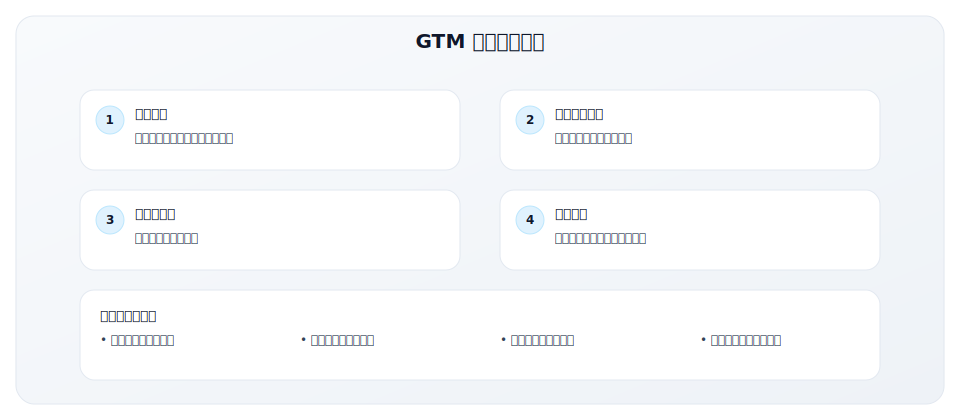

### GTM 工具栈架构

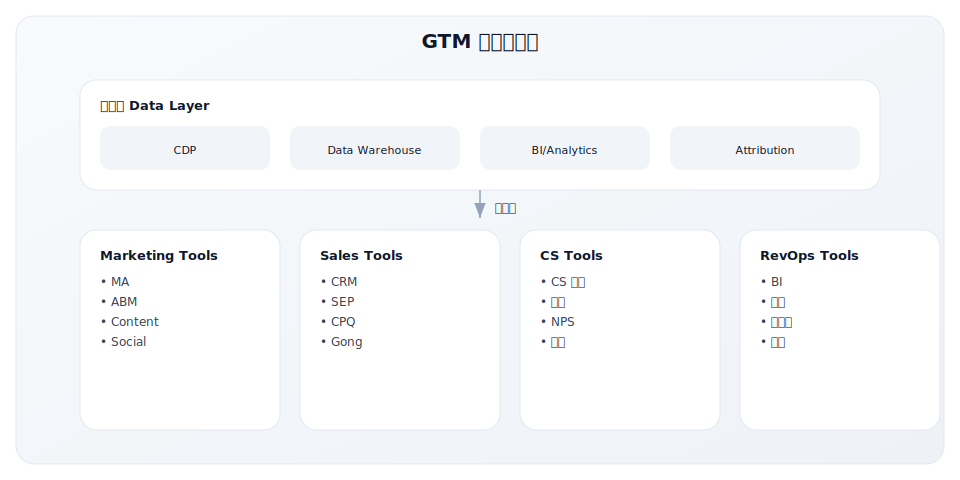

---

## 核心工具类别详解

### 1. CRM（客户关系管理）

**核心功能**：客户数据管理、销售流程管理、Pipeline 跟踪

| 工具 | 定位 | 适合规模 | 起步价格 | 优势 | 劣势 |
|------|------|----------|---------|------|------|
| **Salesforce** | 企业级领导者 | 50+ 人 | $25/用户/月 | 功能最全、生态最强、高度定制 | 复杂、贵、需要管理员 |
| **HubSpot CRM** | 一体化平台 | 1-500 人 | 免费起 | 易用、与营销整合、免费版强大 | 企业级功能较弱 |
| **Pipedrive** | 销售专注 | 5-100 人 | $15/用户/月 | 简洁直观、可视化漏斗 | 功能相对简单 |
| **Zoho CRM** | 性价比 | 10-200 人 | $14/用户/月 | 功能丰富、价格友好 | UI 较旧、集成生态弱 |
| **Close** | 内部销售 | 5-100 人 | $29/用户/月 | 内置通话、适合高频外呼 | 不适合复杂销售 |
| **Freshsales** | 中小企业 | 10-100 人 | 免费起 | AI 功能、性价比高 | 品牌认知度较低 |

**选型建议**：
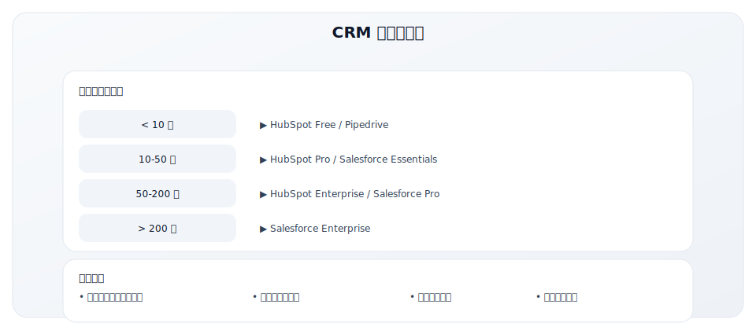

### 2. Marketing Automation（营销自动化）

**核心功能**：邮件营销、Lead Nurturing、营销活动管理、Lead Scoring

| 工具 | 定位 | 适合规模 | 起步价格 | 优势 | 劣势 |
|------|------|----------|---------|------|------|
| **HubSpot Marketing** | 一体化 | 各规模 | 免费起 | 易用、与 CRM 原生整合 | 高级功能价格高 |
| **Marketo** | 企业级 | 100+ 人 | $895+/月 | 功能强大、高度定制 | 复杂、学习曲线陡 |
| **Pardot** | Salesforce 生态 | 50+ 人 | $1,250/月 | 与 SF 深度整合 | 依赖 Salesforce |
| **ActiveCampaign** | 中小企业 | 5-100 人 | $29/月 | 性价比高、自动化强 | 报表较弱 |
| **Mailchimp** | 邮件营销 | 1-50 人 | 免费起 | 易用、适合起步 | 高级功能有限 |
| **Customer.io** | 产品营销 | PLG 公司 | $150/月 | 行为触发、开发者友好 | 不适合传统 B2B |

### 3. Sales Engagement（销售互动）

**核心功能**：销售序列、多渠道触达、活动跟踪

| 工具 | 核心功能 | 适合场景 | 起步价格 | 特点 |
|------|----------|----------|---------|------|
| **Outreach** | 销售自动化序列 | 高频外呼团队 | $100/用户/月 | 功能最全、AI 辅导 |
| **Salesloft** | 销售互动平台 | SLG 团队 | $125/用户/月 | 节奏管理、录音分析 |
| **Apollo.io** | 数据+互动 | 中小团队 | 免费起 | 数据库+外展一体、性价比高 |
| **Lemlist** | 邮件外展 | 冷邮件 | $59/月 | 个性化、图片/视频邮件 |
| **Reply.io** | 多渠道序列 | SDR 团队 | $60/用户/月 | LinkedIn+邮件+电话 |

### 4. Conversation Intelligence（对话分析）

**核心功能**：通话录音、AI 分析、辅导、知识库

| 工具 | 核心功能 | 适合场景 | 起步价格 | 特点 |
|------|----------|----------|---------|------|
| **Gong** | 收入智能平台 | 销售团队 | $100+/用户/月 | 领导者、AI 强大 |
| **Chorus.ai** | 对话分析 | 销售团队 | 询价 | ZoomInfo 旗下 |
| **Fireflies.ai** | 会议记录 | 各类团队 | 免费起 | 性价比高、易用 |
| **Grain** | 会议片段 | 小团队 | $15/用户/月 | 轻量、适合分享 |

### 5. Product Analytics（产品分析）

**核心功能**：用户行为分析、漏斗分析、留存分析、A/B 测试

| 工具 | 核心功能 | 适合 Motion | 起步价格 | 特点 |
|------|----------|-------------|---------|------|
| **Mixpanel** | 事件分析 | PLG | 免费起 | 强大的漏斗和留存分析 |
| **Amplitude** | 产品分析 | PLG | 免费起 | 行为分析、实验平台 |
| **Heap** | 自动采集 | PLG | 免费起 | 无需埋点、回溯分析 |
| **PostHog** | 开源分析 | PLG | 免费起 | 开源、数据自主 |
| **Pendo** | 产品体验 | PLG | 询价 | 引导+分析+反馈 |
| **FullStory** | 会话回放 | 各类 | 免费起 | 用户行为可视化 |

### 6. ABM（账户营销）

**核心功能**：目标账户识别、多渠道触达、账户级分析

| 工具 | 核心功能 | 适合场景 | 起步价格 | 特点 |
|------|----------|----------|---------|------|
| **Demandbase** | ABM 平台 | 企业级 | $50K+/年 | 全面、AI 驱动 |
| **6sense** | 意图数据+ABM | 企业级 | 询价 | 预测分析强 |
| **Terminus** | ABM 执行 | 中大型 | $30K+/年 | 广告+邮件+聊天 |
| **RollWorks** | ABM 平台 | 中型 | $975/月起 | 性价比高 |
| **HubSpot ABM** | 基础 ABM | 中小型 | 包含在 Hub | 简单易用 |

### 7. Customer Success（客户成功）

**核心功能**：客户健康评分、流失预警、Playbook 自动化

| 工具 | 核心功能 | 适合场景 | 起步价格 | 特点 |
|------|----------|----------|---------|------|
| **Gainsight** | CS 平台领导者 | 企业级 | $2,500+/月 | 功能最全 |
| **ChurnZero** | 客户健康 | 中型 | 询价 | 易用、实时数据 |
| **Totango** | CS 平台 | 各规模 | 免费起 | 灵活定价 |
| **Vitally** | 现代 CS | SMB/Mid | $150/月起 | 简洁、产品驱动 |
| **Planhat** | 欧洲 CS | 中型 | 询价 | 数据整合强 |

### 8. Data & Intelligence（数据智能）

**核心功能**：联系人数据、公司数据、意图数据

| 工具 | 数据类型 | 适合场景 | 起步价格 | 特点 |
|------|----------|----------|---------|------|
| **ZoomInfo** | 综合数据 | 各规模 | $15K+/年 | 数据最全 |
| **Apollo.io** | 联系人+互动 | 中小 | 免费起 | 性价比高 |
| **LinkedIn SN** | 社交数据 | 各规模 | $99+/月 | 官方数据 |
| **Clearbit** | 富化数据 | 各规模 | 询价 | 实时 API |
| **Bombora** | 意图数据 | 企业级 | 询价 | B2B 意图 |
| **6sense** | 意图+预测 | 企业级 | 询价 | AI 预测 |

### 9. Revenue Intelligence（收入智能）

**核心功能**：收入预测、Pipeline 分析、Deal Intelligence

| 工具 | 核心功能 | 适合场景 | 起步价格 | 特点 |
|------|----------|----------|---------|------|
| **Clari** | 收入预测 | 企业级 | 询价 | 领导者、AI 预测 |
| **Aviso** | AI 预测 | 中大型 | 询价 | AI 驱动 |
| **InsightSquared** | 销售分析 | 中型 | 询价 | 仪表盘强 |
| **Gong** | 收入智能 | 各规模 | $100+/用户/月 | 对话+收入 |

---

## 工具栈规划模板

### 当前工具栈评估

| 类别 | 当前工具 | 合同到期 | 年费用 | 满意度 | 替换优先级 |
|------|----------|---------|-------|--------|-----------|
| CRM | | | $ | 1-5 | 高/中/低/无 |
| Marketing Automation | | | $ | 1-5 | 高/中/低/无 |
| Sales Engagement | | | $ | 1-5 | 高/中/低/无 |
| Product Analytics | | | $ | 1-5 | 高/中/低/无 |
| Conversation Intel | | | $ | 1-5 | 高/中/低/无 |
| Customer Success | | | $ | 1-5 | 高/中/低/无 |
| Data/Intelligence | | | $ | 1-5 | 高/中/低/无 |
| BI/Analytics | | | $ | 1-5 | 高/中/低/无 |
| **总计** | | | $ | | |

### 工具栈缺口分析

| 能力需求 | 当前方案 | 满足度 | 理想方案 | 预算影响 |
|----------|---------|--------|---------|---------|
| Lead Scoring | | 1-5 | | +$ |
| 营销自动化 | | 1-5 | | +$ |
| 销售序列 | | 1-5 | | +$ |
| 客户健康评分 | | 1-5 | | +$ |
| Pipeline 预测 | | 1-5 | | +$ |
| 意图数据 | | 1-5 | | +$ |

### 工具栈改进计划

| 优先级 | 类别 | 变更类型 | 目标工具 | 原因 | 预算 |
|--------|------|---------|---------|------|------|
| P0 | | [ ] 新增 [ ] 替换 [ ] 升级 | | | $ |
| P1 | | [ ] 新增 [ ] 替换 [ ] 升级 | | | $ |
| P2 | | [ ] 新增 [ ] 替换 [ ] 升级 | | | $ |

---

## 不同阶段的推荐工具栈

### 早期阶段（0-50 客户，<$1M ARR）

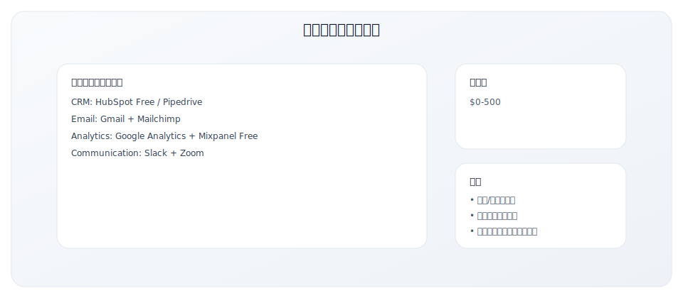

### 成长阶段（50-200 客户，$1-5M ARR）

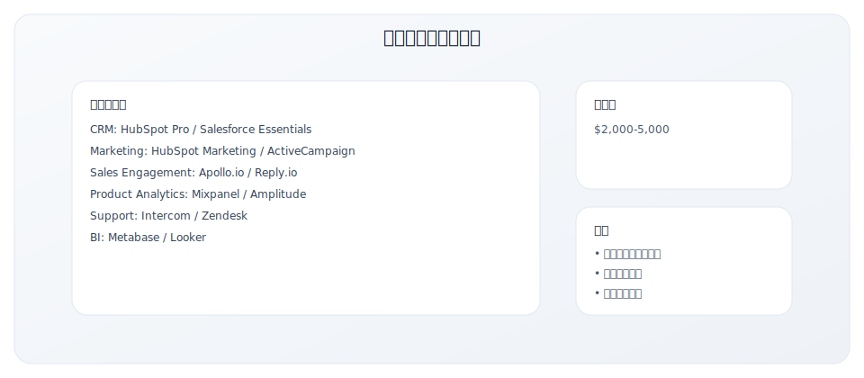

### 规模化阶段（200+ 客户，$5M+ ARR）

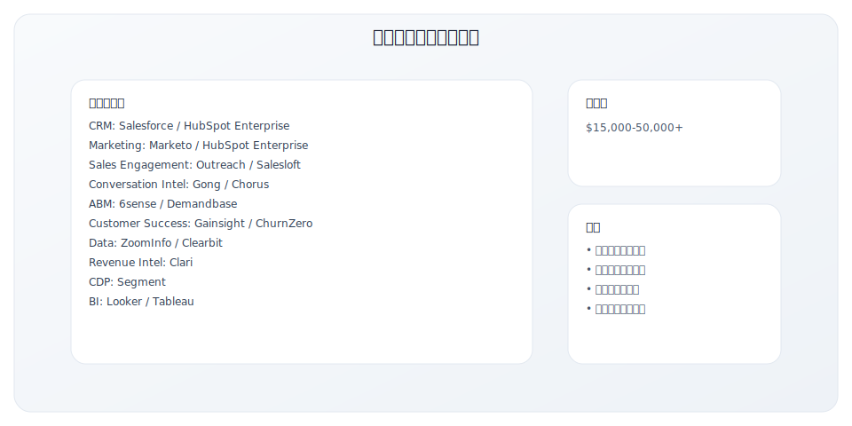

---

## 中国本土 GTM 工具栈

### 中国市场工具选型特点

中国企业在选择 GTM 工具时，需要考虑以下特殊因素：

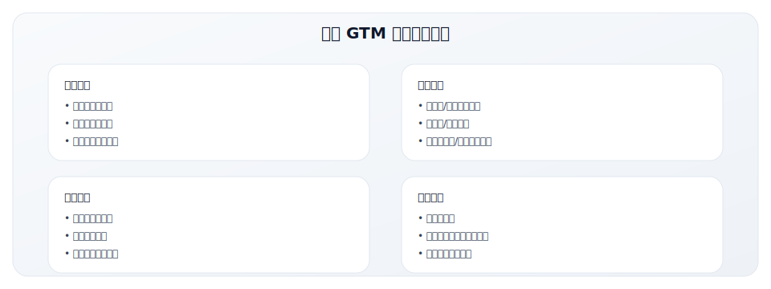

### 中国本土 GTM 工具推荐

#### 1. CRM（客户关系管理）

| 工具 | 定位 | 适合规模 | 起步价格 | 优势 | 劣势 |
|------|------|----------|---------|------|------|
| **销售易** | 企业级 CRM | 中大型企业 | ￥1,980/用户/年 | 本土最专业、腾讯投资 | 价格较高 |
| **纷享销客** | 连接型 CRM | 各规模 | ￥980/用户/年 | 功能全面、移动端强 | 学习成本较高 |
| **悟空 CRM** | 开源 CRM | 中小企业 | 免费起 | 开源免费、可定制 | 需要技术能力 |
| **简道云** | 低代码 CRM | 中小企业 | ￥2,980/年起 | 灵活定制、集成钉钉 | 非专业 CRM |
| **EC SCRM** | 社交 CRM | 中小企业 | 询价 | 企业微信原生 | 功能相对简单 |

#### 2. 营销自动化（SCRM/MA）

| 工具 | 定位 | 适合场景 | 起步价格 | 特点 |
|------|------|----------|---------|------|
| **微盛 SCRM** | 企业微信 SCRM | 私域运营 | ￥3,000/年起 | 企微原生、功能全面 |
| **尘锋 SCRM** | 企业微信 SCRM | 中大型企业 | 询价 | 流程自动化强 |
| **致趣百川** | B2B 营销云 | 中大型 B2B | ￥50,000/年起 | 一站式营销平台 |
| **JINGdigital** | 营销自动化 | 品牌营销 | 询价 | 微信生态整合 |
| **Convertlab** | DM Hub | 中大型企业 | 询价 | 全渠道 CDP |

#### 3. 销售工具

| 工具 | 定位 | 核心功能 | 起步价格 | 特点 |
|------|------|----------|---------|------|
| **探迹** | 智能获客 | AI 线索挖掘、智能外呼 | 询价 | 企业数据库、AI 能力强 |
| **销氪** | 销售加速 | 线索获取、外呼系统 | 询价 | 全流程覆盖 |
| **晓多科技** | 智能外呼 | AI 电话机器人 | 询价 | 对话 AI 强 |
| **卫瓴科技** | 协同 CRM | 企业微信深度整合 | ￥4,980/年起 | 销售协同、客户跟进 |

#### 4. 客户成功与支持

| 工具 | 定位 | 核心功能 | 起步价格 | 特点 |
|------|------|----------|---------|------|
| **智齿科技** | 智能客服 | AI 客服、在线客服 | ￥3,600/年起 | 全渠道、AI 强 |
| **网易七鱼** | 客服平台 | 在线客服、工单 | 询价 | 网易品质 |
| **容联七陌** | 云客服 | 呼叫中心、在线客服 | 询价 | 通讯能力强 |
| **美洽** | 在线客服 | 实时聊天、机器人 | 免费起 | 轻量易用 |

#### 5. 数据分析与 BI

| 工具 | 定位 | 核心功能 | 起步价格 | 特点 |
|------|------|----------|---------|------|
| **神策数据** | 用户行为分析 | 事件分析、用户画像 | 询价 | 国内领先、私有部署 |
| **GrowingIO** | 增长分析 | 无埋点、产品分析 | 询价 | 增长导向 |
| **火山引擎** | 数据中台 | 分析、推荐、A/B 测试 | 按量付费 | 字节技术 |
| **帆软** | BI 平台 | 报表、数据可视化 | 询价 | 国产 BI 龙头 |
| **观远数据** | 智能 BI | 自助分析、AI 洞察 | 询价 | 智能化程度高 |

### 中国企业 GTM 工具栈方案

#### 方案一：中小企业起步方案（月预算 <￥5,000）

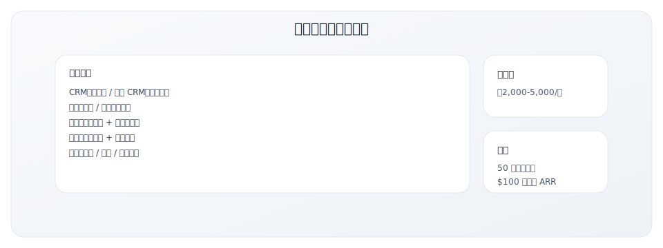

#### 方案二：成长期方案（月预算 ￥5,000-20,000）

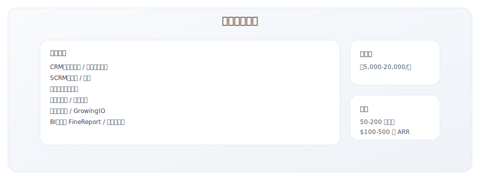

#### 方案三：规模化方案（月预算 ￥20,000+）

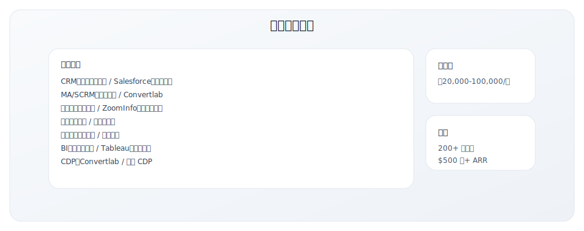

### 中国 vs 国际工具对照

| 类别 | 国际工具 | 中国本土替代 | 说明 |
|------|---------|------------|------|
| CRM | Salesforce | 销售易、纷享销客 | 本土工具更懂中国销售流程 |
| MA | HubSpot, Marketo | 致趣百川、JINGdigital | 更适配微信生态 |
| SCRM | - | 微盛、尘锋 | 企业微信独特场景 |
| SEP | Outreach, Salesloft | 探迹、销氪 | 本土数据更丰富 |
| CS | Gainsight | 销售易 CS | 本土方案较少 |
| Data | ZoomInfo | 探迹、天眼查 | 本土企业数据 |
| Analytics | Mixpanel, Amplitude | 神策、GrowingIO | 数据本地化 |
| Conversation | Gong | 循环智能 | 新兴赛道 |

---

## 工具选型最佳实践

### 选型决策框架

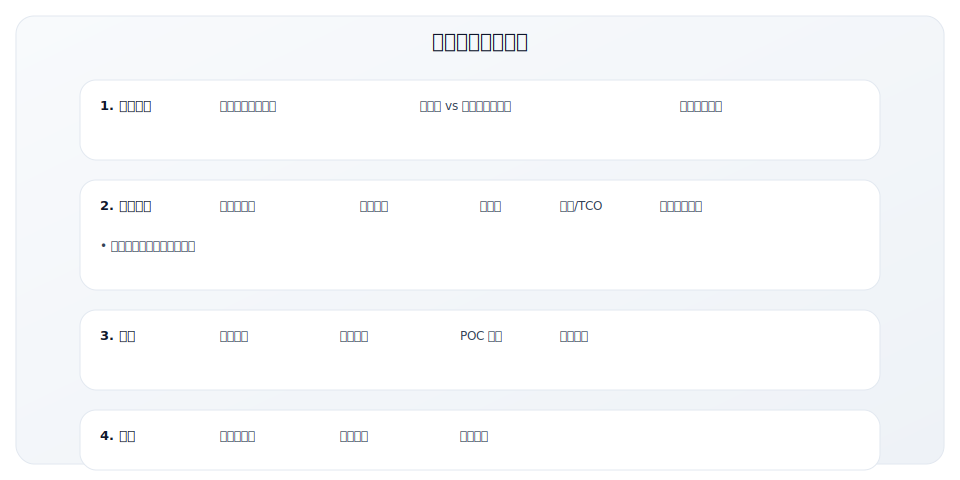

### 选型评估表

| 评估维度 | 权重 | 工具 A | 工具 B | 工具 C |
|----------|------|--------|--------|--------|
| 功能完整性 | 25% | /5 | /5 | /5 |
| 易用性 | 20% | /5 | /5 | /5 |
| 集成能力 | 20% | /5 | /5 | /5 |
| 价格/TCO | 15% | /5 | /5 | /5 |
| 客户支持 | 10% | /5 | /5 | /5 |
| 供应商稳定性 | 10% | /5 | /5 | /5 |
| **加权总分** | 100% | | | |

### 工具选型原则

1. **先流程后工具**
   - 先理清业务流程和需求
   - 工具是流程的支撑，不是替代

2. **集成优先**
   - 选择能与现有栈集成的工具
   - 避免数据孤岛

3. **从简单开始**
   - 不要过早采用复杂工具
   - 先用简单方案验证需求

4. **考虑总成本（TCO）**
   - 包括实施、培训、维护成本
   - 不只看 License 费用

5. **评估供应商**
   - 财务健康状况
   - 产品路线图
   - 客户支持质量

---

## 实用工具演示 {#cac-calculator-demo}

GTM 工具不一定都很复杂。这里展示一个简单的 **CAC 回收期计算器**，你可以基于类似逻辑在内部搭建简单的评估模型：

<ClientOnly>
  <CACCalculator />
</ClientOnly>

---

## 常见问题

### Q1: 应该先买什么工具？

**优先级建议**：
1. CRM（必须）
2. 邮件/沟通工具（必须）
3. 基础分析（必须）
4. 营销自动化（成长期）
5. 销售互动（成长期）
6. 其他专业工具（规模化期）

### Q2: 同类工具怎么选？

**核心考量**：
- 你的核心使用场景是什么？
- 与现有工具的集成如何？
- 团队的技术能力如何？
- 预算和长期成本如何？

### Q3: 什么时候该换工具？

**换工具的信号**：
- 团队不愿使用
- 无法满足核心需求
- 无法与其他工具集成
- 成本远超价值
- 供应商风险增加

---

## 使用说明

1. **定期评估**：每年评估工具栈是否满足需求
2. **整合考虑**：避免工具孤岛，确保数据流通
3. **培训投入**：工具效果取决于使用程度
4. **数据流设计**：规划好工具间的数据流

---

## 相关工具

- [5.1 GTM 战略规划模板](./5.1-strategy-template) - 战略框架
- [5.4 漏斗诊断检查表](./5.4-funnel-checklist) - 诊断工具需求
- [5.5 GTM 里程碑规划表](./5.5-milestone-plan) - 工具实施规划

---

## 关键要点

- 工具选型以流程与数据闭环为核心，而非功能堆砌
- 关注工具间的集成、数据流与协作体验
- 预算与培训投入同等重要

## 实践练习

1. 列出当前团队的核心流程与对应工具
2. 标注 2 个数据断点或协作瓶颈
3. 制定一份工具栈迭代优先级清单

## 延伸阅读

- [3.5 RevOps 体系](../module-03/3.5-revops)
- [3.4 核心指标体系](../module-03/3.4-metrics)
- [5.5 GTM 里程碑规划表](./5.5-milestone-plan)

---

**写作状态**：审校完成
**最后更新**：2025-12-23
**版本**：v1.1
