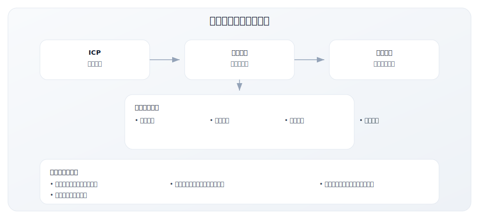
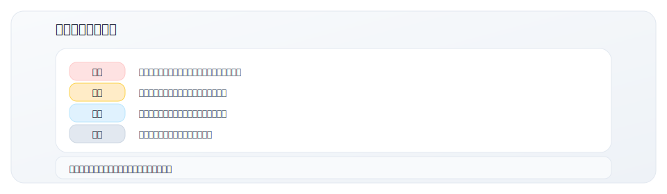
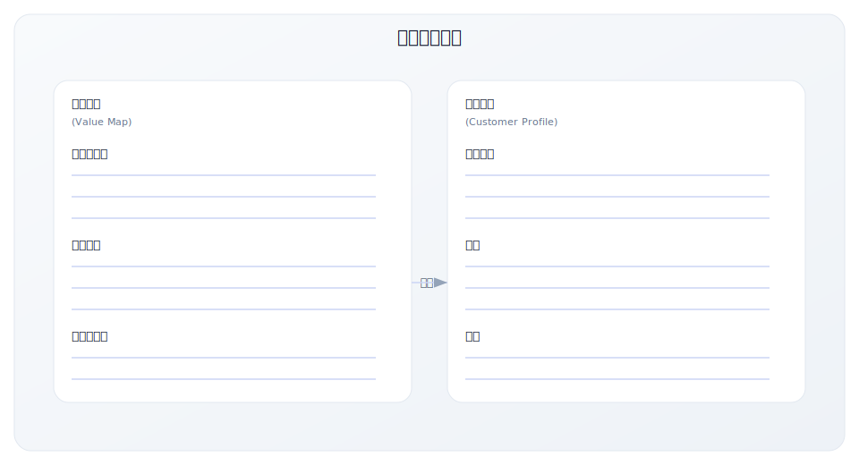
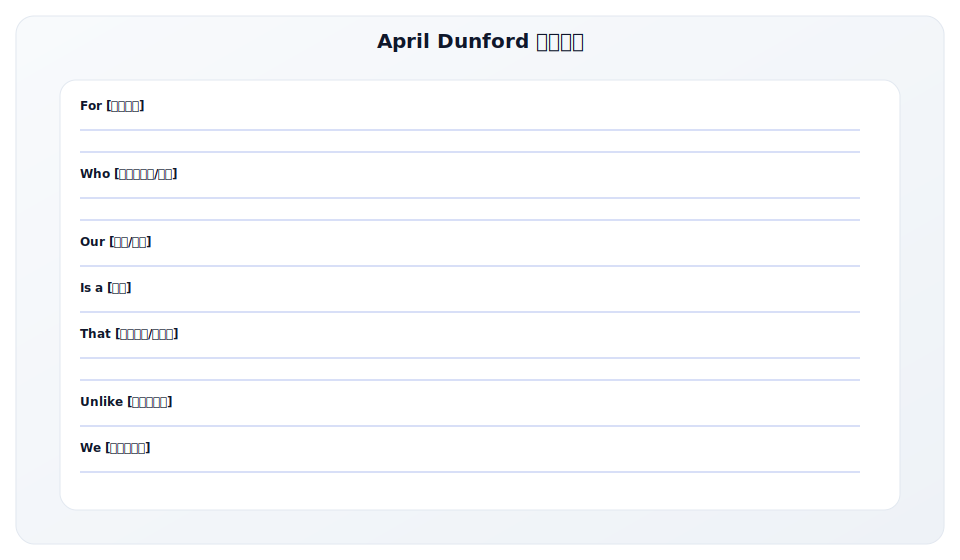

# 5.7 价值主张设计工作表

> **学习目标**：能够系统化设计并验证产品价值主张
>
> **预计时长**：60-90 分钟
>
> **用途**：系统化设计和验证产品价值主张
>
> **适用场景**：新产品定位、价值主张优化、营销信息设计
>
> **使用时长**：60-90 分钟
>
> **前置知识**：建议先学习 [2.4 价值主张设计](../module-02/2.4-value-proposition)

---

## 核心内容

本节覆盖以下内容：
- 工具说明
- 第一部分：基本信息
- 第二部分：客户画像（Customer Profile）
- 第三部分：价值地图（Value Map）
- 第四部分：匹配分析（Fit Analysis）
- 第五部分：定位声明

## 工具说明

### 为什么需要价值主张工作表？



### 工作表结构

本工作表包含 7 个部分：

1. **基本信息** - 产品和项目信息
2. **客户画像** - 理解客户任务、痛点、收益
3. **价值地图** - 设计产品价值
4. **匹配分析** - 评估客户-价值匹配度
5. **定位声明** - 撰写 April Dunford 定位公式
6. **消息框架** - 构建多层次消息体系
7. **验证计划** - 测试和迭代价值主张

---

## 第一部分：基本信息

| 项目 | 内容 |
|------|------|
| 产品/服务名称 | |
| 填写日期 | |
| 负责人 | |
| 版本号 | |
| 目标 ICP | |

---

## 第二部分：客户画像（Customer Profile）

### 2.1 客户任务（Customer Jobs）

客户需要完成什么任务？分三类梳理：

#### 功能性任务（Functional Jobs）
客户需要完成的具体工作任务。

| 任务 | 重要程度 | 频率 | 当前做法 |
|------|---------|------|---------|
| | 高/中/低 | 高/中/低 | |
| | 高/中/低 | 高/中/低 | |
| | 高/中/低 | 高/中/低 | |
| | 高/中/低 | 高/中/低 | |

#### 社会性任务（Social Jobs）
客户希望在他人面前呈现的形象。

| 任务 | 重要程度 | 说明 |
|------|---------|------|
| | 高/中/低 | |
| | 高/中/低 | |

#### 情感性任务（Emotional Jobs）
客户希望获得的情感状态。

| 任务 | 重要程度 | 说明 |
|------|---------|------|
| | 高/中/低 | |
| | 高/中/低 | |

### 2.2 客户痛点（Pains）

客户在完成任务过程中遇到的障碍、风险和负面结果。



| 痛点描述 | 严重程度 | 痛点类型 | 发生频率 | 影响范围 |
|---------|---------|---------|---------|---------|
| | 极端/重度/中度/轻微 | 障碍/风险/负面结果 | | |
| | 极端/重度/中度/轻微 | 障碍/风险/负面结果 | | |
| | 极端/重度/中度/轻微 | 障碍/风险/负面结果 | | |
| | 极端/重度/中度/轻微 | 障碍/风险/负面结果 | | |
| | 极端/重度/中度/轻微 | 障碍/风险/负面结果 | | |

**Top 3 最严重痛点**（将用于价值主张设计）：

1. _______________________________________________
2. _______________________________________________
3. _______________________________________________

### 2.3 客户收益（Gains）

客户期望从完成任务中获得的好处。

| 收益描述 | 收益类型 | 重要程度 | 当前满足度 |
|---------|---------|---------|-----------|
| | 必需/期望/渴望/意外 | 高/中/低 | 高/中/低 |
| | 必需/期望/渴望/意外 | 高/中/低 | 高/中/低 |
| | 必需/期望/渴望/意外 | 高/中/低 | 高/中/低 |
| | 必需/期望/渴望/意外 | 高/中/低 | 高/中/低 |

**收益类型说明**：
- **必需收益**：没有它解决方案就不起作用
- **期望收益**：客户预期会有的收益
- **渴望收益**：超出预期但会很高兴
- **意外收益**：客户没想到的惊喜

---

## 第三部分：价值地图（Value Map）

### 3.1 产品与服务（Products & Services）

列出你提供的产品、服务和功能（只列与客户关键任务和痛点相关的）：

| 类型 | 名称 | 描述 | 对应的客户任务 |
|------|------|------|---------------|
| 核心产品 | | | |
| 核心产品 | | | |
| 增值服务 | | | |
| 辅助功能 | | | |

### 3.2 痛点解药（Pain Relievers）

你的产品如何消除或减轻客户痛点：

| 客户痛点（从2.2复制） | 痛点解药 | 效果量化 | 验证方式 |
|---------------------|---------|---------|---------|
| | | | |
| | | | |
| | | | |

**设计原则检查**：
- [ ] 聚焦最严重的 1-3 个痛点
- [ ] 效果可量化
- [ ] 客户能在试用/POC 中验证

### 3.3 收益创造者（Gain Creators）

你的产品如何为客户创造收益：

| 客户期望收益（从2.3复制） | 收益创造者 | 交付方式 | 与竞品差异 |
|------------------------|-----------|---------|-----------|
| | | | |
| | | | |
| | | | |

---

## 第四部分：匹配分析（Fit Analysis）

### 4.1 价值主张画布匹配图



### 4.2 Fit 评估

| 评估维度 | 问题 | 评分(1-5) | 说明 |
|---------|------|-----------|------|
| 任务匹配 | 你的产品帮助客户完成他们最重要的任务吗？ | | |
| 痛点匹配 | 你解决的是极端/重度痛点还是轻微痛点？ | | |
| 收益匹配 | 你创造的收益是客户真正渴望的吗？ | | |
| 差异化 | 你的痛点解药和收益创造者与竞品有明显差异吗？ | | |
| 可验证 | 客户能在短时间内验证你的价值主张吗？ | | |
| **总分** | | /25 | |

**评分解读**：
- 20-25 分：强 Fit，可以加速 GTM
- 15-19 分：中等 Fit，需要优化
- 15 分以下：弱 Fit，需要重新设计

### 4.3 Gap 分析

| Gap 类型 | 具体描述 | 影响程度 | 改进方向 |
|---------|---------|---------|---------|
| 未解决的痛点 | | 高/中/低 | |
| 未创造的收益 | | 高/中/低 | |
| 差异化不足 | | 高/中/低 | |
| 验证困难 | | 高/中/低 | |

---

## 第五部分：定位声明

### 5.1 April Dunford 定位公式



### 5.2 定位声明自检

| 检查项 | 是/否 | 改进建议 |
|-------|------|---------|
| 目标客户是否足够具体？ | [ ] 是 [ ] 否 | |
| 痛点是否足够真实和严重？ | [ ] 是 [ ] 否 | |
| 品类选择是否帮助客户理解？ | [ ] 是 [ ] 否 | |
| 关键利益是否可量化？ | [ ] 是 [ ] 否 | |
| 差异化是否可验证？ | [ ] 是 [ ] 否 | |
| 把产品名换成竞品名，声明还成立吗？ | [ ] 是（不好） [ ] 否（好） | |

---

## 第六部分：消息框架（Messaging Framework）

### 6.1 电梯演讲（30秒版本）

```
我们帮助 _______________________________________________
                    [目标客户]

解决 _______________________________________________
                    [核心痛点]

实现 _______________________________________________
                    [关键收益]
```

**示例**：
> 我们帮助**快速成长的科技公司**解决**招聘周期长、优质候选人流失**的问题，实现**用一半时间找到两倍优秀的人才**。

### 6.2 价值支柱（Value Pillars）

3-5 个核心价值点，每个有详细支撑：

| 价值支柱 | 核心承诺 | 关键功能 | 量化效果 |
|---------|---------|---------|---------|
| 支柱 1：__________ | | | |
| 支柱 2：__________ | | | |
| 支柱 3：__________ | | | |
| 支柱 4：__________ | | | |

### 6.3 证据库（Proof Points）

为每个价值支柱准备证据：

| 价值支柱 | 证据类型 | 具体内容 | 使用场景 |
|---------|---------|---------|---------|
| | 数据 | | |
| | 客户案例 | | |
| | 客户证言 | | |
| | 演示 | | |
| | 第三方背书 | | |

**证据类型说明**：
- **数据**：产品数据、行业研究、对比测试
- **客户案例**：成功故事、ROI 分析
- **客户证言**：引用语、视频证言
- **演示**：现场演示、录屏
- **第三方背书**：分析师报告、媒体评测、奖项

### 6.4 异议处理预案

| 常见异议 | 回应策略 | 支撑证据 |
|---------|---------|---------|
| "太贵了" | | |
| "我们已经有方案了" | | |
| "不确定是否适合我们" | | |
| "需要更多功能" | | |
| "担心实施风险" | | |

### 6.5 消息矩阵（按角色）

不同角色关心的重点不同：

| 角色 | 关注点 | 核心消息 | 价值支柱优先级 |
|------|--------|---------|---------------|
| CEO/创始人 | 战略价值、ROI | | |
| VP/总监 | 效率、团队绩效 | | |
| 最终用户 | 易用性、日常效率 | | |
| IT/技术 | 安全、集成、稳定 | | |
| 采购/财务 | 成本、合规 | | |

---

## 第七部分：验证计划

### 7.1 验证方法选择

| 验证方法 | 计划使用 | 目标数量 | 时间框架 | 关键指标 |
|---------|---------|---------|---------|---------|
| 客户访谈 | [ ] 是 [ ] 否 | 次 | | |
| 着陆页 A/B 测试 | [ ] 是 [ ] 否 | | | |
| 销售对话分析 | [ ] 是 [ ] 否 | 次 | | |
| 竞品对比测试 | [ ] 是 [ ] 否 | | | |

### 7.2 客户访谈要点

| 问题类型 | 问题 | 期望获得的洞察 |
|---------|------|---------------|
| 痛点验证 | "你提到___很痛苦，能具体说说吗？这个问题有多严重？" | |
| 价值感知 | "如果我告诉你可以___，你的第一反应是什么？" | |
| 差异化验证 | "与你目前的做法相比，这个方案吸引你的地方是什么？" | |
| 付费意愿 | "如果这个工具每月___元，你会考虑吗？为什么？" | |

### 7.3 A/B 测试计划

| 测试元素 | 版本 A | 版本 B | 测试指标 | 样本量 |
|---------|-------|-------|---------|-------|
| 标题（价值主张） | | | 跳出率、停留时间 | |
| 副标题（痛点） | | | 滚动深度 | |
| CTA（行动号召） | | | 点击率、转化率 | |

### 7.4 迭代记录

| 版本 | 日期 | 变更内容 | 测试结果 | 下一步 |
|------|------|---------|---------|-------|
| v1.0 | | 初始版本 | | |
| v1.1 | | | | |
| v1.2 | | | | |

---

## 价值主张健康度总结

### 综合评估

| 维度 | 评分(1-5) | 说明 |
|------|-----------|------|
| 客户理解深度 | | |
| 痛点解决力度 | | |
| 差异化程度 | | |
| 消息清晰度 | | |
| 证据支撑度 | | |
| **综合评分** | /25 | |

### 改进优先级

| 优先级 | 改进项 | 具体行动 | 负责人 | 截止日期 |
|--------|-------|---------|--------|---------|
| P0 | | | | |
| P1 | | | | |
| P2 | | | | |

---

## 常见问题

### Q1: 价值主张和定位有什么区别？

**价值主张**：回答"客户为什么要买"——解决什么问题、创造什么价值
**定位**：回答"客户如何理解你"——在心智中占据什么位置

两者紧密相关：定位是价值主张的对外表达。

### Q2: 多久需要更新一次？

- **重大更新**：产品重大迭代、进入新市场、目标客户变化时
- **优化调整**：每季度根据客户反馈和销售数据
- **消息优化**：持续 A/B 测试和迭代

### Q3: 如何处理多个 ICP？

- 每个 ICP 需要独立的价值主张工作表
- 核心定位可以相同，但消息框架需要定制
- 优先完成 P0 ICP，再扩展其他

### Q4: 价值主张太长怎么办？

遵循"剥洋葱"原则：
1. **电梯演讲**：30 秒，一句话核心价值
2. **定位声明**：1 分钟，完整定位公式
3. **价值支柱**：3-5 分钟，详细价值点
4. **证据库**：按需展开，深度证明

---

## 使用说明

1. **首次使用**：与产品、销售、营销团队一起填写
2. **定期回顾**：每季度 Review 并更新
3. **配合工具**：
   - 先完成 [5.2 ICP 工作表](./5.2-icp-worksheet)
   - 再完成本工作表
   - 最后完成 [5.3 竞争定位矩阵](./5.3-competitive-matrix)
4. **验证优先**：填写后必须进行客户验证

---

## 相关工具

- [5.1 GTM 战略规划模板](./5.1-strategy-template) - 整体战略框架
- [5.2 ICP 定义工作表](./5.2-icp-worksheet) - 客户画像前置输入
- [5.3 竞争定位矩阵](./5.3-competitive-matrix) - 竞争分析补充

---

## 关键要点

- 价值主张需基于客户任务、痛点与收益的真实洞察
- 强调验证与迭代，而非一次性定稿
- 与 ICP、定位与渠道策略强关联

## 实践练习

1. 选择一个产品，完成价值主张工作表
2. 设计 3 个客户访谈问题验证假设
3. 输出一句话定位表达并进行内部评审

## 延伸阅读

- [2.4 价值主张设计](../module-02/2.4-value-proposition)
- [2.5 市场定位策略](../module-02/2.5-positioning)
- [5.2 ICP 定义工作表](./5.2-icp-worksheet)

---

**写作状态**：审校完成
**最后更新**：2025-12-23
**版本**：v1.0
